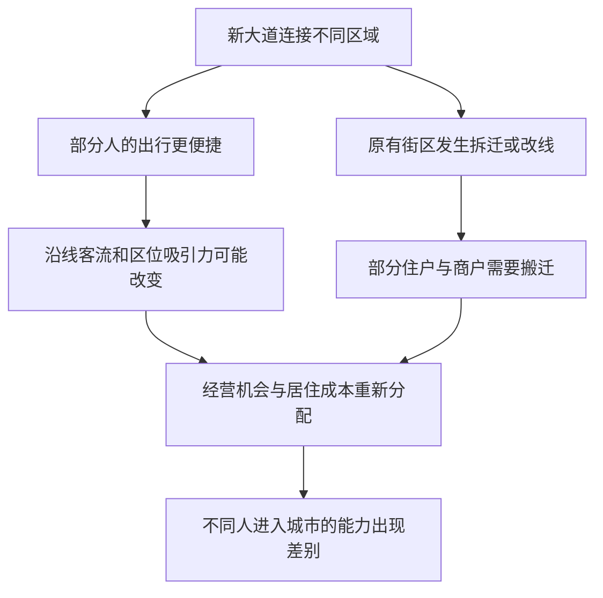

# 05｜一条宽阔大道为什么不只是交通工程？

> 当一条路让某些人更容易抵达城市中心，它会不会也让另一些人难以留下？

---

## 一、先说结论

道路不只是供人和车通过的空白地带。哈维在《巴黎，资本之都的诞生》中把空间组织与社会关系联系起来：巴黎的大道改变人们从哪里出发、能够去哪里，也改变沿街经营和居住的条件。拓宽街道可能改善交通和卫生，却也可能伴随搬迁、地价变化与权力重新布局。理解一项工程，不能只问路变宽了多少，还要问：**谁的可达性提高了，谁维持原有生活的能力下降了？**

## 二、我们先理解一个问题

站在新路口看，宽阔的大道似乎对所有人一视同仁：只要走上去，人人都能使用它。但“能走上去”和“能继续在附近生活”不是同一件事。商人需要货物到店，顾客需要顺路经过，孩子需要抵达学校，居民需要付得起房租。一条路线的改变，可能让其中一种需要更容易满足，同时使另一种需要更昂贵。

这正是单纯用车流量评价道路时容易漏掉的事。道路连接了地点，可地点并不是随意互换的：离工作、市场、亲友和公共服务近的住所，与需要多次换乘才能到达同样地点的住所，生活成本不同。要读懂巴黎的大道，得把路面的便利和路边的人放进同一幅图。

## 三、作者到底提出了什么观点？

出版社目录把《空间关系的组织》列在第二部分“物质化”中，接下来才是货币、信用与地租等主题。这说明我们可以从道路切入，把空间变化与后续经济变化相接；但目录并不能证明某条大道具体因何而修、产生了多大收益。哈维的分析视角是：空间关系并非装载社会生活的中性容器，它本身也是社会活动被安排的方式。

按照这一视角，大道把不同区域重新接起来，旧有的近邻关系和运输路径也随之调整。更便于抵达的沿街地段可能获得新的商业机会；需要征地或拆除的地方，则有人必须搬迁。哈维关注的是这些变化如何相互牵连，而不是宣称拓宽道路只有一种结果，更不是说每条路都只为军队通行而造。

## 四、把这个观点翻译成人话

所谓**可达性**，不是地图上两点之间的直线距离，而是一个人从自己的生活位置出发，实际能否以可承受的时间、钱和精力到达目的地。同一条大道，对有稳定收入、可以换住址的人和靠熟客维持生意的人，可能意味着完全不同的机会。前者看到通勤变快，后者可能因原店拆迁而失去多年积累的顾客。

所谓**空间关系**，就是人、活动与地点之间不断建立的联系；并不是说路铺好以后，人的命运就自动由地图决定。商铺的租约、居民的收入、学校的位置、行政许可，都影响谁有能力利用新路。把它们一起看，才能理解“道路方便了”为什么并不等于“每个人的生活都更方便了”。

## 五、为什么会这样？

修路首先改变通行路径，随后人流、交易机会和沿线土地的使用可能重新分布。为获得新通道而拆房，或因区位更受欢迎而提高租金，都会改变原有居民与商户是否能留下。以下是对哈维问题意识的通俗重组，不是巴黎某条大道的施工记录，也不是必然发生的单向链条。

重要的是图中的“部分”和“可能”：有些人搬迁后也许住得更安全，另一些人可能获得新顾客；具体后果要看道路方案、补偿、租约和可替代住处，而不能凭一张图判定。

## 六、举一个现实生活中的例子

下面是**教学用的假设场景，不是巴黎史料**。某城为缓解拥堵，调整了学生校车路线：新路线沿宽路直达学校，在两个大路口停靠。住在大路附近的家庭，孩子上车更快，家长不用在上学时间开车。原来设在老社区内部的站点取消后，另一批孩子必须穿过车流较大的路口；轮班工作的家长还要安排人陪同。校车“平均行驶时间缩短”，并不代表所有家庭从家门到校门的时间都缩短。

如果旧站点附近的小店曾经靠接送孩子的家庭维持早间生意，它也可能少了顾客；新站点周边则可能更热闹。该不该改线，不能只看车速，也不能因为有人受影响就断言绝不能改。可以比较实际步行距离、过街安全、不同家庭的照护负担，以及能否增设站点或安全通道。这个小场景只演示空间关系如何变化，不把现代校车说成十九世纪巴黎的大道。

## 七、回到书中重新理解

回到哈维对巴黎空间组织的关注，大道不再只是旧城变宽、变直的视觉证据，而是通行、生产和居住关系改变的入口。十九世纪第二帝国巴黎的大规模工程是历史背景；我们从这一背景出发讨论机制，不能反推某户人家的搬迁故事或某家店的收入变化。若要核实具体道路的后果，仍需查街区资料、征地和居住记录。

哈维把空间、信用和地租放在相邻章节，提示读者不要在道路竣工处停下：工程要有人组织、有人融资；新的地点优势也可能变成新的土地收益。这种章节之间的联系，是理解全书论证的读法，不是说修一条路必定导致某个街区涨租。先看空间如何改变谁能到达哪里，再问这种改变怎样被计价，才能读出大道背后的社会关系。

## 八、这个观点背后还有什么？

常见的解释是“大道便于镇压街垒”。政治与军事控制确实可以是理解第二帝国城市改造的一条线索，但若拿它解释每一条路，就会把运输、卫生、商贸、公共展示和行政管理等动机全部挤掉。动机也不等于结果：设计者想让交通更顺畅，仍可能产生房租变化；工程对军队有用，也不证明其他目的不重要。

还有一个容易被忽视的尺度问题。全城通行更有效率，与某个家庭每天多走一段路，可以同时成立。评估公共收益时，应说明是在看全城、街区还是个体，以及是在看工程完工当天还是若干年后。把“整体改善”用来取消局部损失，或只凭局部受损否认一切公共收益，都太快下了判断。

## 九、这个观点有问题吗？

哈维的视角有说服力，因为它迫使我们把道路的使用者和道路旁的居民都纳入解释，避免只凭工程图纸或军事意图讲故事。但从空间重组推到阶级后果，中间还有许多需要证实的环节：原住户获得何种补偿，租金何时变化，新的客流是否真的进入店铺？若忽略这些差异，就会把“可能的不平等”过度简化为“所有道路都使穷人受损”。

对巴黎改造的解释也可以强调疾病防治、交通需求、技术能力，或公共秩序与帝国政治；这些解释不必与土地和阶级分析互相排斥。争议不在于道路能否改善出行，而在于改善如何衡量、代价由谁承受，以及哪种因素在某项具体工程中更关键。没有逐条道路的证据，不能替历史当事人确定唯一动机。

## 十、今天再看这个观点

**以下部分是把哈维的空间关系视角用于当下的现代延伸，不是作者原话。**今天新建快速路、地铁出口或步行街时，可以先画两张图：一张标示全市通行时间，另一张标示原有住户、商户的日常路线与租约。两张图重叠的地方，才是政策说明里应讨论的利益冲突。看见冲突不是拒绝改造，而是要求方案说明怎样分担它。

例如，评价一条新通道，不妨问步行者是否能安全过街、被迁出的人能否继续使用附近服务、改变的商业客流是否只是从另一条街转移过来。这些问题不能从哈维那里直接得到今天的政策答案；它们只是把“谁更容易抵达，谁更难留下”变成可调查、可协商的具体问题。

## 十一、这一篇真正应该记住什么？

1. 大道改变的不是路面宽度这一项数字，还包括谁能到达工作、顾客与公共服务；可达性必须从具体人的生活位置衡量。
2. 空间组织也是社会关系的组织，但搬迁和商业变化并非自动发生；要追踪租约、补偿、替代路线和不同群体的实际处境。
3. 军事控制可能是解释的一部分，却不能代替交通、卫生和经济等其他因素，更不能在缺少证据时充当每条道路的唯一答案。

## 十二、留一个问题

如果大道不仅改变人们经过哪里，也改变哪些地点变得值钱，那么大规模工程在第一块土地升值之前就需要的钱，是从哪里来的？信用怎样让巴黎提前动工，又会把未来偿付的风险留给谁？
