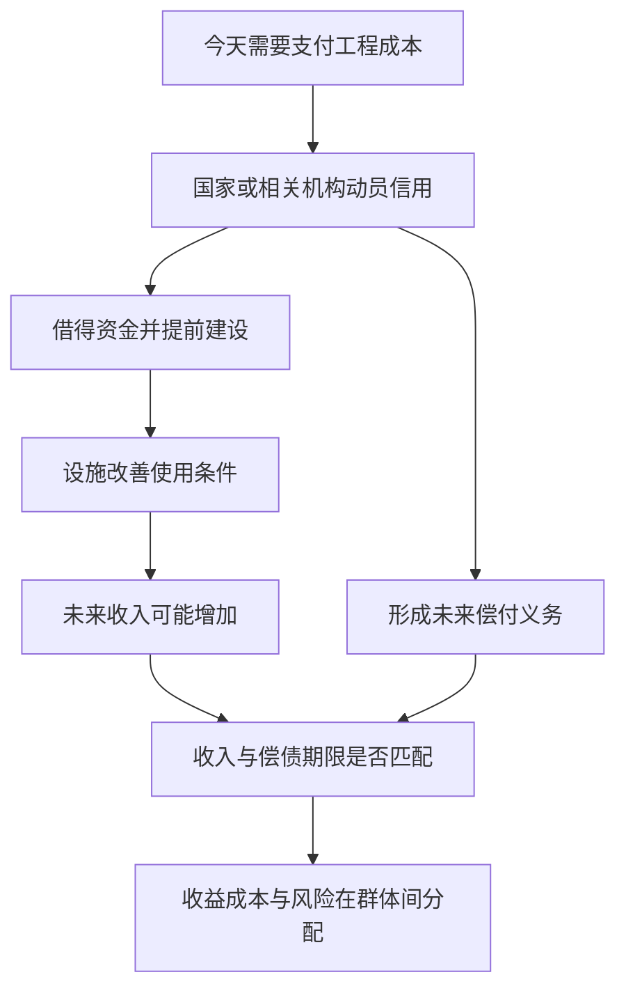

# 06｜修建巴黎的钱从哪里来，又把风险留给了谁？

> 一座城市今天修好道路和设施，为什么明天的居民仍可能继续为它们付款？

---

## 一、先说结论

公共工程常在收益到来之前就需要支付征地、材料和工资。哈维在《巴黎，资本之都的诞生》中把国家推动的改造与货币、信用、金融联系起来：信用能让建设提前发生，却不能凭空造出未来的偿付能力。城市可能因工程受益，账单与风险却未必落在受益者身上。问题不只是“钱从哪里借到”，还要问：**谁承诺偿还，预期的增长若未出现，谁要承担差额？**

## 二、我们先理解一个问题

有人说，大工程会创造工作和繁荣，因此钱总会回来；也有人说，只要借钱就是把债务推给后代。两句话都省略了关键条件。施工确实要先有人付款；工程可能改善交通与生活，也可能带来新税收或沿线收益。但“可能增加收益”和“按时有钱还债”不是一回事。收益到达财政账户的路径、时间和数量，都会影响工程能否持续。

尤其要区分三本账：建设者今天收到的工钱，设施使用者未来得到的便利，以及承担借款义务者以后支付的本息。三本账可能属于不同人。单看工程期间的热闹景象，会漏掉偿付日；只看负债数字，又会漏掉设施能创造的真实公共价值。

## 三、作者到底提出了什么观点？

出版社目录将《货币、信用与金融》列在《空间关系的组织》之后，又接着讨论地租与土地所有者利益。这种安排让我们看到哈维如何把修路、融资和土地收益联系起来，而不能据此编造某笔巴黎贷款的利率或金额。哈维关注的不是金融术语本身，而是城市改造为什么能够在尚未收到未来收入时，先集中大量人力、材料和土地。

在这一分析框架中，国家推动的公共工程需要金融信用支撑，工程又可能为未来经营与财政收入创造条件。**信用是一种把对未来的承诺用于当下的安排**，不是把未来成本取消。只要实际收益、还款期限与政治承诺发生错位，风险就会出现。至于哪些群体承担了巴黎具体项目的损失，需要具体证据，不能把一般机制当成逐项账目。

## 四、把这个观点翻译成人话

假如一座桥要现在建，税收却是多年逐步收取，政府可能先借到钱，建桥后再依约偿还。对居民而言，桥能早几年使用，是信用带来的时间好处；贷款利息、维护费用和偿付压力，则是不能靠“早用上了”这句话抹掉的时间代价。如果桥改善了商业，却让从未使用它的群体承担同样负担，就还涉及分配问题。

这里的**风险**不是说工程一定会失败，而是说未来不能保证如计划那样增长。借款的承诺往往比较确定，收入的增加却有不确定性。公共工程由国家推动，不等于成本自动由“国家”这个抽象名字承担；最终可能是纳税人、使用者、借贷机构或被压缩其他公共服务的人承受不同部分。

## 五、为什么会这样？

工程资金需求集中在今天，公共收益却可能分散在多年以后，这个时间差为信用创造了位置。借贷把未来收入的预期变成今天可以支出的资金，工程完成后，收益才有机会逐渐出现；偿付则按契约或制度安排继续进行。以下流程是为了讲清机制，不代表巴黎某一机构的真实会计路径。

若收入不足或来得太晚，债务并不会因为道路已经通车就消失；若收入充足，也仍需问收入由谁获得、偿债由谁负责。因此，一项工程的“成功”至少要分别检查设施是否有用、筹资能否持续和代价是否公平。

## 六、举一个现实生活中的例子

下面是**教学用的假设场景，不是巴黎史料，也不是实际债券发行建议**。某市准备建一座水厂，工程款要在开工时支付，却预计在投产后的许多年里逐步获得水费收入。市政机构发行债券筹资，投资者先拿出资金，市政机构承诺未来按约付息还本。水厂提前建成，部分家庭较早用上稳定供水，这是建设的真实收益。

但假如新用户增长不及预期，或后续维护费用上升，水费收入就可能不够覆盖支出。市政机构可以选择调整收费、从其他预算中补足或重新安排债务；每种选择影响的人都不同。即使用户如期增加，也要问低收入家庭的水费负担如何、投资者拿到的利息是否与其承担的风险相称。这个假设只用来说明“今天开工—未来偿还”的结构，不暗示巴黎曾发行同样的水厂债券。

## 七、回到书中重新理解

哈维把城市空间改造放进第二帝国巴黎的政治经济关系中讨论，提醒我们大道并非仅靠画线就会出现。取得土地、组织工程与支付工人，必须有能够动员资金的机制。出版社的章节标题提供的是讨论范围，而非详尽财务证据；我们不能仅凭目录断言某种融资手段占了多少份额，或某次债务危机由单一项目引起。

从空间走向金融，读者可以多问一层：工程如何把尚未兑现的未来设想，变为当下可执行的施工计划？这里的“未来”既是对更繁荣城市的期待，也是需要不断兑现的承诺。哈维的贡献在于让人注意，城市景观背后有一套跨时间的关系：今天投入的资金、明天预期的收入，以及承担预期落空代价的群体。

## 八、这个观点背后还有什么？

信用看似把时间向前折叠：未到手的钱让人现在就能买材料和付工资。但任何债务关系都同时安排了谁能提前行动、谁有资格收取利息、谁必须按时还款。金融并非城市建设之外的账房；当借款让工程规模扩大，它就参与决定哪些项目先修、哪些地点更有机会获益。这是依据哈维框架所作的机制说明，不等于声称每个决策都由金融机构单独决定。

还有“收益”本身的分歧。市民可能获得更方便的道路与更稳定的服务，土地所有者可能从地点更受欢迎中获得收入，施工者获得工资，债权人获得利息。这些收益不完全相同，也不一定能直接变成政府偿债所需的现金。若把城市整体价值上升等同于财政立即增收，便忽略了从私人收益到公共偿付之间需要制度安排。

## 九、这个观点有问题吗？

哈维把金融与工程放在一起，很有说服力：它解释了为什么一座城市能在短时间里开展大规模建设，也让繁荣的表面图景接受未来偿付的检验。但若把信用看成危机的充分原因，就会过度简化。负债可以支持有价值且能负担的公共服务，风险大小还取决于借款期限、经济环境、财政制度与项目管理。

另一类解释会强调国家的税收能力、预算安排、技术成本或人口需求，而不是首先从资本流动理解工程。它们可以和哈维的分析对话：同样一笔债务，在不同税制和经济条件下后果可能截然不同。学界对第二帝国城市财政的具体判断需要档案和账目支持；没有这些材料，我们只能讨论逻辑，不能宣称某项巴黎工程已经证明谁必然获利、谁必然亏损。

## 十、今天再看这个观点

**以下部分是把哈维的信用与公共工程视角用于当下的现代延伸，不是作者原话。**今天讨论一项大型基础设施，可以要求方案同时说明融资成本、预计使用量、运营维护开支和收入不及预期时的处理办法。这样的追问并非反对借钱：很多公共服务若一律等到钱全部攒够，等待本身也有成本。关键是不能只公布开工时能创造多少机会，却把未来的偿付写成无人承担的脚注。

还可以问分配：使用者与纳税人是否同一批人，较高的沿线土地收益是否可能反哺公共投入，维持基本服务会不会被偿债挤压？这些是供当代项目比较的提问，不是把十九世纪巴黎的财政制度直接移植到今天。信用缩短了等待建设的时间，却要求公众更认真地讨论未来。

## 十一、这一篇真正应该记住什么？

1. 信用能让未来收入的预期支持今天的公共工程；它改变支付时间，不能消灭本金、利息和维护成本。
2. 工程是否带来公共便利、未来现金流是否足以偿付、不同群体是否公平分担，是三道必须分开回答的问题。
3. 风险不等于注定失败。判断具体工程的得失，需要账目、制度与实际使用情况，不能用“借钱就坏”或“建成就值”代替证据。

## 十二、留一个问题

钱借到了，工程建成了，新的道路与设施让某些地点更有吸引力。可是地点变得值钱之后，增加的收益归谁？当城市变漂亮，地租又会怎样影响小店和居民能不能继续留在原处？
