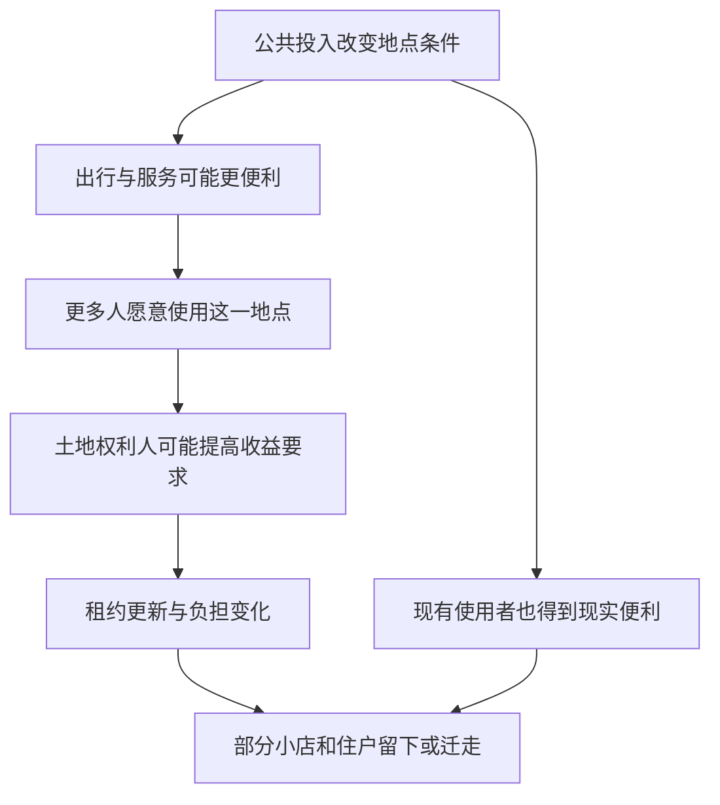

# 07｜城市变漂亮时，地租为什么也会改变城市？

> 当公共投入使一个地点更受欢迎，谁能留下来享受它带来的便利？

---

## 一、先说结论

城市更新不仅改变街景，也可能改变一块土地能带来多少收入。哈维在《巴黎，资本之都的诞生》中把地租与土地所有者利益纳入巴黎改造的分析：公共工程改善地点条件，土地的所有者可能因此拥有更强的议价能力；租金变化又会影响原有小店与居民能否继续留下。问题的关键不是“漂亮有错吗”，而是：**大家参与创造的地点优势，由谁占有，谁因此需要重新寻找落脚点？**

## 二、我们先理解一个问题

一条路修好，附近更容易到达，街面也更整洁。步行者喜欢，店主可能迎来更多顾客，居民可能觉得生活方便了。这时有人说：“既然大家都受益，租金上涨也理所当然。”但把“这里变好了”和“所有人都能负担新租金”连成一句话，中间少了一步：房屋产权、租约期限和租金谈判能力并不属于整条街的每一个人。

同一个改造，可能同时提高某户人家的生活便利、降低他们继续在此居住的可能性。小店也可能在客流增加之前，先收到新的租金要求。如果不区分场所的使用者与土地收益的取得者，“街区升值”就会像一个人人平均分得的好消息；实际分配却远比这复杂。

## 三、作者到底提出了什么观点？

出版社目录中，《地租与土地所有者利益》紧随《货币、信用与金融》之后，提示我们从工程的筹资继续看到土地收益的归属。这是章节安排提供的阅读线索，并不能替代对某块巴黎土地价格或某户租金的史料核对。哈维的分析关注：空间改造所产生的地点优势，如何通过土地所有权与租赁关系成为可被索取的收入。

**地租**可以先通俗理解为占有特定地点所能获得的租金性收益，不能简单等同于某一家店当月交出的房租。公共投资、客流变化和经营机会会影响人们愿意为地点付出多少；地主或开发者若掌握产权，就可能把这种愿付能力转为更高的收益。哈维要读者看见的是：谁拥有地点，与谁使地点更有用，常常不是同一个人。

## 四、把这个观点翻译成人话

一个十字路口原本不太方便，改造后路好走、周围设施增加。店主的手艺和熟客关系也许一直没变，但更多人愿意在那里开店。新租户愿意出更高的价，房东在续约时便有了新的选择。租金上升不必等于房东亲手修了路；也可能是许多人共同出资或使用形成的**区位**优势，被掌握土地权利的人转化为收入。

这里不能倒过来说“凡是涨租，一定是公共投资引起”。人口变动、建筑维修、市场供求与合同约定，同样会改变房租。地点价值也不只有租金一个指标：原有居民可能珍惜邻里照应，小店在熟客那里有信任积累。这些价值未必进入土地交易报价，却会在搬迁时真实地失去。

## 五、为什么会这样？

道路或公共服务改善了地点条件，更多人可能愿意到这里生活或经营；当可用店面和住宅有限时，争夺区位的能力就进入租约谈判。拥有土地权利的一方，可能借此提高要价；能否留下则取决于原有使用者的收入、合同、保护措施及其他选择。图示是对哈维框架的简化说明，不保证每次城市更新都出现同一种涨租过程。

最后两条线要一起读：受益与承压可以落在同一个人身上。若租约稳定、租金受到约束或收入同步提高，使用者未必会搬；若新收益集中于产权人而负担迅速转嫁，留下的难度就可能上升。

## 六、举一个现实生活中的例子

下面是**教学用的假设场景，不是巴黎史料**。某街区完善了人行道，路口更安全。一家自行车修理店在这里多年，靠附近住户的信任经营。新路线吸引更多骑行者，店里可能因此多了生意；但店铺租约即将到期，房东收到出价更高的新租赁意向，于是提出较高的续租条件。修理店新增的收入尚不稳定，还来不及覆盖新房租。

店主可能谈妥较长期限、调整服务，也可能不得不搬去更便宜的地方。若搬走，熟客需要另找修车点，原有邻里便利也随之减少。不能因为店主承压就断言道路改善毫无价值，也不能因为骑行者增加就说店主一定赚到了。这个假设要我们同时核对：公共投入、租约更新、店主的经营收入和土地所有者的选择，分别如何影响结果。

## 七、回到书中重新理解

哈维讨论巴黎的地租与土地所有者利益，是要让读者在道路、信用之后，进一步追问新城市中的增值归属。工程可以提升某些地点的利用条件，但“公共设施建成”与“公共收益被公平分享”之间，还隔着产权、租赁和财政安排。把两者混同，容易只赞美翻新的街景，而不问街景里原有的人后来在哪里。

我们能据出版社目录确认这本书把空间、金融、地租放在相邻的分析位置；不能据此虚构某条大道旁的房东、具体地价涨幅或某家老店的遭遇。以上机制是对哈维论题的通俗重组。要判断十九世纪巴黎某一处更新的实际后果，还需要核对不同街区的产权、租赁与搬迁资料；连“留下来”的意义，也需要听见当事人的经验。

## 八、这个观点背后还有什么？

地租问题把前两个问题连了起来：道路使地点之间的相对位置变化；信用让工程提前完成；土地所有权决定谁能够把变化转成持续收入。要特别分清**创造价值**与**有权收取价值**。新便利或许来自公共开支、施工者劳动、往来人群和商户投入，但握有地契的一方可能更容易把这些共同作用变成租金。这里讨论的是权利结构，不是把每一位房东都写成同样的人。

另一方面，产权人也可能承担维修、空置或建设成本，公共投入也并非涨租的唯一来源。若忽略这些差别，就无法认真讨论怎样分担增值。更深的疑问是：更新后的城市究竟要为谁保留位置？一条漂亮的街既需要投入，也需要可负担的经营与居住空间；两者如何共存，要靠具体制度选择，而不是靠一句“市场自然会安排”。

## 九、这个观点有问题吗？

哈维的视角有说服力，因为它让“城市变好”接受一个分配检验：地点优势增加，产权人与使用者所得是否相称？不过，把迁出都归因于地租上涨，会过度简化。小店停业可能和需求变化、经营成本、店主退休有关；居民搬迁也可能出于家庭变动或主动换房。要证明城市更新通过地租导致排挤，需要比较合同、收入、去向和未改造地区，而不只是观察前后街景。

对土地所有者的评价也存在不同角度。有人强调私人投资与维护可以改善街区，有人认为公共投资创造的增值应更多回馈公众。这些立场关心的成本和权利不同，不能凭一个抽象模型替代事实调查。公共工程可能真让很多人生活更好；若为强调排斥而否认这些收益，同样失之片面。争议的焦点是各类投入如何被计入，以及谁有条件分享改造后的收益。

## 十、今天再看这个观点

**以下部分是把哈维的地租与土地所有权视角用于当下的现代延伸，不是作者原话。**今天讨论城市更新时，可以把竣工照片和租约变化放在一起看：新设施让谁更容易经营，租户能否预知续约条件，老住户是否有可负担的留下选择？公共资金创造的地点优势是否被合理分享，也可以成为评估问题，而非默认“升值”本身就是公平结果。

这不是要求所有租金永远不变。维护成本、服务提升和市场需求都需要认真计算。更可行的讨论是：谁承担改善的成本，谁有谈判权，若要保护原有的生活网络，有哪些透明且可持续的制度安排？哈维提供的是看见收益归属的透镜，不是适用于今日所有城市的单一处方。

## 十一、这一篇真正应该记住什么？

1. 公共投入可能提高地点的吸引力，却不保证使用地点的人能分享增值；土地所有权与租约决定谁有权索取收益。
2. 地租不是街景变美的同义词。比较租金变化，需要把区位、产权、经营状况和其他市场因素分开考察。
3. 更新的公共收益与原有居民、小店的留下能力可以同时讨论；反对排挤不等于反对改善，赞成改善也不等于忽视搬迁。

## 十二、留一个问题

道路把空间接起来，信用让工程先开工，土地所有权又影响新收益的归属。但分散的业主、投资者与居民不会自动朝同一方向行动：国家为什么能把许多私人愿望变成一座新城，又该怎样证明这种协调符合公共利益？
