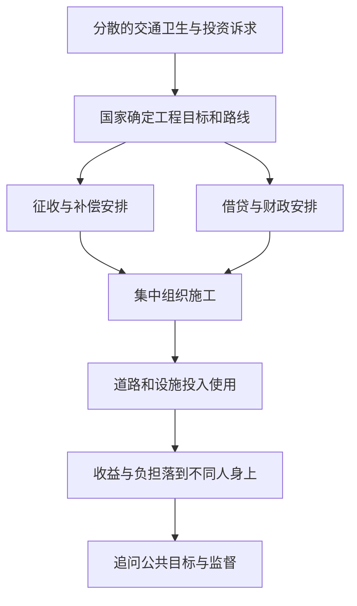

# 08｜国家为什么能把许多私人愿望变成一座新城？

> 当每个人都想要更方便的城市，却不愿自己的房子先被拆掉，谁能让整片街区真正动起来？

---

## 一、先说结论

设计师可以画出道路，投资者可以预期收益，居民也可能盼望干净的水和便捷的交通。但这些愿望不会自己拼成一座新城。哈维分析第二帝国巴黎时，把国家放进城市改造的关键环节：规划路线、动用征收权、组织借贷并执行工程，使分散的土地、资金与行动能够接续起来。**能把工程做成，不等于工程天然符合公共利益**；行政权力为谁服务、由谁监督，是另一个不能跳过的问题。

## 二、我们先理解一个问题

设想一条新路需要穿过几十块相邻土地。店主期待客流，业主希望土地涨价，行人希望少绕路；可是路必须连续，不能绕开每一块拒绝出售的地。即使私人资本愿意出钱，也未必能与每个产权人达成一致，更不能自行决定哪些房屋应当迁移。图纸解决的是道路怎样接起来，没解决**谁有权决定、谁负担搬迁、怎样约束决定者**。

此前谈到信用和地租时，容易把国家只看成拿钱修路的出资者。其实国家还有一种更难被钱取代的能力：把许多彼此冲突的行动排进同一张日程表。它既可以减少协商卡住的成本，也可能让没有足够议价能力的人更难说不。这正是治理问题，而不只是效率问题。

## 三、作者到底提出了什么观点？

哈维在原书第二部分分别讨论空间关系、货币信用、地租与“国家”。这种章节安排提示我们，巴黎的物质改造不是设计、金融或行政的单项成果，而是几种力量的配合。结合本系列的问题来看，他关心的是：第二帝国的公共权力如何让原本零散的改造意向变成可以大规模实施的城市工程，并使某些利益要求获得优先位置。

“国家协调分散利益”是对哈维分析的概括，不是逐字引文；“规划—征收—借贷—执行”是帮助读者追踪工程的分析顺序，也不是原书给出的固定四步法。国家可以批准线路和筹资，也可以使损失被写成必要代价。因此，不能只问它有没有能力，还要问它把谁的愿望变成了优先事项。

## 四、把这个观点翻译成人话

一群人想合建一条通往医院的路：有人出钱，有人愿意让出空地，有人希望路从自家门前经过。但只要有一段无法通行，其他地段修得再漂亮，整条路也无法使用。协调者需要决定线路，谈补偿，安排施工先后，还要保证完工后的维护。城市政府之所以特别，是它不仅能谈，还可能依法作出对不愿意参与者也有效的决定。

这并不意味着反对征收的人一定自私。被征地者在意住处、熟人、经营位置，可能比远处的受益者承担更具体的损失。如果只计算“有多少人将来通车”，忽略“谁今天必须离开”，看似中立的规划就会偏向能够把收益说得响亮的一方。国家的本事既是打通僵局，也是制造必须被解释和约束的权力差距。

## 五、为什么会这样？

关键不在一纸命令，而在多种行动需要互相保证：没有线路难以确定征地范围，没有财务安排难以启动施工，没有组织执行又不能把承诺变成道路。以下是对哈维讨论的机制性重组，不是巴黎某项工程的档案流程。

图中的最后一步不是完工后才想起的礼貌问题。若监督只在开工时宣布，却没有透明的预算、可申诉的补偿和对替代方案的比较，施工能力越强，纠正错误路线的机会可能越少。

## 六、举一个现实生活中的例子

下面是**教学用的假设场景，不是巴黎史料或书中案例**。一座城市准备建设公共游乐场，要征用几户紧邻学校的土地。听证会上，家长希望孩子有安全的活动空间；一户住了多年的居民质疑为什么不能改用隔壁闲置地；附近商户担心围挡影响生意。主管部门拿出两条候选路线、资金用途和补偿方案，居民要求知道公园建成后谁来维护。

如果部门只说“孩子需要游乐场”，就把反对者的生活损失抹掉了；如果一户拒绝就令整个项目永久停摆，也可能让多数孩子失去设施。听证的意义不是保证人人满意，而是让公共利益的主张接受质询：替代地块是否可用？谁得到便利？谁失去居所？补偿与长期维护是否可信？**征收权让项目可能实现，说明理由和接受监督才让权力有资格被行使。**

## 七、回到书中重新理解

出版社目录将“国家”置于信用、地租之后，又接着安排劳动与家庭问题。这是原书可核对的章节顺序；把它读作“钱怎么筹、土地怎么变、谁能下决定、谁去承担后果”的连续追问，则是本系列的重组，并非哈维规定的阅读路线。如此读来，奥斯曼时期巴黎的变化不只是某位官员有远见，也不是资本一有利润预期就自动长出大道。

哈维关心的是第二帝国条件下城市空间被生产出来的过程。国家把权力集中到工程的选择和实施环节，为投资与土地重组提供可操作的条件；工程一旦落地，又改变不同群体的位置。这是作者的解释方向。仅凭章节标题，不能断定某个具体征收案的程序、赔偿额或居民意见，本篇也不以想象补足这些档案。

## 八、这个观点背后还有什么？

公共利益常被讲成一个统一的东西，实际上可能包含互不相同的目标：通行更快、卫生改善、财政收入增长、商业更繁荣，彼此未必总能兼得。假设政府选择一条最能抬高沿线地价的路线，它依然可能改善交通；判断的要点不是贴上“公共”或“私人”的标签，而是比较其他路线和各自代价。

更深一层，国家并非站在城市之外按下开关。它需要贷款者相信未来能偿付，也要土地持有者配合、工程人员工作、居民继续在城市生活。这意味着行政权力既能调动私人力量，也会受到这些力量的影响。把国家写成无所不能的主人，会看漏依赖；把国家写成资本的影子，又会看漏具体决策的责任。

## 九、这个观点有问题吗？

哈维的框架有说服力，因为它解释了一个现实难题：有钱和有图纸，为什么仍不足以把跨地块工程连续建成。但“国家有协调作用”不等于所有决定都能用资本利益来解释。公共卫生的压力、技术可行性、交通需求，乃至行政人员对城市秩序的理解，也可能改变线路与工期。不同工程需要分别比较证据，不能套用单一动机。

争议还在监督的效果：公开征求意见是否真能改变决定，或只是事后为既定计划取得同意？我们不能凭理论断言当时巴黎所有居民都有相同的表达机会，也不能假定今天举行听证就足够公平。检验一个具体项目，需看方案形成前后的变化、补偿能否申诉，以及受益与失去居所的人是否都被算进账本。

## 十、今天再看这个观点

**以下部分是依据哈维的问题意识作出的现代延伸，不是作者原话。**今天修轨道交通、建新区或更新旧街区，也要把不相连的土地、工期与融资安排接上。看到工程宣称“带动发展”，不妨同时寻找替代方案比较、资金的偿付来源、搬迁安排与后续运营计划。没有这些信息，漂亮效果图只能证明有人设想过未来，不能证明每个人都被公平对待。

这也不是要求公共工程无限期等待一致同意。关键是承认效率和正当性不可互相替代：能快速修好，是治理能力；允许受影响的人有效质疑并获得救济，是治理边界。两者都要衡量，才不会把国家简单想成拯救城市的英雄或妨碍市场的敌人。

## 十一、这一篇真正应该记住什么？

1. 私人愿望、资本和设计图不能自动处理跨地块的协调难题；规划、征收、借贷与执行使规模化建设成为可能。
2. 国家有能力推动工程，并不保证工程符合公共利益。谁决定路线、谁承担搬迁与债务、谁能提出异议，同样属于建设的内容。
3. 哈维把国家放进空间、金融和地租相互作用的过程；本文的步骤图只是帮助理解机制，不是每项巴黎工程都照着走的史实。

## 十二、留一个问题

当国家终于能把不同人的计划组织成街道和房屋，站在工地上把这些东西真正造出来的人，是否也就能分享新城市带来的便利与收益？下一步要看的，是工资劳动与城市成果之间那道并不自动消失的距离。
