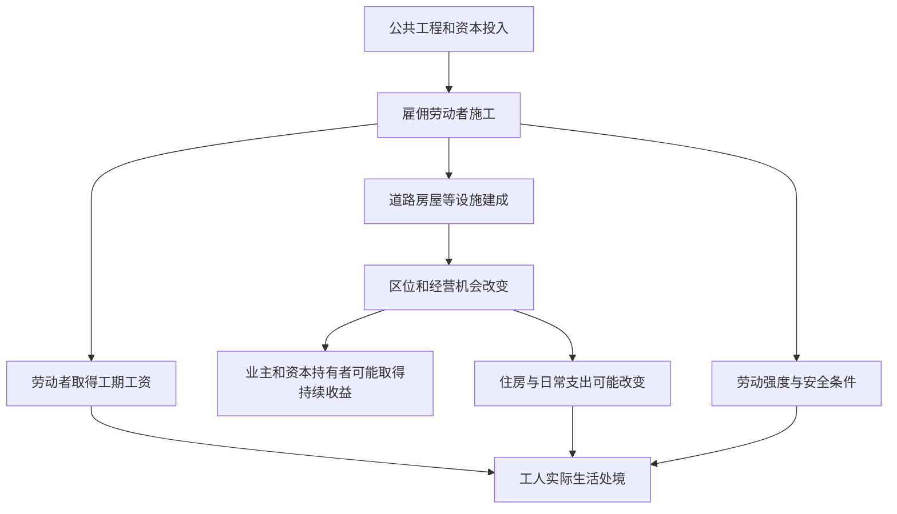

# 09｜城市工人为什么未必分享城市建设的成果？

> 大道由工人的手铺成，可当城市因为大道更值钱时，他们得到的为什么可能只是那段工期的工资？

---

## 一、先说结论

建设带来就业，劳动者也拿到了工资，这都可能是真的。但就业不等于劳动者有权分享工程完工后的土地收益，更不保证他们付得起新街区的住房。哈维在讨论巴黎时，把抽象与具体劳动、劳动力的买卖接在国家与地租问题之后，提醒我们同时看**谁在工地上生产城市，谁在工程结束后占有城市的好处**。工资劳动与资本积累能一起增长，成果却未必按贡献分配。

## 二、我们先理解一个问题

如果有人问：既然道路修建给工人提供了工作，怎么能说他们没有受益？回答不能是“他们一分钱也没拿”。真正的问题是，受雇时得到的报酬，与道路建成后持续产生的价值，属于两种不同的账。工资解决某段时间的劳动报酬；道路改善后沿线更便利，店铺和房屋可能更有吸引力，相关收益未必流向施工者。

还有第三本账：劳动者要在城里继续生活。工程提供岗位的同时，可能推高附近居住成本，也可能迫使原有住户搬迁。一个工人即便工作日工资增加，若租金上涨、通勤拉长，能实际使用新街道的机会依然可能减少。不能只拿“新增就业”四个字当作劳动者最终处境的答案。

## 三、作者到底提出了什么观点？

出版社目录显示，哈维在“国家”之后依次讨论“抽象与具体劳动”和“劳动力的买卖”，随后才转向妇女处境与劳动力再生产。章节主题可据此确认；本篇把它们聚焦为一个问题：劳动者造出的新巴黎，为什么不必然归劳动者享有？哈维对资本主义城市的关注，要求把雇佣劳动、资本获得的收益和阶级位置放在同一画面里，而不是只把工地当成繁荣景观的背景。

“抽象劳动”可以先理解为市场把不同人的劳动折算为可比较的劳动量；“具体劳动”则是石匠、木工等人在特定条件下做出的不同工作。这是帮助入门的概念解释，不是声称巴黎所有工种的工资都相同。雇主购买的是一定时间的劳动力，并不会因此把街道、房屋及其未来收益的所有权一并交给受雇者。

## 四、把这个观点翻译成人话

假设你参与装修一家店，几周里每天切砖、抹灰、搬材料。完工后你领到约定的工钱，店主则长期经营店铺、收取营业收入。不能说工钱毫无意义；也不能因为你真的把店修好，就认定你会分到以后每年的利润。**做出一件东西**和**拥有它产生的后续收入**，是不同的关系。城市建设涉及的所有权与受益链条更长，差别也更不容易看清。

别忘了工作是怎样完成的。赶工、危险作业、缺少休息，都会改变同一份工资的含义。只数就业人数，不问劳动强度和伤害风险，就像只看一座房子的外墙，不问脚手架下面的人能否安全回家。阶级在这里不是给个人贴标签，而是提醒我们注意谁能决定劳动条件、谁只能谈工资、谁掌握建成后的资产。

## 五、为什么会这样？

下面把就业、劳动过程和后续分配放进同一张图。箭头是对哈维议题的通俗重组，并非某个巴黎工地可逐项核对的工资或利润记录。

这里“可能”很重要：修路不会机械地让每处租金上涨，工资也不一定停滞。图要说明的是，工程是否让劳动者过得更好，至少得连看工资、工地条件和住处，而不是由工程存在本身推导出来。

## 六、举一个现实生活中的例子

下面是**教学用的假设场景，不是十九世纪巴黎的工地档案或书中人物**。一名石匠在城市新建的街区工地上砌外墙。施工期他有了收入，师傅教会他更熟练地处理石料；但项目赶工时，他必须更早出门，防护不到位还会增加受伤风险。竣工后，楼房由业主持有，沿街店面出租，石匠的雇佣合同随工期结束。

假如附近租金也涨了，他可能得搬到更远的地方再找活。这里既不能断言石匠一定变穷，也不能用“获得工作”证明他分享了城市价值。要判断他的处境，得比较整个施工期的收入与风险、完工后的就业机会，以及他和家人能否继续住在可负担的地方。这一场景是把分配问题说清楚的练习，不能拿来替代历史调查。

## 七、回到书中重新理解

原书的章节安排让我们看见，讨论完地租和国家，不宜就此停在“新城是谁筹钱修成的”。劳动并非追加的道德评价，而是让图纸落地的生产环节。哈维将劳动的形式与劳动力的买卖分开讨论，提示读者区分劳动者**具体做了什么**，以及劳动进入雇佣和市场关系后**怎样被计价**。本系列把两章放在同一问题下，是为了追问建设者与建成城市的关系，不意味着两章原本只有这一个论点。

哈维的分析框架可以帮助我们提出检验方向：大规模工程吸纳了哪些人，收入是否稳定，劳动关系与资产归属如何连接？但出版社目录本身没有提供石匠工资、事故率或某一街区租金的精确数据。在未核对原书及档案前，不能假托作者给出某个工种的收入或宣布所有巴黎工人都被迫离开市中心。

## 八、这个观点背后还有什么？

“按贡献分配”听起来直观，落实起来并不简单。城市由设计者、施工者、纳税者、长期维护者和原有住户共同参与生产，每个人贡献的形式不同。哈维的提问并不是拿一把尺子算出每块石头该分多少地租，而是指出：在以工资为主要交换方式的关系里，劳动者的贡献与控制权可以长期分离。

更深的一层是时间差。工资一般随劳动期结算，区位优势却可能在竣工后很久仍带来收入；工人承担的是当下的体力消耗和工作风险，资产持有人等待的是以后的租金或经营机会。两者的风险也不一样：资本投入可能亏损，劳动者却很难把已经耗去的时间取回。只有把这些不同风险放在一起，分配讨论才不至于变成“谁辛苦谁全赢”的简单口号。

## 九、这个观点有问题吗？

它有说服力，因为它抵抗了“工程有岗位，所以建设者自然受益”的推论；就业、住房、劳动安全确实是三种不能互相替代的指标。但若把一切收益都归于业主、一切损失都归于工人，也会过度简化。工种、技能、契约、工期、居住位置不同，劳动者处境可能差异很大；改善交通和卫生，也可能带来劳动者能实际享受的好处。

另有解释需认真比较：工资变化可能受整个劳动市场和经济周期影响，租金变化也可能由人口流动、住房供给及其他政策共同造成。即便发现工地附近居民迁移，也不能不加检验就断言单一工程导致了全部变化。争论的焦点不是哈维是否“关心工人”，而是他的阶级框架在具体地点和具体人群上能解释多少、还遗漏了什么。

## 十、今天再看这个观点

**以下部分是借哈维的分析问题作出的现代延伸，不是作者原话。**今天评价地铁、场馆或产业园项目，宣传册通常会列新增岗位；读者还可以追问岗位是长期还是短期、外包人员如何获得保障、周边租房者是否能继续住下、建成后的运营收益怎样分配。这不是说就业数据没价值，而是说它只回答了“开工后有人做事吗”，还没回答“完工后谁留在这里生活”。

同样，不要以某位工人的困难经历代替整座城市的统计结论。最好比较不同岗位的收入、工伤保障和通勤条件，分别记录施工期与运营期，再分析哪些制度能让建设者持续使用他们参与建设的设施。现代问题可以借用哈维的提问方式，不能把今天的合同制度说成十九世纪巴黎的原貌。

## 十一、这一篇真正应该记住什么？

1. 工资是劳动期间的报酬，不自动带来对建成资产和长期区位收益的控制权；建设城市与分享城市成果是两件事。
2. 衡量工程对劳动者的意义，不能只看岗位数量，还须同时看劳动条件、住房成本以及竣工后的生活机会。
3. 哈维将劳动放在国家与地租之后，有助于追问分配；具体工人的得失仍需证据，不能拿阶级框架替代实地和档案调查。

## 十二、留一个问题

工地收工时，石匠还需要吃饭、休息，家中有人要照顾孩子、安排下一天的生活。若城市统计只看得到拿工资的人，那么支撑他们每天重新走进工地的劳动，又由谁承担？
