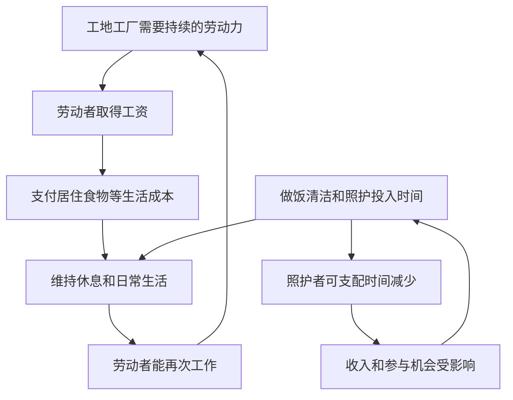

# 10｜巴黎的现代化为什么离不开看不见的家务劳动？

> 工地开工前的一顿饭、孩子放学后的照看，为什么也该进入理解城市建设的账本？

---

## 一、先说结论

道路、工厂和店铺可以在图纸与报表上被看见；为劳动者准备食物、照顾孩子、维持家庭生活的劳动，常被留在图纸之外。哈维在书中把“妇女处境”和“劳动力再生产”接在劳动问题之后，提醒我们：能每天去工作的劳动力，不会自行出现、永久可用。女性的有偿谋生和家庭中的无偿付出、照护时间及生活成本，共同支撑城市运转。**只统计工厂与工地，就会漏掉使它们得以持续开工的基础。**

## 二、我们先理解一个问题

工人今天领到工资，明天为何还能来上班？答案不是“昨天已经付过工资”那么简单。他需要吃饭、睡觉、生病时有人照料；孩子长大以前，也需要花费时间、钱和精力被抚养。家庭购买食物燃料、洗衣做饭和陪伴孩子，都是生活得以继续的条件。它们不一定出现在雇主的账簿里，却会决定一个人究竟有没有时间和体力去谋生。

更容易被忽略的是，照护者本人也可能在挣钱。把妇女简单写成“留在家里的人”，既会漏掉她们在市场上的劳动，也会掩盖工作与照护叠加后的负担。所以问题不是要把每次做饭都算作一段工地施工，而是要看：城市经济怎样使用了家庭投入的时间，却常不把它当成需要被安排和分担的成本。

## 三、作者到底提出了什么观点？

出版社目录可以核对：哈维在劳动相关章节之后，列有“The Condition of Women”和“The Reproduction of Labor Power”。前者把女性的处境带进城市研究，后者追问劳动力如何被维持和重新提供。本系列把两个章节重组为一个问题：如果只关注有工资的工作，为什么会误读巴黎现代化所依赖的劳动？这是问题式读法，不是说哈维原书两章只讨论家务。

劳动力再生产，用白话说，就是让人今天能劳动、明天还能劳动，并让下一代有机会成长为劳动者的日常过程。这个概念涉及收入、居住、饮食和照护，不等于单指生育，也不意味着所有工作都由女性完成。哈维让妇女处境进入这个讨论，使我们不能把家务当作与城市经济无关的私人琐事；本文的具体家庭时间表则是解释性推演，不是原书引文。

## 四、把这个观点翻译成人话

想象一家工厂早上开门，机器、电力、原料都准备好了，工人却因为孩子无人照看、饭菜没人张罗、有人病了无法休息而来不了。工厂表面缺的是“出勤”，背后缺的是维持出勤的生活安排。雇主可以按时发薪，但工资能否换来足够的房租、食物和帮助，还要经过家庭与社区的具体分工。

这里有一个重要差别：**收入是买得起生活资料的可能性，照护是把生活实际组织起来的时间和行动。**有钱不等于附近有人能接孩子，也不等于照护者不累。相反，把做饭、洗衣和养育都归结为“家庭自己解决”，就把使城市劳动持续运转的一部分成本推给了家庭成员。谁被要求无偿承担这些事，谁就少了谋生、休息或参与公共生活的时间。

## 五、为什么会这样？

工资、市场购买和家庭时间必须接上，劳动者才可能每天重新回到工作岗位。以下箭头是为了理解哈维议题而作的机制图，不是声称巴黎家庭人人遵循同一种分工。

图中最后一圈提示：照护不是一次性消耗。若同一个人同时挣钱和承担大部分家务，时间紧张会反过来限制她获得收入与休息的机会。图也没有说这个人必定是母亲；分工可能因家庭收入、居住条件和外部支持而不同。

## 六、举一个现实生活中的例子

下面是**教学用的假设场景，不是十九世纪巴黎的个人档案或书中人物**。一名缝纫工接到服装店的活，按完成的件数挣钱。早晨她要给孩子准备食物，白天赶制衣物；孩子生病时，接活和看护撞在同一段时间里。她可能选择少接几件、晚睡赶工，也可能请别人帮忙，但每一种办法都要付出时间或费用。

如果只记录她卖出多少件衣服，就会看漏照护怎样限制她可用的工作时间；如果只把她称为“照顾孩子的母亲”，又会看漏她的收入与技能。假如雇主要求更快交货，而房租又不能等，压力便在工作间和家中同时增加。这个例子要说明的是成本如何被转移，不是用一个假设人物推断所有妇女的生活方式，更不是证明某个巴黎行业的确切工价。

## 七、回到书中重新理解

原书目录从“劳动力的买卖”走向“妇女处境”“劳动力再生产”，其后才进入“消费、景观与休闲”。可以据此确认哈维把工作与维持工作能力的生活条件放在同一部城市史中；本系列把章节联系读作“工资从哪里来、劳动者怎样再来上班、家庭怎样分担代价”，则是自己的重组。不能把重组的因果顺序冒称作者逐字说过的话。

这样读，巴黎现代化就不是只有大道建成、资本周转和人们走进店铺的故事。工地需要工人持续到场，商店需要员工与顾客有能力参与城市生活；而家庭生活的安排关系到这种能力是否存在。哈维把劳动与妇女处境纳入全书，帮助读者把“私人家庭”重新看成与城市经济相连的场所，但出版社目录不能告诉我们每个家庭具体由谁做饭、照护多久。

## 八、这个观点背后还有什么？

“看不见”并非无人感受到辛苦，而是许多公共计算只计算支出的工资和工程费用，把家务视为不必询问的背景。一条新路缩短了工作通勤，却可能改变孩子去学校、照护者采购食物的路线；一片新房屋增加住房供给，也可能因价格与位置改变家庭安排。后一句是依据哈维问题意识作出的推演，不是对巴黎某条街道的实测结论。

还有分配的问题。家庭成员之间谁获得工资，谁把时间留给照护，影响他们对收入的支配和离开不合适工作的能力。阶级也在其中起作用：有的家庭能用收入购买帮助，有的家庭只能自己挤出时间。女性与照护值得被看见，不是因为女性天然适合做这些事，而是因为当劳动被默认由她们承担时，城市的收益与自由会随之重新分配。

## 九、这个观点有问题吗？

这个视角有说服力：它解释了为何统计大量有偿岗位仍可能误判生活压力，也把挣钱和照护并存的妇女处境放进分析。然而，“家务主要由女性承担”不能不分年代、阶层与家庭结构就当作每家的事实；也不能把妇女的全部活动概括为牺牲与被动。她们可能经营生计、争取支持，也可能通过亲友互助改变分工。

其他解释同样要看：食品价格、住房拥挤、疾病、工作时长和公共服务供给，都会影响家庭可支配时间。若只用资本需要廉价劳动力解释一切，会低估亲属关系、个人选择和地方制度的差别。要检验具体城市中的照护负担，需要调查工时、收入、住房和日常分工，而不是由“再生产”这个概念直接推出一个统一的历史结论。

## 十、今天再看这个观点

**以下部分是依据哈维关于劳动与家庭的问题意识作出的现代延伸，不是作者原话。**今天一个园区宣称创造许多岗位时，可以继续问：附近租金如何，通勤和托育是否可负担，员工照顾老人或孩子时如何安排工作？只计算工资，不看谁在填补服务缺口，就可能误把家庭投入的无偿时间当成企业与城市天然拥有的资源。

这也不意味着每项家务都必须货币化才能获得尊重。公共托育、可预期的工作时间、合理的休息与家庭成员更公平的分工，都可能减轻单一照护者的压力。不同制度效果需要实证比较；不能把十九世纪巴黎的家庭形式直接复制到今天。真正可借鉴的是提问方式：生产一座城市时，谁在维持生产者的生活？

## 十一、这一篇真正应该记住什么？

1. 劳动力再生产指人们得以持续生活和工作的条件，不只是生育；吃饭、休息、照护及居住成本都属于这条链条。
2. 女性可能同时挣钱和承担照护。只统计有偿岗位或只把她们称为家务承担者，都会漏掉时间被怎样分配。
3. 哈维把妇女处境与劳动力再生产纳入巴黎城市史；具体分工不能靠概念推定，本文场景是为解释机制而作的假设。

## 十二、留一个问题

当工地的工资与家庭的照护共同维持了城市生活，人们最终走上新大道，又会怎样被商店、休闲场所和橱窗吸引？那座看得见的消费舞台，会让谁成为享受城市的人，谁只能站在一旁观看？
