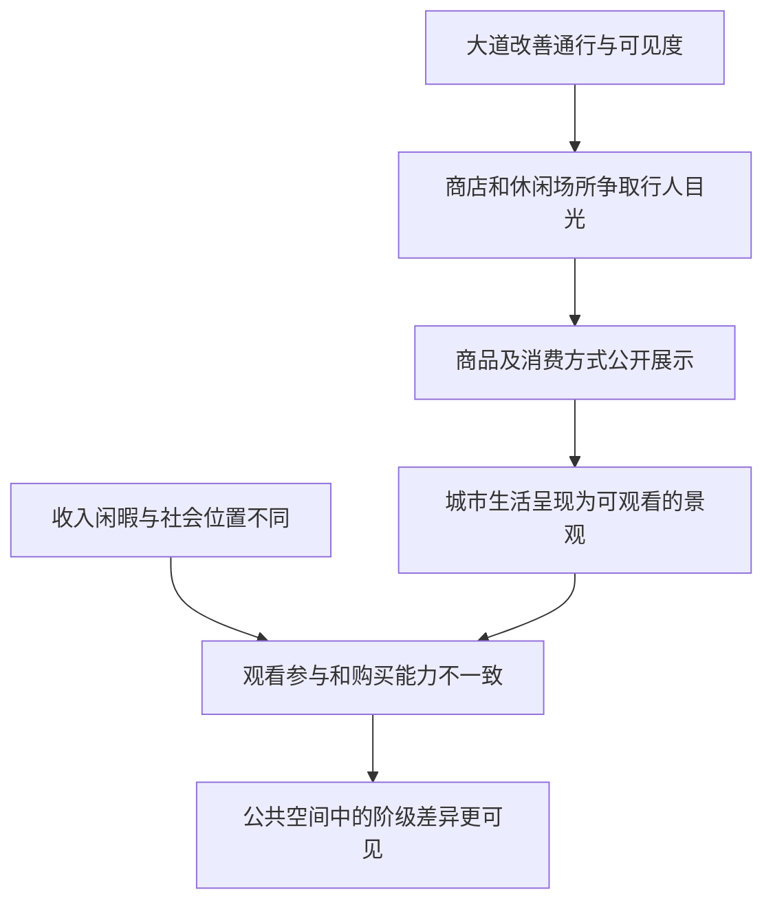

# 11｜大道与橱窗为什么让消费变成一场表演？

> 当每个人都能走上大道，为什么并不是每个人都能平等享受大道上的生活？

---

## 一、先说结论

开放的街道和华丽的橱窗，让商品与行人一起进入公众视野，却不能保证所有人都买得起、坐得下或有同样的休闲时间。大卫·哈维在《巴黎，资本之都的诞生》中讨论消费、休闲与景观的兴起：城市不仅是货物交换的地点，还成为可以观看、展示身份的舞台。**能看见，不等于能占有；能进入，不等于被同等欢迎。**这不是说大道只制造排斥，而是说它的开放性必须同阶级差距一起理解。

## 二、我们先理解一个问题

想象从一条新街道走过：玻璃后摆着商品，路边有人在咖啡馆停留，行人不必买票就能经过。人们很容易把这种场景叫作公共生活的进步。这一判断有道理，街道确实扩大了可见与可行的范围。但如果在玻璃前停步的人没有购买能力，在露天座位旁经过的人付不起消费费用，他们参与的是同一种公共生活吗？

这里要区分**道路的形式开放**与**城市经验的实质平等**。前者问能否通行；后者还要问花钱、闲暇、被接纳的方式，以及在别人目光里所处的位置。橱窗把商品展示给路人，并不负责分配购买能力。问题因此不是要不要漂亮街道，而是谁有条件把那份漂亮变成自己的日常。

## 三、作者到底提出了什么观点？

出版社目录把书中相关章节列作“消费主义、景观与休闲”；出版社介绍也明确提到巴黎大道上消费景观的出现，并将波德莱尔放在城市表述的脉络中。哈维的分析并不把购物当成与城市改造无关的私人嗜好，而是把商品如何被展示、闲暇如何被组织，放进空间改变与阶级关系里考察。街道让人流动，店面招徕目光，休闲场所提供停留的理由；这些要素叠加，消费就成为城市中可被观看的活动。

所谓**消费景观**，不是断言所有行人都在消费，也不是说看橱窗必然受广告操纵。它指向一种组织视觉与欲望的方式：物品等待被看，享受它们的人也可能成为别人观看的对象。哈维关注的阶级问题，是同一空间的不同参与者拥有不同资源；这是阅读其论述的一条线索，不应被伪装成对每个行人心理的统计结论。

## 四、把这个观点翻译成人话

街道像一座没有统一售票处的剧场。谁都可以从门前经过，但前排座位、点餐的桌子和真正带走商品的权利，有不同的价格。有人有钱却没有时间，有人有时间却负担不起，有人还需要靠在这里劳动才能维持别人的闲暇。这些人的身体都在同一条路上，却未必享有同一种城市。

这个比喻的重点不在于嘲笑消费者。买一杯饮料、欣赏一件商品都可以是正当的快乐。值得追问的是：当城市用商品的光亮来代表“大家的繁荣”时，谁的收入和休息被默认足够？如果这些前提并不成立，“人人都能欣赏”的说法便把观看与分享混为一谈。

## 五、为什么会这样？

道路改善与商业集中相遇，使更多人相互可见；店面展示与休闲场所又把这种可见性转成消费机会。但机会如何分配，仍取决于购买力、工作时间与社会位置。

图示是把哈维讨论的关系转为便于理解的推理，不是原书给出的每条大道的发展顺序。商业并非道路建设的唯一目的；景观也未必只会巩固等级。关键在于展示的扩展与分享条件的扩展，不是同一件事。

## 六、举一个现实生活中的例子

先把**教学用的假设场景**摆在大道旁：一间咖啡馆的座位面向橱窗，衣着体面的客人一边喝饮料，一边观看路人；橱窗外，有人只看不买。这个布置是为了说明问题，不是对十九世纪某家真实店铺、顾客收入或巴黎街角的档案复原。玻璃两侧彼此看得见，价格与座位使用权却并不相同。

再联系波德莱尔的散文诗《穷人的眼睛》。出版社书页所引评论指出，哈维运用这首作品展示新大道的暧昧性。诗歌把咖啡馆的光亮与贫困者的目光放在相遇的场面里，让旁观、羞窘及相互判断成为问题；**诗是文学材料，不是贫困人口的抽样报告**。假设橱窗的画面与诗中的相遇放在一起，我们会发现：街道可以让陌生人彼此照面，却不能单靠一次照面消除彼此的物质距离。

## 七、回到书中重新理解

从前面关于道路、地租、劳动与家庭生活的讨论走到消费，视角发生了变化：过去问城市如何建成，现在问建成之后怎样被体验。出版社目录显示，哈维在劳动与劳动力再生产之后讨论“消费主义、景观与休闲”，再转向“社区与阶级”。这不是要说每个章节只有单向因果，而是提醒读者别把橱窗当成脱离工资和生活成本的独立装饰。

波德莱尔的文学场景之所以适合这道问题，在于它让两种容易被抹平的经验同时出现：有人觉得大道明亮而自由，有人站在同样明亮的地方感到自己是局外人。文学能使矛盾可感，但不自动替代价格、就业或居住资料。哈维的解释框架帮助我们提出问题，不能仅凭一首诗就测出整个巴黎的消费结构。

## 八、这个观点背后还有什么？

把消费看作表演，还意味着城市中的人会在观看时互相评判。展示的不只有商品，也有体面、闲暇与所属的群体。即使一个人从不打算购买，他也可能借观看学习什么被称为理想生活；反过来，穿着、举止和停留时间，也可能影响他在某些场所是否感到自在。这是依据哈维框架的延伸推演，并不是他为每一位路人写下的心理描述。

还要看见舞台的后台。灯光、清洁、送货与接待都需要劳动；把休闲当作城市繁荣的象征，很容易只计算坐下消费的人，不计算维持休闲的人。阶级差异因此不仅体现为“买不买得起”，也体现为谁可以自由安排时间、谁必须在别人休息时工作。观看与被观看并不总是对立身份，同一个人也可能在不同时刻转换位置。

## 九、这个观点有问题吗？

哈维的解释有说服力，因为它同时看见街道的开放与购买能力的分层；单说“繁华”或单说“欺骗”都不够。然而，如果把橱窗前每一次停留都解释为阶级支配，便会过度简化人们的主动性。有人只是散步、交谈或享受免费可看的艺术与装饰；公共道路也可能扩大不同群体相遇的机会。两种结果可以同时存在。

另一些解释会强调商业技术、玻璃制造、交通条件、审美趣味与城市管理，而不仅是资本和阶级。它们与哈维的分析不必互相排斥，但要判断具体地点何者更重要，需要商铺、价格、客流与当事人材料；文学场景不能单独承担这份证明。把一种有力的视角变成万能答案，恰好会让城市里的复杂经验再次被遮住。

## 十、今天再看这个观点

**以下部分是把哈维的思路用于当下的现代延伸，不是作者原话。**今天的商业步行街与线上商品展示都能让大量人不付费地观看。可见度空前提高，不等于使用、购买和休息的条件也同样提高。面对一条被赞为“人人共享”的街道，可以问：是否有不用消费也能安坐的空间？交通和租金会不会把原来的使用者推远？店员与清洁者在这里得到怎样的休息？

这些问题并不要求取消橱窗或拒绝休闲。它们要求我们把城市的公共性放在更完整的尺度上评估：不仅统计有多少人经过，还要看人们能否停留、交流与负担日常生活。景观让城市变得吸引人，平等则取决于景观以外的制度和资源。

## 十一、这一篇真正应该记住什么？

1. 大道和橱窗扩展了观看的机会，不能直接推出购买能力、闲暇时间和被接纳的机会也同样平等。
2. 哈维把消费、休闲和景观放在空间与阶级关系中理解；文学能照亮体验，却不能替代历史统计。
3. 判断城市繁华是否真正共享，要同时看舞台上的消费者、舞台后的劳动者以及不消费的路人。

## 十二、留一个问题

橱窗让一座城更容易被看见，却不能告诉我们人们怎样在其中相互依靠。如果道路和地价之外仍有维持日常生活的关系，那么**改造后的城市为什么仍需要邻里与自然？**
