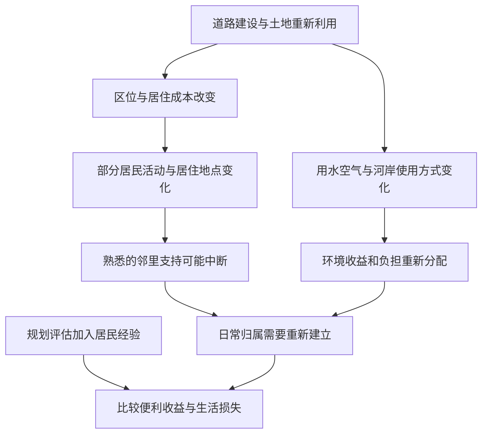

# 12｜改造后的城市为什么仍需要邻里与自然？

> 道路更直、地价更清楚之后，哪些支撑日常生活的联系反而更难画在地图上？

---

## 一、先说结论

把城市只理解成道路和地价，会漏掉居民怎样相互照应、怎样使用附近环境，以及怎样形成对地点的归属。大卫·哈维在《巴黎，资本之都的诞生》中把社区、阶级和自然关系放进对城市转型的考察：空间工程可以改变通行条件，却不能单独替代邻里支持、环境条件与日常生活空间。说这些关系重要，不等于说旧社区没有压迫或污染；重要的是让那些不容易标价的损失也进入改造的判断。

## 二、我们先理解一个问题

设想市政图纸上有两条线：一条是新道路，一条是预期上涨的地价。凭这两条线，我们可以讨论连接效率和投资，却看不到有人每天从哪里取水、在哪里工作，临时需要帮忙时会找谁。搬迁前后的路程也许可以测量，原来熟悉的邻居是否还住在一起，却不能简单折算为多走多少米。

这不是要求工程师用图纸描出所有感情，而是提醒决策者：**同一处土地既是资产，也是生活空间**。一条街的价值，对于房主可能是租金，对于租户可能是邻居替自己照看家人的可靠性。两种价值都真实，不能只把前者算作硬指标，后者当成可以无限补偿的私人怀旧。

## 三、作者到底提出了什么观点？

出版社目录在“消费主义、景观与休闲”之后，列出“社区与阶级”和“自然关系”等章。这说明哈维的巴黎分析不止停留在交通与财产收益，也关心不同群体如何在既有环境里组织共同生活，以及人们与自然条件的关系。把社区和阶级并列尤其重要：邻里不是一个内部毫无差异的温暖整体，居住条件、产权与劳动位置会影响谁能发声、谁能留下。

所谓**自然关系**，在这里不能缩成“城市里种几棵树”。城市依赖水、空气、地形、河流等环境条件，人们接触这些条件的机会与风险也不相同。这里依据书的章节主题和哈维的空间视角说明分析方向，不假装掌握他对某条河岸或某个住户的具体调查结论。中心判断仍然是：改造如果只核算线路与收益，就无法完整评价居民生活如何被重排。

## 四、把这个观点翻译成人话

一套住房的广告写着“离新大道很近”，这是地点的一种优势。但对在那里居住的人来说，能不能借到工具、出门时有人留意孩子、雨天附近道路能不能正常走，可能比地图上的直线距离更影响一天如何过。哪怕道路更宽了，旧的互助网络一旦散开，居民也可能花更长时间重建信任。

不过，不能把邻里想成免费提供照护的万能设施。有人在所谓熟人社会里得不到帮助，还有人承担了大部分照顾他人的工作。因而我们不是说“维持原状就好”，而是问：在改善卫生、道路和住房的同时，能否看见原有支持网络，保证环境改善的机会不只属于付得起更高房租的人？

## 五、为什么会这样？

空间规划容易描述可测量的变化，社区关系与环境体验则需要沿着具体生活过程观察。忽略后者，就可能在交通改善的同时制造新的日常成本。

“可能中断”不是“必然瓦解”；改善排水或交通也可能让社区生活更安全。图示是用于分析的条件链，不是宣称书中逐条记录了这些事件。具体成败要看工程安排、居民的自主选择及公共服务是否跟上。

## 六、举一个现实生活中的例子

下面是一处**教学用的假设河岸洗衣场，不是巴黎史料或哈维写过的现场**。几户人家常在附近洗衣，洗衣时互相交换工作消息，某人病了，别人会顺路替她带回衣物。河岸是与水打交道的地方，也是低成本维系邻里联系的生活节点；但水质不好、洗衣耗力和照护负担不均，同样可能是这里的现实问题，不能将它浪漫化。

假设整治后河岸更干净、道路也更安全，却不再允许原先的使用方式，附近租金又上涨。一位居民也许获得了更好的环境，却失去惯常工作的地点和能帮忙的人；另一位居民则可能终于摆脱污水和重体力劳动。不能替两人预先宣布同一个结论。需要问：有没有可负担的替代洗衣设施？原来互相支持的人还能否在附近见面？谁从环境改善中受益，谁为改变生活方式付出时间与金钱？

## 七、回到书中重新理解

哈维按主题研究城市，不把“社区”留给抒情散文、把“自然”留给风景画，而是让它们进入城市转型的讨论。出版社目录里“社区与阶级”“自然关系”相邻，提醒读者在看到商业大道的可见性后，再看较不显眼的生活联系。书目能确认这种问题布局；至于某项政策对具体巴黎街区的影响，需要独立的历史证据，不能由目录推定。

如果只看土地收益，社区关系会被当成无价也无关的背景；如果只谈熟人情谊，阶级与环境风险又会被遮住。把两个视角放在一起，才可能问得更准确：一个家庭得到便利，是否同时失去支持？一处环境变好，原来承担污染的人还能不能留下来享用？这里说的是运用哈维框架提出的检验问题，而不是代作者写下某个街区的最终判决。

## 八、这个观点背后还有什么？

所谓归属，不只是“我喜欢这里”的感觉，还与生活可以被安排有关：固定的往返路线、可获得的服务、熟悉的求助对象，使居民敢于计划明天。改造切断这些联系时，账面上没有支出的人可能支付了更高的时间成本。反过来，拥有产权者的地方认同也可能成为阻止租户发声的理由；谁的社区值得保护，必须向内部差异继续追问。

自然关系也有分配问题。环境改善可能是真正的公共好处，但如果改善立即转化为租金优势，让承担旧环境风险的人迁走，谁来享受干净河岸就成了阶级问题。这个因果链只是基于空间与阶级分析的合理推演，不是对十九世纪巴黎普遍发生某种“绿色搬迁”的史实断言。要确认它，必须研究具体政策、租约与居住变动。

## 九、这个观点有问题吗？

这一视角有说服力，因为它纠正了只算道路里程和地产收益的片面账本，提醒我们把环境与互助纳入评价。但把社区描写得过于统一，会掩盖性别分工、邻里排斥或疾病风险：有些人正希望通过迁居摆脱原有关系。若由“旧网络存在”直接推出“旧空间必须保留”，就是另一种过度简化。

也可以从公共卫生、基础设施容量、居民自主迁移和技术进步解释改造的必要性。它们并不自动推翻哈维的批评：更好的设施与更公平的分配本来就能同时追求。争论的关键是如何在具体方案中权衡，而不是在“道路效率”与“邻里感情”之间机械二选一。尤其需要分别听取租户、业主和使用公共空间的人，而不是让某一类人代表整个社区。

## 十、今天再看这个观点

**以下部分是把哈维的思路用于当下的现代延伸，不是作者原话。**当一个社区更新方案列出车位、绿地面积和商业回报时，不妨再问：改造期间谁为老人送饭？原来步行能到的工作机会还在吗？新公园的维护由谁承担？假如租金上涨，常来使用它的人还住得起吗？这些问题使“环境提升”从景观承诺变成可讨论的生活条件。

做决定也不能只靠一张“居民满意度”平均表。不同收入、租住状况与年龄的人，对同一项目的风险未必一样。保护日常归属并不意味着冻结街区，而是让居民有能力参与变化，并在改善完成后继续享受原本承诺给他们的好处。

## 十一、这一篇真正应该记住什么？

1. 城市既是可投资的土地，也是支持照护、工作与归属的生活空间；道路和地价不能代替全部评价。
2. 社区有互助也有内部差异，自然关系有改善也有风险；不能把旧城浪漫化，更不能把居民当作同一种人。
3. 真正公允的改造，要比较环境收益与关系断裂的代价，并追问原来的使用者能否留在改善后的地方。

## 十二、留一个问题

当街道的繁华、生活空间的得失和不同阶级的要求并存，政治危机会怎样使这些矛盾变得尖锐？尤其在战争与政权冲突叠加时，**巴黎公社为什么让城市改造的矛盾暴露出来？**
