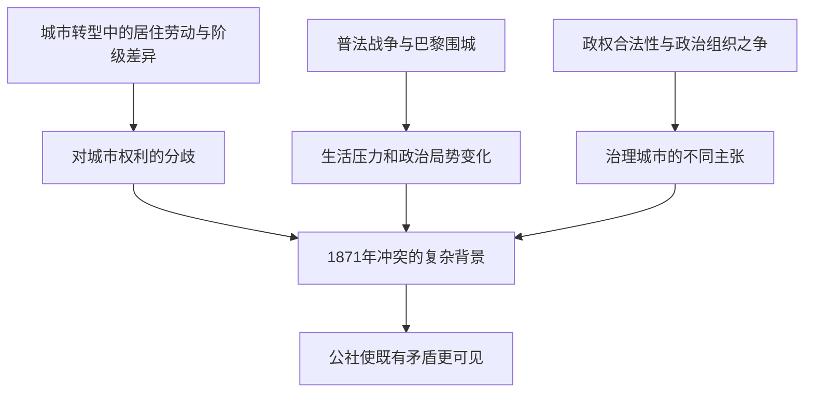

# 13｜巴黎公社为什么让城市改造的矛盾暴露出来？

> 一座城市的道路和地租能帮助理解革命，却能单独解释一场战争后的政治决裂吗？

---

## 一、先说结论

巴黎公社不能简单解释为奥斯曼修了大道、地租涨了，于是1871年的冲突必然发生。普法战争、巴黎围城、政权分裂与城市内部的不平等相互交织；大卫·哈维从地缘政治和城市转型的关系考察公社，提供了看见空间矛盾的一种方式，却不是一条从道路直达革命的公式。**道路与地租能说明冲突发生的城市条件，不能独自决定谁在何时作出什么政治选择。**

## 二、我们先理解一个问题

前面谈过街道、融资、房租、工作与邻里。把这些线索放在一起，读者很可能产生一种诱人的想法：既然新巴黎的收益与代价分得不均，那么公社不就是这笔账最后的“结算”吗？问题在于，把冲突视为城市建设的自动结果，会把战争与围城、政治合法性之争、参与者的组织和判断，都压扁成一条经济曲线。

1870年的普法战争和巴黎围城、1871年的巴黎公社，是理解这段时期不可绕开的历史背景；但从“先有改造、后有革命”不能推出“改造单独造成革命”。历史解释不仅要问哪些社会紧张长期存在，还要问哪些突发事件改变了人们眼前的选择，哪些政治集团在争夺权力，以及那些原本可以有不同走向的节点。

## 三、作者到底提出了什么观点？

出版社目录在城市生活、表述等章节之后，列出“城市转型的地缘政治”。把公社放进这一视角，可以理解为哈维不满足于只在一座城内部寻找答案：巴黎的转型处在更广阔的国家冲突与权力重组里。城市空间如何组织，不同阶级怎样占据和使用它，与战争之后的政治形势如何相遇，才是值得追问的关系。

这里需要守住证据边界：目录证明本书讨论了城市转型的地缘政治，并不替我们证明哈维把某条大道判作公社失败的决定性原因。哈维以资本、空间和阶级关系解释现代巴黎，可以帮助我们看到被“革命只是偶发骚乱”说法遮蔽的长期矛盾；但如果据此说1871年的每个行动都是地租的必然反应，就是把作者的分析框架误写成机械的历史定律。

## 四、把这个观点翻译成人话

假如一座房子早有裂缝，又遭遇风暴，最后有人在争论由谁维修时发生冲突。裂缝值得调查，风暴不能省略，争执双方作过什么决定也不能从裂缝直接推算。用这样的类比理解巴黎：长期城市不平等像已有的压力，战争和围城改变了处境，政治分裂让关于谁来治理城市的问题变得迫切。

类比只能帮我们记住“多条因果线”，不能把战争视为随时可以替换的天气。真实的历史中，人们有政治信念，也会组织、犹豫和采取行动；革命不是城市结构自己按下的按钮。理解公社为什么揭露矛盾，不等于宣布所有矛盾都由公社或改造单独制造。

## 五、为什么会这样？

长期形成的空间与阶级差距，为不同群体看待城市的方式提供背景；战时危机和政治权力争议改变行动条件。多种线索汇合时，城市改造的得失更容易成为公共争论的一部分，但汇合不是命定。

图中箭头表示有助于分析的联系，并非说三类条件都可用同一指标量化，更不是“有大道就一定有公社”的证明。不同史学解释对战争、国家、阶级与政治行动的相对权重可以有争论；这里不借图给某一派偷偷判胜。

## 六、举一个现实生活中的例子

下面这幕是**教学用的假设场景，不是围城期间某条街的实录**：一群人在围城中的面包配给点排队。有人惦记今天能否吃饱，有人谈远处的战事，有人讨论城里由谁来作决定。我们没有在这里核实这条队伍的地点、日期、发放规则、发言人或各人的真实身份；不能把想象的对话当成公社发生原因的史料。

这个设想有一个具体用途：同一个排队空间里，物资短缺、战争消息和政治判断可以同时出现。一个人的住房位置与劳动条件也可能影响他能否及时获得生活必需品，却不能据此断言排在队伍里的人一定拥护同一个政治方案。若要研究真实围城生活或具体配给制度，需要另外查阅档案与历史研究；这里只借假设场景把多重问题从抽象名词还原为人的选择。

## 七、回到书中重新理解

从“社区与阶级”走向“城市转型的地缘政治”，视角不只是从小街区放大到国家地图，还要看两种尺度怎样相遇：城市内部谁住得近、谁承担生计风险，遇到战争与政权危机时会怎样成为政治争执的一部分。哈维的空间分析提供问题框架，不能让我们跳过战争经过、组织差异和政策争议，就直接写出一份完整的公社史。

尤其应把两件事分开。一件事是历史上发生了战争、围城与1871年的公社；另一件事是我们如何解释它们之间以及它们与城市改造之间的关系。前者有时间顺序，后者需要证据与论证。哈维的书帮助读者不忽视城市转型，但不意味着把公社降格为对一张建设图纸的反射动作。

## 八、这个观点背后还有什么？

“谁有权决定巴黎是什么样的城市”在危机时会变得格外尖锐。道路可以提升通行，商业可以制造繁华，但谁制定规则、谁为变化付费，仍是政治问题。当国家权威受到挑战，先前被归入日常经济的住房、劳动与公共空间，也可能被重新提出为集体治理的问题。这是依照哈维框架所作的推演，不应写成公社所有参加者的统一纲领。

还有时间尺度的错位：一项工程的收益与代价可能多年后才显现，战争和政权危机却在短期内迫使人们表态。长期不平等既不能替代短期触发因素，也不是无关的背景板。把两者并置，可以避免两种轻率解释：一种说冲突全是偶然爆发，另一种说它早被地租曲线预先写好。

## 九、这个观点有问题吗？

哈维的空间视角有说服力：它让我们看到一场政治事件发生在具体的城市中，而非发生在没有住户和阶级差异的抽象舞台上。争议在于各因素的权重。战争进程、军事决定、制度安排、政治理念与具体组织，可能比某些街道布局更直接地影响当时行动。仅凭城市地图无法判定公社的兴起或结局。

过度简化的风险尤其明显：把奥斯曼大道说成专为镇压公社所修，或说地租上涨必然导致1871年革命，都是把复杂史实压成目的论；道路也可能有交通、卫生与商业考虑。另一方面，完全忽略改造后的居住和阶级分化，也会让战争像在一座无人居住的棋盘上进行。严谨的解释应允许多种因素竞争，依据具体证据辨别，而不是先决定只准一种原因出场。

## 十、今天再看这个观点

**以下部分是把哈维的思路用于当下的现代延伸，不是作者原话。**面对城市里的政治抗议，我们常听到两种快答案：全怪某项基建政策，或者全怪眼前的突发事件。更可靠的问题是：长期资源分配怎样影响人们承受危机的能力？突发事件改变了哪些选择？哪些组织和制度把不满转成公开行动？问这些问题不等于给抗议者贴同一种身份标签。

现代城市与1871年的巴黎不能直接等同。可迁移的是分析习惯，而不是历史剧本：把战争、公共财政、居住和政治权利分开辨认，再考察它们何时交汇。这样做既能看见结构性不平等，也能尊重人们在具体关头作出的不同选择。

## 十一、这一篇真正应该记住什么？

1. 公社发生在普法战争、围城与政治分裂之后；道路和地租是理解城市背景的线索，不是革命的单一开关。
2. 哈维的地缘政治与城市转型视角使阶级、空间和国家危机能被放在一起提问，但不能替代逐项史料核查。
3. 历史解释要同时容纳长期矛盾、短期局势和人的政治行动；把任何一项写成唯一原因都不够。

## 十二、留一个问题

冲突结束后，城市仍要决定如何讲述冲突：哪些经历被纪念，哪些被压下？如果建筑也能在天际线上替某种历史解释占据位置，那么**圣心圣殿为什么成了关于巴黎记忆的争夺？**
