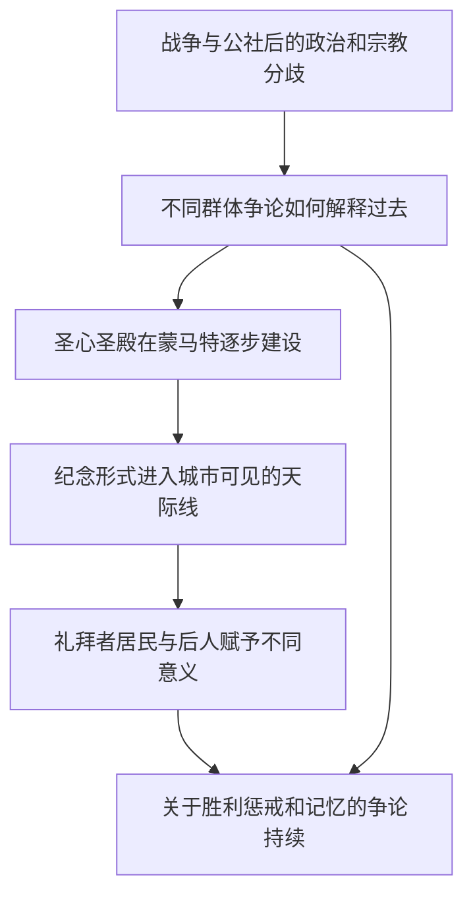

# 14｜圣心圣殿为什么成了关于巴黎记忆的争夺？

> 一座矗立在蒙马特高地的建筑，为什么会让人们争论这座城市究竟应该记住什么？

---

## 一、先说结论

圣心圣殿不只是宗教建筑，也成为人们争论巴黎公社之后如何讲述国家、罪责与胜利的可见地点。大卫·哈维以蒙马特高地的圣心圣殿作全书尾声，讨论宗教、政治与纪念形式怎样塑造城市的自我形象。但不能把圣殿的全部历史压缩为“专为惩罚公社而建”这一种动机，更不能说它在1871年公社发生时就已建成。**建筑落在特定地点，建造和解释却跨越不同时间，也容纳互相竞争的意义。**

## 二、我们先理解一个问题

在一座城市里，关于失败与胜利的争论可以写进报纸，也可以变成一座远远就能看见的建筑。后一种表达特别有力：不论人们是否同意它背后的解释，只要经过或远望，就会再次遇到它。但一座建筑究竟“说了什么”，并非设计者、出资者、礼拜者与后来的观看者都会给出相同回答。

圣心圣殿位于蒙马特，讨论它很难避开普法战争之后的宗教情感与公社的政治记忆。然而，“建在这里”“与那段历史相连”和“只有一个明确动机”并不是同一个判断。把这些层次分开，才能谈**记忆政治**：谁有能力让某种讲述在城市里变得持久、醒目，又有谁不接受这套讲述？

## 三、作者到底提出了什么观点？

出版社目录将全书尾声列为“圣心圣殿的建造”；出版社简介用“反动的文化政治”概括它在书中的重要性。这足以确认哈维把圣殿当成理解现代巴黎文化与权力的关键对象，但不能仅凭一行书目给每个建造者指定同一份心理动机。哈维的核心关注是：宗教建筑及其象征位置如何参与公社之后的政治解释，使一种城市形象获得物质形态。

这与此前的道路和橱窗讨论相通，但不能混作同一问题。大道安排人怎样通行、看见商品；高地上的圣殿则让人面对一段可能持续争论的历史。圣殿当然仍是信仰实践的空间；政治象征并不自动取消它对礼拜者的宗教意义。把哈维的批判读成“建筑没有宗教意义”，反而会使他的记忆政治分析失去复杂性。

## 四、把这个观点翻译成人话

一座被广泛看见的建筑，好比有人把自己的版本的历史写在城市的显眼位置。写的人希望它长久留存，看的人却可能各自读出慰藉、惩戒、纪念、愤怒，或者仅仅是熟悉的地标。墙并不会开口宣布唯一答案；它的意义来自建造者的意图、建筑所处的时局，也来自后来的人如何使用和争论。

所以，问“圣心圣殿意味着什么”，不能只看建筑外形，也不能只凭今天某个人的感受倒推十九世纪所有参与者的想法。需要同时分辨：当时谁支持它、它怎样获得建造条件、哪些人反对有关解释、后来的社会又如何重新赋予意义。这里提出的是读建筑的一套问题，不是宣称已有完整档案足以回答所有问题。

## 五、为什么会这样？

政治冲突不会随战事结束自动形成共同记忆。具有公共可见度的建筑能把解释固定在日常视野里，但固定下来的是象征位置，而不是每个人的认同。

图中的“逐步建设”刻意保留时间差：1871年的事件不是一座当年建成的圣殿的落成仪式。箭头概括解释路径，并非某项工程的精确施工年表；也不表示所有支持建设者都在回应公社或所有反对者都持同一种政治立场。

## 六、举一个现实生活中的例子

下面是**教学用的假设纪念广场揭幕争议，与圣心圣殿的建造史完全分开**。某城决定在广场立一座纪念碑。揭幕时，一部分居民认为碑文纪念的是危机后的和平与重建；另一部分人指出，碑文只写了获胜者的牺牲，遗漏了被压下去的另一种经历。又有人每天来广场坐着，只把它当成普通公共空间。这不是巴黎发生过的某次具体揭幕，也不为圣殿提供任何直接史料。

这个场景提醒我们：争议不一定只围绕“应不应该建”，还会围绕碑文选了什么词、地点有何象征、谁能够公开发表异议。即使多年后多数人都记不得揭幕演说，纪念物仍在场；即使后来重新解释，原来的不平等也未必自动消失。把这一分析用于圣心圣殿时，必须重新查证其具体宗教与政治背景，不能直接搬用广场里假设的碑文或人物。

## 七、回到书中重新理解

哈维把“圣心圣殿的建造”放在尾声，意味着读者不应只停在街道是否宽敞、工程如何融资等问题上。城市转型还关乎谁能把自己的意义安放在城市最可见的地方。巴黎的现代性既有道路、商品和行政权力，也有对旧冲突的再叙述。圣殿把“物质生产”和“观念表达”拉到同一个画面里，这是从全书主题理解尾声的一种读法。

但有必要分清时间与资料层次：圣殿方面公布的建造史显示，最早的建堂誓愿提出于1870年，早于1871年的巴黎公社；国民议会于1873年批准相关建设，1875年才奠基。哈维对圣殿另有专题研究，指出蒙马特选址及公社之后的政治反应赋予建筑强烈的争议性。**建堂念头早于公社，不等于后来的选址和使用与公社无关；后来的政治关联真实，也不等于所有倡议者最初都是为了回应公社。**区分起意、批准、奠基和后世解读，才能避免把漫长的建造过程压成一次动机。

## 八、这个观点背后还有什么？

建筑的长期性带来记忆的非对称：能筹集资源、获得地点和建造许可的人，比只能口头讲述自己经历的人，更容易让叙事留在公共视野。这不是说砖石会彻底消灭不同意见；恰恰因为它一直在，反对者才可能不断重提异议。蒙马特不只是地图上的高地，也是理解“谁的解释更可见”这一问题的空间入口。

另一层是解释权随时间变化。建造者可能希望表达宗教上的奉献或赎罪，后来的人也可能把建筑看作公社记忆中的政治标记。说一种解释与历史有关，不等于否认另一种解释的存在；但也不能用“各有各的看法”取消建造时真实存在的政治权力差别。这是对哈维视角的延伸推演，不是逐字转述他对每一种当代观感的评价。

## 九、这个观点有问题吗？

哈维的读法有说服力：它提醒我们，不要把宏大的宗教建筑隔离于政治背景之外，也不要假装城市的纪念形式是无立场的石头。争议是，若把圣心圣殿完全还原成胜利者惩戒公社的工具，可能忽略战败后的宗教情绪、赎罪观念、教会与国家之间并不一致的诉求，以及普通信徒长期的实际使用。政治意义强烈，不等于动机只有一种。

反过来，只谈建筑审美或私人信仰，也可能遮蔽地点、建造许可与公社记忆引发的争论。不同历史解释需要比较倡议文本、当时的政治讨论和后来的使用史；不能仅凭书的目录或今日观感给它们排出确定的因果权重。**多重动机不是没有冲突，多重意义也不是任何说法都同样有证据。**

## 十、今天再看这个观点

**以下部分是把哈维的思路用于当下的现代延伸，不是作者原话。**面对今天的纪念建筑、广场命名或旧地标改造，可以问：是谁决定要纪念？经费和用地从哪里来？刻在现场的文字允许谁被看见，又把谁留在解释之外？几年后，生活在这里的人还会按最初的讲述理解它吗？这些问题不是说每座建筑都该被拆掉，而是让公共记忆保持可讨论。

讨论时也要避免替别人预定感受。同一个地点可以是某些人的宗教空间、另一些人的政治创伤，或日常出行的背景。允许多种使用与公开辩论，和仔细考证建造背景并不矛盾。真正的公共记忆不必靠一张永不修改的说明牌维持，而可以在资料、使用和异议之间继续生长。

## 十一、这一篇真正应该记住什么？

1. 圣心圣殿位于蒙马特，公社之后历经多年建设；它与公社记忆的联系不能误写成1871年当年落成。
2. 哈维借建筑的文化政治追问谁能塑造巴黎形象；宗教意义、政治象征与后来的不同使用不能压成单一动机。
3. 纪念物能让一种叙事长期可见，却不能终止争论；评价它既需历史证据，也需听见不同人的解释。

## 十二、留一个问题

如果今天站在蒙马特远望巴黎，我们看到的是工程建成的城市、被商品照亮的城市，还是经历冲突后仍在争论自身记忆的城市？当一个地标同时容纳这些层次，你会用什么证据，形成自己的理解？

## 系列收束

起初我们质疑“奥斯曼一夜造出现代巴黎”的**断裂神话**，不是要否定城市确实发生的巨大变化，而是不愿让一个整齐的开端故事遮住此前的设想、后来的代价和未结束的争论。从道路、资本、劳动与日常生活，走到公社与圣心圣殿，现代性不再是一张新旧对照照相片，而是许多人在不平等条件下共同经历的过程。哈维给出一副值得使用的分析眼镜，却不要求读者放弃核查证据与比较其他解释。下次面对一座宣称“从此全新”的城市，不妨先问：谁创造了它，谁得以留下，又是谁有权讲述它？答案请由你自己继续寻找。
