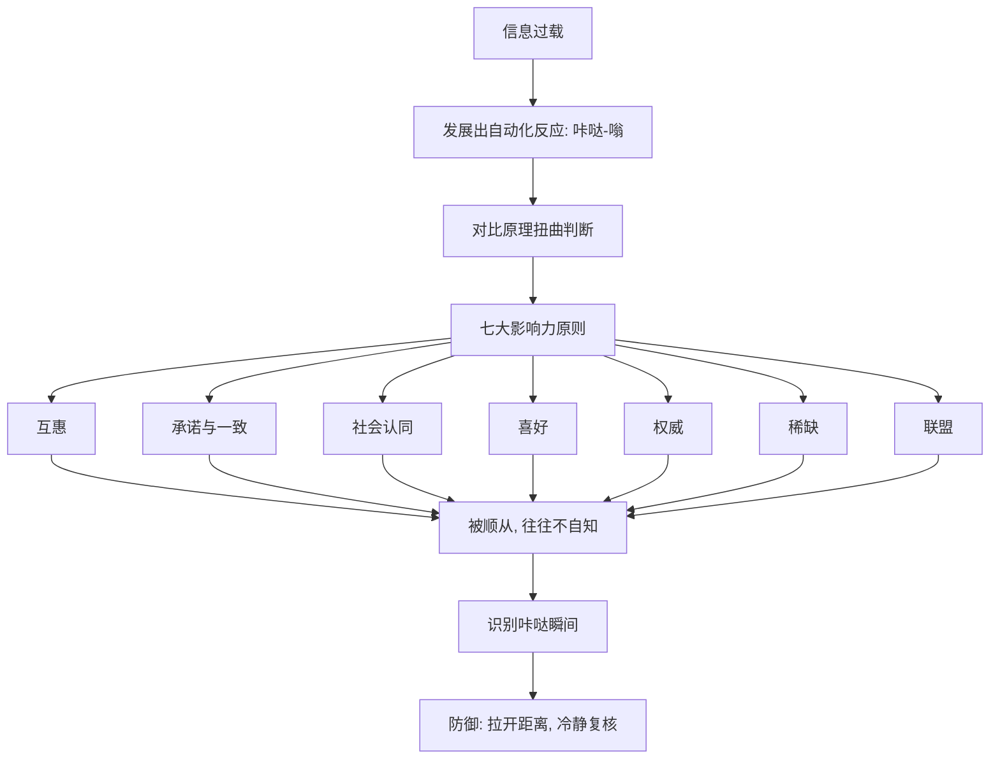

# 《影响力》深度解读系列

## 系列简介

《影响力》是心理学家罗伯特·西奥迪尼的经典之作。它回答一个每个人都关心、却常常说不清的问题：**为什么我们会答应别人的请求？**

西奥迪尼没有从"说服技巧"入手，而是提出了一个更根本的洞察：在信息过载的世界里，人不可能对每个决定都深思熟虑，于是我们发展出一批"自动化反应"——贵的就是好的、大家都买的就是对的、专家说的就信。这些捷径大多数时候高效，但也正因如此，它们成了被人利用的按钮。

他把这些按钮归纳为七大原则：**互惠、承诺与一致、社会认同、喜好、权威、稀缺、联盟**。谁能精准按下它们，谁就能在你不假思索时影响你。本系列围绕 **11 个核心问题**，先讲清自动化反应与对比原理，再逐一拆解七大原则，最后落到"如何保护自己"。

---

## 全书核心问题

| 层次 | 问题 |
|---|---|
| 机制问题 | 我们为什么会"不假思索"地被影响？ |
| 原则问题 | 让人顺从的七大武器分别是什么？如何起作用？ |
| 防御问题 | 面对这些自动化的影响，我们该如何保护自己？ |

---

## 全书知识地图



---

## 全系列目录

### 第一部分：我们为什么会被影响

#### 01｜为什么我们会“不假思索”地答应别人？

核心问题：为什么一个说得出理由的请求，哪怕理由毫无意义，也更容易被答应？

核心观点：西奥迪尼提出，人和动物一样存在"固定行为模式"：某个触发特征一出现，就会自动播放整套反应。在人类身上，这表现为"咔哒—嗡"式的自动化顺从——只要对方给出一个理由（哪怕是废话），我们答应的概率就明显上升。

理解难度：★★☆☆☆

关键词：自动化反应、咔哒嗡、固定行为模式、理由

---

#### 02｜“对比原理”如何悄悄改变你的判断？

核心问题：为什么先看一个更差的东西，会让你觉得眼前的东西更好？

核心观点：对比原理指：两样东西先后出现时，我们会夸大它们的差异，且后出现的那个会被前一个"拉偏"。先看贵再看好、先看差再看优，都是它的应用。它本身不是原则，却是几乎所有影响力武器赖以生效的底层机制。

理解难度：★★★☆☆

关键词：对比原理、参照、先后顺序、中介套路

---

#### 03｜这些“影响力武器”，为什么会有效？

核心问题：既然自动化反应会被利用，为什么我们还会一直依赖它？

核心观点：因为捷径大多数时候是对的。在绝大多数场景里，贵的确实更好、大家都选的确实更稳、专家的确更懂。西奥迪尼的立场不是"这些反应很蠢"，而是：它们是必要的生存工具，问题在于有人故意制造虚假信号来触发它们。

理解难度：★★★☆☆

关键词：启发式、捷径、效率、被利用

---

### 第二部分：让人说"是"的七大原则

#### 04｜互惠：为什么拿了别人的好处就想还？

核心问题：为什么一点小恩惠，就能换来一个远不相等的人情？

核心观点：互惠是深植于人类社会的规范：接受了好处，就产生了偿还的义务感。它强大到可以跨越不喜欢、甚至跨越理性——先给再要，往往比直接要有效得多。免费样品、赠品、先让步（"留面子"技巧）都是它的变形。

理解难度：★★★☆☆

关键词：互惠、亏欠感、先给再要、让步

---

#### 05｜承诺与一致：为什么我们会死守自己说过的话？

核心问题：为什么一个小小的公开承诺，会让人做出越来越大的妥协？

核心观点：人渴望言行一致。一旦做出了选择或公开承诺，我们会自动倾向于维持它，哪怕它已不再合理。这是"登门槛"技巧的根基：先让你答应一个小请求，再利用"我可是个一致的人"这种自我形象，推动你答应大的。承诺越公开、越费力、越自愿，约束力越强。

理解难度：★★★★☆

关键词：承诺一致、登门槛、自我形象、公开承诺

---

#### 06｜社会认同：为什么“大家都在做”就显得对？

核心问题：为什么在不确定时，我们会把别人的行为当成正确答案？

核心观点：社会认同指：当我们不确定该怎么做时，会参照周围人的行为。它在两种条件下最强大：不确定，以及相似者众多。它既会造成从众与冷漠（旁观者效应），也会被商家用刷单、销量、评价数来刻意制造。

理解难度：★★★★☆

关键词：社会认同、从众、不确定性、相似性、旁观者效应

---

#### 07｜喜好：为什么我们更容易答应喜欢的人？

核心问题：为什么"喜欢"本身就能让人答应请求？

核心观点：人倾向于答应自己喜欢的人。好感通常来自几个因素：外表吸引力、相似性、赞美、熟悉感与合作关系。麻烦的是，这些因素都能被"制造"——模仿你、夸你、和你攀关系，都是在人为生产好感，再把它兑换成顺从。

理解难度：★★★☆☆

关键词：喜好、相似、赞美、熟悉、好感转移

---

#### 08｜权威：为什么一个头衔就能让我们服从？

核心问题：为什么仅仅是制服、头衔或身份，就能让人放弃自己的判断？

核心观点：我们从小被教导"服从权威是合理的"，于是形成了一种自动反应：权威说的就是对的。危险在于，我们往往只对权威的"象征"（头衔、衣着、豪车）做出反应，而不是对真正的专业性——这让假权威也能轻易得手。

理解难度：★★★☆☆

关键词：权威、象征物、服从、专业性

---

#### 09｜稀缺：为什么“快没了”让我们失去理智？

核心问题：为什么"数量有限、时间有限"会让人愿出高价、冲动下单？

核心观点：稀缺会提升事物在眼中的价值，并唤起"可能失去"的威胁感，从而破坏理性判断。它有两个放大器：越接近失去越急，以及越被禁止越想要（逆反）。限量、倒计时、独家，都是对稀缺的刻意制造。

理解难度：★★★☆☆

关键词：稀缺、损失威胁、逆反、限时限量

---

#### 10｜联盟：为什么“我们是一伙的”最有力量？

核心问题：为什么"同为一家"比"我喜欢他"更能让人顺从？

核心观点："联盟"是西奥迪尼后来补充的第七原则，指的不是喜欢，而是"身份上的合一"——我们、家人、同乡、同校、同一群体。它比喜好更深、更持久，因为它触动的是"自己人"的本能。这也是为什么"我们都"、"咱们"这类措辞异常有力。

理解难度：★★★★☆

关键词：联盟、身份合一、自己人、我们

---

### 第三部分：如何保护自己

#### 11｜面对影响力武器，我们该如何防御？

核心问题：既然这些按钮会被利用，普通人该怎么自保？

核心观点：西奥迪尼不主张拒绝一切说服，而是提出"以彼之道"的防御：识别触发自动化反应的信号，看穿它是真实信号还是被人伪造；当察觉"咔哒"的一声时，刻意暂停、拉开时间与情境距离再决定。核心不是变聪明，而是给系统 2 争取启动的机会。

理解难度：★★★★☆

关键词：防御、识别信号、暂停、真实与伪造

---

## 推荐阅读顺序

**主线顺序（推荐）：01 → 11。**

```text
第一段｜机制（01–03）
   自动化反应 → 对比原理 → 武器为何有效
        ↓
第二段｜七大原则（04–10）
   互惠 → 承诺一致 → 社会认同 → 喜好 → 权威 → 稀缺 → 联盟
        ↓
第三段｜防御（11）
   识别咔哒瞬间 → 暂停复核
```

**阅读建议：**

- **想先抓住骨架**：读 01、02、04、06、09、11 六篇。
- **对营销/带货感兴趣**：02、06、07、09 是核心。
- **对职场/谈判感兴趣**：04、05、08、10 更有用。
- **想练习批判性阅读**：重点看 03、08、10 三篇。

---

## 全系列状态

> 本系列共 11 篇，正文生成中。
