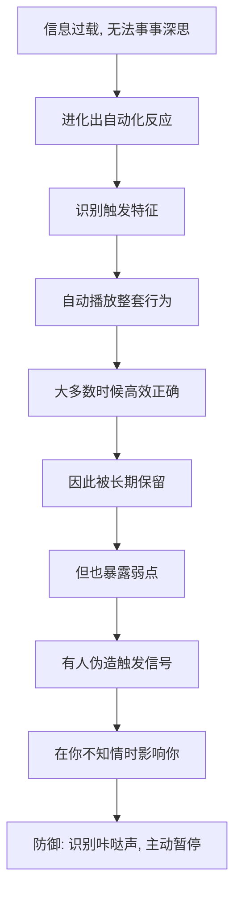

# 01｜为什么我们会“不假思索”地答应别人？

> 为什么一个说得出口的理由，哪怕毫无意义，也更容易让我们答应？

---

## 一、先说结论

西奥迪尼的答案是：**我们的大脑里装着一些"自动反应程序"，只要触发特征出现，就会不加思考地照着走。**

他把这种现象叫做"咔哒—嗡"：某个信号"咔哒"一响，整套行为就像录音带一样自动播放。最典型的例子是"理由"：当一个人请求你帮忙，并给出一个理由时，你答应的概率会明显上升——**哪怕那个理由本身毫无信息量。**

这不是愚笨，而是效率的代价。在信息过载的世界里，逐件事深思熟虑是不可能的，自动化反应是必要的省电模式。

---

## 二、我们先理解一个问题

先想象一个场景。

你在排队复印，前面有个人对你说：

> "不好意思，我有 5 页要复印，能让我先用一下复印机吗？因为我赶时间。"

你会让吗？大概率会。

现在换一句话：

> "不好意思，我有 5 页要复印，能让我先用一下复印机吗？因为我得印点东西。"

第二句的"理由"其实是废话——每个人来复印都是为了印东西。可研究表明，**第二句的成功率依然很高**，虽然略低于第一句。

问题来了：为什么一个明摆着没有信息量的理由，也能让人更愿意配合？我们到底在服从什么？

---

## 三、作者到底提出了什么观点？

西奥迪尼提出了一个贯穿全书的框架：**人类和许多动物一样，存在"固定行为模式"。**

在动物身上，这表现为：某个特定刺激一出现，就自动触发整套行为。比如某些鸟看到幼鸟张嘴（红色）就会喂食，哪怕那只是一块带红点的假鸟嘴。

在人类身上，这种自动反应表现为"咔哒—嗡"式的顺从：我们并不是在评估请求本身，而是在对**某个触发特征**做出反应。西奥迪尼指出，人类最常见、最有效的触发特征之一，就是**"因为"这个词背后的理由结构**。

他的核心立场是：

1. 这些自动反应是必要的——它们让我们能在信息过载中快速行动；
2. 它们大多数时候是可靠的——所以我们会一直依赖；
3. 正因如此，它们可以被人**伪造和利用**：只要制造出触发信号，就能让你顺从，而整个过程你几乎意识不到。

---

## 四、把这个观点翻译成人话

我们可以用一个日常的类比来理解。

电脑里有两种操作方式：一种是"手动模式"——每一步都自己确认；另一种是"快捷键"——按下某个组合键，整段操作自动执行。快捷键快得多，但前提是——**你得相信按对了键**。

人的自动化反应，就是大脑的快捷键。

"因为……"这三个字，就是一个快捷键。它并不负责验证理由的真假，它只负责**识别"这是一个理由"**，然后放行。于是,"我赶时间"和"我要印东西"在触发层面几乎等价。

同理，还有一批这样的快捷键：**贵 = 好**、**大家都买 = 对**、**专家说 = 信**、**快没了 = 快抢**。它们平时让你省下大量力气，但一旦有人能自己制造这些信号，你就会被"远程操控"。

---

## 五、为什么会这样？

这套机制的来龙去脉，可以这样拆：

关键在 **E → G** 这一跳。

自动化反应之所以能被利用，恰恰因为它**平时太好用**。你不会怀疑一个屡试不爽的快捷键，骗子却可以模仿那个按键。也就是说：**弱点不是设计缺陷，而是效率的必然副产品。**

西奥迪尼的整套体系，本质上就是把这批"快捷键"逐个拆开，让你看见它们在哪里，以及它们是怎么被按下的。

---

## 六、举一个现实生活中的例子

看一个几乎人人都经历过的场景：电商大促的直播间。

主播说："家人们，这款原价 599，今天直播间专属价 199，**只有最后 300 单，3、2、1，上链接！**"

短短一句话，你已经被按下了至少四个快捷键：

- "原价 599"——用**对比**让你觉得 199 很便宜；
- "家人们"——用**联盟/喜好**让你产生亲近；
- "只有 300 单"——用**稀缺**制造紧迫；
- "3、2、1，上链接"——用**时间压力**剥夺你启动慢思考的机会。

你甚至来不及问：我真的需要它吗？599 是真的原价吗？我买它，是因为它好，还是因为"快没了"？

这就是自动化反应被批量利用的样子：**它不攻击你的判断，它绕过你的判断。**

---

## 七、回到书中重新理解

现在再回看西奥迪尼为什么从"固定行为模式"讲起，就顺了。

他并不是在教我们"如何不被骗"这么简单。他先要建立一个认识：**人类的说服与顺从，很多时候不是发生在理性层面，而是发生在触发层面。** 只有接受这一点，后面七大原则——互惠、承诺一致、社会认同、喜好、权威、稀缺、联盟——才有统一的解释框架。

所以第一篇的关键不是"理由"这个词，而是这个更冷的判断：**你以为你在做决定，其实你可能只是被按下了按钮。**

---

## 八、这个观点背后还有什么？

**第一，"自动化"本身是中性的。** 它不是缺陷，而是有限理性的合理策略。真正的问题在于信号的**真实与伪造**。

**第二，触发往往成组出现。** 现实中的说服很少只用一招，而是一整套组合拳（对比＋稀缺＋社会认同），让每个信号互相强化。

**第三，它和卡尼曼"两套系统"高度相通。** 自动化反应对应系统 1，说服的本质，就是让系统 2 来不及介入。

**第四，它把"顺从"从道德问题变成了机制问题。** 与其责怪自己"怎么这么好骗"，不如去识别"这次是什么按下了我"。

---

## 九、这个观点有问题吗？

有，主要来自研究可靠性的争议。

**第一，"固定行为模式"的类比被批评为过度引申。** 动物的固定动作模式（如鸟类对红点的反应）与人类复杂的说服场景差别很大，用"咔哒—嗡"一概而论，可能把丰富的社会判断简化成了机械反应。

**第二，部分经典实验面临可重复性挑战。** 心理学近年经历"可重复性危机"，西奥迪尼引用的个别研究（如某些社会认同与对比效应的实验）在重复检验中效应变弱或消失，因此在引用具体数据时应保持谨慎。

**第三，七大原则的边界并非总是清晰。** 喜好与联盟、社会认同与从众，在不同情境下会互相交叠，把它们拆成并列的"七个原则"，是为了清晰而做的简化。

**第四，但它作为实践框架依然极有价值。** 无论机制细节如何，这套分类在营销、谈判、公共沟通中反复被验证有用，也是它成为经典的原因。

**所以更准确的说法是**："自动化顺从"是一个有力的解释视角；但要记住它是解释框架，而非已被完全证实的机械定律。

---

## 十、今天再看这个观点

以下部分是基于西奥迪尼思想的现代延伸，不是他在书里的原话。

在推荐算法时代，这套洞察被推到了新的高度。过去，影响力武器需要一个人现场施展；现在，平台可以**批量、实时、个性化**地触发它们：为你显示"仅剩 2 件"、告诉你"你的好友都在看"、把价格从 599 划到 199。

更微妙的是，算法比你更清楚哪一种触发器对你最有效——它对每个人用的组合都不一样。

所以西奥迪尼的框架在今天有了一个新的用途：它不只是识别"推销员的话术"，更是识别**整个界面设计里藏着的按钮**。

---

## 十一、这一篇真正应该记住什么？

1. **人会做出"自动化的顺从反应"。** 特定触发特征一出现，整套行为就自动播放，无需思考。
2. **"理由"本身就是触发器。** 哪怕理由没有信息量，也能显著提高答应的概率。
3. **自动化反应是效率的产物，不是愚蠢。** 它平时高效，因此才容易被伪造利用。
4. **说服常常绕过理性。** 它不攻击你的判断，而是让你来不及使用判断。
5. **它是全书的统一框架。** 七大原则，本质上都是可以被按下的"快捷键"。

---

## 十二、留一个问题

> 如果让你说"是"的，往往不是理由本身，而是"这是一个理由"的形式——
> 那么回想你最近一次爽快答应的请求，
> 你答应的，究竟是那件事，还是那声"咔哒"？

---

**下一篇**：在七大原则登场之前，还有一个更底层的机制在悄悄工作——它不制造理由，却能扭曲你对一切事物的判断。为什么先看差的东西，会让你觉得眼前的东西更好？

下一篇我们就来拆开这个问题——**"对比原理"如何悄悄改变你的判断？**
