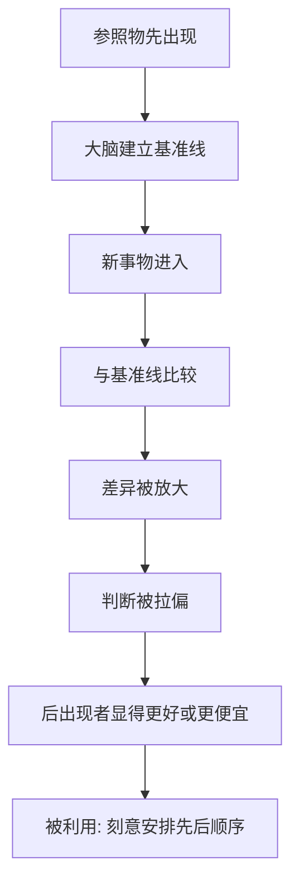

# 02｜“对比原理”如何悄悄改变你的判断？

> 为什么先看一个更差的东西，会让你觉得眼前的东西更好？

---

## 一、先说结论

西奥迪尼认为，人对事物的判断很少是绝对的，而是相对的——我们几乎总是通过“和什么比”来确定一个东西的好坏、贵贱、大小。这就是对比原理。

它有两个要点：第一，两样东西先后出现时，我们会**夸大彼此之间的差异**；第二，**后出现的那个，会被前一个拉偏**。所以先看贵的，再看便宜的，便宜的会显得格外便宜；先看差的，再看好的，好的会显得格外好。

对比原理本身不在七大原则之列，但它更底层：几乎所有影响力武器都要借它才能生效。

---

## 二、我们先理解一个问题

假设你正准备买房。

中介先带你看两套房子。第一套旧、暗、格局差，还卖得很贵；第二套稍微好一点，但同样破败，价格更离谱。你越看越失望，开始怀疑自己是不是根本买不起房。

然后中介带你去看第三套。它其实只是一套普通、干净、价格正常的房子。可当你看完前两套再走进第三套时，你会觉得它“简直是天堂”。

问题来了：第三套房子一点没变，变的只是你看它的**顺序**。为什么先看差的东西，会让眼前的东西显得更好？我们判断的到底是房子本身，还是房子和前一套之间的差距？

---

## 三、作者到底提出了什么观点？

西奥迪尼借用了知觉心理学里的一个发现来解释顺从行为：**人的感知系统对“对比”高度敏感，对“绝对值”却相当迟钝。**

他描述过类似的知觉现象：把一只手先放进冷水、另一只手先放进热水，再把两只手同时放进温水，同一盆温水，一只手觉得热，另一只手觉得冷；或者先举起一个重物再举起一个轻物，会觉得轻物格外轻。

西奥迪尼的观点是：这种知觉层面的对比，会一路延伸到判断与决策层面。**我们评价一个人、一件商品、一个价格时，同样是在和“刚刚接触到的参照物”作比较。** 而且这个参照物不必和眼前的东西同类——只要它先出现，就能把后面的判断拉偏。

于是他给出一个更冷的结论：想让人答应你，未必需要改变事物本身，你只需要改变它出现的**先后顺序**。

---

## 四、把这个观点翻译成人话

可以这样理解：你的判断不是一台秤，而是一支滑动的指针。**秤称的是绝对值，指针显示的却是“和刚才相比偏了多少”。**

你说“这件衣服好贵”，其实很少是因为你精确知道它值多少钱，而是因为它比你上一眼看到的价位高。你说“这人真高”，往往是因为你刚和一个矮个子站在一起。参照物一换，结论就换。

由此得到一句非常实用的话：**如果你想让对方觉得某个东西好，不一定要让它真的变好，只需要先让他看一个更差的。**

---

## 五、为什么会这样？

对比原理能起作用，是因为感知和判断共用同一套“相对编码”机制：

关键在于 **B → E** 这一段：大脑建立的不是“目标物的绝对水平”，而是“相对于刚才的基准线”。基准线一旦被压低，后面的东西自然显得更高。

也正因为如此，对比原理是“顺序的艺术”。同一组东西，换个出场顺序，就能得到不同的结论。

---

## 六、举一个现实生活中的例子

回到开头那个买房场景——这正是西奥迪尼在书中拆解过的经典套路，也是房产中介最常用的手法。

中介手里常常备着几套**条件差、价格高**的房子。他们未必指望这些房子卖出去，它们更像是“陪衬”。先带你看这几套又贵又破的，让你在心里默默建立起一条糟糕的基准线；等你失望到极点，再带你看那套真正想卖给你的房子。

这时那套目标房其实什么都没变，位置、面积、价格都和昨天一样。但它的“贵”与“好”，是在一个被刻意压低的参照系里被重新计算的。你的手指停在“还不错”那一格，并不是因为房子好，而是因为它比前两套好。

更隐蔽的是，整个过程里没有一句假话。中介没有骗你，他只是**安排了你比较的顺序**。对比原理的高明之处就在这里——它不篡改事实，它篡改事实之间的相对位置。

---

## 七、回到书中重新理解

现在再看西奥迪尼为什么在讲七大原则之前，先讲对比原理，用意就清楚了。

互惠、承诺一致、社会认同、稀缺这些武器，几乎每一个都要靠对比来放大效果：原价 599 划掉写成 199，是价格对比；“别人都有而你没有”，是身份对比；“先提大要求、再退一步”，是让步对比。**对比原理像是这些武器的共同放大器。**

所以它不是第八条原则，而是原则们的底层语法。先学会看穿顺序，后面每一条原则才不容易骗过你。

---

## 八、这个观点背后还有什么？

**第一，对比原理是中性的。** “先看差再看优”既可以被用来卖房，也可以被老师用来鼓励学生——先看一份糟糕的作业，再看自己那份，就会觉得“其实我写得还行”。

**第二，它的作用范围比想象中广。** 不只是商品和价格，还包括人对人的评价、幸福感的比较，乃至“今天算不算过得糟”这类整体判断。

**第三，它和“锚定效应”高度相关。** 一些心理学家认为，先出现的数字会像锚一样拖住后续估计；对比原理更像是锚定在知觉层面的近亲。

**第四，它意味着“顺序”本身就是一种权力。** 谁决定了先看什么、后看什么，谁就在某种程度上预先决定了你会得出什么结论。

---

## 九、这个观点有问题吗？

有，需要几点提醒。

**第一，对比效应的大小和条件并不稳定。** 关于这一问题，学界存在不同解释：对比效应在有些情境下很强、可重复，在另一些情境下会减弱甚至反转（变成“同化效应”）——如果参照物和你判断的东西太接近，你可能反而拿它当模板，向它靠拢，而不是远离它。这条边界至今没有完全统一。

**第二，它容易被讲成“一切都靠比较”的过度简化。** 实际上，人对重大决策（买房、择业）仍会进行相当程度的绝对性评估，只是这个评估更容易被参照物影响，而不是被完全取代。

**第三，实验证据的强度参差。** 部分对比效应研究属早期成果，在心理学“可重复性危机”中受到审视，引用其具体数字时应保持谨慎。

**所以更准确的说法是**：对比原理是一个**解释力很强、但有边界**的判断规律。它告诉你顺序会影响结论，但不等于结论只由顺序决定。

---

## 十、今天再看这个观点

以下部分是基于西奥迪尼思想的现代延伸，不是他在书里的原话。

在电商与推荐系统里，对比原理被彻底自动化了。平台可以为你实时生成一个“锚”：先给你看一个高价版本，再给你看一个“折中款”；先列出“原价”，再用红色划掉。界面上的每个数字排布，都在替你安排比较的顺序。

更值得注意的是：算法不必让你看到某个具体的“前一样东西”，它可以让你看到**一个统计意义上的参照群体**——“和你相似的人，平均买了这个价位的”。这时参照物从一样商品，变成了一群人，对比原理的作用范围被进一步放大。

---

## 十一、这一篇真正应该记住什么？

1. **判断是相对的。** 我们很少评估绝对价值，而是评估“和参照物相比的差距”。
2. **先后顺序会放大差异。** 后出现的东西，会被前一个拉偏。
3. **它不篡改事实，只篡改相对位置。** 所以它极难被察觉，也极具说服力。
4. **它是七大原则的共同放大器。** 几乎所有影响力武器都要靠它生效。
5. **防御的关键是问一句：** 我是在拿它和什么比？这个“什么”，又是谁安排的？

---

## 十二、留一个问题

> 如果中介没有对你说任何一句假话，他只是调整了你走进房间的顺序——
> 那么那一刻，你买下的到底是房子，
> 还是他替你安排好的那个“参照系”？

---

**下一篇**：你已经知道顺序能骗过判断，也知道按钮会被按下。但还有一个更大的问题没有解答——如果这些自动化反应真的这么容易被利用，为什么我们进化到今天，还一直保留着它们？换句话说，这些武器为什么这么好用？

下一篇我们就来拆开这个问题——**这些“影响力武器”，为什么会有效？**
