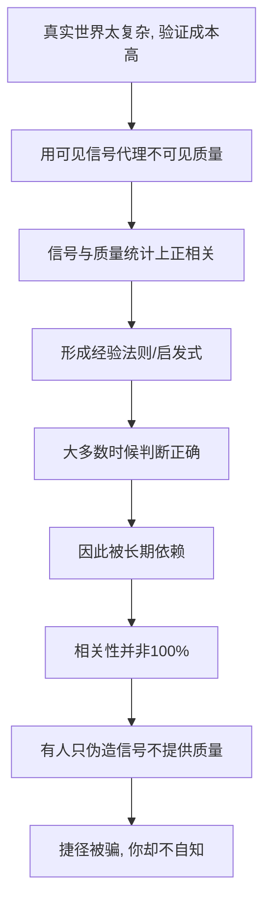

# 03｜这些“影响力武器”，为什么会有效？

> 既然自动化反应会被人利用，为什么我们仍然一直依赖它？

---

## 一、先说结论

西奥迪尼认为：因为这些捷径**大多数时候是对的**。

贵的平均确实更好，多数人都选的通常更稳，专家确实更懂行，快要没有了的东西确实更值得留意。这些自动反应不是愚蠢，而是被经验一遍遍校准过的**概率工具**。

所以他的立场不是“这些反应很蠢，我们要抛弃它”，而是：它们是必要的生存工具，真正的麻烦在于——有人能伪造信号，让这套本来可靠的工具有时判错。

---

## 二、我们先理解一个问题

先看一个场景。

同样一种药，有效成分一模一样，只是包装和标价不同：一种卖得很贵，一种卖得很便宜。让两组人分别服用，然后报告效果。

结果，服用“贵药”的那组，往往报告说效果更好。

问题来了：药是同一种药，身体里的化学反应不可能因为价签而改变。为什么我们明知成分可能一样，却依然倾向于相信贵的那一个更有效？我们在相信的，到底是药，还是那个价格？

---

## 三、作者到底提出了什么观点？

西奥迪尼的观点可以拆成三层。

**第一层：人的心智是“吝啬”的。** 在信息过载的世界里，对每一个决定都做完整分析是不可能的，所以我们发展出一批启发式——也就是经验法则、思维捷径。它们用少量线索，快速给出一个“够用”的判断。

**第二层：这些捷径的准确率并不低。** 西奥迪尼强调，它们之所以被长期保留，是因为在**统计意义上常常是对的**。价格确实和品质正相关，多数人的选择确实过滤掉了不少明显的坑，专家的判断确实平均高于外行。换句话说，捷径不是瞎猜，而是长期经验的压缩。

**第三层：正因如此，捷径才值得被攻击。** 如果你想让别人相信你的东西好，与其真的把东西做好，不如**制造出“好”的信号**——标一个高价、找人排队、亮出一个头衔。你利用的不是人的愚蠢，而是这套捷径平时积累起来的可信度。

---

## 四、把这个观点翻译成人话

可以这样理解：我们每天要做的判断太多，而验证每一件事的成本太高。于是大脑用**看得见的信号**去代理**看不见的质量**。

我们看不见这颗药的真实疗效，但能看见它的价格；我们看不见这家餐厅的卫生，但能看见门口的队；我们看不见这个人的专业水平，但能看见他的白大褂和头衔。价格、队伍、头衔都是**代理指标**。

代理指标的好处是省力、够快。代理指标的代价是：**它代理的是“质量的相关线索”，而不是质量本身。** 只要相关性不是百分之百，就存在一条缝隙——有人可以只伪装线索，不提供质量，而你的捷径依然会放行。

---

## 五、为什么会这样？

这套机制可以被画成一条“信号—捷径—被利用”的链条：

关键在 **C → G** 这一段：捷径的合法性建立在“信号和质量相关”之上；而**相关是概率，不是保证**。只要存在例外，就存在被利用的空间。

所以西奥迪尼不认为自动化反应是缺陷。更准确地说：**缺陷不在捷径，而在信号可以被伪造。** 这是理解全书的关键立场。

---

## 六、举一个现实生活中的例子

回到开头那个药价的问题。

一些研究表明，当受试者被告知某种药物价格较高时，他们报告的缓解程度会明显高于被告知价格较低的受试者——哪怕两组拿到的是同样的东西。研究者通常用**预期效应**来解释：价格这个信号，改变了你对“它应该有效”的预期，而预期本身就能影响主观感受，安慰剂效应也是类似道理。

这个例子之所以重要，是因为它把“影响力武器为什么有效”讲透了。人们相信“贵＝好”，并不是因为每次都被骗，而是因为在无数真实场景里，这条法则确实能帮他们躲开劣质品。正因为它在**多数情况下兑现**，我们才愿意把判断外包给价签。造假者要做的，只是借用这份长期信誉，在一个具体商品上标一个高价而已。

也就是说：**捷径的可信度是它最大的资产，也正是它唯一的软肋。** 它越可靠，就越值得被寄生。

---

## 七、回到书中重新理解

现在再回看西奥迪尼为什么坚持把七大原则叫作“武器”，就顺了。

如果自动化反应只是愚蠢的毛病，那么解决办法很简单：变聪明一点就好。可他反复强调，这些反应**本质上是有用的**。这带来一个更棘手的结果——**你不能靠“不相信任何信号”来保护自己**，因为那会让你在面对海量选择时彻底瘫痪。

所以防御的方向不是取消捷径，而是学会分辨：这次的信号，是真实的，还是被人**低成本伪造**出来的？真实的价格往往伴随着真实的成本，而伪造的信号，通常只花了一点点力气。

---

## 八、这个观点背后还有什么？

**第一，它和“有限理性”一脉相承。** 一些心理学家和经济学家认为，人在信息与注意力有限时，会主动采用“足够好”的策略，而不是追求最优解。捷径正是这种策略。

**第二，它可以用“信号理论”来补强。** 学界有一种观点认为：真正可信的信号，往往携带成本——读很多年书才当上医生，所以头衔有分量；伪造头衔却几乎免费，所以头衔也最容易被滥用。

**第三，它和卡尼曼的“两套系统”互补。** 捷径对应系统 1 的快速直觉；说服的本质，是让系统 2 来不及介入。

**第四，它把“服从”从道德问题变成了机制问题。** 与其责怪自己“怎么这么好骗”，不如去问：这次是哪条捷径被按下了，那条捷径原本是为解决什么问题而存在的？

---

## 九、这个观点有问题吗？

有，需要几点提醒。

**第一，“捷径大多数时候是对的”这句话本身难以精确检验。** 我们往往只记得它奏效的场合，忘记它失灵的时刻；判断正确时我们不会察觉，判断错误时才归因于“被骗”。这种记忆偏差，会让“大多数时候正确”显得比实际更有保证。

**第二，在被人为设计的环境里，正相关可能被系统性破坏。** 刷单让“大家都买”和“东西好”脱钩，刷评让“评分高”和“质量好”脱钩。当信号的生成成本降到接近零，捷径赖以为生的统计前提就被侵蚀了。

**第三，相关研究存在可重复性争议。** 心理学近年经历“可重复性危机”，西奥迪尼引用过的部分实验在重复检验中效应变弱。因此可以说“一些研究表明”，但不宜把单个数字当作定论。

**第四，但作为实践框架它依然成立。** 无论细节如何，“人用低成本线索代理复杂质量，因此线索可被伪造”这一方向，在营销、谈判与公共沟通中被反复观察到，这也是它成为经典的原因。

**所以更平衡的说法是**：捷径确实有用，但它的可靠性取决于环境是否“诚实”。在一个信号可以随意伪造的世界里，捷径的准确率会下降，而它的使用习惯却不会自动更新——这正是现代人最尴尬的处境。

---

## 十、今天再看这个观点

以下部分是基于西奥迪尼思想的现代延伸，不是他在书里的原话。

在平台经济里，信号已经不只是一件商品上的标签，而是一整套可被批量生产的“社会证据”：销量、评价数、热度、榜单、粉丝量。它们的共同点是——**看起来像质量的代理，实际却常常可以直接购买。**

这带来一个西奥迪尼当年没有正面处理的新问题：当“贵＝好”“人多＝对”“专家＝可信”这些捷径赖以为生的相关性，被平台方当作可优化的指标时，捷径从“省力的工具”变成了“被持续投喂的对象”。你需要防的不再只是某个推销员，而是一整个把信号生产规模化的系统。

---

## 十一、这一篇真正应该记住什么？

1. **捷径不是愚蠢，而是经验压缩。** 它们大多数时候准确，所以被我们一直保留。
2. **捷径用可见信号代理不可见质量。** 价格、队伍、头衔，都只是代理指标。
3. **问题不在捷径，而在信号可被伪造。** 攻击者借用的是长期积累的可信度。
4. **防御不是不信任何信号，而是分辨真伪信号。** 真实信号往往带着真实成本。
5. **捷径的可靠性依赖环境。** 当一个系统能批量生产信号，捷径就更容易被带偏。

---

## 十二、留一个问题

> 如果“贵＝好”这条捷径，是千百年真实经验换来的省力工具——
> 那么当你下一次因为价格高而相信某样东西时，
> 你是在使用经验，
> 还是在使用别人替你准备好的经验？

---

**下一篇**：理解了捷径为什么有效，我们终于可以走进七大原则本身。而它们之中排在第一位的，是最古老、也最普遍的一条社会规范——它甚至能在你并不喜欢对方、也并不需要那样东西的时候，依然让你觉得“不还点什么，心里过不去”。

下一篇我们就来拆开这个问题——**互惠：为什么拿了别人的好处就想还？**
