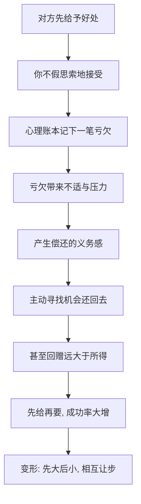

# 04｜互惠：为什么拿了别人的好处就想还？

> 为什么一点小恩惠，就能换来一个远不相等的人情？

---

## 一、先说结论

西奥迪尼认为，人类社会中存在一条几乎无人明说、却人人遵守的规范：**接受了好处，就产生了偿还的义务感。** 他称之为互惠。

它的强大之处在于三点：第一，**它跨越喜欢**——哪怕对方你并不欣赏，甚至讨厌，欠了人情还是想还；第二，**它跨越理性**——你回赠的东西往往远超过当初收到的那一点；第三，**它先于请求发生**——先给再要，通常比直接要有效得多。

免费样品、赠品、先让你的小让步，都是互惠的不同变形。

---

## 二、我们先理解一个问题

先想象一个场景。

你走进超市，路过一个试吃台。促销员微笑着递来一小块切好的食物：“尝一尝，不要钱。”你顺手接了，吃了。

味道其实一般，你原本也不打算买。可当促销员问“要不要带一盒”时，你犹豫了。不买，好像有点说不过去；空着手走开，仿佛自己白占了人家便宜。

问题来了：那一小块食物，成本可能只有几毛钱；你和促销员素不相识，也没有任何义务。**为什么一点微不足道的好处，就能让你产生一种“我得还点什么”的压力？** 而且这种压力，为什么常常大到足以改变你的购买决定？

---

## 三、作者到底提出了什么观点？

西奥迪尼把互惠称为人类文化中最普遍、最根本的规范之一。**它的核心是：我们有义务，在未来回报别人给过我们的东西。**

他特别强调几个容易被低估的特征。

**第一，亏欠感是被强烈感受到的。** 欠了人情，是一种不舒服的状态，人们会急着把它消掉——就像急着还一笔看不见的债。

**第二，互惠的回报往往不对等。** 收到一点小恩惠，回赠的却常是一份大礼。正因如此，“先给一点点”可以撬动“还很多”。

**第三，义务感可以被“未请求的恩惠”触发。** 对方并没有要求你接受，是你自己伸手拿的；但一旦拿了，亏欠感照样成立。这让“先给”成为一种低成本、高回报的策略。

**第四，** 西奥迪尼指出，互惠还有一种更隐蔽的变形：**相互让步**。如果你先提出一个大要求、被拒绝，再退一步提出一个小要求，对方会把你的“退让”当成一种给予，从而也倾向于退让——这就是所谓“留面子”技巧。

---

## 四、把这个观点翻译成人话

可以这样理解：人类社会里流通着一种看不见的货币，叫“人情”。

它不像钱那样被精确计价，所以反而更难拒绝。收了别人的好处，你的心理账本上就多了一笔“应付账款”；而人天生厌恶欠着账的感觉，于是会主动寻找机会把它平掉。

关键在于：**这笔账的金额由感受决定，而不由市场决定。** 一盒试吃成本几毛，但它在心理账本上可能记作“我欠了人家一份好意”，而“好意”是无法标价的，于是你还回去的，往往远超过它实际值。

所以互惠真正厉害的地方不是“礼尚往来”这么简单，而是：**给予者握着定价权。** 他给得轻，你未必还得轻。

---

## 五、为什么会这样？

互惠能成立，靠的是一条从“接受”到“偿还”的心理链条：

关键在 **C → E** 这一跳：好处一旦收下，义务感就自动生成，**甚至不需要你喜欢对方，也不需要你主动开口要**。

西奥迪尼提醒，正因为这条链条几乎是自动的，它才容易被利用：对方只要抢先付出一点，就相当于在你的心理账本上预先记了一笔，后面再开口，你答应的概率就明显上升。

---

## 六、举一个现实生活中的例子

超市里的免费试吃，是互惠最日常、也最赤裸的应用。

一块小小的试吃品，几乎没有成本，却被系统性地摆在动线上。它的作用不是让你判断味道，而是完成一次**先给的仪式**：你伸手接了，吃了，你和促销员之间就多了一层看不见的关系。促销员没有强迫你，他只是先付出了那么一点点。

接下来发生的事，是互惠的经典剧本：即使你并不特别喜欢这个味道，即使你原本完全没有购买计划，你也会更倾向于“至少买一盒”。不是产品说服了你，而是那份亏欠感在推你。

更值得留意的是，这一招还常常和别的影响力武器叠加。试吃台旁往往还放着价格对比的标牌、排着队的顾客、写着“限购”的字样——但**互惠是第一块多米诺骨牌**：它先让你产生亏欠，后面的信号才有机会顺着这份亏欠，把你推得更远。

---

## 七、回到书中重新理解

现在再看西奥迪尼为什么把互惠放在七大原则的第一条，就顺了。

在书里，互惠是**最古老、最普遍**的一条规范。它比社会认同、喜好、权威更基础，因为人类社会本身就要靠“给与还”来维持协作。没有它，交换、信任、分工都难以持续。

西奥迪尼的洞察在于：正因为这条规范如此深入人心、如此自动，它才不只是维系关系的**黏合剂**，同时也是一种可被设计的**顺从工具**。先给再要、先大后小、先退一步，全都是在同一条规范上做文章。

所以记住：**互惠本身是中性的社会机制，被谁使用、用在什么目的上，才是问题的关键。**

---

## 八、这个观点背后还有什么？

**第一，它把“礼物”变成了一种关系语法。** 送礼、请客、帮忙，表面上是付出，实际上也在建立一种“你欠我”的联结。人类学早就注意到，很多社会里礼物从来不是免费的。

**第二，不对等是它的常态而非例外。** 因为回赠多少由感受决定，所以“还得更多”几乎是默认设置。这也是为什么收下别人主动送的东西，有时反而是一种被动。

**第三，让步也是一种给予。** “留面子”技巧就是互惠的变体：从大要求退到小要求，对方感知到的不是“降级”，而是“你为我让了步”，于是也愿意让一步。这解释了很多谈判中的奇怪现象——先狮子大开口的人，最后反而更容易拿到一笔不高不低的条件。

**第四，它和“关系远近”有关。** 一些心理学家认为，在熟人之间，互惠更像长期投资；在陌生人之间，互惠更像即时交易。同一规范，在不同的关系里表现并不相同。

---

## 九、这个观点有问题吗？

有，需要几点提醒。

**第一，经典研究存在可重复性争议。** 西奥迪尼引用过的一些“先给再要”实验，在心理学“可重复性危机”的检验中效应有所减弱。因此可以说“一些研究表明互惠会显著提高顺从率”，但不宜把某个具体比例当成铁律。

**第二，文化差异不可忽略。** 关于这一问题，学界存在不同解释：互惠规范的强度在集体主义与个人主义文化、在熟人社会与陌生人社会里并不一致；在有些情境下，未请求的恩惠甚至会引起警觉和反感，而不是义务感。

**第三，被识破的“给予”会反噬。** 一旦我意识到你递来的试吃只是诱饵，那份亏欠感就可能翻转成防备甚至抵触。互惠要起作用，往往需要对方不觉得这是一场交易。

**第四，它不是万能的。** 互惠影响的是“答应的倾向”，而不是“必须答应”。面对真正重大的决定，义务感会被其他考量抵消。

**所以更平衡的说法是**：互惠是一条真实而强大的社会规范，但它是一种**倾向性压力**，而非不可违抗的强制力；它的强度和表现，取决于关系、文化与你是否识破。

---

## 十、今天再看这个观点

以下部分是基于西奥迪尼思想的现代延伸，不是他在书里的原话。

数字时代把“先给”这件事的成本压到了接近零，也把它放大了无数倍。免费试用、免费课程、免费额度、免费内容、免费软件——你几乎不需要付出任何代价就能收到好处，因此也几乎无从拒绝地被记入了无数笔心理账。

更微妙的变化在于：过去的“给予”多来自某个具体的人，你会看着他的眼睛；现在，给予者常常是算法与平台，免费的东西被推送到你面前，而“偿还”被延后到某个你不易察觉的时刻——充会员、留数据、形成依赖。互惠的链条没变，只是**它从一次面对面的交换，变成了一个长期的、自动化的账户。**

---

## 十一、这一篇真正应该记住什么？

1. **互惠是一条普遍的社会规范。** 接受好处，就会自动产生偿还的义务感。
2. **它跨越喜欢与理性。** 哪怕不喜欢对方，回赠也常远大于所得。
3. **“先给再要”远胜“直接要”。** 亏欠感是顺从最强的前置条件之一。
4. **让步也是给予。** “先大后小”的留面子技巧，是互惠的变形。
5. **它中性地存在。** 真正要分辨的是：这份好处，是善意，还是被设计好的钩子？

---

## 十二、留一个问题

> 如果那一小块免费食物在心理账本上，被记成了“我欠人家一份好意”——
> 那么下次当有人抢先对你好一点时，
> 你该问自己的是：
> 我真的想还，还是只是不喜欢欠着？

---

**下一篇**：互惠让我们“拿了就想还”，但它还只是针对别人的给予。有一样东西比它更靠近你自己——你自己说过的话、做过的选择。为什么一个小小的公开承诺，会让人一步步做出越来越大的妥协，哪怕它早已不再合理？

下一篇我们就来拆开这个问题——**承诺与一致：为什么我们会死守自己说过的话？**
