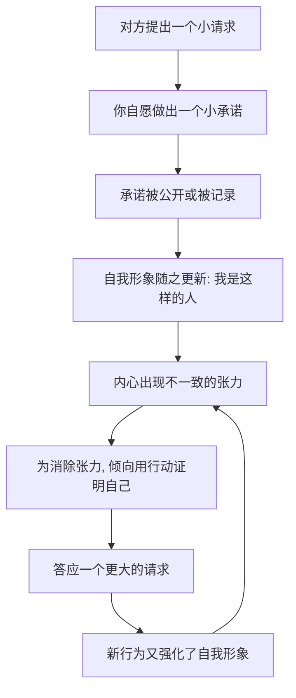

# 05｜承诺与一致：为什么我们会死守自己说过的话？

> 为什么一个小小的公开承诺，会让人随后做出越来越大的妥协？

---

## 一、先说结论

西奥迪尼认为：**一旦我们做出了某个选择，尤其是公开做出了承诺，就会产生一股强大的内在压力，逼着自己去维持它。**

这股压力追求的不是“把事情做对”，而是“让自己看起来前后一致”。于是，先让你答应一个小请求，再利用“我可是个说话算数的人”这种自我形象，去推动你答应一个更大的请求——这就是“登门槛”。

承诺越公开、越费力、越出于自愿，它对你的锁定就越紧。

---

## 二、我们先理解一个问题

先看一个很多人经历过的场景。

一位志愿者在街头拦住你，请你在一张“支持救助贫困儿童”的请愿书上签名。你觉得没什么，顺手签了。

几天后，同一个人打来电话，说他们正在为贫困儿童募捐，希望你能捐一笔钱。

按常理，签个名和捐钱是两件独立的事，你完全可以理直气壮地拒绝。但西奥迪尼在书里引述的观察一致指向同一个方向：**签过名的人，之后捐款的比例明显更高。**

问题来了：为什么一张不花钱的签名，会让之后花钱的捐款变得难以拒绝？我们真正在维护的，到底是什么？

---

## 三、作者到底提出了什么观点？

西奥迪尼提出了“承诺与一致”原则。它的核心是：**人有一种强烈的、近乎自动的需求，要让自己的言行前后一致。**

他进一步指出，这种一致性倾向有几个关键特征：

1. **它由自我形象驱动。** 真正起作用的不是“我答应了你”，而是“我成了一个做出过承诺的人”。
2. **它会被行动与公开放大。** 光在心里想不算数；一旦说出口、写下来、当众做出，压力就成倍上升。
3. **它会自我延续。** 为了维护一致，人会主动寻找支持自己立场的理由，甚至为已经不合理的选择继续加码。

所以西奥迪尼的立场是：一致性本身是好事，它让生活可预测、让合作成为可能；但正因为它如此有力，它也就成了被人精心利用的按钮。

---

## 四、把这个观点翻译成人话

可以把它想象成给自我形象“上了一把锁”。

签下名字的那一刻，你并不是在承诺“我要捐钱”，你只是把自己归档成了“一个关心这件事的人”。之后，当募捐电话打来，你面对的其实不是“要不要捐钱”，而是“我要不要承认自己是那种签了名却什么也不做的人”。

这两道题的难度完全不同。前者是成本问题，后者是身份问题。

人在身份问题上，通常比在金钱问题上更不肯认输。

---

## 五、为什么会这样？

这条链条可以这样拆：

关键在于 **D → E** 这一跳。

真正被锁住的不是你的行为，而是你的**自我认知**。行为可以改，认知却很难承认自己“前后矛盾”。于是，为了不做一个“不一致的人”，你宁愿做一个“答应更多请求的人”。

这也是为什么公开承诺比私下承诺强得多：**公开意味着有见证者，不一致的代价从“自我评价”升级成了“社会评价”。**

---

## 六、举一个现实生活中的例子

慈善募捐是经典场景，但它的现代版本更常见：健身房办卡。

销售的第一步往往不是让你立刻付款，而是让你先做一件很小的事——免费体验一次、填一份“你的健身目标”，甚至只是当场写下“我承诺每周来三次”。

你写下这句话时，觉得不过是随口一说。

可一旦写下，它就变成了你对自己的一次公开表态。接下来教练来谈套餐，你拒绝的就不再是“要不要花这笔钱”，而是“我要不要承认自己写下的目标做不到”。很多人正是在这一步，签下了远超预期的年卡。

真正的机关不在价格，而在那张纸上的字。

---

## 七、回到书中重新理解

现在再回看西奥迪尼的框架，“登门槛”就顺了。

它的顺序是：**先小后大、先易后难、先公开后深入。** 前面每一步都在悄悄修改你的自我形象，等到大请求出现时，你面对的已经不是同一道题了。

书里还提到相关的变体，比如“抛低球”：先用一个优惠条件让你做出决定，再悄悄撤掉条件。此时决定已经做出，人往往不会撤销，反而会自己找理由留下来。

所以这一原则真正针对的不是你的钱包，而是**你对自己是谁的那份坚持**。

---

## 八、这个观点背后还有什么？

**第一，一致性是一种高效的省电模式。** 如果每件事都重新权衡，人会被决策压垮。用“我以前怎么选”来指导“我现在怎么选”，大多时候是划算的。

**第二，它是一种自我防卫。** 承认自己做过错误承诺，比继续坚持它更痛苦。一些心理学家用“认知失调”来描述这种张力。

**第三，它和沉没成本互相强化。** 已经投入的时间、金钱、公开表态，都会让退出显得更不划算。

**第四，它会让人一步步走向极端。** 因为每一步都只比上一步多一点，所以单看每一步都不荒谬，累积起来却可能面目全非。

---

## 九、这个观点有问题吗？

有，而且需要平衡地看。

**第一，“一致性压力”不是无条件的。** 一些心理学家认为……效应是否出现，取决于承诺是否自愿、是否公开、是否被自己视为主动选择。被迫做出的承诺，反而可能削弱后续的顺从。

**第二，解释并不唯一。** 同样的现象，也可以被解释为沉没成本效应，或自我知觉理论——即我们通过观察自己的行为来推断自己的态度。承诺与一致只是其中一种讲法，关于这一问题，学界存在不同解释。

**第三，部分经典研究的效应量受到质疑。** 近年心理学的可重复性讨论提醒我们，某些“登门槛”类实验的效应在重复检验中并不总是稳定，因此在引用具体比例时要谨慎。

**第四，但这不影响它作为实践框架的价值。** 无论底层机制叫“失调”还是“自我知觉”，“先小承诺、后大请求”在实际场景中的有效性被反复观察到，这也是它在销售、动员与谈判中被广泛使用的原因。

**所以更准确的说法是**：这是一个强有力的解释视角，但它的强度取决于情境条件，不能理解成“只要签了字就必然被套牢”。

---

## 十、今天再看这个观点

以下部分是这一原则的现代延伸，不是西奥迪尼的原话。

数字产品把它做成了流水线。注册时先让你点“同意”、打卡类应用让你连续签到、会员体系让你公开一个“目标”，每一步都在制造一个小小的、可被记录、可被展示的承诺。

更微妙的是，平台可以把这条链条拉得极长：今天填一个偏好，明天授权一项数据，后天升级一个套餐。单看每一步都微不足道，合起来却是一份你从未主动同意的合同。

所以这一原则在今天的新用途是：**当你被要求“先表个态”时，先想一想，你是在回答一个请求，还是在修改一个关于自己的定义。**

---

## 十一、这一篇真正应该记住什么？

1. **人需要言行一致。** 做出承诺后，会自动产生维持它的压力。
2. **承诺会被自我形象放大。** 起作用的不是承诺本身，而是“我成了那样的人”。
3. **公开、费力、自愿的承诺最危险。** 三个条件越齐，锁定越紧。
4. **登门槛靠的是先小后大。** 每一步都不荒谬，累积起来却很惊人。
5. **防御的关键是回头检查。** 问一句：如果今天重新选，我还会这样选吗？

---

## 十二、留一个问题

> 如果你坚持某件事，只是因为“我已经说了要做”，
> 那么假设你从没说过那句话，
> 你今天还会做同样的选择吗？

---

**下一篇**：承诺与一致让人守住自己说过的话，还有一种力量更省事——它不需要你开口，只需要你抬头看一眼周围的人。当所有人都在做同一件事时，我们为什么会觉得那一定是对的？

下一篇我们就来拆开这个问题——**社会认同：为什么“大家都在做”就显得对。**
