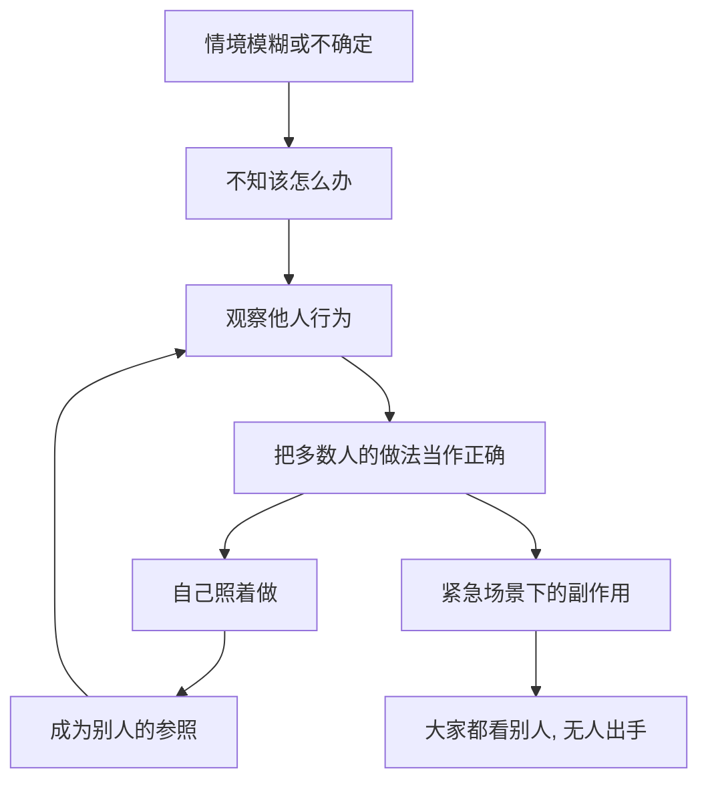

# 06｜社会认同：为什么“大家都在做”就显得对？

> 为什么在不确定的时候，我们会把别人的行为当成正确答案？

---

## 一、先说结论

西奥迪尼认为：**当我们不确定该怎么做时，会本能地参照周围人的行为，并把“大家都在做”当成正确答案。**

这就是社会认同。它有两个最强的触发条件：**一是情境不确定，二是参照对象与我们相似。**

它的麻烦在于双向性：既能帮我们在陌生场合迅速找到正确做法，也能让我们在有人需要帮助时集体沉默——因为每个人都在看别人，而别人也在看每个人。

---

## 二、我们先理解一个问题

两个场景摆在眼前。

第一个：你点开一场直播，商品页面写着“已下单 3 万件”“好评 10 万条”，弹幕不断刷“抢到了”。你原本只是随便看看，手指却慢慢移向了“立即购买”。

第二个：街边有一家餐厅排起长队，隔壁那家空无一人。你从没吃过任何一家，却几乎下意识地走向了排队的那家。

问题来了：你既不知道直播间的货好不好，也不知道那家餐厅的味道如何。**在信息几乎为零的情况下，你为什么敢下单、敢进门？**

---

## 三、作者到底提出了什么观点？

西奥迪尼提出“社会认同”原则：**人们会依据他人的行为来判断什么是对的，尤其是在自己拿不准的时候。**

他概括了几个关键点：

1. **不确定时依赖最强。** 越没把握、越陌生、越含糊，越容易跟着别人走。
2. **相似者影响最大。** 一个和你处境相似的人怎么做，比一个遥不可及的人说什么更有分量。
3. **它常常是无意识的。** 我们并不是在“抄作业”，而是根本没意识到自己在参照别人。

同时，西奥迪尼也指出它的阴暗面：**当紧急情况发生，旁观者越多，反而越可能没人出手。** 每一个人都在观察别人的反应，于是所有人的冷静被彼此确认，最后无人行动。

---

## 四、把这个观点翻译成人话

可以把别人的行为，当成一块“社会仪表盘”。

在一个陌生的路口，你不知道前面的水有多深。这时你最省力的做法不是自己下水试探，而是看别人怎么走——如果大家都蹚过去了，那大概率是安全的。

问题在于：**这块仪表盘显示的是“别人怎么做”，而不是“这件事对不对”。** 当别人也是照着别人在做时，整块仪表盘其实是一串回音。

所以社会认同不是知识，而是**信号**。它降低的是你判断的成本，而不是你判断的风险。

---

## 五、为什么会这样？

这条链条可以这样拆：

关键在 **E → F** 这条回路。

社会认同自带放大器：你的跟随行为，又变成了下一个人的证据。于是原本只是一个猜测，经过几次传递，就被加固成了“事实”。

这也解释了为什么它既能制造从众，也能制造冷漠——**在同一套机制里，行动与不行动都会传染。**

---

## 六、举一个现实生活中的例子

看那个直播间。

主播说：“家人们，已经下单 3 万件了，好评率 99%。”

此时你手里没有任何关于商品质量的独立信息。唯一的线索，就是“3 万件”这个数字和满屏“抢到了”的弹幕。你心里其实在想：**这么多人都买了，总不会都错吧？**

但你忽略了三件事：这个数字可能只是“加入购物车”而非真实成交；好评可能来自优惠激励；弹幕里可能混着无数和你一样在观望的人。

排队也一样。你看到的是队伍，看不到的是队伍形成的原因——可能是刚开了团购，可能只是门口临时堵车。但你不追问，因为**长队本身就已经替你完成了判断。**

这正是社会认同被商业化使用的方式：**它不改变商品，它改变你对商品的信心来源。**

---

## 七、回到书中重新理解

现在再回看西奥迪尼为什么要专门写“社会认同”，就顺了。

他真正关心的不是“从众”这个老话题，而是一个更锐利的判断：**在信息不足时，人会主动向他人索取答案，而这份索取可以被规模化地制造。**

书里提到的很多手段，本质都是同一个操作：先制造一个“很多人已经这样做了”的表象，再让真实的跟随者自己去填补剩下的信任。印好的笑声、排队的托、刷出来的销量，做的都是这件事。

所以这一原则的核心不是“人多”，而是**“人多”被当作了正确性的证明。**

---

## 八、这个观点背后还有什么？

**第一，它和“不确定”是一对。** 情境越清楚，社会认同越弱；越模糊，越强。这给了我们一条很实用的判断线索。

**第二，相似性比数量更关键。** 一个和你同城、同岁、同样处境的人的行为，往往比一万个陌生人更有影响力。

**第三，“多数”有时是想象出来的。** 我们常常高估某种行为在人群中的普遍程度，于是做出其实没人在做的事。

**第四，它可以被反过来利用。** 一旦公开正确的做法——比如“本店大多数客人只点一份”——社会认同也能被用来引导节约或合规。

---

## 九、这个观点有问题吗？

有，而且争议相当集中。

**第一，“旁观者效应”的经典叙事受到挑战。** 关于这一问题，学界存在不同解释。早期的著名案例在细节上被质疑，一些学者分析大量真实监控记录后发现，人群密度与是否施救之间的关系，并不像实验室结论那样简单——在真实世界里，人越多，得到帮助的概率有时并不下降。

**第二，实验室情境与真实情境存在差距。** 实验室里的“紧急事件”往往是设计出来的、低风险的，与真实危机中的责任、能力、风险判断差别很大。

**第三，文化差异明显。** 一些心理学家认为……社会认同的强度在不同文化中并不一致，集体主义文化中的从众倾向可能更强，但具体结论也存在分歧。

**第四，但“不确定时参照他人”这一基本面被广泛认可。** 无论旁观者效应的边界如何，社会认同作为日常判断的依据，在消费、舆论与公共行为中都被反复观察到。

**所以更准确的说法是**：社会认同是一个可靠的解释框架；但“人越多越冷漠”这类结论要谨慎使用，它更像是特定条件下的结果，而不是普遍规律。

---

## 十、今天再看这个观点

以下部分是社会认同原则的现代延伸，不是西奥迪尼的原话。

平台把“别人怎么做”变成了一种默认的界面语言：好评数、点赞、播放量、热搜榜、“你的好友都在看”“附近的人都在买”。这些数字有一个共同点——**它们几乎不提供关于质量的任何信息，却极大地影响你对质量的判断。**

更进一步，这些数字是可以被设计和购买的，而算法又倾向于把已经被跟随的内容推给更多人，于是“多数”会自我实现。

所以这一原则在今天的新用途是：**当你想知道一件东西好不好时，先分清你看到的到底是证据，还是只是别人也在看。**

---

## 十一、这一篇真正应该记住什么？

1. **不确定时，我们会把别人的行为当答案。** 这是社会认同的核心。
2. **两个放大器：不确定与相似。** 越模糊、参照者越像自己，影响越大。
3. **它会传染，也会被制造。** 跟随行为本身又成为别人的证据。
4. **它既造成从众，也造成冷漠。** 行动和不行动沿同一机制传播。
5. **防御的方法是问“这是证据还是回音”。** 分清真实信息与被展示出来的多数。

---

## 十二、留一个问题

> 如果你对一件商品的信任，全部来自“很多人在买”，
> 那么假设那些数字从未被你看见，
> 你还会做出同样的选择吗？

---

**下一篇**：社会认同讲的是“别人怎么做”，但还有一股力量更柔软——它不靠人多，只靠你喜欢。为什么同样的请求，从一个你喜欢的人口中说出，就变得很难拒绝？

下一篇我们就来拆开这个问题——**喜好：为什么我们更容易答应喜欢的人。**
