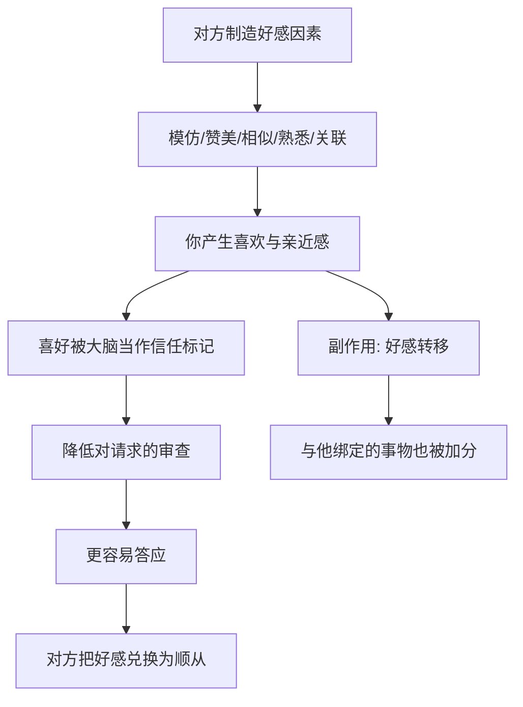

# 07｜喜好：为什么我们更容易答应喜欢的人？

> 为什么“喜欢”本身，就能让人答应请求？

---

## 一、先说结论

西奥迪尼认为：**人倾向于答应自己喜欢的人的请求。**

而“喜欢”并不是一种纯粹的感情，它由若干可以被拆解、也可以被制造的因素组成：外表吸引力、相似性、赞美、熟悉感，以及合作关系。

麻烦正在这里：**既然好感可以被人为生产，那么“我喜欢他”这条线索，就不足以成为“我该答应他”的理由。**

---

## 二、我们先理解一个问题

先看两个几乎人人经历过的场景。

第一个：一个你熟悉的明星出现在广告里，微笑着说“我一直在用这款产品”。你明知道他是收钱出镜，却仍可能对它多一分好感。

第二个：一位平时关系不错的同事找你帮忙，说“这个表格你能不能帮我弄一下，就你最靠谱”。你本来手头也忙，却不太好意思拒绝。

问题来了：**这两件事里，都没有任何关于“这个产品好不好”“这个忙该不该帮”的证据。** 可你就是更容易点头。为什么“我喜欢他”会自动翻译成“我答应他”？

---

## 三、作者到底提出了什么观点？

西奥迪尼提出“喜好”原则：**我们倾向于答应自己认识和喜欢的人的请求。**

他进一步把“喜欢”的来源拆成几个可操作的成分：

1. **外表吸引力。** 长得好看的人，常常被默认也更聪明、更善良、更可靠。
2. **相似性。** 与自己观点、背景、兴趣相似的人，更容易被喜欢。
3. **赞美。** 哪怕明知对方有所图，赞美依然有效。
4. **熟悉与接触。** 反复接触会提升好感，即使接触本身没有内容。
5. **合作与关联。** 一起做事、或被人为地与愉快的事物绑定，都会把好感转移过来。

西奥迪尼的关键提醒是：**这些因素大多可以被伪装和操纵。** 模仿你的说话方式、迎合你的立场、夸你几句、把自己和好消息绑定——都是在生产好感，再把好感兑换成顺从。

---

## 四、把这个观点翻译成人话

可以把“好感”理解成一张**优先通行证**。

在社交里，我们需要快速决定该信任谁、该帮谁。喜欢是一种省事的标记：我喜欢你，所以我默认你无害、你值得。它让你绕过了一部分审查。

问题在于，这个标记是可以被伪造的。别人不需要真的对你好，只需要让你“感觉”到亲近——模仿你的语气、赞同你的观点、送你一句真诚的赞美。

于是票被放行了，而你甚至没意识到，自己刚才验的不是资质，而是情绪。

---

## 五、为什么会这样？

这条链条可以这样拆：

关键在 **D → E** 这一跳。

喜好并不直接改变请求本身的价值，它改变的是你的**审查强度**。同样一个请求，来自喜欢的人，你问的问题会少一半。

而 **C → H** 说明好感的另一个特性：它会溢出。喜欢的人推荐的东西、喜欢的球队去的餐厅，都会跟着加分——这就是为什么“关联”是营销里最常用的操作之一。

---

## 六、举一个现实生活中的例子

明星代言是最公开的一种。

品牌付钱请一个你早就喜欢的人，让他拿着产品说“我也在用”。真正的信息量为零：他有没有用，你无法核实；他为什么说，你心知肚明。但你依然会稍微偏向它，因为你把对那个人的好感，顺手转给了那个产品。

熟人推荐则更隐蔽。

一个朋友在群里发来链接，说“这个真的不错，我用过”。你可能连参数都不看就下单了。这里促成决定的，不是产品评估，而是**你与朋友的关系被借用了一次**。而朋友本人，往往也是出于真诚——他只是把自己对产品的好感，和对你这个人的信任，叠在了一起。

两种场景的共同点是：**决定是在信任层面做出的，却以“产品不错”的形式被感知。**

---

## 七、回到书中重新理解

现在再回看西奥迪尼为什么把“喜好”和“互惠”分开写，就顺了。

互惠靠的是亏欠，是“我欠你”；喜好靠的是亲近，是“我信你”。前者是账本，后者是感情。两者都能换来顺从，但机制不同。

书里描述过一种典型场景：家庭聚会式的销售。主人邀请朋友来家里，产品由熟人展示，气氛是朋友聚会，交易却在进行。这里的机关不是产品，而是**熟人关系被临时征用成了销售渠道。**

西奥迪尼真正想说的不是“别喜欢别人”，而是：**当“我喜欢他”变成了“所以我答应他”的自动理由，这条捷径就被人接管了。**

---

## 八、这个观点背后还有什么？

**第一，好感与好感转移是两种不同的东西。** 前者针对人，后者针对与人绑定的事物。品牌请代言，买的就是后者的溢出效应。

**第二，赞美和相似性几乎无法免疫。** 哪怕你事先知道对方在讨好你，效果依然存在。知道，不等于不受影响。

**第三，熟悉感会伪装成判断。** 一个反复出现的名字、一张反复见到的脸，会让人误以为自己对它有了解。

**第四，它与“联盟”相邻但有别。** 喜欢是“我欣赏你”，联盟是“我们是一伙的”。后者更深、更持久，也更难拒绝。

---

## 九、这个观点有问题吗？

有，但这一条总体上争议较小。

**第一，“外表即优势”的效应真实但被夸大。** 一些心理学家认为……“美即好”的刻板印象确实存在，但它对重要决策的影响往往被情境削弱，尤其在信息充分时。

**第二，相似性的作用条件不明确。** 相似确实提升好感，但它对顺从的影响，在不同研究和场景中强弱不一，关于这一问题，学界存在不同解释。

**第三，因果关系有时很难分清。** 是喜欢导致了顺从，还是顺从之后为了自我一致而更喜欢对方？两者可能互相强化，而不只是单向作用。

**第四，部分研究的效应量存在波动。** 在可重复性讨论中，某些单一好感因素（如单纯赞美）的效应并不总是稳定，因此不宜把“夸几句就能让人答应”当作必然规律。

**第五，但总体方向被广泛接受。** 无论细节如何，“喜欢提升顺从”这一现象在营销、谈判与日常交往中被反复验证，这也是它成为经典原则的原因。

**所以更准确的说法是**：喜好是一条可靠的捷径，但它的强度取决于具体的人、事与情境，不能简化成“只要讨人喜欢就一定能得手”。

---

## 十、今天再看这个观点

以下部分是喜好原则的现代延伸，不是西奥迪尼的原话。

社交与内容平台把“制造好感”变成了一项可外包的服务。博主先通过长期分享与你建立熟悉与相似，再在合适的时机推荐商品；粉丝与创作者之间形成的情感联结，把一条普通的购物链接变成了“支持自己喜欢的人”。

更细的一层是算法：它可以学习你偏好怎样的表达、怎样的立场，然后把内容调整成你最容易喜欢的样子。你感到的“合拍”，有一部分是设计出来的。

所以这一原则在今天的新用途是：**当你说“我相信他推荐的东西”时，清点一下，你相信的到底是这个产品，还是那种被制造出来的喜欢。**

---

## 十一、这一篇真正应该记住什么？

1. **人会答应喜欢的人的请求。** 这是喜好原则的一句话版本。
2. **喜欢由可拆解的因素组成。** 外表、相似、赞美、熟悉、合作。
3. **好感会溢出。** 与人绑定的事物也会跟着被加分。
4. **好感可以被制造。** 模仿、迎合、赞美、攀关系，都是生产工具。
5. **防御的关键是分开两件事。** 我喜欢这个人，不等于这个请求值得答应。

---

## 十二、留一个问题

> 如果提出请求的是一个你不喜欢、甚至有点反感的人，
> 同样的内容，你还会答应吗？
> 如果你的答案会变，那么让你点头的，究竟是那个请求，还是那份好感？

---

**下一篇**：喜好靠的是“我喜欢他”，但那还需要一点私人感情。还有一种影响更省力——它不需要你喜欢、不需要你熟悉，只需要一个头衔、一件制服、一辆车，就足以让你放弃自己的判断。

下一篇我们就来拆开这个问题——**权威：为什么一个头衔就能让我们服从。**
