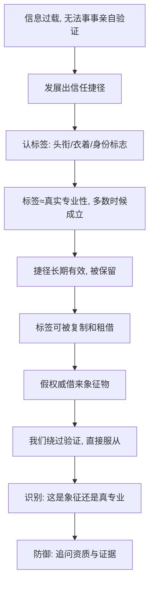

# 08｜权威：为什么一个头衔就能让我们服从？

> 为什么仅仅是制服、头衔或身份，就能让人放弃自己的判断？

---

## 一、先说结论

西奥迪尼认为，**人有一种强烈的、近乎自动的服从权威的倾向**。我们从小被教导：听老师的话、听医生的话、听专家的话，服从权威是合理的，甚至是安全的。久而久之，这种态度变成了一种自动反应——**权威说的，就是对的。**

真正危险的地方在于：我们往往不是对权威的"专业性"做出反应，而是对权威的"象征"做出反应——一件白大褂、一个头衔、一辆豪车、一个"博士"的称呼。象征是可以租来的，专业性却不能。于是，只要有人能借来这些象征，就能在你几乎毫无察觉的时候，使用并不属于他的权威。

这一篇只回答一个问题：**为什么仅仅是制服、头衔或身份，就能让我们放弃自己的判断？**

---

## 二、我们先理解一个问题

先看一个你几乎天天都会遇到的场景。

你刷到一条广告：一位穿着白大褂、戴着眼镜的中年人，站在类似诊室的背景前，语气笃定地说："作为专业人士，我推荐这款产品。"你的手指停了一下。哪怕你心里清楚"广告里的人多半是演员"，"作为专业人士"这几个字，还是让产品的可信度往上抬了一点。

问题就在这里：**白大褂本身，证明了什么？**

它没有证明这个人读过医学院，没有证明他了解这款产品，甚至没有证明他真的是医生。它只证明了一件事——他穿了一件白大褂。可为什么仅仅这一点，就足以改变我们的判断？

更奇怪的是，这种影响往往发生在你意识到"这可能只是演员"之后，依然存在。你明明不信，却还是被打动了一点点。我们到底在服从什么？

---

## 三、作者到底提出了什么观点？

西奥迪尼把"权威"列为让人顺从的核心原则之一。他的观点大致可以拆成三层。

**第一层：服从权威是一种根深蒂固的社会规范。** 从家庭到学校再到职场，我们被反复训练：服从权威会得到奖励，违抗权威会付出代价。这种训练太成功，以至于成年之后，只要一个权威身份出现在面前，我们就会本能地倾向于配合。

**第二层：我们对权威的反应常常是自动化的。** 西奥迪尼强调，顺从往往不需要深思熟虑。权威一旦登场，判断的那道闸门就会松动，我们不再追问"他说得对吗"，而是直接进入"那我该怎么做"。

**第三层，也是最关键的：触发这种自动反应的，往往不是权威本身，而是权威的象征。** 西奥迪尼归纳了三类最典型的象征：**头衔**（博士、教授、总监、专家）、**衣着**（白大褂、制服、西装、警服）、**身份标志**（名车、名表、光鲜的办公场所）。这三样东西的共同点是——它们和真实的专业能力之间，并没有必然联系，却能在瞬间改变别人对我们的态度。

书中还特别提到，权威常常靠"话术"来加持自己：先抛出一点无关痛痒的不足之处，再强调自己的立场，从而显得客观可信。这种"先小批评、再大推荐"的方式，会让听众觉得说话的人没有被收买。

至于服从的力量究竟有多强，西奥迪尼引用了社会心理学家米尔格拉姆的经典服从实验。在这个实验里，普通人在一位"研究人员"的指示下，对另一位参与者施加越来越强的电击，尽管许多人表现出明显的不安与抗拒，仍有相当高比例的人一路执行到了最后。西奥迪尼用它说明：**当权威在场，普通人做出违背自己判断甚至违背良心的事，比我们想象的容易得多。**

需要说明的是，实验的具体设计与伦理争议，学界至今仍有讨论，这一点我们留到第九段再谈。这里先记住西奥迪尼的结论：**权威的象征，足以让人交出判断权。**

---

## 四、把这个观点翻译成人话

可以用一个类比来理解。

人的大脑里有一套"信任分发机制"。它面对的问题是：世界上懂行的人那么多，我不可能对每一件事都亲自验证，那该信谁？于是它找了一个省力的办法——**认标签，不认人。** 看到白大褂，就默认"专业"；看到头衔，就默认"可信"；看到制服，就默认"该听"。

这套机制在大多数时候是划算的。真正的医生确实穿白大褂，真正的教授确实有头衔，真正的警察确实穿制服。标签和真实身份，在多数情况下是重合的。

但标签是**可以被复制**的。一个演员可以买到白大褂，一个公司可以给自己人安一个唬人的头衔，一场直播可以租来一间豪华的"实验室"背景。于是原本用来"省验证成本"的快捷方式，就变成了"绕过验证"的漏洞。

用一句话概括：**我们真正服从的，很多时候不是那个权威，而是权威的制服。**

---

## 五、为什么会这样？

这套机制为什么会被保留下来，又为什么会被利用？可以这样拆。

关键在 **D → F** 这一跳。

正因为"标签约等于真实专业性"在多数时候成立，我们才会放心地把判断外包给标签。也正因为我们放心，复制标签才变得有利可图。权威原则的力量，并不来自骗子有多聪明，而来自我们有多依赖捷径。

西奥迪尼的立场并不是"不要相信权威"。恰恰相反，权威是文明的必需品，我们无法也不该拒绝它。他真正想让我们看见的是：**当你对权威做出反应时，请分清你反应的对象，是他的能力，还是他的装扮。**

---

## 六、举一个现实生活中的例子

回到那则穿白大褂的广告。

把它的结构拆开，你会看到一条精心铺设的"权威链"：

- **衣着**：白大褂，暗示医学专业身份；
- **背景**：书架上摆着仪器或书籍，暗示研究场景；
- **措辞**："作为专业人士""我从医这些年"，用语言补足身份；
- **话术**：先承认"它并不适合所有人"，再强调"但我推荐它"，制造客观感；
- **叠加**：有时还会加一句"某某机构认证"，把"权威"再转包一层。

你注意一下就会发现：整个广告**没有给你任何可以核对的专业证据**——没有可查的资质编号，没有可验证的临床数据，没有说出这个人的真实姓名与执业机构。它给你的全是"权威的气味"，而不是权威本身。

而几乎所有观众（包括你我）在看到白大褂的那一秒，大脑已经悄悄松了一次闸。这就是权威原则最典型的运作方式：**它不和你辩论，它只是把你的验证程序关掉。**

日常里还有大量同类场景：穿着工装上门维修、声称"总部派来的"、朋友圈里晒出的各种证书、直播间里"XX 老师"的头衔。它们的共同套路都一样——用最便宜、最容易伪造的象征，换取最昂贵的信任。

---

## 七、回到书中重新理解

现在再回看西奥迪尼为什么把"权威"与"互惠""社会认同"并列，就清楚了。

他并不是在罗列一堆话术，而是在指出一个统一的脆弱点：**在复杂社会里，我们必须学会"信任陌生人"，而信任必须借助符号来传递。** 头衔、制服、身份标志，本质上都是"我值得信任"的快捷信号。

问题在于，越是依靠符号来传递的信任，越容易被符号本身冒充。权威原则之所以危险，恰恰因为它触及了我们最深的依赖——**我们不是在服从某个人，我们是在服从"一个看起来值得服从的框架"。**

这也解释了为什么西奥迪尼强调"象征"而非"实体"：因为只有象征是可见的、可复制的、可被瞬间触发的。真正的专业性需要时间来验证，而象征只需要一秒。

---

## 八、这个观点背后还有什么？

**第一，权威经常被当成其他原则的"放大器"。** 一个穿白大褂的人使用稀缺话术（"名额有限"），会比普通人说同样的话有效得多。权威本身不是孤立的按钮，它常常是让别的按钮更好按的那只手。

**第二，我们不仅在服从权威，还在把自己变成权威。** 职场里追逐头衔、名片上堆叠认证、社交平台上经营"人设"，某种程度上都是在争夺权威的象征物。这说明"权威符号"已经成为一种可交易的资源。

**第三，权威的信任分发，也是现代专业分工的必需品。** 没有对医生、飞行员、工程师的制度化信任，社会根本无法运转。所以问题从来不是"要不要信权威"，而是"如何确保标签与能力对得上"。

**第四，它把"为什么我会听他的"这个问题，从性格问题变成了结构问题。** 与其责怪自己轻信，不如去看这次是哪一种象征按下了你。

---

## 九、这个观点有问题吗？

有，而且争议不小。

**第一，米尔格拉姆实验本身受到持续的方法学质疑。** 近年来，一些研究者重新分析实验记录后认为，当年参与者承受的心理压力、他们是否真的相信自己在施以电击、实验结果在不同条件下的稳定程度，都可能与最初叙述有出入。因此，用它来证明"人类有压倒性的盲从本能"，是一个需要谨慎对待的推论。

**第二，跨文化研究发现服从程度存在差异。** 有研究显示，不同社会、不同年代的服从比例并不一致，这说明"服从权威"并非完全固定的人性常数，而是会受到制度与文化塑形。

**第三，服从权威本身具有合理性。** 在紧急情况、专业领域和无暇亲自验证的时刻，服从专家往往是更理性的选择，而不是弱点。把所有服从都当成"被操控"，是一种过度警惕。

**第四，"象征与专业脱节"当然是问题，但象征也并非毫无价值。** 头衔和制服之所以能传递信任，是因为它们背后通常对应着一定的筛选门槛。真正要警惕的不是象征本身，而是**完全没有代价就能获得的象征**。

**所以更平衡的说法是**：权威原则揭示了我们对符号化信任的依赖，这是真实且深刻的现象；但"人一旦遇到权威就会盲目服从"这种强版本的说法，证据并没有那么硬。

---

## 十、今天再看这个观点

以下部分是基于西奥迪尼思想的现代延伸，不是他在书里的原话。

今天最明显的变化是：权威的象征被**低成本、大规模地批量生产**了。过去租一件白大褂要向道具店跑一趟，现在打开软件，几秒钟就能给任何人配上认证标识、专家头衔、机构背景。而生成技术又能把"专家形象"和"专业场景"做成看起来毫无破绽的图片与视频。

另一个变化是权威的**外包与转包**。平台上的"认证"、榜单、"官方合作"标识，让权威不再来自个人，而是来自一层层背书链条。你信任的不再是某个具体的人，而是一个你看不见的认证系统——而那个系统本身，也可能被人利用。

因此西奥迪尼的框架在今天多了一个用途：它不只是用来识别"广告里的白大褂"，更是用来识别**整个信息界面里那些被设计出来的信任符号**。看到一个头衔时，值得多问一句：这是能力的证明，还是一张贴纸？

---

## 十一、这一篇真正应该记住什么？

1. **服从权威是一种自动化反应。** 权威一出现，我们的判断闸门就容易松动。
2. **真正触发我们的是权威的象征，而非权威本身。** 头衔、衣着、身份标志，都是可以借来的。
3. **象征与专业性之间没有必然联系。** 白大褂证明不了医术，头衔证明不了能力。
4. **权威常常是其他影响力武器的放大器。** 借来的权威能让稀缺、社会认同等话术更有效。
5. **不必拒绝权威，但要追问代价。** 真正值得警惕的，是那些毫不费力就能获得的权威符号。

---

## 十二、留一个问题

> 回想你最近一次因为"对方是专家"而点头的时刻——
> 你相信的，是他的专业能力，
> 还是那件让你觉得他专业的衣服与头衔？

---

**下一篇**：如果说权威靠的是"它对"，那么还有一种武器靠的是"它快要没有了"。为什么一样东西一旦被说成即将失去，我们就会突然变得非得到不可，甚至愿意为它多掏很多钱？

下一篇我们就来拆开这个问题——**"稀缺"为什么让我们失去理智？**
