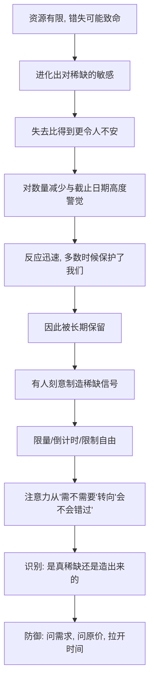

# 09｜稀缺：为什么“快没了”让我们失去理智？

> 为什么"数量有限、时间有限"会让人愿出高价、冲动下单？

---

## 一、先说结论

西奥迪尼认为，**稀缺本身就会提升事物在我们眼中的价值**，而且它唤起的不只是"我想要"，更是"我可能要失去了"——后一种感受，比前者凶狠得多。

更麻烦的是，稀缺有两个放大器：**越接近失去，越着急**；**越被禁止，越想要**。当一样东西被说成"数量有限、时间有限"，我们关注的焦点会从"我需不需要它"悄悄切换到"我会不会错过它"，理性判断就在这个切换里被挤了出去。

所以这一篇只回答一件事：**为什么"快没了"这三个字，能让一向冷静的人也冲动下单？**

---

## 二、我们先理解一个问题

先看一个熟悉的场景。

你本来只是随便逛逛，看到一件衣服，标价不便宜，你犹豫了一下，打算"再想想"。这时页面弹出一行小字：**"仅剩 2 件""活动最后一天""已有 387 人加购"**。你的心态变了。你不再比较价格，不再考虑衣柜里有没有类似的，而是突然担心起来：**万一我明天来，它没了怎么办？**

问题来了：这件衣服的价值变了吗？面料还是那块面料，价格还是那个价格，你原本"再想想"的理由一条也没消失。**变的只是"它可能会没有"这个念头。** 为什么一个关于数量的念头，就能推翻你原本的判断？

---

## 三、作者到底提出了什么观点？

西奥迪尼把"稀缺"列为让人顺从的核心原则之一。他的观点可以分成四层。

**第一层：稀缺会提高事物的价值。** 这个判断非常直白——难以获得的东西，看起来更珍贵。这不是因为东西本身变好了，而是因为"难以获得"本身被我们读成了"有价值"。

**第二层：稀缺真正触动的是"损失"，而不是"收益"。** 西奥迪尼指出，比起得到一个同样东西的快乐，"可能失去它"带来的不安要强烈得多。所以稀缺话术的杀伤力，不在于许诺你能得到什么，而在于提醒你可能失去什么。

**第三层：稀缺有两个放大器。** 一个是**数量**——剩下的越少，紧迫感越强，从"有限"到"仅剩 2 件"，紧迫性是逐级上升的；另一个是**时间**——截止日期越近，压力越大，"最后一天""倒计时 10 分钟"都是这个道理。

**第四层，也是更反直觉的一点：被禁止的东西，反而更想要。** 西奥迪尼借用了心理逆反的概念来解释——当我们的选择自由被限制时，会产生一种恢复自由的冲动，而最直接的方式就是去要那个被限制的东西。这也解释了为什么"限购""限量""暂不开放"这类限制，有时反而在给商品做广告。

书中还提到一个常被引用的现象：当某种信息被封锁、某种商品被禁售时，人们对它的渴望反而上升。西奥迪尼用恋人对阻力的反应来打比方——外部的禁止，常常会强化当事人的渴望。这里强调的是机制，而不是具体情节。

需要注意：关于稀缺效应的许多研究，学界后来也有重复与争论，这一点我们留到第九段再谈。这里先记住结论：**稀缺不改变事物的客观价值，它改变的是你看待价值的方式。**

---

## 四、把这个观点翻译成人话

可以用一个类比来理解。

假设你面前有两张电影票，座位、场次、价格完全一样。差别只有一点：其中一张是"随时都能买到"的，另一张是"只剩最后一张，两小时后过期"。你的大脑对这两张票的估值，会发生微妙的偏移——**不是因为第二张更好，而是因为它更难得到。**

人心里的"价值"，其实有两根指针：一根叫"它有多好"，一根叫"我有多难得到它"。正常情况下，这两根指针应该分得很开。可稀缺话术做的事情，是**把第二根指针直接连到你的情绪上**，让它带着第一根指针一起往上涨。

更关键的是，稀缺会**劫持你的注意力**。你本来在评估商品，现在却在评估"错过的风险"。评估对象一换，理性就换了赛道——你不再问"值不值"，而是问"来不来得及"。而"来不来得及"这种问题，本来就该由时间紧迫感回答，而不是由你的真实需求回答。

用一句话说：**稀缺不是让东西变得更好，而是让你变得没空去想它到底好不好。**

---

## 五、为什么会这样？

为什么会进化出这种反应，又为什么它特别容易被利用？可以这样拆。

关键在 **E → G** 这一跳。

在漫长的匮乏环境里，对稀缺保持敏感是生存优势——错过食物、错过配偶、错过机会，代价可能极高。所以我们对"越来越少"和"越来越近"格外警觉，反应也格外快。这套机制保护过我们的祖先。

但到了物质充裕、信息被精心设计的今天，稀缺信号可以**被凭空制造**。库存可以虚报，倒计时可以重置，"限量"可以是常态，"最后一天"可以明天再来一次。于是保护过我们的本能，成了最好按的按钮之一。

西奥迪尼想让我们看到的正是这一点：**稀缺的威力，来自它触动了损失恐惧；而损失恐惧的力量，又来自它曾经真的救过我们的命。**

---

## 六、举一个现实生活中的例子

看一件几乎人人遇过的事：直播间或电商页面里的"限量 100 件""最后一天"。

把这句话拆开，你会发现它同时踩中了好几个开关：

- **数量稀缺**："限量 100 件"——剩下的数字被明确化，紧迫感被量化；
- **时间稀缺**："最后一天""倒计时 5 分钟"——给犹豫设了截止线；
- **逆反助推**：有时还会配一句"这个价格只此一次，过了不再有"，把"你还能选"变成"你快没得选"；
- **社会认同叠加**："已有 2000 人下单"——既显稀缺（抢的人多），又显正确（大家都买）。两个信号相互加强。

你注意一下：这整套话术里，**没有一句话在讨论商品本身**。它不告诉你面料、工艺、售后，它只反复告诉你——**你会失去它。**

这就是稀缺话术最典型的样子：它把一场"要不要买"的评估，悄悄换成了一场"抢不抢得到"的竞赛。而一旦你开始比赛，价格就不再是价格，而是入场券。

现实里还有许多变体：机票"仅剩 1 张"、酒店"今日特价即将结束"、软件"限时免费即将恢复原价"、商场"闭店清仓最后三天"。它们的技术细节不同，心理结构完全一样。

---

## 七、回到书中重新理解

现在再回看西奥迪尼为什么把稀缺与损失、逆反放在一起讲，就顺了。

他真正想指出的，不是"商家爱搞促销"这种表面现象，而是一个更深的结构：**人对"自由被剥夺"的敏感，远高于对"获得好处"的敏感。** 稀缺之所以有力，是因为它同时做了两件事——**把东西变得更诱人，又把你变得更不自由。**

这也解释了为什么稀缺几乎可以和任何其他原则组合使用：稀缺+权威（专家说最后一批）、稀缺+喜好（你喜欢的博主联名限量）、稀缺+承诺一致（你已经加购了，不能半途而废）。在这些组合里，稀缺往往扮演"最后一脚"的角色——前面铺陈得再久，往往要靠"快没了"来收网。

所以第九篇的核心判断是：**稀缺制造的从来不是价值，而是紧迫。而人在紧迫中，最先放弃的就是判断。**

---

## 八、这个观点背后还有什么？

**第一，稀缺效应在"竞争"场景下会被进一步放大。** 当你看到别人也在抢同一件东西时，稀缺就不只是"东西少"，而是"有人要和我抢"，紧迫感成倍增加。

**第二，"新出现的稀缺"往往比"一直稀缺"更有力。** 一样东西从充裕突然变得短缺，比它长期短缺更能刺激行动。这就是为什么"限时"比"常年特价"更管用。

**第三，稀缺对"快要失去的选择自由"最敏感。** 逆反的核心不是想要那件东西，而是想保住"我能选"的感觉。有时我们抢购，买的其实不是商品，而是"我还能做主"。

**第四，稀缺会改变信息处理方式。** 紧迫状态下，人更容易依赖捷径与第一印象，更少做比较与核算。这正好和其他影响力武器形成配合。

---

## 九、这个观点有问题吗？

有，需要平衡地看。

**第一，稀缺效应的强度在研究中并不完全一致。** 近年来的重复研究与元分析发现，限量、倒计时这类手段的效果，会随商品类型、价格、消费者熟悉度和情境大幅波动，并非"只要稀缺就一定奏效"。因此不应把它当成万能公式。

**第二，逆反理论的应用边界需要谨慎。** 心理逆反是一个有影响力的框架，但把它直接套用到营销场景时，容易忽略一个重要前提——只有当"自由被限制"被明确感知时，逆反才会被激活；而很多"限量"并未真正限制自由，人们心里清楚明天还能买。

**第三，稀缺有时传递的是真实信息。** 真正绝版的商品、真正截止的报名、真正售罄的座位，稀缺是客观事实而非操纵。把所有稀缺提示都当成骗术，会让我们错失真实机会。

**第四，稀缺也可能带来正面的行为。** 在公共政策中，适度提示资源的有限性，反而能促进节约与理性使用，而不是冲动消费。同一机制，用在不同地方，结果可以相反。

**所以更平衡的说法是**：稀缺确实会系统性地影响价值判断和紧迫感，这是相对稳固的发现；但"稀缺必然让人失去理智"是一种夸张说法，它更像是**在缺乏思考时间的条件下，把某个倾向放大**。

---

## 十、今天再看这个观点

以下部分是基于西奥迪尼思想的现代延伸，不是他在书里的原话。

今天的稀缺，已经从"货架上的最后一件"变成了**实时计算出来的心理压力**。平台可以根据你的犹豫时长，动态决定要不要给你弹一个"仅剩 3 件"；倒计时可以因为你反复查看而重置；"限时优惠"可以对你一个人限时。

更微妙的是，稀缺开始被**个性化制造**。算法知道你怕错过、知道你比价习惯、知道你几点最容易下单，于是就有人能在那个时刻，恰好把"最后一天"推到你面前。稀缺不再是统一的广告，而是为你量身定做的一句话。

因此，识别稀缺在今天多了一层难度：**你看到的"仅剩 2 件"，可能对别人来说是 200 件。** 当稀缺本身可以被单独生成，问题就从"这是不是真稀缺"，变成了"我凭什么相信这个数字"。

---

## 十一、这一篇真正应该记住什么？

1. **稀缺提升的是感知价值，不是真实价值。** 东西没变，变的是你的估值。
2. **它真正触动的是损失恐惧，而不是得到渴望。** 怕错过，比想得到更有推动力。
3. **两个放大器是数量与时间。** 越少越急，越近越急。
4. **被限制的自由，反而更想要。** 这是逆反在起作用。
5. **防御的关键是换回评估对象。** 从"会不会错过"回到"我需不需要"。

---

## 十二、留一个问题

> 回想你最近一次因为"快没了"而下单的经历——
> 如果当时页面安安静静，没有任何倒计时和库存提示，
> 你还会买它吗？

---

**下一篇**：前几件武器，靠的都是"他是对的""它快没了""大家都买了"。但还有一种力量更安静，也更顽固——它不诉诸利益，也不诉诸恐惧，只诉诸一句"我们是一伙的"。为什么"自己人"这三个字，比任何话术都更能让人放下戒备？

下一篇我们就来拆开这个问题——**"联盟"为什么最有力量？**
