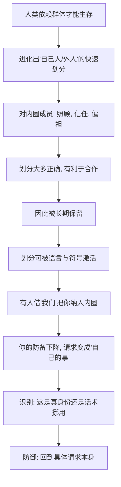

# 10｜联盟：为什么“我们是一伙的”最有力量？

> 为什么"同为一家"比"我喜欢他"更能让人顺从？

---

## 一、先说结论

西奥迪尼认为，"联盟"是比"喜好"更深、更持久的一种力量。喜好说的是"我喜欢他"，联盟说的是"**我们是一体的**"。前者是情感上的亲近，后者是身份上的合一。

当一个人被你划进"自己人"的范围，你的防备会自动降下来，他的请求不再是"外人的请求"，而更像是"自己人的事"。所以"我们""咱们""一家人"这类措辞异常有力——它们不是在讨好你，而是在**重新定义你和说话人之间的关系**。

这一篇只回答一个问题：**为什么"同为一家"，比"我喜欢他"更能让人顺从？**

---

## 二、我们先理解一个问题

先看三个看起来不相干的场景。

一场大学球赛，你旁边坐着一位素不相识的校友，你们聊了不到十分钟，他就请你帮个小忙——你答应的概率，明显高于一个陌生人提出同样的请求。

一次出差，你在外地遇到同乡，口音一对上，彼此都热络起来，许多原本要走的流程，忽然变得好商量。

一场比赛，你和几万人一起为同一支队呐喊，散场后你甚至愿意为素不相识的球迷多让一步。

问题就在这里：**你并不"喜欢"这些人。** 你可能连名字都不知道，谈不上被他们的外表、性格或赞美打动。可你依然更容易答应他们。既然如此，起作用的一定不是"好感"，而是别的东西——**你们都觉得自己属于同一个"我们"。**

---

## 三、作者到底提出了什么观点？

西奥迪尼最初在书中总结的是六大原则。多年之后，他在后续著作中补上了第七条——**联盟**。这一条和喜好看起来很接近，但指向完全不同。

**喜好处理的是"关系好不好"。** 我们更容易答应喜欢的人，靠的是吸引力、相似、赞美、熟悉与合作。

**联盟处理的是"是不是同一个人"。** 它触及的是身份认同——我们、我们家人、我们同乡、我们同校、我们同一种信仰、我们同一支队。西奥迪尼特别强调，联盟感最强的时候，人会**把对方的部分自我，纳入自己的自我**。也就是说，"他受委屈"会被感受成"我受委屈"，"他的事"会被感受成"我的事"。

西奥迪尼指出，联盟可以通过几种方式被建立或强化：

- **共同身份**：籍贯、学校、姓氏、血缘、民族、职业；
- **共同行动**：一起唱歌、一起呐喊、一起做同一件事（他称之为"同步"）；
- **共同处境**：老乡见老乡、同病相怜、同处困境；
- **"我们"的语言**：反复使用"我们""咱们""家人们"，把关系从"你我"改写成"一体"。

他给出的判断是：**联盟比喜好更强大，因为它不需要你喜欢对方，只需要你承认对方和你是一伙的。**

需要说明的是，联盟原则是西奥迪尼后期的补充，学界对它的独立性与测量方式也有讨论，这一点留到第九段再谈。

---

## 四、把这个观点翻译成人话

可以用一个类比来理解。

一个人的"自我"，像一圈由内向外扩散的同心圆。最里面是"我"，然后是家人、挚友，再往外是同乡、同学、同事，最外面才是陌生人。

喜好做的事情，是把一个人**从外圈往内挪了一点**——"这人不错，我愿意多理他一点"。

联盟做的事情，则是把一个人**直接放进内圈**——"他是我们的人"。一旦进了内圈，规则就变了：外圈讲的是计较与交换，内圈讲的是照顾与偏袒。你会为自己人破例，也会为自己人承担本不该你承担的责任。

这就是为什么联盟话术往往不跟你谈条件，只跟你谈身份。**说服一个"外人"，你要给出理由；说服一个"自己人"，你只需要提醒他自己是谁。**

用一句话说：**喜好让你愿意帮他，联盟让你觉得帮他就是帮自己。**

---

## 五、为什么会这样？

为什么"我们"这两个字能绕过理性？可以这样拆。

关键在 **D → F** 这一跳。

"区分自己人和外人"曾经是生死攸关的能力——同部落的人会分享食物、共同御敌，外部落的人可能带来威胁。所以大脑进化出了一套极快的归类机制，并且一旦归入"自己人"，就自动切换成照顾模式。

问题是，这套归类机制**依赖线索，而不依赖事实**。一句乡音、一个校徽、一句"我们"，就足以触发归类。而当归类可以被几句语言轻易触发时，它就成了最好用的说服工具——**不用给你好处，不用让你喜欢他，只要让你觉得"他是我们的人"。**

西奥迪尼的洞察是：联盟之所以强，是因为它劫持的不是你的判断，而是你的**归属本能**。

---

## 六、举一个现实生活中的例子

看一个把联盟用到极致的场景：球迷、校友与同乡。

先说球迷。一支球队比赛时，几万人一起唱同一首歌、喊同一个口号、做同一个动作。西奥迪尼所说的"同步行动"，在球场里被做到极致。比赛结束，你会看到素不相识的球迷互相拥抱、请对方喝酒、甚至为对方买单。**没有人在意对方是谁，他们只在意"我们都支持同一支队"。** 于是一个陌生人的请求，会被自动翻译成"球迷之间的互帮互助"。

再看校友。一句"我们是一个学校的"，就能让两个没有交集的人迅速熟络。校友群里的一次募捐、一位学长的请求、一句"帮衬一下自己人"，成功率往往远高于陌生人的同类请求。原因很简单——拒绝"我们"的人，会有一种背叛自己身份的不适。

再看同乡。异地打拼的人，往往对乡音格外敏感。一句"听着像老乡"，就能让戒备心下降一档。许多生意的第一句话不是谈价格，而是"你哪儿的"，这正是在**先把对方拉进内圈，再谈事**。

这些场景的共同点是：**整个过程中，没有人试图让你喜欢他，他们只让你承认，你们属于同一个"我们"。** 这就是联盟与喜好最本质的区别。

---

## 七、回到书中重新理解

现在再回看西奥迪尼为什么要在喜好之后，单独补上联盟这一条，就顺了。

因为喜好解释不了的很多现象，联盟能解释。你未必喜欢那位学长、那位同乡、那位球迷，可你还是答应了。这说明影响力并不总是通过"好感"这个中介起作用，它有时直接作用于**身份**。

这也解释了为什么"我们"这个词在商业与政治中如此廉价又如此昂贵：**廉价在于任何人都可以说，昂贵在于一旦被说出口并且被接受，它就重塑了听者的归属结构。** 一句"家人们"，就能把交易关系伪装成家庭关系，把买卖包装成帮衬。

所以第十篇的核心判断是：**联盟不是一种更强的喜好，而是一种身份层面的整合。当"我"和"你"变成"我们"，说服就不再是说服，而是"自己人之间的事"。**

---

## 八、这个观点背后还有什么？

**第一，联盟常常与喜好叠加，效果成倍。** 一个既让你觉得"是我们的人"、又让你觉得"人不错"的博主，带货能力通常远超仅有其中一项的人。

**第二，"我们"的边界是可以被刻意收窄和放大的。** 收窄到"只有我们几个"，会制造小圈子式的忠诚；放大到"全国人民"，则适合动员型的号召。边界怎么划，本身就是一种影响力操作。

**第三，联盟对群体冲突有双向作用。** 它既能在内部催生互助与牺牲，也能在外部催生对外人的冷漠甚至敌意。同一套机制，对内是黏合剂，对外可能是排斥力。

**第四，它和企业管理、组织凝聚高度相关。** 团队建设、企业文化、"共同愿景"，本质上都是在人为生产联盟感。这未必是坏事——很多合作正建立在"自己人"的信任之上。

---

## 九、这个观点有问题吗？

有，需要平衡地看。

**第一，联盟与喜好的边界在实证上并不总是清晰。** 归属感、相似性、共同身份，本来就高度交叠。有研究者认为，把联盟从喜好中单独拆出来作为一个"原则"，更多是理论上的区分，在实际情境里两者往往一起起作用。

**第二，"联盟感"的测量相当困难。** "我们是一体"是一种主观体验，很难像价格或数量那样被精确量化，因此关于它独立效应有多强的证据，仍不如互惠、稀缺等原则那样丰富。

**第三，身份诉求也可能被健康地使用。** 不是所有"我们"都是操纵。社区互助、公益动员、团队协作，都需要真实的身份认同作为基础。把一切身份语言都当成操纵，是一种过度怀疑。

**第四，警惕借"我们"回避具体问题。** 联盟话术最典型的风险，是用"都是自己人"来替代对请求本身的评估。真正需要问的不是"他是不是自己人"，而是"这件事我该不该做"。

**所以更平衡的说法是**：身份认同对顺从的影响是真实且重要的，这一点与大量社会心理学研究一致；但把它当作一条可以独立测量的"第七条原则"，学界仍有争论，把它理解为**对喜好原则的深化与补充**，可能更稳妥。

---

## 十、今天再看这个观点

以下部分是基于西奥迪尼思想的现代延伸，不是他在书里的原话。

今天的联盟，最明显的变化是：**它可以在没有真实共同经历的情况下被大规模生产。** 过去，"自己人"来自一起长大、一起上学、一起打过仗；现在，一次共同的吐槽、一个共同的爱好、一次共同的情绪爆发，就能在几分钟内创造出一群"我们"。

平台深谙此道：用"家人们"称呼观众，用同一套梗、同一套黑话、同一套身份标签把陌生人聚在一起。社群运营的核心工作，几乎就是在**持续制造联盟感**。而算法则负责把"和你像的人""和你站在一起的人"推到你面前。

还有一个新现象是"按需切换身份"——一个人可以在一天之内，同时是某个游戏的队友、某个城市的同乡、某个明星的粉丝、某个品牌的"会员家人"。联盟不再是一个稳定的归属，而是一个个可被召唤的临时身份。

因此，识别联盟在今天的关键是：**当有人叫你"自己人"时，先别急着感动，先问问他为什么需要你觉得自己人。**

---

## 十一、这一篇真正应该记住什么？

1. **联盟不是喜好，而是身份合一。** 它不问你喜不喜欢他，只问你承不承认"我们是一伙的"。
2. **联盟比喜好更深、更持久。** 因为它触及的是归属本能，而非情感偏好。
3. **"我们"这类措辞在悄悄重写关系。** 它把"你我"改写成"一体"，从而绕开条件谈判。
4. **共同身份、共同行动、共同处境都能生产联盟感。** 也因此都能被刻意制造。
5. **防御的方法是回到请求本身。** 身份可以是真的，但请求仍要单独评估。

---

## 十二、留一个问题

> 回想你最近一次因为"都是自己人"而答应的请求——
> 如果对方不是你的校友、同乡或同好，只是路上一个陌生人，
> 你还会答应吗？

---

**下一篇**：七大原则一路讲下来，我们似乎已经看清了这些按钮在哪里。但看清，不等于躲得过。当"咔哒"声真的响起的那一刻，普通人到底该怎么办？有没有一种不靠意志力、而靠方法的防御？

下一篇我们就来拆开这个问题——**面对影响力武器，我们该如何防御？**
