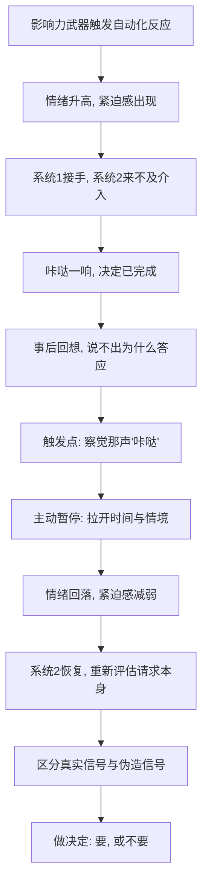

# 11｜面对影响力武器，我们该如何防御？

> 既然这些按钮会被利用，普通人到底该怎么保护自己？

---

## 一、先说结论

西奥迪尼不主张拒绝一切说服。他的防御方案，核心不是"变得刀枪不入"，而是**在自动化反应启动的那一刻，给自己争取一点时间**。

具体做法有两步：**第一步，识别**——当你感到那声"咔哒"（突然很想答应、突然很怕错过、突然很信任），先意识到"有一个按钮被按下了"；**第二步，暂停**——刻意拉开时间与情境的距离，让慢思考有机会介入。

他把这套方法称为"以彼之道"：既然影响力武器靠的是触发自动化反应，那么防御也只需从自动化反应下手。**你不需要更聪明，你只需要让系统 2 来得及上班。**

---

## 二、我们先理解一个问题

先看一个再普通不过的场景。

你本来只是随便看看，销售的话说得你越听越顺，价格似乎也合适，你心里升起一股"就它了"的冲动。就在手要伸向付款键的一瞬间，你忽然顿了顿——**好像哪儿不太对，可又说不上来。**

这种说不清的"哪里不对"，其实就是你的系统 1 在打报告：有个按钮被按了。真正的难题是：**大部分时候，这声报告太轻、太快，还没等你反应过来，决定已经做完了。**

所以问题不在于"该不该相信自己的直觉"，而在于：当直觉已经被人精准设计过，我们靠什么把它接住？这一次，到底有没有一种方法，能在不牺牲生活效率的前提下，给自己装一道刹车？

---

## 三、作者到底提出了什么观点？

西奥迪尼的防御观，可以用三句话概括。

**第一，不要试图对抗，要试图识别。** 自动化反应是无法被永久关闭的，硬扛只会把自己累垮。真正可行的是：承认自己会被触发，然后学习**认识那些触发信号长什么样**。当你一眼认出"这是稀缺话术""这是权威借用""这是社会认同制造"，它对你的作用就已经被削弱了一半。

**第二，判断信号是真实的还是被伪造的。** 这是全书的防御核心。同一句"限量"，可能是真的最后一批，也可能是明天照旧的促销；同一声"专家"，可能是真的资质，也可能只是一件白大褂。西奥迪尼的意思是：**不要否定信号本身，要去追问信号背后的真实性。** 真实的稀缺值得重视，伪造的稀缺值得忽略。

**第三，察觉"咔哒"时，主动拉开距离。** 这是最实用的一条。所谓"拉开距离"，包括拉开**时间**（不立刻决定，过一段时间再说）和拉开**情境**（离开那个让你心跳加快的页面、场地、人群）。因为自动化反应高度依赖当下的情绪与情境，一旦脱离现场，它的力量会迅速衰减。

他特别提醒，防御不是去和每一个说服者讲道理，而是**管理自己的反应节奏**。说服者能控制你听到什么，但决定"我现在不决定"的权力，始终在你手里。

---

## 四、把这个观点翻译成人话

可以用一个类比来理解。

系统 1 像一个反应极快的门卫，看到熟悉的脸就放行；系统 2 像一个慢吞吞的主管，要核实证件、比对名单，虽然可靠，但很费时间。影响力武器做的事情，几乎都是**趁主管不在，骗过门卫**。

所以防御的思路不可能是"让门卫变聪明"——门卫本来就不负责思考。真正有效的做法是：**在门卫放行和事情办成之间，加一道"延迟办理"。**

西奥迪尼给出的延迟，可以具体化成一些简单动作：把商品先放进购物车然后关掉页面；把答应的事说成"我看一下日程再回复你"；遇到重大购买，设一个"明天再说"的规则；遇到热情推销，先离开那个环境再判断。

这些动作看起来笨，但它们做的是同一件事——**把决定从"触发瞬间"搬到"冷静之后"。** 而说服的魔力，恰恰最怕冷静。

用一句话说：**防御不是挡住对方的手，而是松开对方按着你的那个键。**

---

## 五、为什么会这样？

为什么"识别 + 暂停"能够生效？可以这样拆。

关键在 **F → G** 这一跳。

自动化反应有一个致命弱点：**它需要现场感。** 抢购需要倒计时在眼前跳，服从需要权威站在面前，从众需要看到人群。一旦你离开现场、隔开时间，所有信号都失去了即时性，它们能调动的情绪也随之下降。

西奥迪尼的深刻之处在于：他没有把防御寄托在"意志力"上——因为意志力在触发瞬间几乎必然输给情绪。他把它寄托在**结构**上：改变决定发生的时间与地点，让慢思考重新获得位置。这就是为什么"24 小时规则"有效——它不要求你更自律，只要求你**把决定挪到明天**。

---

## 六、举一个现实生活中的例子

看一个具体的、可以立刻上手的做法：**察觉"咔哒"后，强制冷静 24 小时再决定。**

具体可以这样操作：

- **先认出那声"咔哒"**：你突然很想买、突然怕错过、突然觉得对方特别可信、突然不好意思拒绝。出现这几种感觉，就是信号。
- **然后不决定**：把页面关掉，把商品放进收藏或购物车，把对方的话先记下来但不当场答应。
- **隔 24 小时再回看**：第二天再问自己三个问题——我是真的需要它，还是只是不想错过？如果它原价我还会买吗？我答应这件事，是因为事情本身，还是因为对方按了我一个键？
- **再决定**：如果 24 小时后你依然想要、依然觉得合理，那就大方地买、大方地答应。防御不等于拒绝，防御只是**把决定权拿回来**。

这个方法的妙处在于，它几乎不需要意志力。你不需要在冲动的顶点强行按住自己，你只需要做一件最省力的事——**什么都不做，然后去睡觉。**

实际效果往往非常直观：昨夜让你辗转反侧的"最后一件"，第二天早上再看，常常已经不那么重要了。不是商品变了，是**按着你的那根手指松开了。**

同一套逻辑可以迁移到很多场景：收到的推销电话，说"我考虑一下再联系你"；面对限时优惠，先截图，明天再看；面对让自己心动的承诺，先写下条件，隔夜再答复。

---

## 七、回到书中重新理解

现在再回看西奥迪尼为什么用整整一本书，逐个拆解七大原则，就完全顺了。

因为**防御的前提是识别，而识别的前提是理解机制。** 一个人如果不知道稀缺会制造紧迫感，他就只会把冲动当成"我真喜欢"；如果不知道权威的象征可以被借来，他就会把白大褂当成专业。只有先看清按钮在哪里，那声"咔哒"才可能被你听见。

所以这本书真正的用途，不是教你如何"用"影响力，而是教你如何"看穿"影响力。西奥迪尼反复强调，这些武器并不邪恶，它们只是效率的产物；真正需要防守的，是**有人故意制造虚假信号来触发你的自动化反应**。

防御的本质，因此可以概括成一句话：**在两套系统之间，为慢的那一套保留一个座位。**

---

## 八、这个观点背后还有什么？

**第一，防御是有成本的，不必对每件事都启动。** 如果买杯咖啡也要"冷静 24 小时"，生活会瘫痪。真正需要防御的是**高代价、不可逆**的决定——大额消费、重要承诺、法律与医疗选择。日常小事，交给捷径反而更理性。

**第二，最好的防御往往发生在事前。** 预先设定规则（"超过多少金额必须隔夜再看""任何需要当场签字的都先带走"），能让防御在情绪尚未升起时就已经布置好。

**第三，识别信号可以训练。** 当你反复留意自己"被按下"的时刻，你会逐渐形成一种对触发器的敏感度，这在谈判、购物、职场沟通中都是可迁移的能力。

**第四，防御也包含对"真实信号"的尊重。** 真正稀缺的机会、真正专业的权威、真正可信的伙伴，依然值得珍惜。防御的目标不是怀疑一切，而是**不让伪造的信号占走你本应给真实信号的位置**。

---

## 九、这个观点有问题吗？

有，需要平衡地看。

**第一，"暂停"并非总能奏效。** 有些决定本就无法拖延（紧急医疗、限时确权）；有些触发在暂停之后依然强烈（真实需求叠加稀缺提示）。把"冷静 24 小时"当成万能解药，会高估它的适用范围。

**第二，过度防御会损害正常的社会信任。** 如果对每一个善意、每一份人情、每一次专家建议都先假设是操纵，人会变得冷漠且疲惫，合作成本会大幅上升。防御需要边界。

**第三，个体防御无法解决结构性问题。** 当平台可以实时、个性化、大规模地制造触发信号时，让每个消费者靠"自觉暂停"去对抗，本身是一种不对等的负担。真正有效的治理，往往需要规则与设计层面的约束，而不只是个人技巧。

**第四，西奥迪尼的框架也带有"事后归因"的风险。** 当你已经学会用七大原则解释一切，很容易把任何一次答应都归因为"被按了按钮"，从而忽略了对方的合理理由或自己的真实意愿。解释框架用过头，也会伤害判断。

**所以更平衡的说法是**：识别与暂停是一套真实有效、成本低廉的防御方法，尤其适合高代价决定；但它不是万能钥匙，也无法替代制度性的约束。防御的目标是**恢复选择权**，而不是变得谁都不信。

---

## 十、今天再看这个观点

以下部分是基于西奥迪尼思想的现代延伸，不是他在书里的原话。

西奥迪尼写作的年代，影响力武器需要一个大活人现场施展。今天，触发变得更密集、更贴身、更持续。算法可以在你情绪最薄弱的时间点推送；界面可以在你犹豫的瞬间弹出提示；同一种话术可以在几亿人身上同时运行。

这意味着"识别 + 暂停"这条防御路线，今天必须升级：**个人要建立自己的"减速规则"，同时社会也要在平台设计层面设置限制。** 比如对自动续费、倒计时的真实性、默认勾选的设置提出要求。单靠每个人"自己注意"，在这场不对等的较量里是不够的。

另一个变化是，暂停本身也在被商品化。有的应用会故意制造"多想一想"的错觉，其实仍在缩短你的决策时间。所以真正的防御标准，不是"我有没有想"，而是"**我的决定，是否发生在没有压力的时刻与空间里**"。

西奥迪尼的框架在今天因此有了双重用途：既是个人保护自己的方法，也是判断一个产品、一个平台是否在滥用影响力武器的尺子。

---

## 十一、这一篇真正应该记住什么？

1. **不要对抗，要识别。** 自动化反应关不掉，但可以被认出来。
2. **分辨真实信号与伪造信号。** 真稀缺值得重视，假稀缺值得忽略。
3. **察觉"咔哒"后暂停。** 拉开时间与情境，让慢思考有机会介入。
4. **把"冷静 24 小时"变成规则。** 它不靠意志力，只靠把决定挪到明天。
5. **防御的目的是恢复选择权，不是拒绝一切。** 真实的好处、真诚的人，依然值得答应。

---

## 十二、留一个问题

> 从"不假思索的自动化反应"，到互惠、承诺与一致、社会认同、喜好、权威、稀缺、联盟——我们一路看到，人是如何把判断力一次次交出去的。
>
> 现在，把这个问题交还给你：
> 下一次那声"咔哒"响起的时候，
> 你希望自己，是哪一种人？

---

到这里，这套解读就走到结尾了。

我们从头说起：人为什么会不假思索地答应别人？答案是**自动化反应**——在信息过载的世界里，我们发展出一批高效的"快捷键"，它们平时救人，也偶尔害人。随后我们看见，这些快捷键如何被逐个按响：有人凭空给你一点好处，有人让你先说出口，有人告诉你大家都在做，有人让你喜欢上他，有人披上权威的外衣，有人制造稀缺，有人把你划进"我们"。

但请别把这一整套理解为"世界处处是陷阱"。恰恰相反，西奥迪尼的用意始终是**理解而非恐惧**：这些原则之所以有力，是因为它们本来就在帮助我们高效地合作、信任与生活。真正的问题从来不是武器本身，而是**信号的虚实**。

所以，这十一篇留给你的，不是一份"防骗清单"，而是一种态度：**在被感动、被说服、被推动的时候，允许自己慢半拍。** 你不需要记住全部七条原则，也不需要时刻警惕。你只需要在最关键的那些时刻，听见那声"咔哒"，然后亲手把决定权拿回来。

至于剩下的事，就交给你的判断了。毕竟，这本书真正想帮你的，从来不是替你做决定，而是让你**重新拥有做决定的那个自己**。
