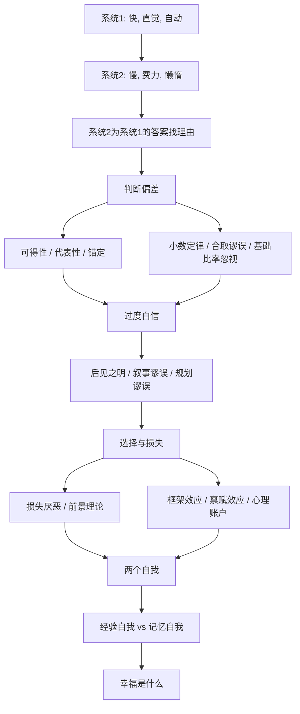

# 《思考，快与慢》深度解读系列

## 系列简介

《思考，快与慢》是诺贝尔经济学奖得主丹尼尔·卡尼曼的代表作。它讲的不是"如何更聪明"，而是一个更冷峻的问题：**我们的大脑是如何系统性地骗我们的？**

卡尼曼把心智分成两套系统：快速、自动、凭直觉的"系统 1"，和缓慢、费力、需要专注的"系统 2"。大部分时候，我们以为自己在理性思考，其实是系统 1 先给出答案，系统 2 只是为它找了个理由。于是，可得性、代表性、锚定、损失厌恶、过度自信……一整套偏差，在不知不觉中替我们做了决定。

这本书的价值不在于让你"不再犯错"——卡尼曼本人承认他也做不到；而在于**给这些错误命名**。一旦你能叫出一个偏差的名字，你就有机会在它发作时认出它。本系列围绕 **20 个核心问题**，从两套系统、判断偏差、过度自信，一路讲到前景理论与"两个自我"，把这本书拆成一套可理解、可自查的思维地图。

---

## 全书核心问题

| 层次 | 问题 |
|---|---|
| 机制问题 | 我们的大脑是怎么运作的？两套系统如何分工？ |
| 偏差问题 | 判断为什么会系统性出错？有哪些典型偏差？ |
| 自信问题 | 为什么我们如此自信，却常常预测失败？ |
| 选择问题 | 面对得失，我们为什么会做出"不理性"的选择？ |
| 幸福问题 | 我们记住的幸福，和我们真正经历的，是同一件事吗？ |

---

## 全书知识地图



---

## 全系列目录

### 第一部分：两套系统如何工作

#### 01｜为什么我们的大脑有两套系统？

核心问题：直觉和理性，在大脑里是怎么分工的？

核心观点：卡尼曼把心智分为系统 1（快、自动、不费力、情绪化）与系统 2（慢、受控、费力、讲逻辑）。系统 1 负责绝大多数日常判断，系统 2 平时很省电，只在遇到困难时才被调用。理解这两套系统的分工，是理解全书所有偏差的前提。

理解难度：★★☆☆☆

关键词：系统1、系统2、双过程、自动与受控

---

#### 02｜为什么系统 2 那么懒？

核心问题：我们明明有能力多想一步，为什么常常不想？

核心观点：认知是昂贵的，大脑遵循"最省力法则"。系统 2 会本能地回避需要投入的思考，把大部分任务交给系统 1。结果是：我们经常"觉得自己在思考"，其实只是接受了直觉的第一反应。

理解难度：★★★☆☆

关键词：认知吝啬、最省力法则、思维惰性

---

#### 03｜什么是“眼见即全部”？

核心问题：为什么我们总根据眼前那点信息，就自信地下判断？

核心观点：卡尼曼用 WYSIATI（"所见即全部"）概括系统 1 的倾向：它只会拿手头已有的信息编一个连贯的故事，而对"缺失了哪些信息"毫无察觉。于是我们常常在信息严重不足时，得出一个感觉非常确定的结论。

理解难度：★★★☆☆

关键词：WYSIATI、所见即全部、信息缺口、连贯性

---

#### 04｜直觉什么时候可以相信？

核心问题：同样是"凭感觉"，为什么消防员的直觉可靠，股民的直觉不可靠？

核心观点：卡尼曼指出，直觉可信需要两个条件：环境有足够规律，且人能通过长期反馈学会这些规律。满足条件时（如消防、下棋），直觉是专家能力；不满足时（如预测股市），直觉只是自信的猜测。

理解难度：★★★★☆

关键词：专家直觉、有效环境、反馈、预测

---

### 第二部分：判断为什么出错

#### 05｜为什么容易想起的事，就显得更常见？

核心问题：我们对"频率"的判断，为什么会被记忆的难易度带偏？

核心观点：可得性启发——一件事越容易被想起来，我们就越觉得它常见。而"容易想起"取决于媒体报道、情绪强度、亲身经历，而不是真实概率。于是新闻里的空难，比日常车祸更让我们恐惧。

理解难度：★★★☆☆

关键词：可得性启发、易得性、媒体、风险感知

---

#### 06｜为什么我们爱用“像不像”来下判断？

核心问题：为什么我们宁愿相信"像"，也不愿相信"概率"？

核心观点：代表性启发——我们用"这个东西像不像某类事物"来代替"它属于那类的概率有多大"。它快速有效，却会系统性忽略基础比率、样本大小和运气，产生刻板印象与误判。

理解难度：★★★☆☆

关键词：代表性启发、刻板印象、像与概率

---

#### 07｜为什么小样本会骗人？

核心问题：为什么几件事就能让我们确信一个"规律"？

核心观点：小数定律——人会把小样本的结果当成总体规律，忽视"样本越小、波动越大"。掷三次硬币都是正面，并不说明硬币有问题；但大脑会自动为它编出一个模式。

理解难度：★★★☆☆

关键词：小数定律、样本量、随机性、模式幻觉

---

#### 08｜“琳达问题”：为什么我们偏爱更详细的描述？

核心问题：为什么一个更具体、更详细的描述，反而让我们觉得更可能？

核心观点：合取谬误——当两个条件同时成立（更详细）时，概率只会更低，但系统 1 会因为"故事更连贯"而觉得它更可信。这就是著名的"琳达问题"，它揭示了故事性如何压过逻辑。

理解难度：★★★★☆

关键词：合取谬误、琳达问题、连贯性、故事偏好

---

#### 09｜为什么一个随机的数字也能影响你？

核心问题：一个明显无关的数字，为什么会影响我们的判断和出价？

核心观点：锚定效应——只要一个数字进入视野，它就会像"锚"一样拉动后续估计，哪怕我们知道它毫无意义。它在谈判、定价、量刑、估值中普遍存在，且极难被完全消除。

理解难度：★★★☆☆

关键词：锚定效应、先入为主、谈判、定价

---

#### 10｜为什么统计数字说服不了我们？

核心问题：为什么明确的概率信息，常常敌不过一个生动的印象？

核心观点：基础比率忽视——面对具体个案时，我们会忽略总体概率，转而依赖个案的代表性。要让统计"说服"人，必须把它变成具体、可感的例子，否则再准确的比例也会输给一个鲜活的故事。

理解难度：★★★★☆

关键词：基础比率、贝叶斯、具体个案、说服

---

### 第三部分：我们为什么如此自信

#### 11｜为什么我们总觉得自己不会错？

核心问题：为什么大多数人对自己的判断过度自信？

核心观点：过度自信是人类最普遍的认知偏差之一。我们高估自己的知识、预测能力和掌控力，同时对自己的无知"无感"——因为不知道的边界，恰恰是我们看不见的地方。

理解难度：★★★☆☆

关键词：过度自信、自知之明、能力错觉

---

#### 12｜为什么“事后诸葛亮”总是很多？

核心问题：事情发生后，为什么大家都觉得"早就该料到"？

核心观点：后见之明偏差——一旦知道了结果，大脑会自动重构记忆，让结果看起来"理所当然"。它使我们无法公正评价当初的决策质量，也让"我早说过"成为一种廉价的错觉。

理解难度：★★★☆☆

关键词：后见之明、结果偏误、记忆重构

---

#### 13｜为什么我们爱听故事，却忽略概率？

核心问题：为什么一个精彩的故事，能压倒一堆统计证据？

核心观点：叙事谬误——人用故事理解世界，而故事天然追求连贯、省略随机。于是我们记住"白手起家的传奇"，却忽略同样努力却失败的大多数。故事越动人，越容易让我们忽略它背后的概率结构。

理解难度：★★★★☆

关键词：叙事谬误、故事、因果错觉、幸存者

---

#### 14｜为什么专家预测经常失败，却依然自信？

核心问题：专家的预测为什么不可靠，他们自己却毫不动摇？

核心观点：规划谬误与预测难题——我们系统性低估任务的时间、成本与风险，高估自己的判断。卡尼曼发现，专家在复杂、低反馈领域（如长期政治经济预测）的表现，往往不比简单模型更好，但他们的自信却不受影响。

理解难度：★★★★☆

关键词：规划谬误、专家预测、内部视角、外部视角

---

### 第四部分：选择与损失

#### 15｜为什么“损失”比“得到”更让你在意？

核心问题：同样大小的得失，为什么失去的痛苦远大于得到的快乐？

核心观点：损失厌恶——人对损失的敏感度大约是同等收益的 2 到 2.5 倍。这解释了大量"不理性"行为：死守亏损的股票、不愿放弃已投入的项目、对改变充满恐惧。

理解难度：★★★☆☆

关键词：损失厌恶、得失不对称、沉没成本

---

#### 16｜什么是“前景理论”？

核心问题：为什么面对收益时保守、面对损失时冒险？

核心观点：前景理论是卡尼曼获诺奖的核心成果。它指出：人评估的不是绝对财富，而是相对于参照点的得失；且面对收益倾向确定（风险厌恶），面对损失倾向赌一把（风险偏好）。这一理论修正了传统经济学的"理性人"假设。

理解难度：★★★★★

关键词：前景理论、参照点、风险偏好、确定效应

---

#### 17｜为什么换个说法，你的选择就变了？

核心问题：同一件事，为什么换个表述方式，判断就完全不同？

核心观点：框架效应——"手术成功率 90%"与"死亡率 10%"是同一事实，却会引发截然不同的选择。人不对"事实"本身反应，而对事实被呈现的"框架"反应。这也意味着，谁能设置框架，谁就影响了决策。

理解难度：★★★★☆

关键词：框架效应、表述、参照点、说服

---

#### 18｜为什么你会高估自己拥有的东西？

核心问题：为什么东西一到手，我们就觉得它更值钱了？

核心观点：禀赋效应——一旦拥有，人就会自动抬高对它的估值。它源于损失厌恶：卖出被感知为"失去"。这解释了为什么二手房卖家要价偏高、免费试用会提高购买率。

理解难度：★★★☆☆

关键词：禀赋效应、所有权、损失厌恶、估值

---

### 第五部分：两个自我

#### 19｜“经历”和“记忆”，为什么给出不同的答案？

核心问题：我们真正经历的快乐，和我们记住的快乐，是同一回事吗？

核心观点：经验自我活在当下，记忆自我负责讲述。记忆自我遵循"峰终定律"：一段体验的记忆主要由最高峰和结尾决定，与总时长几乎无关。于是我们会为"一个漂亮的结尾"或"一个高光时刻"选择痛苦的过程。

理解难度：★★★★★

关键词：经验自我、记忆自我、峰终定律、时长忽视

---

#### 20｜幸福到底是什么？

核心问题：财富增长为什么没有让幸福感同步提升？

核心观点：卡尼曼区分"生活满意度"（记忆自我的评价）与"当下的情绪体验"（经验自我的状态）。二者受不同因素影响：前者与收入、地位关系更大，后者与人际关系、当下活动关系更大。混淆二者，是讨论幸福时最常见的错误。

理解难度：★★★★☆

关键词：幸福、生活满意度、情绪体验、伊斯特林悖论

---

## 推荐阅读顺序

**主线顺序（推荐）：01 → 20。**

```text
第一段｜机制（01–04）
   两套系统 → 系统2很懒 → 眼见即全部 → 直觉何时可信
        ↓
第二段｜判断偏差（05–10）
   可得性 → 代表性 → 小数定律 → 合取谬误 → 锚定 → 基础比率
        ↓
第三段｜过度自信（11–14）
   过度自信 → 后见之明 → 叙事谬误 → 规划谬误
        ↓
第四段｜选择（15–18）
   损失厌恶 → 前景理论 → 框架效应 → 禀赋效应
        ↓
第五段｜两个自我（19–20）
   经验自我 vs 记忆自我 → 幸福是什么
```

**阅读建议：**

- **想先抓住骨架**：读 01、05、09、15、16、19 六篇。
- **对投资/决策感兴趣**：15、16、17、18 是一个独立单元。
- **对"幸福"感兴趣**：直接从 19、20 切入。
- **想练习批判性阅读**：重点看 04、10、14、16 四篇。

---

## 全系列状态

> 本系列共 20 篇，正文生成中。
