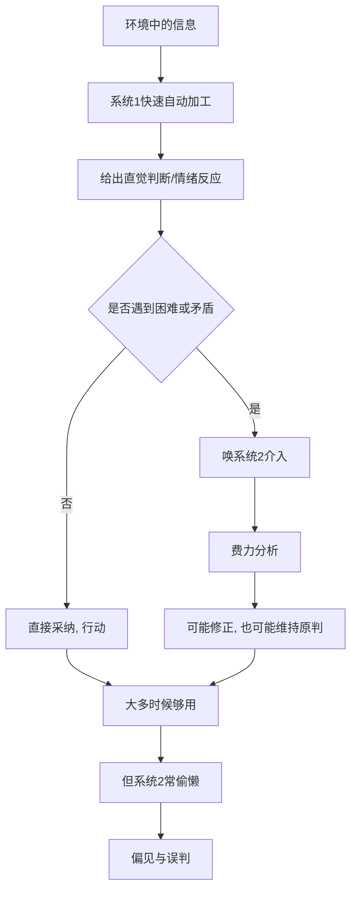

# 01｜为什么我们的大脑有两套系统？

> 直觉和理性，在大脑里到底是怎么分工的？

---

## 一、先说结论

卡尼曼用一套极简的比喻，撑起了整本书：**我们的心智有两套系统。**

**系统 1** 快、自动、不费力、靠联想和情绪，几乎无法关闭；**系统 2** 慢、受控、费力、讲逻辑，平时极度省电，只在遇到麻烦时才启动。

关键在于：日常绝大多数判断，都是系统 1 替我们做完的。系统 2 更像一个懒惰的审核员——它常常不审核，只是为系统 1 的结论补一个理由。所以，我们以为的"理性思考"，很多时候只是直觉的化妆。

---

## 二、我们先理解一个问题

先做两件事。

第一件：在脑子里算 17 × 24。

第二件：看向你面前的桌子，感觉它是一张桌子。

第一件事会立刻让你紧张：你需要集中注意力、回忆乘法、一步步算，稍一分心就出错。第二件事则毫不费力——你甚至不需要"决定"去认出它，答案自己就浮出来了。

同样是"大脑在工作"，为什么差别这么大？

这正是卡尼曼要解释的：**有些心理活动是自动、无意识的（系统 1），有些是受控、需要努力的（系统 2）。** 而理解这两者，是理解人类为什么既聪明又愚蠢的入口。

---

## 三、作者到底提出了什么观点？

卡尼曼把心智活动分为两类：

- **系统 1（快思考）**：自动运行，速度快，不消耗意志力；依赖直觉、联想、情绪和经验；无法主动关闭。比如察觉语气里的敌意、判断两样东西哪个更远。
- **系统 2（慢思考）**：需要集中注意力，速度慢，消耗认知资源；负责复杂计算、逻辑推理、自我控制。比如填税表、核对一份合同。

他反复强调三点：

1. 系统 1 是默认模式，系统 2 是备用模式；
2. 系统 2 非常"懒"，能不用就不用；
3. 系统 2 一旦启动，往往会直接采纳系统 1 的直觉答案，只在自己察觉到矛盾时才真正介入。

**偏差的根源，恰恰在这里：系统 1 的直觉又快又自信，而系统 2 懒得复核。**

---

## 四、把这个观点翻译成人话

想象你在开车。

刚学车时，你用的是系统 2：看后视镜、想离合、数挡位，每一步都要"想"，紧张又疲惫。开熟之后，这一切交给了系统 1：你可以一边换挡、一边聊天、一边想晚饭吃什么——换挡这个动作，你已经不需要"意识"了。

现在，假设你一边开车一边算"这趟油费一共多少"。这时系统 2 被叫醒，它会占用资源。于是新手的典型反应是：一旦认真算账，就忘记了看路——因为系统 2 是**单线程**的，它一忙，系统 1 的监控就变弱了。

再看一个更贴近日常的例子。你逛超市，随手拿起一瓶熟悉的洗发水——你的"选择"几乎没经过思考（系统 1）。如果有人此刻问你"为什么不比较一下单价"，你才启动系统 2，去看标签。但你不会每次都这么做，因为**那太累了**。

这就是两套系统的日常：系统 1 负责快速生活，系统 2 负责偶尔把关。

---

## 五、为什么会这样？

从进化的角度看，这套分工是有道理的：

关键在于 **D → F** 这一跳：系统 2 只在"被唤到"时才工作，而它是否被唤到，取决于系统 1 有没有发出"这里有麻烦"的信号。

问题是：系统 1 的自检非常弱。它会给出一个连贯、自信、毫不迟疑的答案，而这个"自信"本身，恰恰让系统 2 觉得没必要复核。于是偏差就悄悄通过了审查。

---

## 六、举一个现实生活中的例子

看银行 App 推送的一笔理财产品。

它写着"预期年化 4.5%""往期表现优良""限时抢购"。你扫一眼，系统 1 已经给出结论：**不错，买一点。** 这个判断快得你甚至没意识到自己做了判断。

如果此时你启动系统 2，你会问一些更麻烦的问题：这个"往期表现"是多长时间？"预期"是怎么算出来的？风险等级是多少？赎回规则是什么？——每一个问题都需要点开、阅读、比较。

大多数人的日常状态是：系统 1 说"买"，系统 2 说"哎呀懒得看"，于是照做。

这不是某一个人的愚蠢，而是大脑的默认设置。理解这一点，你才会明白为什么"提醒自己谨慎"几乎没用——**真正有用的，是给系统 2 一个被唤醒的触发条件**，比如一条硬规则："任何超过多少钱的支出，必须看风险等级那一段。"

---

## 七、回到书中重新理解

现在再回看卡尼曼开篇为什么先讲这两套系统，就顺了。

他并不是要教我们"用系统 2 取代系统 1"——那既不可能，也没必要。系统 1 是生活的引擎，没有它我们连过马路都做不到。他真正想做的是：**让系统 2 知道系统 1 会在哪里出错。**

所以后面所有的偏差——可得性、代表性、锚定、损失厌恶——本质上都是同一个故事的不同版本：**系统 1 快速给出了一个偏差的答案，而系统 2 没有及时复核。** 两套系统不是两个知识点，而是全书所有内容的统一背景。

---

## 八、这个观点背后还有什么？

有几个隐含前提值得拎出来。

**第一，系统 2 是"单线程、会疲劳"的资源。** 认知资源被消耗后（累、饿、情绪差），系统 1 的话事权就更大——这解释了为什么人在疲惫时更冲动、更容易受骗。

**第二，这不是"理智 vs 情绪"的道德故事。** 系统 1 不是坏的，它又快又准，大多数时候比系统 2 更高效。它只是在特定场景（概率、统计、长期后果）容易失灵。

**第三，"双系统"是一个功能性比喻，不是解剖结构。** 大脑里并没有两个叫系统 1、系统 2 的器官；这是为了说明"自动 vs 受控"两种加工方式而造的语言。

**第四，它为整本书定了调。** 先接受"我们的默认状态是直觉优先"，才谈得上识别一个个具体偏差。

---

## 九、这个观点有问题吗？

有问题，主要来自后续研究。

**第一，"系统 1 / 系统 2"的划分被批评为过度简化。** 一些学者认为，把复杂的认知过程塞进两个标签，会模糊掉中间层次，甚至造成"系统 2 在替系统 1 找理由"这类拟人化描述的不严谨。

**第二，双系统在实证上也有争论。** 后续研究（包括可重复性危机中对部分启发式实验的复检）显示，一些经典效应的强度可能被高估，关于"两套系统如何切换"的机制，学界也还没有一致结论。

**第三，"系统 2 懒惰"可能低估了人的主动性。** 在真正重要、有动机的场合，人会显著地投入思考；把懒惰说成默认，可能忽略了动机的调节作用。

**第四，但它作为"实用比喻"依然极有价值。** 即便机制细节有争议，"直觉优先、理性兜底"这个框架，仍能解释和预防大量现实错误。

**所以更准确的说法是**：双系统是一个极好用的心理学隐喻，但要记住它是隐喻——理解偏差的入口，而不是大脑的解剖图。

---

## 十、今天再看这个观点

以下部分是基于卡尼曼思想的现代延伸，不是他在书里的原话。

在信息流和算法推荐的时代，这套区分变得更关键了。短视频、推送、自动播放，几乎都是为系统 1 设计的：它们奖励即时反应、自动滑动、情绪被牵动。而系统 2 需要的是停顿、比较、查证——恰恰是产品设计最不希望你做的事。

也就是说：**注意力经济，本质上是在争夺系统 2 的启动权。** 谁能让你不假思索地滑下去，谁就赢。

卡尼曼的提醒在这里有了新的意义：在一个人人都被鼓励"凭感觉"的环境里，主动给系统 2 留出一点空间，本身就是一种反抗。

---

## 十一、这一篇真正应该记住什么？

1. **心智有两套系统。** 系统 1 快、自动、不费力；系统 2 慢、受控、费力。
2. **系统 1 是默认，系统 2 是备用。** 大多数判断由直觉完成，理性常常只是事后补充理由。
3. **系统 2 很懒，需要被唤醒。** 偏差的产生，往往是"直觉给了答案，理性没复核"。
4. **这是进化上的合理设计。** 系统 1 高效却不是万能，它在概率与长期后果上容易失灵。
5. **双系统是比喻，不是解剖。** 机制细节仍有争议，但作为日常自查工具非常有用。

---

## 十二、留一个问题

> 如果大多数决定其实由系统 1 替你做了，系统 2 只是事后盖章——
> 那么，你上一次"深思熟虑"做的决定，
> 究竟是真的想清楚了，还是只是给直觉补了一份好看的理由？

---

**下一篇**：既然系统 1 是默认，而系统 2 又那么懒，那问题就来了——我们到底有没有能力"多想一步"？答案是：有，但大脑会本能地抗拒。

下一篇我们就来拆开这个问题——**为什么系统 2 那么懒？**
