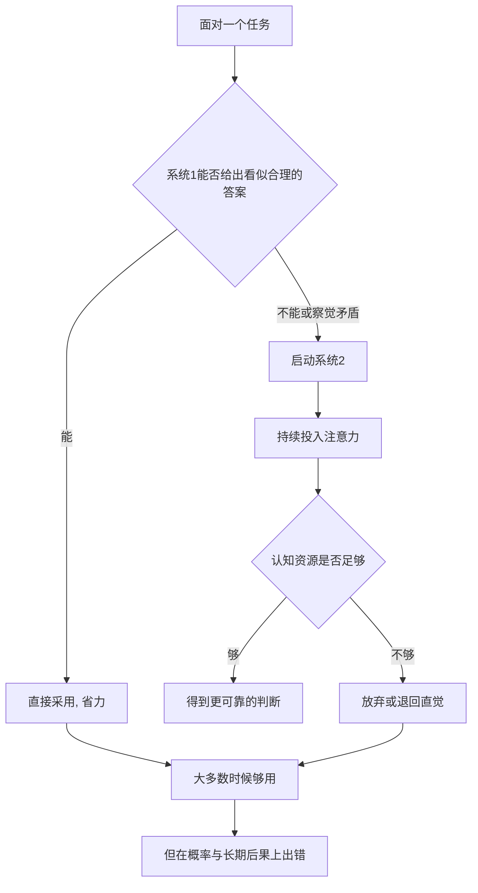

# 02｜为什么系统 2 那么懒？

> 我们明明有能力多想一步，为什么常常不想？

---

## 一、先说结论

卡尼曼认为，认知是昂贵的。大脑遵循一条"最省力法则"（law of least effort）：只要存在更省力的处理路径，它就会优先选那一条。系统 2 因此天生懒惰——能不启动就不启动，一旦启动也尽快关闭。结果是，我们经常"觉得自己在思考"，其实只是接受了系统 1 的第一反应。

关键在于：这种懒惰不是道德缺陷，也不是某个人的毛病，而是大脑的节能设计。偏差之所以能一遍遍通过审查，正是因为负责把关的那位审核员，本来就不太愿意上班。

---

## 二、我们先理解一个问题

先在心里做一件事：从 100 开始，每次减 7，一直往下算。100、93、86、79……

大多数人做不到几轮就会走神或放弃。可同样是此刻，你走路、呼吸、听声音，却毫不费力。同一颗大脑，为什么对一件事如此吝啬，对另一件却如此慷慨？

还有一个小场景：你和朋友聊天，对方说了一句语气有点冲的话，你立刻"感觉到"他不高兴——这个判断几乎不需要时间。但如果要你判断"他这句话在逻辑上是否自洽"，你就得停下来想。

差别很清楚：有些加工是自动的，有些是需要投入的。卡尼曼要回答的，正是后者为什么总是不肯被叫醒。

---

## 三、作者到底提出了什么观点？

卡尼曼围绕"懒惰"提出了几层看法：

- **最省力法则**：心智活动像体力活动一样会消耗资源、会带来疲劳。面对多项任务，大脑倾向于选择耗能最少的那个方案。
- **认知吝啬**：只要系统 1 能给出一个"看起来说得过去"的答案，系统 2 就倾向于直接采用，而不重新计算。
- **监督很弱**：系统 2 平时处于低耗待机，它需要一个"这可能有问题"的信号才会真正接管；而系统 1 生成的答案往往既连贯又自信，恰恰不发出这种信号。
- **共用一个资源池**：卡尼曼与合作者把这种有限的投入能力称为注意力或自我控制资源。刚做完一件需要自控的事，紧接着再做另一件，会明显更吃力。

他反复强调的一点是：这不是偶发的偷懒，而是默认设置。懒惰是常态，勤奋才是例外。

---

## 四、把这个观点翻译成人话

把心智想象成一部开着"省电模式"的手机。

它并非不能运行复杂程序，而是时刻在权衡：这个程序真的值得耗电吗？在绝大多数时候，系统 1 那个"轻量版"应用已经够了，于是系统 2 这个"高耗能专业软件"就一直被挂在后台，不加载、不更新。

或者换一个比喻：系统 2 更像一位只在被举报时才出场的审核员。你递给他一份材料，他一眼扫过觉得"没什么毛病"，就盖章放行。他不会主动去逐条核对，因为逐条核对很累，而"看起来没问题"是个足够舒服的理由。

日常的状态就是如此：系统 1 说"就这么办"，系统 2 说"哎呀，懒得看"，于是照做。真正让人警惕的不是某个决定错了，而是我们从头到尾都没意识到——自己根本没打算认真想。

---

## 五、为什么会这样？

从能量和进化的角度看，这套设计是有道理的。大脑体积不大，却是全身耗能最高的器官之一；卡尼曼也提到，认知努力本身带有可感知的成本。在资源稀缺、危机四伏的环境里，能省则省是被奖励的策略。

这张图里最要紧的是从上往下第二个分叉：系统 1 能不能"糊弄过去"。它糊弄过去的时候，流程根本不会走到系统 2。也就是说，懒惰不是发生在思考之后，而是发生在思考之前——我们不是想了但想错了，而是压根没进入想的状态。

而系统 1 之所以敢这么自信，是因为它给出的答案通常自成一体、不需要解释。一个连贯的答案，本身就让人失去复核的动机。

---

## 六、举一个现实生活中的例子

组装一件需要自己动手的家具。

你拆开纸箱，一堆木板、螺丝、六角扳手，还有一本薄薄的说明书。第一页是密密麻麻的步骤图。你扫了一眼，系统 1 立刻表态："这还不简单，不就是把板子拼起来？"于是说明书被丢到一边，你凭形状硬拼。

半小时后，你发现某块背板装反了，一个关键孔位对不上，只能把前面装好的全部拆掉重来。这时你才捡起说明书，一页页读，系统 2 终于上线了——而它上线的真正原因，是系统 1 终于发出了"不对劲"的信号。

有意思的是，你并非看不懂图纸。你完全有能力读、有能力按步骤核对。懒惰的真相就在这里：不是不能，而是"不到万不得已不做"。返工之前，你其实瞟过一眼说明书，只是那一眼没有真正读进去——系统 2 被唤醒的时间太短，还没来得及工作，就又被关掉了。

---

## 七、回到书中重新理解

卡尼曼把最省力法则放在全书很靠前的位置，是有用意的。后面所有的启发式与偏差——可得性、代表性、锚定——本质上都是这条法则的产物：当系统 2 不肯投入，系统 1 就用最省事的方式替代了正确答案，比如"最容易想起的例子""最像的那一类""眼前这个数字"。

所以"系统 2 很懒"不是一个孤立的知识点，而是解释全部偏差的总开关。它把"人为什么会错"从道德问题改写成了设计问题：我们不是不够努力，而是大脑默认选择了不努力。要谈怎么改，得先从这条默认设置谈起。

---

## 八、这个观点背后还有什么？

有几个隐含前提值得拎出来。

**第一，认知努力与自我控制同源。** 这解释了为什么人在疲惫、饥饿、情绪低落时更容易做出糟糕的决定——资源被消耗后，系统 1 的话事权更大。

**第二，懒惰可以被"预授权"。** 如果提前给自己设一条硬规则，比如"买大件必须看三家中评""报价前必须先复述一遍对方条件"，就等于让系统 2 在不依赖当下意志力的前提下被自动唤起。

**第三，它揭示了一个残酷事实。** 提醒自己"要谨慎"几乎无效，因为执行这个提醒本身就需要系统 2 先醒过来。真正有效的是外部触发与环境设计，而不是自我喊话。

**第四，它也有积极面。** 如果每个动作都要系统 2 参与，生活将寸步难行。懒惰是一种必要的分流机制，它的代价只集中在少数领域——概率、统计、长期后果。

---

## 九、这个观点有问题吗？

有问题，主要来自后续研究。

**第一，动机的作用可能被低估。** 一些心理学家认为，人并非在任何情况下都吝啬思考；当问题与自身利益、身份、目标高度相关时，人会主动投入大量认知资源。把懒惰说成"默认"，可能把动机这一变量挤到了角落。

**第二，"认知资源像肌肉一样会耗竭"的模型受到挑战。** 早期关于自我耗竭的研究在后续复检中可重复性存在争议，一些研究者未能稳定复现相关效应。所以"努力会消耗有限资源"这一说法，目前学界存在不同解释，不宜当成定论。

**第三，解释力过强反而带来问题。** 一个能解释一切的概念容易变得不可证伪——"没多想"和"想了但出错"有时很难区分，事后再用懒惰来解释，就成了一种后见之明。

**第四，但它的实用价值是稳固的。** 即便机制细节有争议，"人倾向于走认知捷径""省力是默认倾向"这一现象本身，在大量行为研究中被反复观察到。它作为自查工具，依然很好用。

**所以更准确的说法是**：懒惰是一个极好的提醒，但要把它当作倾向而非铁律——在真正在意的事情上，人是可以主动打破它的。

---

## 十、今天再看这个观点

以下部分是卡尼曼思想的现代延伸，不是卡尼曼的原话。

推荐算法与信息流，本质上是替系统 1 服务的。自动播放、无限下拉、个性化推送，都在降低你的认知成本，让你稳稳停在省力模式里。而"帮你想"的服务——摘要、一键下单、默认选项、智能推荐——在提供便利的同时，也在替系统 2 做决定。

当默认选项由别人设定，懒惰的收益就不再只属于自己。于是问题悄悄变了：不再是"我该不该多想一步"，而是"在哪些事情上，值得我花钱买回思考的权利"。

卡尼曼的提醒在这里有了新的锋芒：在一个被设计成鼓励你不假思索的环境里，愿意停下来想，本身就是一种抵抗。

---

## 十一、这一篇真正应该记住什么？

1. **认知是昂贵的。** 大脑遵循最省力法则，能省则省。
2. **系统 2 的懒惰是默认设置。** 它不是个人缺点，而是节能设计。
3. **"觉得自己在思考"和"真的思考了"是两件事。** 偏差往往发生在思考开始之前。
4. **靠意志力提醒自己谨慎几乎无效。** 有效的是预设规则与外部触发。
5. **懒惰多数时候是必要的。** 它只在概率与长期后果上代价高昂。

---

## 十二、留一个问题

> 如果懒惰是大脑的默认设置，而不是你的过错——
> 那么，你上一次把决定"交给感觉"，
> 是因为真的想不出更好的办法，
> 还是因为多想一步，实在太累了？

---

**下一篇**：既然系统 2 默认偷懒，那它偷懒的时候，系统 1 到底拿什么来凑答案？答案是：拿你眼前已有的那点信息，编一个听起来完整的故事——哪怕这个故事离真相很远。

下一篇我们就来拆开这个问题——**什么是"眼见即全部"？**
