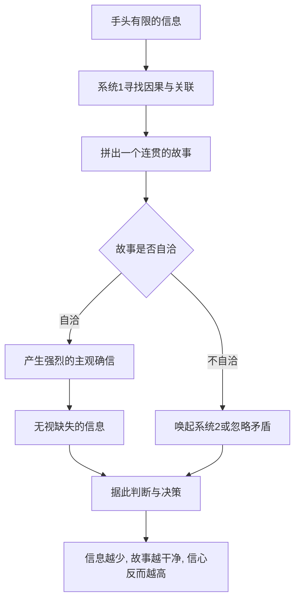

# 03｜什么是“眼见即全部”？

> 为什么我们总根据眼前那点信息，就自信地下判断？

---

## 一、先说结论

卡尼曼用 WYSIATI（What You See Is All There Is，即"眼见即全部"）来概括系统 1 的一个核心倾向：它只会用当下可得的有限信息，编出一个尽可能连贯的故事，然后把这个故事当成完整的真相。

它不会为"自己遗漏了什么"感到不安，因为缺失的信息根本不在它的加工范围里。于是我们能在信息严重不足的情况下，得出一个感觉非常确定的结论——而且越是信息少，故事反而越干净，信心还越高。

---

## 二、我们先理解一个问题

先想一个反常识的现象：为什么信息越少，人有时反而越自信？

按常理，了解得越多应该越有把握。可现实常常相反：只听过一个说法的人，往往比听过十种说法的人更笃定。因为信息一多，故事就容易自相矛盾，人就不得不启动系统 2 去权衡；而信息少的时候，手边那几条刚好能拼成一个通顺的版本，系统 1 直接给出结论，毫不迟疑。

卡尼曼注意到的正是这一点：决定我们"有多相信"的，不是信息的数量和质量，而是故事讲不讲得通。所以问题不在"我们看到得够不够"，而在"我们根本不知道自己没看到什么"。

---

## 三、作者到底提出了什么观点？

卡尼曼围绕 WYSIATI 提出了几层看法：

- **只用手头信息**：系统 1 不会去追问"还缺哪些信息"，它只对已经出现在眼前的内容做加工。
- **追求连贯，不追求完整**：它优先让故事自洽，而不是让它覆盖全部事实。
- **信心来自连贯**：主观确信的强度，主要取决于故事的顺畅程度，而非证据的充分程度。
- **缺失的信息不可见**：我们无法为"没想到的东西"感到不安，因为那部分内容根本不存在于意识中。
- **因此产生系统性后果**：过度自信、对个案的高度投入、以及大量"信息不足却结论坚定"的判断。

卡尼曼把 WYSIATI 视为整本书里最重要的机制之一，因为它是一条底层规则，很多具体偏差都是它的不同表现。

---

## 四、把这个观点翻译成人话

把系统 1 想象成一个赶着交稿的记者。

主编问："事情是怎么回事？"他手边只有三条线索，但他不会写"资料不足，暂无法判断"，而是立刻把这三条串成一篇情节完整、因果清晰的报道。读起来毫无破绽，读者自然信以为真。

只有当他被派去"再多找几条线索"时，那篇报道的漏洞才会暴露。可现实中，很少有人会主动去要更多线索——因为稿子已经写完了，看起来也挺好。

关键在这里：缺失的信息不是纸上的"空白"，而是"根本没有出现在稿纸上"。你不会因为没写的东西而心虚，因为你压根没意识到它存在。这就是 WYSIATI 最要命的地方——它不是"我知道我不知道"，而是"我连自己不知道都不知道"。

---

## 五、为什么会这样？

因为系统 1 的日常任务不是求真，而是求"够用"。它需要在极短时间内给出一个能指导行动的说法，而一个连贯的故事，恰好最能胜任。

从图中可以看到，真正产生确信的不是 A（信息量），而是 D 与 E 之间的那一跳：故事一旦自洽，主观确定感就产生了。而 G 这一步几乎无法避免——因为"缺失的信息"本身不可见，系统 1 也就没有任何理由停下来。

换句话说，WYSIATI 不是"我们懒得去找信息"，而是"我们的判断装置，从设计上就不认识'缺失'这回事"。

---

## 六、举一个现实生活中的例子

选一家餐厅。

你打开外卖软件，看到一家店评分 4.6，评论只有七条，其中五条夸"出餐快、份量大"。你心里已经决定下单了。

但你没有问：这个 4.6 分是从多少单里算出来的？这七条评论，会不会恰好是老板的朋友写的？那上百个沉默的顾客后来还点不点这家？——这些问题都没有出现在屏幕上，因此也就"不存在"。

你得到的，是一个干净的小故事：这家店不错。这个故事没有破绽，因为破绽藏在你看不到的地方。更耐人寻味的是，如果你接着刷到一条图文并茂的差评，故事会立刻反转成"这家店不行"，你同样自信。可见变的不是事实，而是你手里的故事——而故事，永远是由"恰好出现在眼前的那几条"拼出来的。

顺带一提，这也是为什么"沉默的顾客"在评分里几乎不发声：他们不是不存在，只是没进入你的屏幕。

---

## 七、回到书中重新理解

WYSIATI 是理解后面许多偏差的底层机制。

可得性启发是它的一个特例——容易想起的信息被当成了全部信息；锚定效应是它的一个特例——眼前那个数字被当成了全部参考；过度自信也与它直接相关——正因为看不见缺失信息，我们才以为自己掌握的就是全部。

所以卡尼曼反复强调，如果一个判断是在信息不足时形成的，那么它的自信程度本身就值得怀疑。理解 WYSIATI 之后，再看到"这人怎么这么笃定"，你的第一反应就不再是"他一定知道很多"，而可能是"他恰好没看到那些碍事的信息"。

---

## 八、这个观点背后还有什么？

有几个隐含前提值得拎出来。

**第一，沉默证据。** 我们只看到活下来的、发声的、被呈现的；看不到没发生的、沉默的、被省略的。幸存者偏差和叙事谬误，都长在同一片土壤上。

**第二，信息的可得性越来越由别人决定。** 算法、媒体、界面决定了什么出现在你眼前，也就在很大程度上决定了你会编出什么样的故事。

**第三，它是框架效应的前提。** 因为系统 1 只在给定框架里追求连贯，所以只要改变呈现方式，就能改变结论——同一个事实，换一种说法，判断就可能完全不同。

**第四，它解释了专业训练为什么重要。** 好的训练很多时候不是往脑子里装更多知识，而是让人对"我可能漏掉了什么"保持敏感，甚至形成一种不舒服的直觉。

---

## 九、这个观点有问题吗？

有问题，需要公允地看。

**第一，它并非总是坏事。** 在时间紧迫、代价可控的日常里，用有限信息快速拼一个故事，是有效率的。不是所有决策都值得穷尽信息，把所有判断都拖到信息齐全才做，本身就是另一种失误。

**第二，"信心来自连贯"是倾向而非定律。** 一些研究表明，当人明确意识到关键信息缺失时，也会适当地降低信心；领域内的专家知识，能在一定程度上修正这种倾向。

**第三，概念较难精确量化。** WYSIATI 更像一个描述性的统称，而不是可以被精确测量、单独证伪的机制。一些学者认为，它把若干不同现象打包在了一个标签之下，用起来方便，追究起来模糊。

**第四，但方向上很少有争议。** "忽视缺失信息、凭有限线索过度自信"是行为决策研究中被反复观察到的现象，它在现实中的代价也确实存在。

**所以更准确的说法是**：WYSIATI 是一个极好的警觉信号，但不能把它当成"信息越少越不可信"的简单公式——重要的是，你是否知道自己漏掉了什么。

---

## 十、今天再看这个观点

以下部分是卡尼曼思想的现代延伸，不是卡尼曼的原话。

在社交媒体上，一个人、一件事常常以"截取的一段"出现在你面前，而那一段，往往恰好是最容易被拼成故事的那一段。切片越短，故事越干净，确信就越强。于是公共讨论里最常见的，不是"我们信息还不够"，而是"这不明摆着吗"。

算法又进一步放大了它：推荐系统倾向于把"最连贯、最抓人"的内容推到前面，也就等于优先递给你那些最容易形成完整故事的碎片。

对个人来说，一个实用的问句是：如果现在要我为相反的结论找证据，我需要知道哪些我目前还不知道的事？这个问题，就是给缺席的信息留一个位置。

---

## 十一、这一篇真正应该记住什么？

1. **WYSIATI：所见即全部。** 系统 1 只用可得信息编故事。
2. **信心来自连贯，而非完整。** 话说得通，人就信。
3. **缺失的信息不是空白，而是根本不在视野里。**
4. **它催生了可得性、锚定、过度自信等一系列偏差。**
5. **对抗它的方法，是主动追问"我漏掉了什么"。**

---

## 十二、留一个问题

> 如果你此刻对某件事的确定感，
> 仅仅来自"手边的信息已经能拼成一个通顺的故事"——
> 那么，你有什么理由相信，
> 这个故事不是因为你没看到别的，才显得这么顺？

---

**下一篇**：既然我们常凭有限信息自信地下判断，那么问题来了——同样是凭感觉，为什么有些人的直觉很准，有些人的直觉却只是自信？凭直觉，到底什么时候可以相信？

下一篇我们就来拆开这个问题——**直觉什么时候可以相信？**
