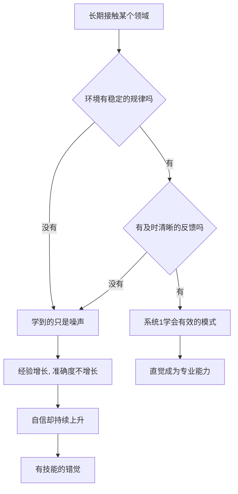

# 04｜直觉什么时候可以相信？

> 同样是"凭感觉"，为什么消防员的直觉可靠，股民的直觉不可靠？

---

## 一、先说结论

卡尼曼认为，直觉不是一律可信，也不是一律不可信。专家直觉的可靠性，取决于两个条件：

**第一，所处的环境有足够稳定的规律；第二，人能通过长期、及时的反馈学会这些规律。**

两个条件都满足时，直觉是真正的专业能力，比如消防指挥员判断火势、象棋大师看出关键一步；缺少任何一个，直觉就只是被误当成能力的自信，比如长期政治经济预测、股市点位预测。同样是"凭感觉"，差别不在感觉本身，而在感觉生长的土壤。

---

## 二、我们先理解一个问题

先问一个反差很大的问题：为什么"直觉"这个词，有时是褒义，有时是贬义？

我们说一位老消防员"有直觉"，是在夸他判断准；我们说一位股民"全凭直觉"，往往是在暗示他不靠谱。可两件事的主观体验几乎一样：都是飞快地冒出一个判断，都说不清理由，都很笃定。

既然体验相同，为什么结论的可靠性天差地别？如果只盯着"感觉"本身，这个问题永远说不清。卡尼曼的贡献在于，他把注意力从"人"移到了"环境"：不是哪一种感觉更神秘，而是哪一种领域允许感觉被训练得准确。

---

## 三、作者到底提出了什么观点？

卡尼曼围绕专家直觉提出了几层看法：

- **直觉是识别，不是神秘力量。** 它来自系统 1 的模式识别，是大量经验沉淀后的快速匹配。
- **两个必要条件**：环境要有可被学习的规律；学习者要能得到足够快、足够清晰的反馈。
- **条件满足时，直觉是能力。** 消防、下棋、某些医学判断，长期反馈让人真的学会了规律。
- **条件不满足时，会形成"有技能的错觉"。** 卡尼曼用这个说法描述一种现象：人对自己的预测非常自信，而这种自信并不随着准确性差而下降。
- **因此，判断一个直觉值不值得信，要先看领域，再看人。**

他还特别提到，自己曾与合作者加里·克莱因就"专家直觉是否可靠"展开过长期讨论，两人起初立场对立，最终达成的共识正是：答案取决于环境是否具备上述条件。

---

## 四、把这个观点翻译成人话

直觉像一台靠经验训练的识别机器。

象棋大师看棋盘，不是"计算了所有走法"，而更接近"一眼认出一张熟悉的脸"。他见过成千上万个局面，系统 1 直接给出了"这一步危险"的信号——快得他自己都来不及解释。

而股评家面对的是另一台机器：同样的输入，明天可能给出完全相反的答案，而且几乎不提供清晰的反馈告诉你"你错在哪里"。赢了可能是运气，输了也可能怪黑天鹅。

在没有规律的地方训练直觉，就像在噪声里找信号：你会越来越熟练地读出噪声，却以为那就是规律。你的感觉没有骗你，它只是忠实地学会了它被喂进去的东西。

---

## 五、为什么会这样？

把这两个条件画出来，一切就清楚了：环境是否有规律，决定了"有没有东西可学"；反馈是否及时清晰，决定了"能不能学得会"。

从图中可以看到，两条路径的分岔点不在"努力程度"，而在环境本身。无论一个人多勤奋、多资深，只要环境没有规律，或者反馈既慢又模糊，他学到的就不是本事，而是"我很懂"的感觉。

反过来，条件齐备时，直觉的快与准其实并不矛盾——快是因为规律稳定，准是因为反馈长期校准过它。

---

## 六、举一个现实生活中的例子

先说棋手。

面对一个陌生局面，象棋大师往往能在几秒内指出关键一步，或者干脆说"这里有问题"。他说不清全部理由，但这种判断来自十几年、上百万个局面的反复锤炼——赢了输了，结局清晰，错误可以追溯。这是系统 1 在海量有效反馈里训练出来的真本事。

再说股评家。

电视上有人笃定地说："下个月大盘会到某个点位。"语气甚至比棋手更自信。但市场恰恰是低规律、高噪声的环境：相似的技术形态，结果可能完全相反；预测错了，还能归因于"意外""黑天鹅"。他没有一条可以学到真本事的反馈通道，却在不断积累"我很懂市场"的感觉。

两个人用的都是系统 1，机器的输入质量却天差地别。一个是在规则清晰的棋盘上练出来的识别力，一个是在噪声里练出来的笃定。这也解释了一个反直觉的现象：有时候经验越久，错觉反而越深——因为他在错误的方向上练得越来越熟练。

---

## 七、回到书中重新理解

这一篇把前面两篇收在了一起。

系统 1 会自动用经验做判断，无论经验是否有效；而系统 2 又懒得复核，所以当环境没有规律时，直觉的错误不仅不会被及时纠正，反而会被自信一层层掩盖。懒惰与过度自信在这里合流：一个负责出错，一个负责不让错误被发现。

同时，这一篇也交代了卡尼曼的一种立场：他并不是反对直觉，也不是反对专家。他反对的是在不该相信直觉的领域，把自信当成能力。这也解释了为什么他在书的后面，会对形形色色的长期预测那么不客气——因为那些领域，恰恰是直觉最容易伪装成能力的地方。

---

## 八、这个观点背后还有什么？

有几个隐含前提值得拎出来。

**第一，反馈的质量比经验的数量更重要。** 慢反馈、模糊反馈、被运气主导的反馈，都会让人学到错误的东西。资历本身不是证据。

**第二，选择领域比埋头努力更关键。** 在一个噪声很大的领域，投入越多，可能只是把错觉练得越熟。方向错了，勤奋会加速错误。

**第三，它可以用来筛选建议。** 听到一个自信的预测时，先问两句：这个领域的规律稳定吗？预测者能得到清晰、及时的反馈吗？

**第四，它与机器形成对照。** 在高维、低反馈的难题上，统计模型之所以常常胜过专家，恰恰因为它不依赖"感觉"，也不在乎自己是否自信。

---

## 九、这个观点有问题吗？

有问题，需要公允地看。

**第一，界定标准偏模糊。** 什么算"足够规律"、什么算"有效反馈"，往往要事后才说得清，事前很难判断。这使这套标准有滑向事后归因的风险——事情对了就说环境有效，错了就说环境无效。

**第二，反馈并非唯一的学习途径。** 一些心理学家认为，人可以通过逻辑推理和理论学习在缺乏直接反馈的情况下修正直觉，不必事事依赖实战结果。

**第三，专家直觉的实证本身存在争议。** 部分经典研究在可重复性讨论中受到质疑；也有研究显示，在棋类等反馈清晰的领域，专家优势相当稳健。所以关于专家直觉的边界，学界存在不同解释。

**第四，但它作为一把尺子很稳。** 即便细节有争论，"先看环境、再看人"这个框架，至少能让人不再把"资历深、说话笃定"直接等同于"判断准"。

**所以更准确的说法是**：直觉的可靠性是一个关于环境的问题，而不是一个关于天赋的问题。两条件框架不是判决书，而是提问方式。

---

## 十、今天再看这个观点

以下部分是卡尼曼思想的现代延伸，不是卡尼曼的原话。

在一个专家言论满天飞、算法推荐无处不在的时代，这个框架格外好用。越是高噪声、反馈又慢又模糊的领域，比如宏观经济、地缘政治、长期股价，自信的预测越应该打折；越是高规律、反馈清晰快速的领域，比如工程、部分医学场景、竞技体育，经验才更可能代表真本事。

与此同时，生成式人工智能让"看起来专业"的成本急剧下降——流畅、笃定、结构完整的表达，已经不再需要以真实能力为代价。于是自信的表达本身，越来越不构成能力的证据。

这也给出一条更实用的自检：当你被某个人的笃定打动时，先别急着信他，先看看他所处的那个领域，是否允许一个人变得真正可靠。

---

## 十一、这一篇真正应该记住什么？

1. **直觉是否可信，取决于环境，而不是取决于谁在信。**
2. **两个条件：稳定的规律，加有效的反馈。**
3. **条件满足，直觉是专业能力；条件缺失，只是"有技能的错觉"。**
4. **高手"一眼看出"，本质是海量经验训练出的模式识别。**
5. **判断一个预测，先看领域，再看人。**

---

## 十二、留一个问题

> 如果一个人在某个领域里显得很自信，
> 仅仅因为他在那里待了很久——
> 那么，你该相信的，
> 究竟是他的经验，
> 还是他所在的那个环境，本来就学不出经验？

---

**下一篇**：无论直觉可不可信，它都需要"素材"。而系统 1 调用素材时有个鲜明的偏好：什么最容易想起来，就用什么。于是，"容易想起"悄悄变成了"更常见"。

下一篇我们就来拆开这个问题——**为什么容易想起的事，就显得更常见？**
