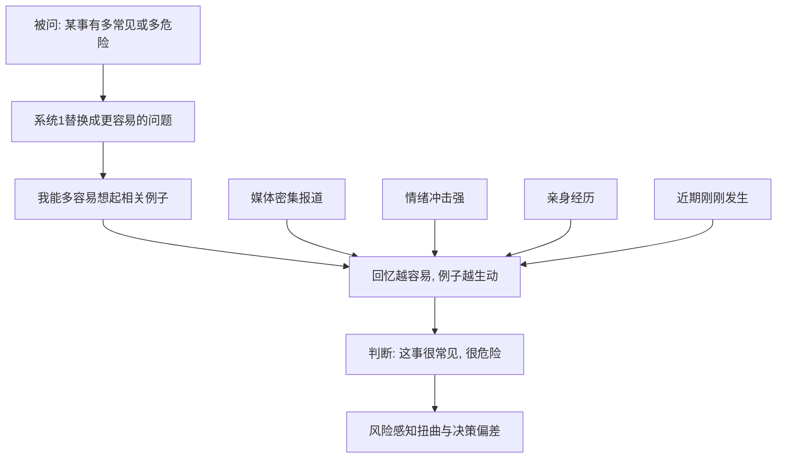

# 05｜为什么容易想起的事，就显得更常见？

> 我们对"频率"的判断，为什么会被记忆的难易度带偏？

---

## 一、先说结论

卡尼曼认为，人在判断某类事件"有多常见"时，并不真的去统计，而是悄悄把问题换成一个更容易回答的版本："这类事，我能多容易地想起例子？"

这种用"回忆的难易度"替代"真实频率"的捷径，就是可得性启发。结果是：一件事越容易被想起，我们就越觉得它常见。而"是否容易想起"，取决于媒体报道、情绪强度、亲身经历和近期程度，并不取决于它真实的概率。

---

## 二、我们先理解一个问题

先做一个小测试。

请你在十秒内估计：英文里，以 r 开头的单词多，还是第三个字母是 r 的单词多？

大多数人会脱口而出：以 r 开头的更多。理由也很自然——你随手就能想起 red、road、run、right。但真实情况恰恰相反：第三个字母是 r 的单词其实更多。这个经典问题说明的是同一件事：我们判断"多不多"，靠的是"好不好想"，而不是"数一数"。

好想的东西，显得多；难想的东西，显得少。系统 1 把"提取的难易"直接读成了"频率的证据"，中间那一步真实的清点，被整个绕过了。

---

## 三、作者到底提出了什么观点？

卡尼曼围绕可得性启发提出了几层看法：

- **用容易的问题替换难的问题**：被问"多常见、多危险"时，系统 1 换成"我能多快想到例子"，并对这个替换毫无察觉。
- **可得性由什么决定**：媒体报道的密度、事件的情绪冲击、是否亲身经历、是否刚刚发生。
- **偏差的方向**：高估生动、罕见、被反复报道的事件，比如空难、凶杀、罕见疾病；低估平淡、常见、不被报道的事件，比如日常车祸、慢性病。
- **与 WYSIATI 相连**：能想到的，就成了"全部"；想不起的，仿佛不存在。
- **后果**：风险感知被扭曲，进而影响个人选择，甚至影响公共政策。

卡尼曼强调，这条捷径的可怕之处不在于它会偶尔失灵，而在于它的偏差方向是系统性的——它总是朝"更生动"的那一边倾斜。

---

## 四、把这个观点翻译成人话

把记忆想象成一个仓库，仓库门口有一条传送带，上面跑的是"最近最常被搬动"的东西。

当你被问"这事常见吗"，系统 1 并不去清点库存，而是随手抓了传送带上最快经过的几件货，当作整个仓库的样本。样品越顺手，你就越觉得这类货很多。

所以问题的关键，从来不是"事实上有多少"，而是"你脑子里多快能搬出几件"。而传送带运什么，很大程度上不由你决定——媒体、算法、以及你最近被什么吓到过，都在替它装货。

---

## 五、为什么会这样？

把可得性偏差拆开来看，会发现最醒目的是：真实的频率根本没有进入流程，进去的只是"提取的难易"。

从图中可以看出，判断链路里有一个隐形的替换：A 被 B 换掉了。我们以为自己回答的是"它有多常见"，实际上回答的是"它有多好想"。

而右侧那四个箭头——媒体、情绪、亲历、近期——决定了记忆的"手感"。它们每一个都偏向戏剧性与冲击力，于是可得性偏差天然地偏爱那些吓人的、罕见的事件。

---

## 六、举一个现实生活中的例子

坐飞机，还是开车。

一架客机失事，几乎必然登上所有媒体的头条：画面震撼、伤亡集中、情节戏剧化。于是"坐飞机很危险"这个感觉被反复加固，成了记忆里最鲜艳的一幅画面。

可如果去看数据——一些研究表明，按每公里或每出行次数计算，商业航空的死亡风险远低于公路交通。但人们依然更害怕飞机，而不是每天开车出门。为什么？因为车祸太日常、太零散、太不成新闻；一架飞机的坠落却会被反复播放，在你的仓库传送带上永远占着一个显眼的位置。

可得性偏差就这样完成了一次悄无声息的翻译：把"记忆的鲜艳度"翻译成了"现实的危险度"。

更耐人寻味的是它在行为上的后果。空难新闻之后，往往有一些人会改选长途自驾——为了躲开一个极小概率的灾难，反而把自己暴露在更大的风险里。他们的恐惧是真实的，只是这份恐惧，量错了对象。

---

## 七、回到书中重新理解

可得性启发是卡尼曼判断偏差部分里最有影响力的一条，因为它把两个层面接在了一起：认知机制（记忆提取的难易）与现实后果（媒体、风险、公共政策）。

它也解释了为什么"生动的个案"总能压倒"准确的统计"——统计需要系统 2 去处理，而生动案例直接命中系统 1 的提取通道。这与后面的基础比率忽视、叙事谬误是同一条线上的延伸：我们总是更容易被"能想起来的那一个"带走，而不是被"算出来的那一片"说服。

所以可得性不只是一条关于记忆的规则，它还是理解公共舆论与风险治理的一把钥匙。

---

## 八、这个观点背后还有什么？

有几个隐含前提值得拎出来。

**第一，可得性不仅影响对外部世界的判断，也影响自我评价。** 容易想起自己做过的好事，可能让人对自己评价偏高；反过来，反复想起自己的失误，也可能让人过度自责。

**第二，它解释了媒体的塑造作用。** 报道什么、反复报道什么，就在定义公众认为什么"常见"、什么"值得害怕"。

**第三，它是双向可利用的。** 企业可以通过反复曝光让一个品牌"显得流行"，政治议题可以通过重复出现在镜头里而"显得重要"，个体则需要多一层自检。

**第四，它提醒我们："容易想起"本身，是一种可以被制造出来的感觉。** 你以为的常识，可能只是被重复得够多。

---

## 九、这个观点有问题吗？

有问题，需要公允地看。

**第一，它不是纯粹的缺陷，很多时候是好用的近似。** 在信息稀缺、时间紧迫的环境里，"能想起来的"往往确实更常见，这条捷径有它的合理性，甚至是生存优势。

**第二，效应的强度存在争议。** 部分经典的可得性实验在可重复性讨论中被重新检验，一些研究者认为其效应大小随情境变化很大。关于"它在多大范围内主导判断"，学界存在不同解释。

**第三，它与情绪的作用难以分离。** 生动事件同时带来情绪唤起。究竟是"因为记得住"还是"因为吓到了"，在具体案例里有时并不容易区分。

**第四，但基本方向相当稳定。** 高估被报道、被经历的事件，低估沉默的常见风险，这一现象在大量研究中被反复观察到，也在现实中留下了大量可检验的后果。

**所以更准确的说法是**：可得性是一条高效的近似规则，代价是它系统性地偏向生动。问题不在捷径本身，而在我们从未意识到自己走了捷径。

---

## 十、今天再看这个观点

以下部分是卡尼曼思想的现代延伸，不是卡尼曼的原话。

社交媒体是可得性偏差的放大器，而且比传统媒体更极端。算法会把最能引发情绪、最容易被转发的内容推到你的面前，而"罕见且极端"天然更容易被转发。于是你看到的"世界"，是由最容易被记住的片段拼成的。每一次刷屏，都在悄悄改写你对"什么常见、什么危险、什么正常"的判断。

这在公共层面还有一个副作用：当所有极端事件都被集中呈现在同一个屏幕上，人会误以为"世道越来越乱"，而这种感觉的来源，可能只是信息密度提高了，而不是坏事的频率上升了。

一个可操作的对策是：当你想说"现在这种事越来越多了"时，先停一秒，问自己——是真的变多了，还是我最近更容易看到它了？

---

## 十一、这一篇真正应该记住什么？

1. **判断频率时，我们用的是"好不好想"，不是"数一数"。**
2. **容易想起，取决于报道、情绪、亲历和近期程度。**
3. **结果是高估生动罕见的事件，低估平淡常见的风险。**
4. **它与 WYSIATI 相连：能想到的，就成了全部。**
5. **媒体和算法，正在替你决定"什么显得常见"。**

---

## 十二、留一个问题

> 如果"显得常见"只是"容易想起"的副产品——
> 那么，你现在最害怕的那件事，
> 到底是它真的危险，
> 还是你恰好见过它太多次？

---

**下一篇**：可得性说的是"用好不好想，代替有多少"。还有一种更狡猾的替换：用"像不像"代替"概率有多大"。为什么我们宁愿相信一个东西"像"，也不愿相信概率给出的答案？

下一篇我们就来拆开这个问题——**为什么我们爱用"像不像"来下判断？**
