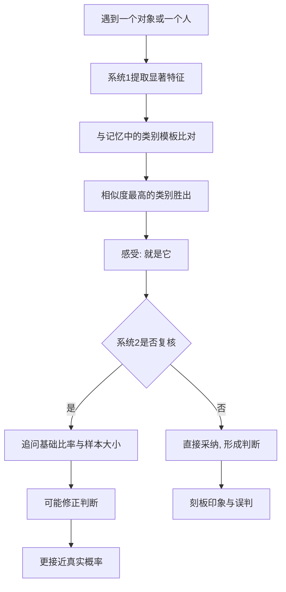

# 06｜为什么我们爱用“像不像”来下判断？

> 为什么我们宁愿相信“像”，也不愿相信“概率”？

---

## 一、先说结论

卡尼曼与他的长期合作者阿莫斯·特沃斯基提出：当我们要判断“某件事属于哪一类”时，大脑很少去算概率，而是问一个更省事的问题——**它像不像那一类？**

这条捷径叫**代表性启发**。它快得惊人，也常常管用，但它会系统性地漏掉三样东西：**基础比率、样本大小、运气**。于是，“很像”被我们悄悄偷换成了“很可能”，刻板印象和误判也由此而来。

---

## 二、我们先理解一个问题

假设朋友介绍一个人给你认识，只说了一句：他话不多，喜欢一个人待在电脑前，戴眼镜，对技术细节着迷。

你的第一反应是什么？大概率是：他大概是个程序员。

再换一个版本：同样的描述，但这个人住在一个只有几百人的小镇上。你的直觉会变吗？多半不会——你还是觉得他像程序员。

可这里有一个被跳过的步骤：**“像”不等于“很可能是”。** 一个人符合程序员的典型形象，只能说明他“像”程序员，而不能直接推出他在所有职业中“最可能是”程序员。要得出后者，你还得知道：在这个人所属的人群里，程序员本身占多大比例？

这个被跳过的比例，就是本篇的核心。

---

## 三、作者到底提出了什么观点？

卡尼曼认为，人在做类别判断时，会用一个**替代问题**：把“它属于那一类的概率有多大”，换成“它有多像那一类的典型形象”。

这个机制就是**代表性启发**。它的运作方式是相似度评分：越符合某个类别的刻板形象，我们就越倾向于认为它属于那一类。

作者指出，代表性会带来三类典型错误：

1. **忽视基础比率。** 某一类在总体里本来就稀少，哪怕描述再像，它的实际概率也未必高。
2. **忽视样本大小。** 小样本更容易出现极端结果，而代表性判断对此毫不敏感。
3. **忽视运气与回归。** 我们把随机波动读成了“这个人本来就是这样”。

换句话说：**代表性负责给出一个连贯、生动的“像”，而概率需要的是枯燥的、藏在后台的数字。**

---

## 四、把这个观点翻译成人话

我们的大脑里，装着一套“识人模板”。

看到一个人，系统 1 会立刻拿他和你脑子里的模板做比对：程序员、艺术家、销售、老师……哪个模板匹配度最高，哪个就胜出。这个过程不需要你主动，也不需要数字。

而真正的概率判断是另一回事。它至少要问：

- 这个人所在的环境里，各种职业各占多少？
- 这段描述本身有多可靠？
- 描述里的特征，哪些是典型特征，哪些只是巧合？

这些问题，系统 2 得一项项去算，很累；而系统 1 已经递上了一个“像程序员”的答案。大多数人于是停在了第一个答案上。

**“像”是系统 1 的评分，“概率”是系统 2 的工作。**

---

## 五、为什么会这样？

从信息加工的角度看，代表性其实是一种极高效的压缩：

关键在 **D 到 E** 这一步：相似度一旦足够高，感受上的“确定”就已经产生。这种确定感来自匹配的顺畅，而不是来自任何概率计算。系统 2 如果不起疑，就不会去补那道基础比率的算术。

---

## 六、举一个现实生活中的例子

招聘场景最能说明问题。

假设你是一家公司的面试官，两份简历摆在面前：

甲：计算机专业，项目经历普通，成绩中等。
乙：非科班出身，但简历上写满了各种技术折腾，个人项目一堆小工具，说话时满口技术名词。

“像程序员”的直觉会立刻指向乙，因为乙更符合我们心中那个“技术迷”的形象。

但如果认真看基础比率呢？在你收到的所有简历里，科班、有系统训练的人占绝大多数；非科班的候选人本来基数就小，其中能把爱好做到能上岗的更是少数。于是，**“乙很像”并不等于“乙更可能是合适的人”。**

代表性在这里还叠加了一层更隐蔽的东西：**刻板印象**。当“程序员的典型形象”本身来自流行文化——不爱说话、戴眼镜、昼夜敲代码——你其实是在用一个被简化的形象，替代对眼前这个具体的人的判断。结果是：沉默寡言的人可能被高估，健谈开朗的候选人可能被低估，而真正的能力信号反而被形象信号盖住了。

这不是某个面试官的问题，而是所有人共用的默认设置。

---

## 七、回到书中重新理解

卡尼曼在书里讲过一个著名的判断难题：只给出一段性格素描，让你猜这个人最可能读什么专业。

实验里的典型结果是：人们会依据素描与各个专业“像不像”来排序，几乎不去考虑各专业招生人数的巨大差异。哪怕他们被告知了各专业的基础比率，也常常把它放在一边——**因为他们手上那段生动的描述，比一个干巴巴的比例更有说服力。**

卡尼曼由此指出，代表性不是偶发的失误，而是判断系统的常态工作方式。它解释了为什么我们那么容易被“人设”带走，也解释了为什么统计信息在具体个案面前常常败下阵来。它与可得性、锚定一起，构成了他所说的“启发式与偏差”研究的基础。

---

## 八、这个观点背后还有什么？

有几个隐含点值得拎出来。

**第一，代表性不是错误，而是省钱的策略。** 在大多数日常场景里，“像不像”确实能迅速给出够用的答案。它不是一个坏习惯，而是一个高效但对某些问题不敏感的工具。

**第二，“像”之所以有力量，是因为它带来了连贯感。** 一个符合模板的故事读起来顺畅，而顺畅被大脑翻译成了“可信”。

**第三，刻板印象与代表性共享同一套机制。** 刻板印象在很多时候并不是恶意的产物，而是类别化判断的副产品——这也正是它难以根除的原因。

**第四，它把概率从直觉里赶了出去。** 只要是“像不像”的判断，基础比率就天然处于劣势。要把它请回来，只能靠系统 2 刻意去问。

---

## 九、这个观点有问题吗？

有问题，而且争议不小。

**第一，有人认为“启发式”被过度当成了缺陷。** 一些心理学家指出，代表性判断在很多情况下表现相当不错，它其实是对环境规律的一种合理利用；把它统一描述成“偏差”，可能忽略了它的适应性价值。

**第二，可重复性危机波及了这一领域。** 后续研究显示，部分启发式与偏差实验中测到的效应强度，可能没有早期报告得那么大；关于人们在什么条件下会忽视基础比率，学界也仍在争论。

**第三，关于刻板印象还有一个更微妙的分歧。** 有研究者认为，某些刻板印象在统计意义上并非全无根据；但这个说法本身争议很大，因为即便某个群体存在平均差异，用它去判断一个具体的人，仍然会系统性地忽略个体，而且很容易造成真实的伤害。

**第四，但代表性的解释力依然被广泛承认。** 即便机制细节有分歧，“用相似度代替概率”这个描述，仍能解释大量现实中的误判。

**所以更准确的说法是**：代表性是一个真实存在、极其好用的判断捷径，但它不该被用来回答“概率有多大”这类问题——那不是它擅长的题。

---

## 十、今天再看这个观点

以下部分是基于卡尼曼思想的现代延伸，不是卡尼曼的原话。

在算法和人工智能的时代，代表性获得了新的形态。推荐系统、内容审核、人脸识别、简历筛选，本质上都在做同一件事：把人或物归入某个类别，再依据类别的“典型特征”做判断。区别只是，机器用的模板来自训练数据。

这意味着：**如果训练数据里存在刻板印象，算法会把代表性放大成系统性的歧视。** 招聘筛选、贷款审批、内容推荐，都曾出现过这类问题。卡尼曼当年描述的是人脑的倾向，而今天，这个倾向被写进了大规模运行的系统里。

对个人来说，这带来一个更实际的提醒：当你要对一个人下判断时，先问一句——我是在看“他像不像”，还是在看“他实际有多大概率”？前者是直觉，后者才是证据。

---

## 十一、这一篇真正应该记住什么？

1. **代表性启发**：用“像不像某类”替代“属于那类的概率有多大”。
2. **它忽略基础比率**：类别的总体稀少或普遍，被相似度盖住了。
3. **它忽略样本大小与运气**：小样本和随机波动会被读成规律。
4. **刻板印象与它同源**：都是类别化的快判断，难以根除。
5. **“像”是感觉，“很可能”是概率**：把这两者分开，是本文最实用的自查。

---

## 十二、留一个问题

> 你最近一次对别人下的判断——这个人是怎样的人、适合做什么——
> 你依据的是他实际的行为证据，
> 还是他“看起来像”某种人的那张脸？

---

**下一篇**：代表性让我们盯住眼前的“像”，而它对样本大小几乎不敏感。于是，只要连续发生几件同样的事，我们就会立刻宣布发现了一个规律。可问题是：几件事，究竟能说明什么？

下一篇我们就来拆开这个问题——**为什么小样本会骗人？**
