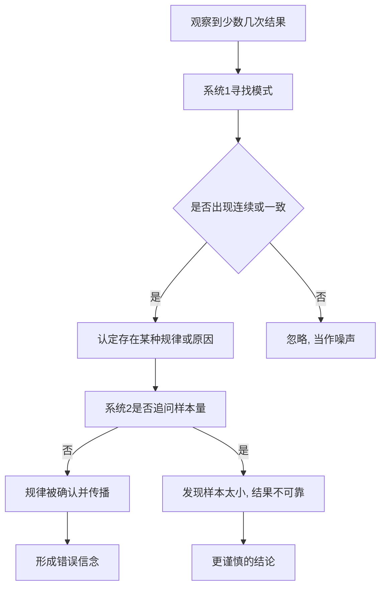

# 07｜为什么小样本会骗人？

> 为什么几件事就能让我们确信一个“规律”？

---

## 一、先说结论

卡尼曼与特沃斯基提出过一个名字非常反讽的概念——**小数定律**：人会把小样本的结果，直接当成总体的规律。

问题在于，样本越小，随机波动越大。少量观察里出现“连续同向”的结果，其实相当常见。但大脑不这么看——它会为这串结果自动编一个故事，把纯粹随机的东西读成某种稳定规律。

一句话：**我们不是算错了概率，而是根本没意识到“样本大小”是一个变量。**

---

## 二、我们先理解一个问题

你在打球。

第一次投篮进了，第二次又进了，第三次还是进。你心里升起一个念头：手感来了。第四球你更敢出手，队友也更愿意把球传给你。

现在把问题放慢：三次进球，真的能说明“手感”这个东西存在吗？

如果投篮本来就有接近一半的命中率，那么连续三次命中，是一件极其罕见的事吗？再想想，你打过的球局里，连续三次命中到底出现过多少次？——只是你只在它出现时才注意到了它，然后给它取了个名字叫“手感”。

这就是小数定律的日常版本。

---

## 三、作者到底提出了什么观点？

卡尼曼认为，人对随机性有一套根深蒂固的误解。

**第一，小样本应该被当作“有代表性”。** 我们会默认，几件事情的分布，就应该和长期总体的分布差不多。所以连续几次同向的结果一出现，我们就觉得“这里一定有原因”。

**第二，随机看起来应该像“均匀”。** 我们期待随机序列是正反交替、均匀铺开的。可真实的随机恰恰经常成串出现——连续好几个正面，在足够长的序列里几乎是必然。

**第三，我们会自动为波动编出因果。** 一旦发现了“连续”，系统 1 立刻给出解释：手感、状态、运势、周期。解释来得太快，系统 2 根本来不及问一句：样本够大吗？

作者把这种倾向概括为一句话：**人们相信小样本也能反映总体，就像相信存在一条“小样本的大数定律”。** 这正是“小数定律”这个说法的由来。

---

## 四、把这个观点翻译成人话

抛一枚公平的硬币。

你抛出“正、正、正”，会不会觉得这硬币有点怪？

可算一下：三次抛掷一共有八种等可能的结果，其中“连续三次正面”是一种，“连续三次反面”也是一种。也就是说，三次结果全部相同的概率是四分之一——一点都不稀奇。

我们真正期待的“随机”，其实不是随机本身，而是**均匀**：正反正反、分布整齐。但随机数不会照顾你的审美，它只是允许成串出现。

**小数定律的本质，是把“成串”误读成“规律”。**

---

## 五、为什么会这样？

从系统 1 的工作方式看，这条路径几乎是被设计好的：

关键在 **C 到 D**：系统 1 天生就是一台找模式的机器，它对“一致性”特别敏感，对“样本量”却毫无概念。而这台机器最擅长的事，恰恰是拿一个连贯的故事，堵住系统 2 可能提出的那个问题。

---

## 六、举一个现实生活中的例子

还是那场球。

你连进三球，全场都开始说“他手感来了”。于是接下来，你的队友更多地把球给你，你自己也更愿意出手。

可如果你真的去统计整个赛季，你可能会发现：所谓“手感来了之后的下一球命中率”，和你平时命中的概率差不多。三连中之后，你的下一球该进还是进、该丢还是丢——真正的差别，只是**你和队友都更相信那个故事了**。

而且这个信念会自我强化：因为大家更愿意传球给你，你获得了更多出手机会，进了就被归功于“手感”，没进就被解释成“手感凉了”。**解释永远能自圆其说，因为小样本永远能提供新素材。**

同样的剧本还出现在很多地方：一个球员连续两场得分高，就被称作“进入状态”；一个基金连续三个月跑赢指数，就被称作“经理有眼光”；一家公司连续两个季度增长，就被称作“找到第二曲线”。我们没有算错任何一步算术，只是从没问过：这么少的观察，值得下这么重的结论吗？

---

## 七、回到书中重新理解

卡尼曼在书里讲过一个与此直接相关的著名研究：研究者分析了职业篮球运动员的大量投篮数据，检验“连续命中之后下一球更容易进”这个广为人知的说法。

结果与直觉相反：在数据里，连续命中之后的命中率，并没有显著高于平时的水平。也就是说，“热手”至少没有人们以为的那么明显。

卡尼曼借此指出，我们对随机性的感知，是被故事修剪过的。观众只记住了那些高光连击，忘记了同样多的普通回合；而记忆只留下“手感来了”的片段，就足以支撑一个看起来无懈可击的信念。

他同时提醒：小样本不只骗球迷，也骗专家。任何依赖短期业绩做判断的领域，都容易掉进同一个坑。

---

## 八、这个观点背后还有什么？

有几个隐含点值得拎出来。

**第一，它和“回归均值”是一对。** 极端表现之后，结果通常会向平均水平回摆，而我们总会把这种回摆归因于某个具体的干预——换教练、改策略、请大师。

**第二，它与叙事谬误相连。** 随机的短序列本身没有故事，是我们为它补上了开头、高潮和因果。

**第三，它是“可得性”的近亲。** 连中的片段更容易被记住、被谈论，于是它在记忆里显得比实际更常见。

**第四，它提醒我们一件事：** 判断一个结论是否可靠，除了看结论本身，还得看它是从多少观察里得出来的。样本量不是一个技术细节，而是结论的一部分。

---

## 九、这个观点有问题吗？

有问题，而且这里恰好有一个非常精彩的学术反转。

**第一，“热手不存在”这个结论本身后来受到了挑战。** 一些研究者在重新审视早期数据后发现，当初的统计方法可能存在选择偏差，修正之后，“热手效应”并非完全不存在。也就是说，卡尼曼在书里转述的那个“反直觉结论”，其证据基础在学界仍有争论。这提醒我们：连批评偏差的研究，也可能受到偏差的影响。

**第二，有学者认为“人不理解随机性”被夸大了。** 一些心理学家指出，在更贴近日常的实验设置里，人对样本量其实有一定敏感性；把“小数定律”说成普遍规律，可能低估了人的统计直觉。

**第三，但核心提醒依然成立。** 无论热手是否存在，**把小样本的偶然结果直接当成稳定规律**，在现实中确实反复导致误判。争议针对的是边界与强度，而不是这个倾向完全不存在。

**所以更准确的说法是**：不确定的是“某个具体效应是否成立”，确定的是“用小样本下重结论很危险”。前者留给学界继续吵，后者你我今天就能用。

---

## 十、今天再看这个观点

以下部分是基于卡尼曼思想的现代延伸，不是卡尼曼的原话。

在数据泛滥的时代，小数定律的舞台比卡尼曼写作时更大。团队看周报，产品看七天留存，投资看三个月净值，运营看一场活动的转化——每一个数字都可能只来自很小的样本，却足以触发一轮“发现了规律”的兴奋。

更值得注意的是：**数据越多，我们越容易从中翻出小样本的巧合。** 当你能同时观察几百个指标，总会有几个指标恰好连续几期同向；把它们挑出来讲故事，几乎必然成功。

一种朴素的对抗办法，是事先定好规则：这个结论需要多大的样本才允许被认真对待？需要多长的观察窗口才允许被称为“趋势”？把这条线画在看见数据之前，而不是之后，才能挡住系统 1 事后编故事的冲动。

---

## 十一、这一篇真正应该记住什么？

1. **小数定律**：把小样本结果当成总体规律。
2. **样本越小，波动越大**：连续同向在小样本里很常见。
3. **我们期待随机“均匀”**：但真实随机允许成串出现。
4. **系统 1 会自动补因果**：手感、状态、运势都是事后命名。
5. **样本量是结论的一部分**：问一句“这结论来自多少观察”，能挡掉大量误判。

---

## 十二、留一个问题

> 你最近笃信的那个“规律”——某人状态好、某事正在变好、某方法确实有效——
> 它背后到底有多少次观察？
> 如果把那些你没注意到的反面例子也算进来，这个规律还站得住吗？

---

**下一篇**：小样本骗人的方式，是让我们把偶然读成规律。但它还有一个更隐蔽的伙伴：当两个条件叠在一起、描述变得更具体时，我们不但不觉得概率更小，反而觉得它更可信。

下一篇我们就来拆开这个问题——**“琳达问题”：为什么我们偏爱更详细的描述？**
