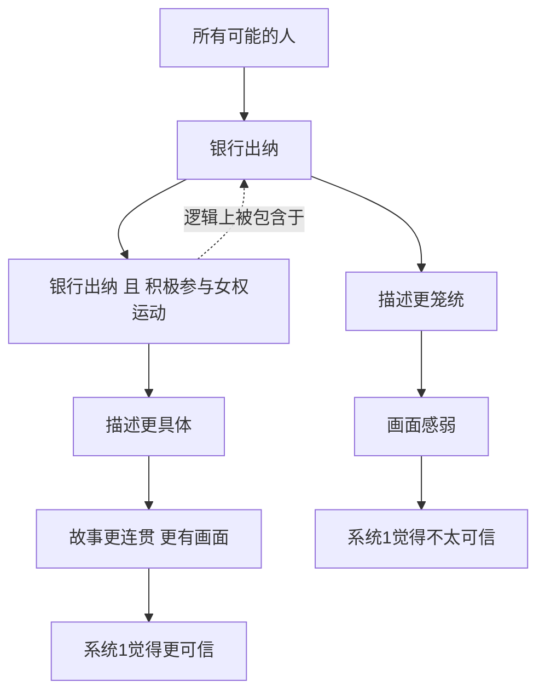

# 08｜“琳达问题”：为什么我们偏爱更详细的描述？

> 为什么一个更具体、更详细的描述，反而让我们觉得更可能？

---

## 一、先说结论

从逻辑上讲，**“A 并且 B”的概率永远不可能大于“A”的概率**。条件越多，能同时满足的可能性就越小。

但卡尼曼与特沃斯基发现，人不是这样感觉的。当一个描述更具体、更像一个完整故事时，我们会觉得它“更可能”。这就是**合取谬误**——两个条件同时成立明明概率更低，我们却因为故事更连贯而更相信它。

著名的“琳达问题”，就是这枚偏差最漂亮的一次公开演示。

---

## 二、我们先理解一个问题

先看一段人物介绍：

琳达，三十一岁，单身，坦率，非常聪明。她大学时主修哲学，学生时代就非常关心歧视与社会公正问题，还参加过反核游行。

现在，请判断下面两句话，哪一句更可能为真：

甲：琳达是一名银行出纳。
乙：琳达是一名银行出纳，并且积极参与女权运动。

停一下，先不要往下看，记下你的直觉答案。

大多数人的直觉会选乙。因为乙更“像”那个琳达——一个关心社会议题的哲学系学生，似乎天然就该是女权运动的参与者。可稍微一想就会发现：所有“银行出纳且参与女权运动”的人，本身就已经是“银行出纳”；乙只是甲的一个子集，怎么可能比甲更可能？

这就是本篇的核心：**为什么一个逻辑上更小的可能性，会在感觉上更大？**

---

## 三、作者到底提出了什么观点？

卡尼曼认为，合取谬误来自代表性对逻辑的压倒。

按照概率的基本规则，一个合取事件（A 且 B）的概率，不可能超过其中任何单独一项。这是无争议的数学事实。

但人在做判断时，用的不是这条规则，而是**“哪个描述更像那个人的形象”**。乙把琳达的哲学背景和女权倾向拼在了一起，构成一个连贯、有因果、读起来顺畅的故事；甲则平淡、缺乏信息。故事越完整，系统 1 越觉得它真实。

于是作者指出：

1. 我们混淆了**“看起来合理”与“概率高”**；
2. 具体细节会提升可信度，哪怕它同时降低了概率；
3. 这种错误与智力、教育程度关系不大，受过统计训练的人也难以完全免疫。

---

## 四、把这个观点翻译成人话

想象你面前有两扇门。

甲门背后写着：随便一个人，是银行出纳。
乙门背后写着：随便一个人，是银行出纳，而且热衷女权运动。

要同时穿过多重条件，本来就比通过单一条件更难。乙门其实更窄。

但系统 1 不检验门有多窄，它检验的是**门上的故事讲得好不好**。一个生动的、带细节、带心理动机的描述，会让系统 1 产生一种“这就对了”的熟悉感。而熟悉感被我们误读成了“更可能”。

**细节增加的是画面感，减少的是概率——我们却把画面感当成了概率。**

---

## 五、为什么会这样？

从集合的角度看，这件事其实一目了然：

注意最后那条虚线：**乙集合完全被甲集合包住**，这就是数学上的硬约束。可系统 1 看不到集合的嵌套，它只看到两个故事的生动程度——于是它把更大、更真实的那个集合，判成了更不可能。

---

## 六、举一个现实生活中的例子

把琳达问题搬到相亲现场，它立刻就活了。

你面前有两个潜在对象的介绍。

甲：对方是个普通的上班族，性格还不错，工作稳定。
乙：对方是个普通的上班族，但据说特别懂你——他也曾经历过一段很难的日子，后来靠自己一点点走出来，所以格外珍惜认真生活的人。

你更想见谁？大多数人会选乙。

可如果严格讲，乙成立的人，一定同时满足甲；乙只是甲里更小的一撮。乙之所以吸引你，不是因为它的概率更高，而是因为它**具体、有情节、有情感动机**——它更像一个可以相信的故事。

问题也正出在这里。越具体的描述，往往包含越多未经核实的信息：那些“据说”“曾经历”“格外珍惜”的细节，可能恰恰是讲故事的人添上去的。我们被故事的连贯打动，却忘了去问：这些细节是哪里来的？有没有被检验过？

**具体让人心动，也让人放松警惕。**

---

## 七、回到书中重新理解

卡尼曼在书里详细记录了“琳达问题”的实验。他让被试对一系列关于琳达的陈述排序，其中关键的两项，就是“银行出纳”与“银行出纳且是女权主义者”。

结果非常稳定：**绝大多数被试把后者排在了前者前面**，直接违反了合取规则。

更让卡尼曼在意的是：即便把“这是概率问题”“请按可能性排序”写在题目里，错误率也没有消失。他甚至报告过，受过统计学训练的被试同样会犯错——只是他们事后更难接受自己错了。

卡尼曼从这个实验里得到的，不只是一个有趣的偏差，而是一个更冷的结论：**系统 1 对连贯性的偏好，强到可以覆盖最基本的逻辑约束。** 当一个故事足够顺畅时，它就不再需要证据。

---

## 八、这个观点背后还有什么？

有几个隐含点值得拎出来。

**第一，它与“所见即全部”相连。** 描述里的细节越多，我们越容易觉得自己掌握了全貌，越不会去追问被省略的那些可能。

**第二，它解释了故事为什么比数字有力量。** 一段具体的、有过程的叙述，几乎天然比一个统计比例更容易被相信——哪怕后者才是更硬的证据。

**第三，它也是好广告、好谣言、好文案的共同秘密。** 只要把细节铺得足够足、因果接得足够顺，人就会自动站到故事这一边。

**第四，它给我们一个反直觉的提醒：** 一个说法越详细，你越应该警惕，而不是越放心。细节是说服力的来源，也是检验成本的来源。

---

## 九、这个观点有问题吗？

有问题，这是全书争议最大的实验之一。

**第一，有学者认为“谬误”这个帽子扣得太重。** 格尔德·吉仁泽等人指出，被试可能并没有在算概率。他们听到“更可能”这个词，会自然理解成“根据这段描述，哪个判断更站得住脚”；他们是在做合理性判断，而不是在做概率计算。换个问法，“一百个人里有几个符合乙、有几个符合甲”，错误率会明显下降。

**第二，因此争议的焦点是：这到底是推理失败，还是语言理解问题。** 一方认为系统 1 压倒了逻辑，另一方认为是题目本身的表述制造了误解。两种解释都各有证据，至今没有定论。

**第三，合取规则本身没有争议。** 无论怎么解释被试的行为，“A 且 B 不超过 A”这条规则都成立，现实中的这类误判也确实会产生后果。分歧在于——它该被叫作认知缺陷，还是被叫作正常的语言沟通现象。

**所以更准确的说法是**：琳达问题确实抓住了我们对具体故事的偏爱，但把它简单定性为“人不会逻辑”，可能低估了人在不同提问方式下的灵活性。

---

## 十、今天再看这个观点

以下部分是基于卡尼曼思想的现代延伸，不是卡尼曼的原话。

在信息流时代，合取谬误几乎被工业化使用了。

一条谣言要传播，最有效的方式不是给数据，而是给细节：具体的名字、具体的时间、具体的对话、具体的动机。细节会让故事显得“有人证过”。阴谋论尤其如此——它往往比真相更具体、更连贯、更能解释一切，因此也更容易被相信。

营销和内容创作同样如此：一段用户故事、一个转变过程、一个“我曾经也……”的开头，会比一个数据表更能打动人。这不是骗术的胜利，而是系统 1 被正确地满足了。

留给我们的功课很朴素：**当一个说法讲得特别顺、细节特别多时，先不要因为顺而相信它，反而要问一句——这些细节，谁来验证？**

---

## 十一、这一篇真正应该记住什么？

1. **合取谬误**：具体化会降低概率，却提高可信感。
2. **琳达问题**：人们把“银行出纳且女权主义者”排在“银行出纳”之前，违反逻辑。
3. **故事压过逻辑**：连贯性带来的“像”，被误读成“更可能”。
4. **训练难以免疫**：聪明人和懂统计的人也常犯错。
5. **越具体越要警惕**：细节是说服力的来源，也是检验成本的来源。

---

## 十二、留一个问题

> 你最近被哪个“讲得特别顺”的说法打动了？
> 如果把它拆开，去掉那些让人心动的细节，
> 剩下的那个核心判断，还站得住吗？

---

**下一篇**：故事和细节能拉动我们的判断，那么，比故事更单薄的东西呢？如果只是在你眼前晃过的一个数字——一个明确告诉你毫无意义的数字——它会不会也悄悄改变你的估计？

下一篇我们就来拆开这个问题——**为什么一个随机的数字也能影响你？**
