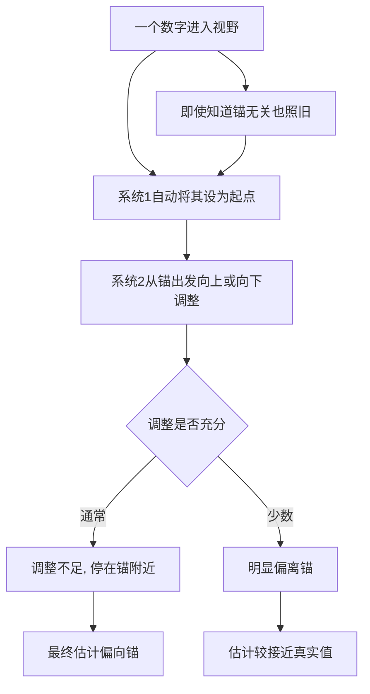

# 09｜为什么一个随机的数字也能影响你？

> 一个明显无关的数字，为什么会影响我们的判断和出价？

---

## 一、先说结论

卡尼曼与特沃斯基发现：**只要一个数字进入了你的视野，它就会像“锚”一样，拉动你随后的估计——哪怕你完全知道这个数字毫无意义。**

这就是**锚定效应**。它不是发生在你被数字说服的时候，而是发生在你根本没打算理它的时候。谈判、定价、量刑、估值，处处有它的影子，而且极难被彻底消除。

---

## 二、我们先理解一个问题

设想你在商场看到一件外套。

吊牌上写着原价两千元，旁边贴着一行红字：限时价九百九十九。

你会不会觉得“挺划算”？大概率会。可如果换一种呈现：这件外套从来没标过两千，直接就是九百九十九，你还会觉得它便宜吗？多半不会——你会开始盘算它到底值不值这个数。

问题来了：那个两千元，是商家自己写的。它不代表成本，不代表市场行情，甚至可能从来没人在两千元买过。可它一旦出现在你眼前，就变成了你判断“贵不贵”的起点。

**一个并非由你选择的数字，替你设定了判断的基准线。** 这就是本篇的核心。

---

## 三、作者到底提出了什么观点？

卡尼曼认为，人对数量的估计，很少从零开始，而是**从某个已经出现的数值出发，再往上或往下调整**。这个过程就是锚定与调整。

关键在于两点：

1. **锚可以来自完全无关的来源。** 它不需要有信息量，甚至不需要你认为它相关。
2. **调整总是不充分的。** 我们通常从锚出发移动一段，就停下来，最终结果仍然偏向锚的一方。

作者用一系列实验说明：即使被试明确知道锚是随机产生的，估计值依然会被它拉动。由此他得出一个相当强的结论——**锚定效应不是粗心，而是估计过程本身的结构。**

---

## 四、把这个观点翻译成人话

人的估计像什么？

不像一把从零开始量的尺子，倒像**从某个起点出发的一次短途移动**。

系统 1 拿到一个数字，就顺手把它当成出发点；系统 2 负责从那里往“正确答案”的方向挪，但它很懒，挪几步就停了。于是最终停在哪里，很大程度上取决于从哪里出发。

所以你看到的那个两千元，并不需要说服你，它只需要**先出现**。它是起跑线，而起跑线一旦被定在远处，你跑得再认真，落点也会偏。

**锚定的可怕之处在于：你越觉得自己在独立思考，越可能只是从锚出发挪了一小步。**

---

## 五、为什么会这样？

从估计过程看，锚的路径大致是这样的：

注意 **A 到 I 的那条回路**：知道“这个数字是随机的”“这个标价是虚的”，并不能自动关闭锚定。信息层面的知情，管不住估计过程本身的起点。

---

## 六、举一个现实生活中的例子

商场里的“先标高、再打折”，是锚定效应最日常、也最赚钱的一次应用。

一件衣服的真实价值可能就在八九百元附近。但如果它先被标成两千，再降到九百九十九，你的判断就变了：你不是在问“它值不值九百九十九”，而是在问“它从两千降下来，我占了多大便宜”。

这里发生了两件事：

**第一，锚替换了参照系。** 你的比较对象从“同类商品的市场价”，变成了“这件衣服的吊牌价”。前者需要你去查、去比；后者就挂在你眼前，免费、醒目、即时。

**第二，折扣制造了一个“你赢了”的感觉。** 从两千到九百九十九，落差本身就是奖赏。你可能根本没需要这件衣服，但“省了一千”的感觉让你觉得买下它是理性的。

这也解释了为什么很多商家宁可标一个虚高的原价，也不愿意直接定低价：低价只告诉你“它便宜”，虚高原价则告诉你“你赚了”。而人，往往对后者更没抵抗力。

---

## 七、回到书中重新理解

卡尼曼在书里讲过一个著名的实验：先让被试看一个转盘，转盘停在某个数字上，然后请他们估计“非洲国家在联合国中所占的比例”。

关键设计在于：那个转盘的数字是**被做过手脚的**，而且被试清楚地知道它是随机转出来的、与题目毫无关系。可结果依然惊人——转到较小数字的人，给出的估计明显偏低；转到较大数字的人，估计明显偏高。

一个明知随机、明知无关的数字，就这样改变了人们对一个真实比例的估计。

卡尼曼还提到过另一类证据：在房地产场景里，即使是经验丰富的从业者，其估值也会受到挂价的影响。一个本应被专业训练纠正的偏差，依然顽固存在。

他由此指出，锚定是“启发式与偏差”里最难对付的一类，因为它不依赖你的无知，也不依赖你的粗心——它依赖的是估计这件事本身的工作方式。

---

## 八、这个观点背后还有什么？

有几个隐含点值得拎出来。

**第一，锚不限于数字。** 一个先被提出的方案、一个开场的报价、一个先入为主的说法，都是锚。谈判里“先出价”之所以有优势，正源于此。

**第二，锚的作用不对称。** 它既能把你拉高，也能把你拉低；而在损失与收益的语境里，同一个锚可能引发完全不同的反应。

**第三，它与“参照点”是一对概念。** 锚定义了你从哪里出发，参照点定义了你如何感受得失——后者是理解前景理论的关键。

**第四，它解释了默认选项的威力。** 一个预先勾选的框、一个系统推荐的数值，本质上都是锚：大多数人不会去改，不是因为认同，而是因为起点已经被设好了。

---

## 九、这个观点有问题吗？

有问题，但主要不在“效应是否存在”，而在“它为什么存在”。

**第一，锚定效应本身相当稳健。** 它被反复复制，出现在价格、量刑、薪资、估值等多个领域，是认知偏差里证据最扎实的一类。这一点学界基本没有异议。

**第二，争议集中在机制上。** 一种解释是“锚定与调整”：从锚出发调整但总不到位；另一种解释是“选择通达性”：锚让与它一致的信息更容易被想起，从而改变了判断。两种解释各有实验支持，至今仍在竞争。

**第三，也有研究者提醒可能存在实验设计上的夸大。** 一些批评者认为，部分锚定实验的设置，可能无意中暗示了被试“应该往锚的方向靠”，真实世界中的效应强度未必有实验室里那么大。不过这类质疑并没有否定效应存在，只是调整了对它大小的估计。

**第四，但它确实难以被完全消除。** 卡尼曼本人也承认，知道锚定原理，并不等于能在现场摆脱它。能做的，往往只是事先设好规则、或主动从另一个起点重新估一遍。

**所以更准确的说法是**：锚定是少数几乎没有“存废之争”、只有“机制之争”的偏差。你可以怀疑它有多大，但很难否认它存在。

---

## 十、今天再看这个观点

以下部分是基于卡尼曼思想的现代延伸，不是卡尼曼的原话。

在电商、金融与谈判的界面里，锚定几乎被系统化了。

“划线价”与“到手价”的并置，是把锚直接画在屏幕上；“建议零售价”“参考区间”“同类均价”，都是精心选择的起点；分期方案把一个大数字拆成几个小数字，是在用月供当锚，削弱你对总额的痛感。谈判里先开口的一方，往往不是在给价，而是在放锚。

一个更现代的观察是：**算法也懂锚定，因为它服务的正是被人性偏好的界面。** 平台知道你更容易被“从高往下”的落差打动，于是把落差摆在你眼前。这不是阴谋，而是对系统 1 的精准适配。

对个人来说，比较实在的做法有两个：一是**在看到任何价格或数字之前，先自己形成一个独立估计**；二是**主动用一个相反的锚重估一遍**，看看结论会不会变。锚无法被删除，但你至少可以不让它独占起点。

---

## 十一、这一篇真正应该记住什么？

1. **锚定效应**：无关数字也会拉动后续估计。
2. **调整不充分**：我们从锚出发，却总停在锚附近。
3. **知情不管用**：明知锚随机、明知标价虚高，仍会受影响。
4. **它无处不在**：谈判、定价、量刑、估值、默认选项。
5. **对抗方式**：先形成独立估计，或用相反的锚重估一遍。

---

## 十二、留一个问题

> 你最近一次觉得“划算”“合理”“可以接受”，
> 这个感觉是相对什么产生的？
> 那个“什么”，是有人特意放在你眼前的吗？

---

**下一篇**：锚定告诉我们，一个数字出现的方式，就能改变我们的判断。但还有一层更硬的疑问：当统计数字把真相明明白白摆出来时，我们为什么仍然更相信一个生动的印象？

下一篇我们就来拆开这个问题——**为什么统计数字说服不了我们？**
