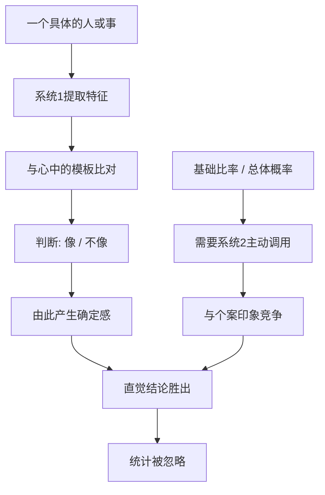

# 10｜为什么统计数字说服不了我们？

> 为什么明确的概率信息，常常敌不过一个生动的印象？

---

## 一、先说结论

卡尼曼认为，人在判断一个具体情况时，会系统性地忽略"基础比率"——也就是这类事情在总体上发生的概率。

他把这种现象叫作**基础比率忽视**。面对一个具体的人、一件具体的事，我们不会先问"这类情况本来有多常见"，而是直接看"眼前这个描述像不像那么回事"。于是，一个鲜活的个案印象，能轻易压过一个正确的统计比例。

一句话：统计告诉你世界长什么样，个例告诉你故事长什么样，而大脑偏爱故事。

---

## 二、我们先理解一个问题

先看两条信息。

第一条：某种病在人群中的总体发病率非常低，一万个人里只有极少数人会得。

第二条：你的一位朋友刚刚向你描述了他最近身体的各种不适，细节很多，听起来很像那种病。

现在问你自己：你更愿意相信哪一条？

几乎所有人都会不自觉地被第二条抓住。那些生动的细节会自动占据你的注意力，而第一条"总体概率很低"显得抽象、遥远、没什么存在感。

问题就在这里：如果发病率极低，那么即便症状描述得再像，这个人真正得病的概率也可能依然不高。可我们的大脑几乎不会去做这个乘法。

为什么明确的概率，敌不过一个生动的印象？这就是本篇要回答的核心问题。

---

## 三、作者到底提出了什么观点？

卡尼曼与阿莫斯·特沃斯基在研究判断时，提出了一组相互印证的观点。

第一，人会用"代表性"替代"概率"。判断某个人属于哪一类，我们不自觉地看这个人"像不像"那一类，而不是计算"他属于那一类的概率有多大"。当描述足够典型时，基础比率几乎被完全丢到一边。

第二，基础比率会被系统性忽略。他们用"律师与工程师"这一类问题做过研究：给被试看一段对某个人的性格描述，让他们判断这个人是律师还是工程师，同时告知样本中两类人的比例。结果显示，当描述很有代表性时，无论比例怎么变，被试的判断几乎不受影响；只有当他们拿不到任何个性描述时，才会老老实实使用那个比例。

第三，信息缺失是感觉不到的。这正是"眼见即全部"的延伸：当手里有一个连贯的印象时，我们不会觉得"我还缺一个基础比率"，因为我们根本想不起来自己缺了什么。

所以卡尼曼的核心判断是：人不是不会算概率，而是在有具体个案时，压根不会想到要去算。

---

## 四、把这个观点翻译成人话

想象你是一个医生，面前坐着一位病人。

他描述的每一个症状，都精准地指向某种罕见病。你的脑海里立刻浮现出教科书上那一页插图，越想越像，你甚至已经能想象出确诊报告的样子。

这时候，"这种病在门诊里一千个人碰不到一个"这句话，虽然你也知道、也学过，却基本不会进入你的思考。

不是因为你不专业，而是因为具体细节的力量太强了。细节越丰富、越连贯、越符合你心中的模板，你就越容易确信，而统计知识在这个过程中被挤到了背景里。

反过来，如果你只被告知"这位病人有点不舒服"，没有任何细节，你就只能依靠那个基础比率来判断——这时统计又变得有用了。

这揭示了一个非常反直觉的规律：个案信息越多，统计越失效；个案信息越少，统计越有用。而现实中我们面对的，几乎永远是信息很多的个案。

---

## 五、为什么会这样？

因为系统 1 处理的是"像不像"，而不是"有多少"。

关键在于右下方那一路：基础比率不会自己跳出来，它必须由系统 2 主动去取、主动去算。而系统 2 很懒，它默认采纳系统 1 已经给出的那个"像不像"的结论。

于是，一个结构性的不平等就出现了：直觉结论是免费的，统计推理是要付费的。免费的东西总是先到。

---

## 六、举一个现实生活中的例子

面试。

一位候选人坐在你对面，简历平平，前二十分钟的表现也只能算中规中矩。突然，他说了一个细节：某个项目最难的时刻，是他一个人熬夜把问题扛下来的，还顺带讲了一个具体到让人信服的场景。

你心里那盏灯亮了。

接下来的时间里，他的每一次回答你都会自动往好的方向解释；他的犹豫被你读成"谨慎"，他的简洁被你读成"沉稳"。面试结束，你在评价表上写下"强烈推荐"。

现在换一个问法：在所有面试者里，这种"有一段亮眼细节"的人，最终真正胜任岗位的比例有多高？你会发现，你从头到尾都没想过这个问题。你被那个细节抓走了，忘了去调取一个更基础的事实——面试中动人的故事，和实际工作表现之间的关联，往往远比我们以为的弱。

更麻烦的是，这种"被一个细节说服"并不只发生在面试。它同样支配着投资、招聘、相亲、选医生，乃至一次新闻事件之后的公众判断——因为具体的印象永远比抽象的比例更有画面感。

---

## 七、回到书中重新理解

现在再回看卡尼曼为什么反复强调基础比率，就顺了。

他并不是说统计数字是万能的，也不是说直觉总是错的。他要指出的是一个非常具体的机制：当个案足够生动时，人会跳过"这类事情通常怎样"这一步，而这一步恰恰是理性判断的关键。

这也解释了为什么"给数据"往往没有用。你摆出一张漂亮的统计表，对方却在心里想着刚才那个故事——你说的比例是真的，他想的画面也是真的，但只有画面能驱动他的判断。

所以真正有效的说服，从来不是重复数字，而是把数字变成一个具体、可感、能想象的画面。"这种病很罕见"没有力量，"假设诊室里坐满一千个人，这一千个人里只有一个会得这种病"就有力量。同一个概率，变成频率和画面之后，人才会真正接收它。

---

## 八、这个观点背后还有什么？

第一，它对应的是贝叶斯推理的一个前提。理性地更新信念，应当同时考虑"新证据"和"原有的基础比率"。忽略后者，就是只看证据、不看背景。

第二，它和"外部视角"是一体两面。卡尼曼后来多次提倡在做预测时从"外部视角"入手：先问这一类事情通常的结果是什么，再考虑眼前这个个案的特殊之处。这正是对基础比率忽视的直接矫正。

第三，它解释了"分母看不见"。我们容易关注分子，也就是那个引人注目的个案，却忘记分母，也就是总共有多少同类情况。看得见的故事与看不见的分母，构成了所有概率误判的底层结构。

第四，它不是知识的缺陷，而是注意力的缺陷。大多数人并非不知道那个概率，而是那个概率根本没被想起来。

---

## 九、这个观点有问题吗？

有问题，而且争论相当有意义。

第一，一些心理学家认为，"基础比率忽视"并没有那么普遍。他们指出，当基础比率以自然频率的形式呈现，比如"一千个人里有一个"，而不是"千分之一"，或者当基础比率看起来与因果有关时，人们其实会相当合理地使用它。也就是说，这更可能是"呈现方式"的问题，而不完全是"人不会推理"。

第二，任务的措辞会显著改变结果。同一道题，换一种问法，忽略基础比率的程度就可能大幅变化。这提示我们，不能把一个实验里的结论，当成关于人类理性的普遍定律。

第三，现实中的专业人士可能比实验里表现得好。医生、法官、审计师在长期训练后，确实会养成主动查基础比率的习惯，至少在那些反馈明确、后果清晰的场合。

第四，但它揭示的倾向仍然真实存在。即便存在上述修正，"生动的个案压过抽象的比例"这一现象，在日常判断中依然随处可见。

所以更准确的说法是：人未必天生不会用基础比率，但在生动个案面前，我们确实需要额外的努力，才想得起来去用它。

---

## 十、今天再看这个观点

以下部分是基础比率忽视在现代传播与健康沟通中的延伸，不是卡尼曼的原话。

在风险沟通领域，一个已经相当成熟的实践是：尽量用频率而不是概率，用人数而不是百分比。"每一千名服用者中约有三人会出现这种不良反应"，比"不良反应发生率约为百分之零点三"更能让人准确理解，也更少引起恐慌或轻视。

在新闻和社交媒体上，这个机制则常常被反向利用。一条耸动的个案，配上几张具体的图片，就足以覆盖掉背后那个"其实极少发生"的统计事实。而算法又恰好偏爱那些能激起强烈情绪的个案，因为个案能带来点击，比例不能。

这给普通人留下了一个很实用的自查动作：当你被一个故事深深打动、几乎要立刻下结论时，强迫自己问一句，这类情况总体上有多常见？这一问不会让你变得冷漠，只会让你在被打动的同时，还保留一个分母。

---

## 十一、这一篇真正应该记住什么？

1. 基础比率忽视：面对具体个案时，我们会忽略总体概率，转而依赖个案的"像不像"。
2. 个案越生动，统计越失效：细节丰富的感觉会压过抽象的比例。
3. 忽略往往不是无知，而是遗忘：那个概率不是不知道，而是没被想起来。
4. 要说服人，就把比例变成画面：频率和具体人数，比百分比更有力量。
5. 自查动作是"问分母"：被打动的时候，问一句"这类事通常多常见"。

---

## 十二、留一个问题

> 你最近一次被一个故事、一段描述打动，从而改变了看法，
> 是因为它真的更接近事实，
> 还是只因为它更具体、更生动、更容易想象？

---

**下一篇**：如果一个人总能忽略统计、凭一个印象就下结论，那随之而来的，往往是另一个更顽固的问题——他不只判断得草率，而且还非常确信自己不会错。

下一篇我们就来拆开这个问题——**为什么我们总觉得自己不会错？**
