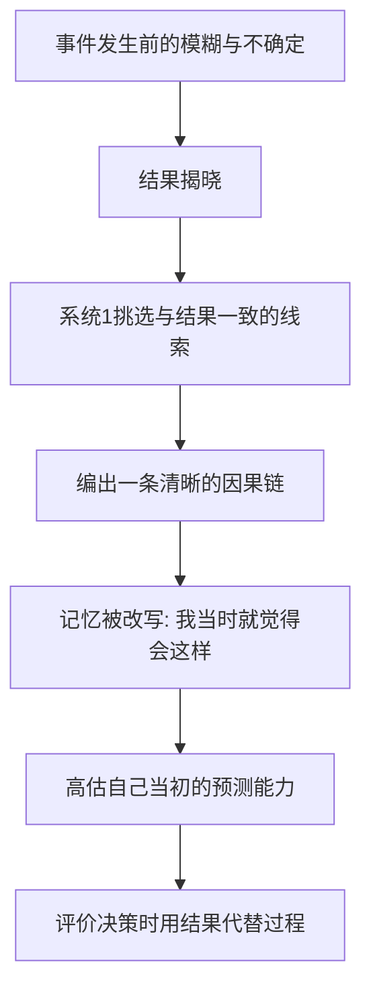

# 12｜为什么“事后诸葛亮”总是很多？

> 事情发生之后，为什么大家都觉得自己"早就料到"？

---

## 一、先说结论

卡尼曼认为，一旦知道了结果，大脑会自动重写记忆和因果，让这个结果显得"理所当然"。他称之为**后见之明偏差**，通俗说法就是"我早就知道"效应。

它带来的后果很实际：我们无法公正地评价当初的决策质量，因为结果一旦揭晓，过程就会被重新讲述一遍。于是，"我早说过"成了一种廉价的错觉。

---

## 二、我们先理解一个问题

设想一件你完全没关注过的事，比如某家公司突发的意外危机。

危机爆发前，如果你被问到，你会觉得"根本无法预料"。可危机爆发后，新闻开始梳理：管理层早有分歧、财报早现端倪、市场早有异动。

看着这些事后整理出来的线索，你会产生一种强烈的感觉——这不挺明显的吗？当时怎么会看不出来？

问题就在这里：那些"线索"，在事前是和无数条噪音混在一起的；只有在结果揭晓之后，它们才被单独挑出来，串成一条清晰的因果链。

为什么知道了结果之后，过去就变得如此"显而易见"？

---

## 三、作者到底提出了什么观点？

卡尼曼把后见之明偏差和"结果偏误"放在一起讲。

后见之明偏差说的是：知道结果后，我们会高估自己"当初就能猜到"的程度，甚至真的相信自己当时就是这么想的。

结果偏误说的是：我们习惯用结果的好坏，去判断一个决策的好坏。可决策质量本应在结果出现前就已经确定，我们偏偏等到结果出来才给它打分。

卡尼曼还指出，这两种偏差让"评价专家"变得极其困难。因为人们总能事后把结果解释成"必然"，专家的预测究竟准不准，反而很难被公正地追踪。今天人们赞他神机妙算，明天同样的判断落空，却没人再提。

他的核心判断是：记忆是重构的，不是录像。每次你回想过去，其实都是在用现在知道的东西，重新改写当时的你。

---

## 四、把这个观点翻译成人话

想象一场比赛的最后十秒。

球员选择了强行出手，球没进，球队输了。赛后评论一片："这球就该传，太独了。"

如果那球进了呢？同样的一投，会被说成"大心脏""关键先生"，勇气被反复表扬。

同一个动作，同一套判断，只因为结果不同，就被讲成了完全相反的故事。而我们不仅这样评价别人，也会用同样的方式评价过去的自己：我们记得的，往往不是当时怎么想的，而是现在希望自己当时怎么想的。

---

## 五、为什么会这样？

因为大脑会拿"结果"当线索，去倒推"过程"。

核心在从 D 到 E 的那一步：不是我们真的记住了旧想法，而是我们重新生成了一份"看起来像旧想法"的版本。

系统 1 天生受不了杂乱和随机，它需要一个说得通的版本。结果一旦给出，就相当于给了一根线头，它顺势把散落的事件串起来。串好之后，这条线会被当作"我当时的想法"存进记忆，而原本那些犹豫、怀疑和完全相反的可能，就悄悄消失了。

---

## 六、举一个现实生活中的例子

股灾之后，你几乎一定能听到这样的声音：泡沫太大了、估值太离谱了、某条政策早就释放信号了、某某人早就警告过了。

这些说法里，有一些确实是事前就说过的；但同样说实话的，还有无数条事后被证明完全错误、如今却无人再提的警告。事前是一片众声喧哗，事后被剪成了一句准确的预言。

更关键的是，那些"早有征兆"的征兆，事前大多无法与噪音区分。价格涨的时候，有人说太高，也有人说还会更高；两种声音一直同时存在，只是事后只有对的那一拨被留下来，成为"聪明人早就看出来了"的证据。

这就是后见之明最麻烦的地方：它不制造事实，它重新分配功劳。事前人人都有观点，事后只有应验的那个观点还活着。

---

## 七、回到书中重新理解

卡尼曼为什么如此在意这个偏差？因为他关心的不是"人爱吹牛"，而是一个更严肃的问题：我们该如何学习和评价。

如果每一次结果出来后，我们都能轻易地觉得"这本来就在预料之中"，那么我们就无法从中学到任何东西。成功的决策会被说成本该如此，失败的决策会被说成愚蠢透顶，而运气的作用被彻底抹掉。

他反复提醒：评价一个决策，要看决策当时可得的信息，而不是事后知道的结果。一个在赌局里做了正确概率判断却输了钱的人，和一个乱赌却赢了钱的人，前者的决策质量更高——虽然结果恰好相反。

这也正是它和上一篇的接续之处：过度自信让人相信自己的判断，后见之明则负责把已经发生的结局，补写成"我早就判断对了"。

---

## 八、这个观点背后还有什么？

第一，它是"记忆自我"的直接体现。记忆不是档案柜，而是一份不断被重写的叙述，每次调用都可能带上新的修改。

第二，它和叙事谬误是一对孪生。后见之明让过去变得连贯，叙事谬误让世界变得连贯，两者都服务于同一个需求——我们受不了随机和无序。

第三，它解释了为什么"复盘"常常流于形式。如果复盘只是把已经知道的结果再讲一遍，那不叫学习，叫确认。

第四，它是所有"事后专家"的生存基础，也是我们需要警惕舆论的原因之一。

---

## 九、这个观点有问题吗？

有问题，需要更精细地看。

第一，后见之明偏差本身有相当稳固的证据，但它的强弱会随情境变化。有研究者发现，如果人在事前明确写下过自己的判断，事后偏差会明显减弱——因为白纸黑字挡住了一部分记忆改写。

第二，一些有经验、又有长期记录的预报者，比如长期被评分的气象工作者，受影响较小。这说明在反馈清晰、必须留痕的领域，这个偏差是可以被约束的。

第三，事后解释并非全无价值。有些事后分析确实能揭示结构性的问题，让人下次真的做得更好。问题不在于"事后思考"，而在于用结果去改写"我当时怎么想的"。

第四，所以更准确的说法是：后见之明是一种默认倾向，而不是无法摆脱的命运；对抗它的办法，是事先留下证据。

---

## 十、今天再看这个观点

以下部分是后见之明偏差在组织复盘与网络舆论中的延伸，不是卡尼曼的原话。

在组织里，一种被广泛推荐的实践是"决策日志"：在做重要决定时，写下当时的依据、你预期的结果、以及你对不确定性的判断，然后封存。等结果出来，再拿出来对照。它不能消除偏差，但能让人看见自己当初到底是怎么想的。

在网络舆论中，这个偏差则是被放大的。事件发生后，发言记录可以被随时翻出、截图、重新解释，而"我当时说对了吗"这个问题，往往被情绪和立场盖过。于是人们更容易记住那些应验的预测，忘掉自己错得更多的时候。

一个朴素的建议是：凡是重要的判断，尽量在事前写下来。这既是对抗后见之明的工具，也是对未来的自己最诚实的一份交代。

---

## 十一、这一篇真正应该记住什么？

1. 后见之明偏差：知道结果后，我们会高估自己"当初就能猜到"的程度。
2. 记忆是重构的：我们不是记住旧想法，而是重新生成一个版本。
3. 结果偏误：我们用结果的好坏，代替决策质量的好坏。
4. 对抗方法是事前留痕：写下预测、依据和不确定性。
5. 事后解释可以有价值，但用它改写"我当时怎么想"，就是错觉。

---

## 十二、留一个问题

> 你说过的那些"我早就知道"，
> 有多少是真的在当时就说出口的，
> 又有多少，是在结果出来之后，才被你补写进记忆里的？

---

**下一篇**：事后我们能轻松讲出一套完整解释，事前我们却总在迷雾里。这种"用故事填补空白"的本事，并不只在复盘时出现——它几乎支配着我们理解世界的全部方式，也让我们一次次高估成功、忽略概率。

下一篇我们就来拆开这个问题——**为什么我们爱听故事，却忽略概率？**
