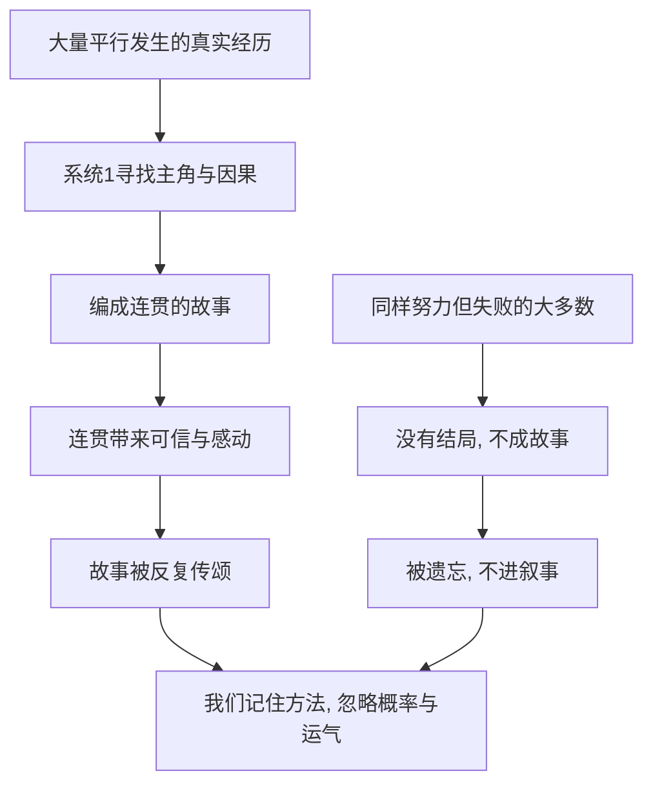

# 13｜为什么我们爱听故事，却忽略概率？

> 为什么一个精彩的故事，能压倒一堆统计证据？

---

## 一、先说结论

卡尼曼认为，人是用故事来理解世界的，而故事天生追求连贯、省略随机。他把这种倾向与"叙事谬误"联系在一起：我们记住那些白手起家的传奇，却看不见同样努力却默默失败的大多数。

故事越动人，我们越容易忽略它背后的概率结构。听故事时我们学到的是"他做对了什么"，而很少追问"做对同样事情的人一共有多少，成功的又有几个"。

---

## 二、我们先理解一个问题

比较两句话。

第一句：有一家公司，从几个人、一间小办公室起步，最后做到了行业前列。

第二句：大多数创业公司活不过五年。

第一句让你心里一动，甚至有点热血；第二句让你觉得无聊，听完就忘。

为什么？因为第一句有主角、有转折、有希望；第二句没有人物、没有情节，只有冷冰冰的比例。人对故事有反应，对概率没有反应。

可吊诡的是，最该影响我们判断的，往往是第二句。为什么一个精彩的剧本，能压倒一堆统计证据？

---

## 三、作者到底提出了什么观点？

卡尼曼在书中引用了纳西姆·塔勒布提出的"叙事谬误"这个说法，并把它和自己的框架接上。

他的核心判断有几层。

第一，系统 1 天生是讲故事的高手。它会把零散的事件自动拼成一个有因果、有动机、有主角的连贯叙事，因为连贯让人感觉世界可以理解。

第二，故事要求因果，而现实常常只是随机。为了讲得通，故事会自动省略运气、时机，以及那些说不清道不明的偶然。

第三，我们对过去的理解，总是被后来的故事重塑。一件当时毫无头绪的事，一旦被编进一个结局明确的故事，回头看就变得顺理成章。

所以卡尼曼反复强调：理解世界需要故事，但判断概率需要反故事。

---

## 四、把这个观点翻译成人话

你听一位成功企业家讲他的创业史：辞职、借钱、被拒绝了很多次、某个关键人物出手相救、一个大胆的决定改变了命运。

每一个环节听起来都充满必然，因为他就是从那个结局往回讲的。

可如果换一个人，同样的辞职、同样的坚持、同样的关键人物，最后公司还是倒了——这段经历没有资格被讲成一个故事，因为它没有"成功"这个结尾。

于是，我们听到的永远是被筛选过的剧本。不是成功者的方法特别有魔力，而是失败者根本没有机会站上讲台。

---

## 五、为什么会这样？

因为故事有主角，概率没有。

关键在右侧那一路：沉默的大多数不是不存在，而是它们构不成一个"故事"，所以在我们的认知里，约等于不存在。

系统 1 的资源是有限的，它会把注意力给那些有情节、有情绪、有起伏的东西。一个统计数据没有情节，一个成功故事有整条情节线，胜负从一开始就分好了。

---

## 六、举一个现实生活中的例子

书店的畅销区、访谈节目、朋友圈的转发，到处是这样的故事：白手起家、几度绝境、凭着信念和眼光做出了一家了不起的公司。

这些故事几乎都是真的，问题在于它们不是全部。

在同一个年代，有成千上万个同样聪明、同样努力、甚至做了类似选择的人，他们失败了。他们的经历同样真实，只是没有结尾，也没有读者。

而我们听故事时学到的，往往是"他做对了哪几件事"，却很少问：做了同样几件事的人，一共有多少？其中成功的又有几个？

一旦问出这个问题，很多"成功的秘诀"就会露出真面目——它们可能只是幸存者在事后总结出来的运气。这也是"幸存者偏差"最日常的样子。

---

## 七、回到书中重新理解

把叙事谬误放回整本书，你会发现它和前面几篇紧紧咬合。

它依赖"眼见即全部"：一个完整的故事会让我们觉得手头的信息已经够了，不会想起去查分母。

它和后见之明是一对：故事需要一个结尾，而后见之明正好负责把结尾变得理所当然。

它又喂养过度自信：听多了成功故事，我们自然相信自己也掌握了一套可以复制的规律。

卡尼曼由此提醒我们：故事的可信度，来自它的连贯性，而不是它的代表性。一个讲得通的故事，未必是一个有统计依据的判断。

---

## 八、这个观点背后还有什么？

第一，它对应"幸存者偏差"：我们只看到活下来的样本，从而高估成功的条件与概率。

第二，它对应"回归均值"：很多被故事解释成"能力"的起伏，其实只是从极端值回到平均。故事不喜欢"运气"这个词，它更喜欢"英雄"。

第三，媒体天然偏爱故事。一个具体的失败者比一张统计表格更有传播力，于是公共讨论被个案主导，概率被挤到角落。

第四，故事也有真实的功能：它传递经验、塑造动机、维系共同体的价值。问题不在故事本身，而在把故事当证据。

---

## 九、这个观点有问题吗？

有问题，而且不该被简单否定。

第一，一些心理学家认为，叙事是人类理解复杂社会的基本方式，不是一种可以随意丢弃的缺陷。人本就活在一个由故事组织起来的意义世界里。

第二，分析性的思维与叙事性的思维，未必是互相替代的。有学者主张，二者是不同的认知模式，人可以在"讲得通"和"算得准"之间来回切换，关键在于意识到自己正在用哪一种。

第三，故事确实能传递难以量化的知识，比如判断力、文化规范、价值取舍。把一切还原成概率，也会丢掉很多重要的东西。

第四，所以更准确的表述是：故事不是问题，把故事当成统计证据才是问题。我们需要做的，不是在两者之间选一个，而是知道此刻需要哪一个。

---

## 十、今天再看这个观点

以下部分是叙事谬误在当代内容生态中的延伸，不是卡尼曼的原话。

短视频和算法推荐，是天然的故事放大器。一个"穷小子逆袭"的片段，能在几秒钟内激起情绪、被反复推送；而一篇说明"这类逆袭的概率极低"的文章，几乎不会有人转发。平台偏爱故事，因为故事能留住人。

在投资领域，这一点尤其明显：一家公司的"故事"好不好听，常常比它的财务数据更能影响股价。故事让人相信未来，而数字只会让人面对当下。

一个朴素的应对是：每当一个故事让你热血上头，就去问一句，没被讲出来的那些是什么样子。不是要你放弃被故事打动，而是别让一个精彩的剧本，替你完成本该由概率做的判断。

---

## 十一、这一篇真正应该记住什么？

1. 叙事谬误：人用故事理解世界，故事追求连贯、省略随机，于是我们记住传奇、忽略概率。
2. 故事的可信来自连贯，不来自代表性。
3. 幸存者偏差：我们只看到活下来的样本，因而高估成功的概率。
4. 故事不是缺陷，把故事当证据才是问题。
5. 自查动作：被故事打动时，去问"没被讲出来的那些是什么"。

---

## 十二、留一个问题

> 你心里最相信的那几个"成功经验"，
> 是从多少人身上总结出来的？
> 而那些照着同样做法却没有成功的人，
> 你见过吗？

---

**下一篇**：故事让我们相信成功可以复制，可当我们真的去规划自己的项目、预测自己的未来时，一种更直接的偏差会接管判断——我们对时间、成本和风险的系统性低估。专业人士也不例外。

下一篇我们就来拆开这个问题——**为什么专家预测经常失败，却依然自信？**
