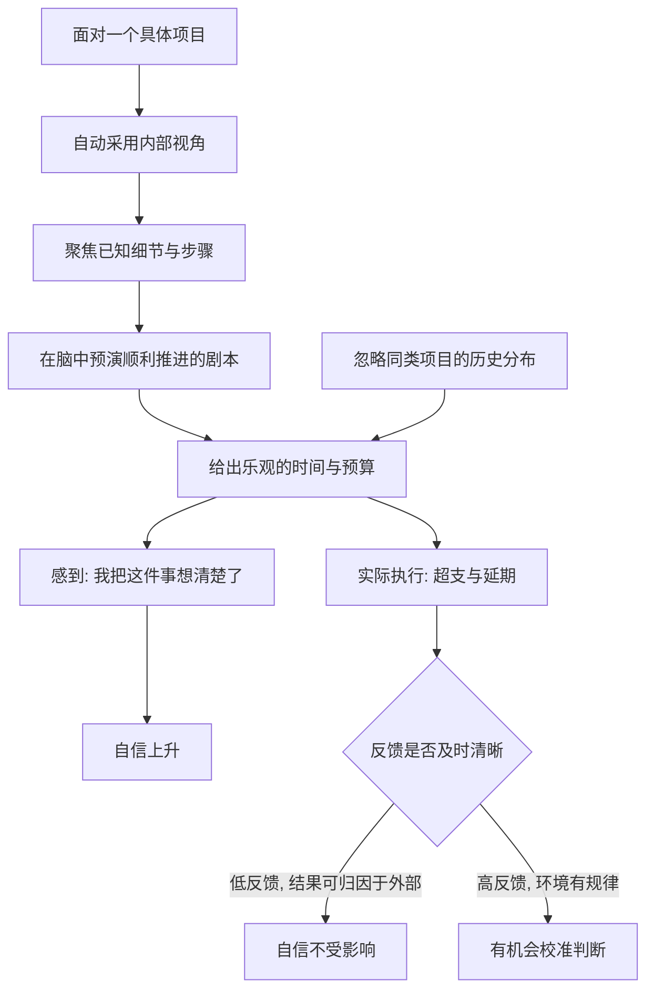

# 14｜为什么专家预测经常失败，却依然自信？

> 专家的预测为什么不可靠，他们自己却毫不动摇？

---

## 一、先说结论

卡尼曼认为，专家预测经常失败却依然自信，背后是两个彼此叠加的机制：一个是"规划谬误"，一个是"自信并不由准确度校准"。

规划谬误说的是：我们在估计一件具体的事时，习惯从它的内部细节出发，想象它顺利推进的样子，于是系统性地低估时间、成本和风险。而自信的问题更微妙——一个人感觉"我把这件事想得很清楚"，于是就觉得"我对这件事的判断很准"。这两件事看起来挨得很近，其实毫无关系。想得清楚，只是故事讲得顺；判断得准，要靠长期、及时的反馈来检验。

关键在于：在复杂又缺乏反馈的领域里，专家的自信几乎没有机会被修正。所以他们会一直自信下去。

---

## 二、我们先理解一个问题

先想一件你自己正在拖延的事，或者一件计划了很久却没开工的事。

比如装修。你在纸上列了一个预算：主材多少、人工多少、家具多少，加起来大概三十万，工期三个月。你算得很认真，每一项都有依据，甚至连瓷砖的品牌都查好了。

现在换一种问法：不要看你这套房子，去看你身边所有装修过的人——十个朋友里，最后有几家的花费和工期真的落在了最初计划之内？

你大概会沉默一下：几乎没有。多数人是超支三成、延期两个月。

问题就在这里：同样是判断，为什么"从我这套房子出发"得出的估计，和"从所有人装修的经验出发"得出的估计，会差这么远？哪一个更可信？

---

## 三、作者到底提出了什么观点？

卡尼曼用两个概念回答这个问题。

第一是**内部视角与外部视角**。

- 内部视角：把眼前这件事当成独一无二的个案，专注它的具体细节、步骤、条件，想象它如何一步步推进；
- 外部视角：把它看成"一类事"中的一个样本，去查这一类事过去通常是什么结果。

卡尼曼认为，人天然偏爱内部视角。因为它具体、生动、能讲出细节，而外部视角要求你把这件事"降格"成统计里的一行——那感觉很冷，也很不像"了解情况"。

第二是**规划谬误**。

它的内容是：人在做计划时，会系统性低估所需的时间、成本和风险，同时高估收益和成功的概率。一个重要的细节是：它并不只发生在懒人身上，越投入、越相信自己在做一件重要事情的人，反而越容易落入其中。

至于专家为什么依然自信，卡尼曼的观点是：**自信是一种主观感受，不是一种准确度的指标。** 当一个人能流畅地为自己的判断讲出一套完整的因果故事时，他的自信就会上升，而这份自信与他的历史命中率没什么关系。

---

## 四、把这个观点翻译成人话

把装修这件事拆开看，就清楚了。

你从内部视角算三十万，依据全是"我这套房子"：面积、户型、想要的风格、找的施工队。这个视角有一个天然的漏洞——它只包含了**你已知的条件**，而超支往往来自你此刻不知道的东西：隐蔽工程打开后发现管线要换、设计改到第三轮、材料在开工后涨价、工人过年返乡停工一个月。

这些事每一件都不确定，但它们并列在一起，几乎必然发生。内部视角看不见它们，因为它不是在看概率，它在讲一个顺利的故事。

外部视角的做法正相反。它不问"我的房子会怎样"，而是问："和我情况相近的人，过去一百次装修，花费和工期的分布是什么样？"这个答案不好看——平均超支三成——但它把那些"必然的意外"提前装进了估计里。

所以规划谬误的本质，不是算错了，而是**算的框架选错了**。

---

## 五、为什么会这样？

这张图里有两条线值得看。

一条是 **A → D**：一遇到具体项目，内部视角几乎是自动启动的，它不给你"要不要换成外部视角"的选项。预演顺利的剧本，是系统 1 的拿手好戏——故事越连贯，你越觉得真实。

另一条是 **J → K**：之所以失败不能动摇自信，是因为反馈太差。项目超支了，你可以说"这次是特殊情况""市场环境变了""合作方不给力"。在一个没有清晰规律、结果又迟到的领域里，一个人的判断永远得不到干净的对错判决。没有判决，自信就不需要修改。

---

## 六、举一个现实生活中的例子

大型工程项目是最典型的现场。

一座桥、一条地铁线、一个公共场馆，在立项时的预算和工期，往往和最终结果相差甚远。这不是个别国家的毛病，而是几乎普遍的现象。原因正是前面那套机制：决策者和工程师从内部视角出发，看的是图纸、方案、技术指标，他们能非常具体地描述这座桥怎么修；而"同类工程的平均工期是多少"这种外部数据，被当成不够专业的东西放在一边。

更有意思的是，超支超期一旦发生，通常不会导致决策者的自信受损。它会被解释成"百年一遇的困难""不可预见的条件"，然后下一轮预算，还是从内部视角算起。

装修也是一场缩小的工程。你找的设计师给你一张漂亮的方案，他不会主动告诉你"你认识的装修过的朋友里，八成超支了"；他只会告诉你，他上一次做的一个类似项目有多顺利。

---

## 七、回到书中重新理解

卡尼曼在书里讲过一段自己的经历，用来演示规划谬误。

他曾经和几位同事一起编写一本教材。团队里每个人都估了一下时间，大概需要两年左右。后来有人请来一位经验丰富、长期研究课程设计的专家，让他回答一个简单的问题：与他合作过的团队中，过去有多少最终完成了课程设计？大概用了多久？

那位专家的回答让所有人安静下来：多数团队最终会完成，但大约有相当一部分团队没能完成；即便完成的团队，耗时也远远超过两年。也就是说，卡尼曼团队当时信心满满的"两年"，用外部视角一看，根本站不住脚。

这段经历的意义不在于"教材写不出来"，而在于：**一群聪明人，在一套内部视角的故事里，几乎不可能自己意识到估计有多乐观。** 除非有人从外面把参照类端上桌。

---

## 八、这个观点背后还有什么？

第一，它给出了一味可操作的解药：**主动采用外部视角**。在估计之前，先问"这一类事通常怎样"，用历史分布做基准，再看本题的独特性该上调还是下调。这听起来简单，做起来反直觉，因为它要求你把"我很了解这件事"暂时放下。

第二，卡尼曼很推崇一种叫"事前验尸"的做法。在项目开始前，先假设它已经失败了，然后所有人写一份"它为什么会失败"的报告。这其实是强行把内部视角撬开一条缝，让那些被顺利故事挤掉的坏情形，有机会被说出来。

第三，它和过度自信、后见之明是同一群问题。规划谬误负责高估，后见之明负责事后把结果说得理所当然，两者合起来，让个人的判断永远处在一个"看起来永远正确"的循环里。

---

## 九、这个观点有问题吗？

需要指出，规划谬误是稳健的发现，但不是全部真相，学界也有不同声音。

一些研究者认为，乐观偏差并不纯粹是缺陷。它在人类历史上可能有适应性：一个对未来完全冷静、按平均概率行动的人，可能根本不会去尝试那些成功率很低的伟大项目。换句话说，适度的过度乐观，可能是行动的心理燃料。

另一些批评更技术化。有学者指出，在部分专业领域，专家的判断确实优于简单模型，糟糕的是某些特定领域（尤其是长期政治经济预测）；把"专家普遍不行"当成结论，是对研究结果的高估。此外，可重复性危机之后，心理学界对若干经典效应的强度也更为谨慎，关于这些偏差到底有多大、在什么边界内成立，讨论仍在继续。

还有一点值得注意：规划谬误通常只被观察到"平均而言"偏向乐观，但它并非对每个人都同等成立。有人低估，也有人高估——只是低估那一侧更常见。

所以更平衡的说法是：**外部视角是提高估计质量的有效工具，但不是包治百病的公式；专家的自信值得警惕，却也不必因此认为所有专业判断都没有价值。**

---

## 十、今天再看这个观点

以下部分是基于卡尼曼思想的现代延伸，不是他在书里的原话。

今天讨论这个问题，绕不开产品排期、创业融资和软件项目。一个团队说"这个功能两周能上线"，往往是从内部视角出发的：需求清楚、代码量不大、人手也够。但真正拖住项目的，通常是没被写进计划的联调、返工、需求变更和线上事故——它们全都在内部视角的盲区里。

有意思的是，现代的工程管理里已经长出了一套软性的"外部视角"：用历史速度估算下一个迭代，用数据而不是感觉来给不确定的方差留缓冲。某种意义上，这正是卡尼曼那套想法被嵌进了流程。

而对个人来说，更好的用法或许是反过来：**当有人（包括你自己）非常自信地向你描述一个美好计划时，先别评价故事好不好听，先问一句：这一类事，过去通常是什么结果？**

---

## 十一、这一篇真正应该记住什么？

1. **规划谬误：** 人系统性低估时间、成本与风险，高估成功概率，越投入越容易掉进去。
2. **内部视角 vs 外部视角：** 前者盯着眼前这个项目的细节，后者看同类事的历史分布；我们天然偏爱前者。
3. **自信不等于准确。** 自信来自故事流畅，而不是来自历史命中率。
4. **低反馈环境里，自信无法被校准。** 这是专家在复杂领域预测失败却依然自信的关键。
5. **可操作的解药：** 主动采用外部视角，用参照类做基准；必要时做一次"事前验尸"。

---

## 十二、留一个问题

> 如果一个人能在没有明确对错反馈的领域里，永远保持自信，
> 那么他的自信究竟是一种能力，
> 还是一种不需要被证伪就能一直活下去的错觉？

---

**下一篇**：讲到这里，有一个更底层的机制还没展开。为什么我们如此害怕损失、甚至害怕到宁愿放弃明显更好的选择？答案指向行为经济学里最著名的发现之一。

下一篇我们就来拆开这个问题——**为什么"损失"比"得到"更让你在意。**
