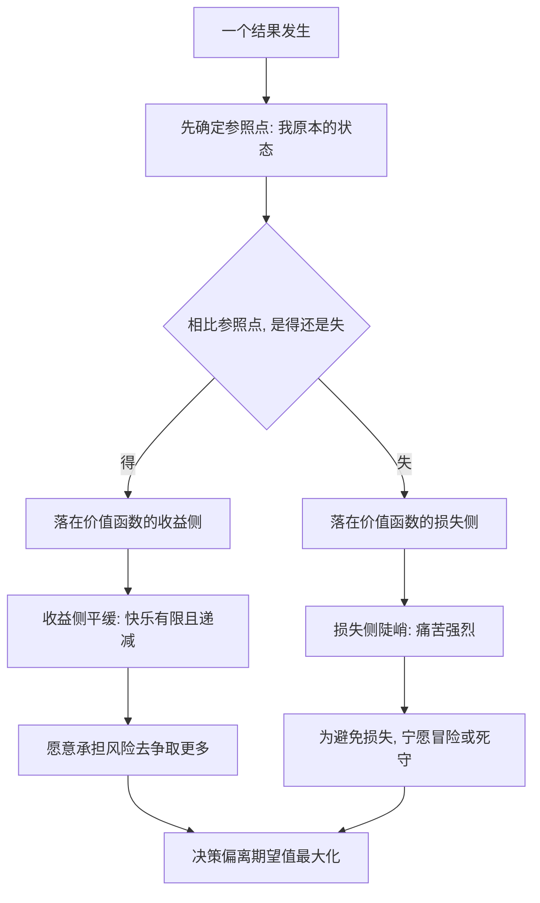

# 15｜为什么“损失”比“得到”更让你在意？

> 同样大小的得失，为什么失去的痛苦远大于得到的快乐？

---

## 一、先说结论

卡尼曼认为，人对损失的敏感，远大于对同等收益的敏感。同样是一百元，丢掉带来的痛，通常明显大于捡到带来的快乐。他在书中给出的经验比例是：损失的痛苦，大约是同等收益快乐的 2 到 2.5 倍。

这说明人不是按"最后我得到了多少"来做决定的，而是按"相比原来，我多了还是少了"来做决定的。而这个"少了"的杀伤力，被系统性地放大了。

关键在于：损失厌恶不是情绪化，而是一种稳定、可预测、人人都会犯的偏差。它解释了大量的"不理性"行为。

---

## 二、我们先理解一个问题

想象两件事，分开发生。

第一件：你在路上捡到一百元。

第二件：你口袋里本来有一百元，回家发现丢了。

如果必须选一件发生，几乎所有人都会选第一件——这没什么稀奇，谁都喜欢白赚。真正值得琢磨的是另一个问法：这两件事，会在你心里各自留下多重的痕迹？

捡到一百元的开心，大概持续一小会儿，你甚至很快就忘了；而丢掉一百元的懊恼，可能会反复回来，你会在接下来的一整天里不自觉地复盘：是不是在哪儿掉的？早知道就不带现金了。

同一个金额，一进一出，为什么在心里的分量差这么多？如果人是理性的计算器，这两件事应该等价，只是符号相反而已。

---

## 三、作者到底提出了什么观点？

卡尼曼与阿莫斯·特沃斯基提出的**损失厌恶**，正是对这个不对称的描述。

卡尼曼的核心观点有三层。

第一，**人评估的是"变化"，不是"总量"。** 我们关心的不是自己现在有多富，而是相比某个参照点，我是赚了还是亏了。所以同一笔钱，是"多出来的"还是"被拿走的"，心理效果完全不同。

第二，**得失曲线不对称。** 卡尼曼认为，收益侧的价值增长是逐渐变缓的（第一笔钱最让人高兴，后面越来越麻木），而损失侧不仅同样是弯曲的，而且**陡得多**。也就是说，从"拥有"滑向"失去"的坡度，远大于从"没有"升向"拥有"的坡度。

第三，**损失厌恶可以量化。** 卡尼曼在书里报告过一类观察：面对一个输赢概率各半的赌局，人们通常需要一个明显更大的赢面，才愿意参与——大致要赢的金额约为可能输的金额的两倍。换句话说，赢两百元的吸引力，才勉强抵得上输一百元的恐惧。

---

## 四、把这个观点翻译成人话

还是那两件事，一百元。

捡到一百元时，你的参照点是"我原本没有这一百元"。这一百元是额外的，它让你的状态从"零"升到"加一百"。按卡尼曼的说法，收益的边际效果是递减的，所以这一跳带来的快乐，是有限而短暂的。

丢掉一百元时，参照点变了——它变成了"我本来有一百元"。此刻你不是"没赚到"，而是"从我的里面被拿走了"。同样是一百元，它落在曲线的另一侧，而那一侧更陡。所以痛苦来得更猛、更久。

还有一个更隐蔽的地方：**损失厌恶会自动改变你的注意力。** 捡到钱，你不会去想"如果没捡到会怎样"；但丢了钱，你会不停地在脑子里重演"如果当时我怎样就好了"。后悔，本质上就是把注意力钉在损失那一侧。

所以人不是贪婪，而是**怕亏**。这两者的行为差别，在钱、时间、机会、面子上全都会显形。

---

## 五、为什么会这样？

这张图最关键的一步是 **B**：**参照点是先被设定好的，而且它对结果是"得"还是"失"具有决定权。** 同一笔钱，换个参照点，就可能从收益侧跳到损失侧，心理效果立刻反转。

这就解释了一个奇怪的现象：一个已经赚了一万的人，如果发现自己"本可以赚两万"，他的感觉不是庆幸，而是难受——因为他的参照点已经变成了两万。损失厌恶不只对钱敏感，它对**期望**同样敏感。

再往下看，**G → I** 这一跳，是很多"死守亏损"行为的根源：为了不让损失变成现实，人宁可继续加注、继续等待，也不肯承认它已经亏了。

---

## 六、举一个现实生活中的例子

回到丢一百元这件事，把它放到一个更具体的场景里，你会发现它有多顽固。

假设你在一家小店买东西，收银员多找了你一百元。你走出店门才数清楚。这时候，多数人的内心会有一场小拉扯。有一部分人会觉得这钱"不算自己的"，但另一部分人会想：反正对方也没发现，留下也就留下了。

现在把场景反过来：你付了一百元，转身发现东西忘了拿，或者发现算错了找零，你少了一百元。你的反应会果断得多——你会立刻回去、会追问、会为一个细节跟人反复核对，情绪也更强烈。

看出区别了吗？对"多拿一百"和"少拿一百"，人投入的注意力、情绪强度和行动力完全不对称。**丢失那一百元会把你变成另一个人**：更警觉、更执拗、更愿意为它折腾。而捡到那一百元，你多半只是默默开心一下。

这就是损失厌恶在日常里的样子：它不是一句"我讨厌亏钱"，而是一整套自动加重的反应机制。

---

## 七、回到书中重新理解

现在再看卡尼曼为什么要花那么大力气讲损失厌恶，就顺了。

它不是一个孤立的小癖好，而是好几类"不理性"行为的共同根。**沉没成本**就是最直接的产物——已经投进去的钱和时间，被感知为"一旦放弃就等于确认损失"，于是人宁可继续投入一个明显不划算的项目，也不愿面对"白花了"。**处置效应**也是同一回事——投资者倾向于卖掉赚钱的股票、死守亏钱的股票，因为卖出亏损等于把痛苦坐实。还有**现状偏好**——任何改变都同时包含"可能失去什么"，而失去的那部分被放大，于是人宁可维持现状。

也就是说，损失厌恶把整个决策的方向都轻轻扭了一下：**从"怎么赢更多"，偏向"怎么不输"。** 这个偏向在多数日常情境里很稳妥，但在需要果断止损、果断转向的场合，它会成为枷锁。

---

## 八、这个观点背后还有什么？

有一点特别值得说：**损失厌恶是本书很多其他概念的地基。**

比如禀赋效应——为什么东西一到手就觉得更值钱？因为卖出被感知为"失去"，而失去的痛被放大，所以你必须用更高的价格补偿自己。再比如框架效应——同一个方案说成"成功率 90%"还是"死亡率 10%"，本质上是把同一个事实推进了收益侧还是损失侧。它们看起来是三个知识点，底下其实是同一台机器。

另一个有意思的推论是：**损失厌恶可以被"利用"。** 一旦商家知道失去比得到更痛，营销的语言就会转向损失："仅剩最后三件""优惠今天就结束""不买就涨价"。你感受到的不是"买能省多少"，而是"不买会亏多少"——后者更疼，也更有效。

卡尼曼本人承认，在所有他研究过的概念里，损失厌恶是最能解释现实、也最难摆脱的一个。

---

## 九、这个观点有问题吗？

损失厌恶是被大量研究支持的现象，但"到底有多强、是否普遍"存在认真的争论，不能当成铁律。

最直接的质疑来自一部分研究者。他们认为，很多所谓"损失厌恶"的证据，可能只是"对损失的注意更强"，而不是"损失被赋予了更高的权重"。换句话说，人可能只是更容易把目光投向损失，但一旦认真计算，未必真的按两倍来权衡。有学者在整理大量数据后提出，损失厌恶的普遍性可能被夸大了，至少它不像一个恒定的系数那样可靠。关于具体倍数（例如 2 到 2.5 倍）是否稳定，学界也仍无定论。

此外，可重复性危机之后，行为经济学与心理学界对若干经典效应的稳健性都更为审慎，一些实验在更大样本或不同情境下得到的效应并不一致。跨文化研究还发现，损失厌恶的强度会随情境、文化和个体差异而变化——它不是一个对所有人在所有时候都成立的自然常数。

不过，即便系数存疑，"得失不对称"这个大方向在大量真实场景里反复被观察到——保险、投资、谈判、消费，都留下了它的痕迹。

所以更平衡的说法是：**损失厌恶是一个非常有解释力的框架，但在具体数值和适用边界上，需要保持开放；它是一种倾向，不是一条精确定律。**

---

## 十、今天再看这个观点

以下部分是基于卡尼曼思想的现代延伸，不是他在书里的原话。

今天，损失厌恶的影响被产品设计放大了。

订阅服务中，许多 App 会先用"免费试用"让你进入"已经拥有"的状态，再用"即将恢复原价，即将失去会员权益"来触发续费。保险行业的整套话术，也在把"可能发生的损失"变得具体而可怕。投资类应用里，红色的下跌数字比绿色的上涨数字更能抓住眼睛，也更能驱动频繁操作。

更有意思的是，数字支付本身就在稀释损失感——刷卡和扫码时，钱作为"流出"的实感变弱了，损失厌恶被暂时压住，人更容易超支。而当账单生成、一次性看到总额时，那种被放大的痛又会成倍回来。

这提醒我们：**在别人精心布置的损失框架面前，"我要理性"几乎没用；有用的是提前设好参照点**——买之前先问"如果没有这个优惠，我本来会买吗"，把参照点从"享受优惠"拉回"要不要拥有"。

---

## 十一、这一篇真正应该记住什么？

1. **损失厌恶：** 同额得失，损失的痛大约是收益快乐的 2 到 2.5 倍。
2. **人评估的是相对参照点的变化**，不是绝对总量；换个参照点，得与失的感觉会反转。
3. **得失曲线不对称：** 损失侧更陡，所以"怕亏"的力气大于"想赚"。
4. **它是很多行为的共同根：** 沉没成本、处置效应、现状偏好、禀赋效应、框架效应。
5. **可以自查：** 当你发现自己不愿止损、死守现状，或对"错过优惠"特别焦虑时，很可能正被损失厌恶推着走。

---

## 十二、留一个问题

> 如果失去的痛天然大于得到的快，
> 那么我们所追求的"更好的选择"，
> 究竟是在向前争取，还是只是在拼命躲开各种可能的失去？

---

**下一篇**：损失厌恶解释了"为什么会怕亏"，但它只讲了一半。真正完整的问题是两个：人在有得有失的赌局里，究竟按什么规则做选择？为什么面对收益会保守、面对损失反而去赌？

下一篇我们就来拆开这个问题——**什么是"前景理论"。**
