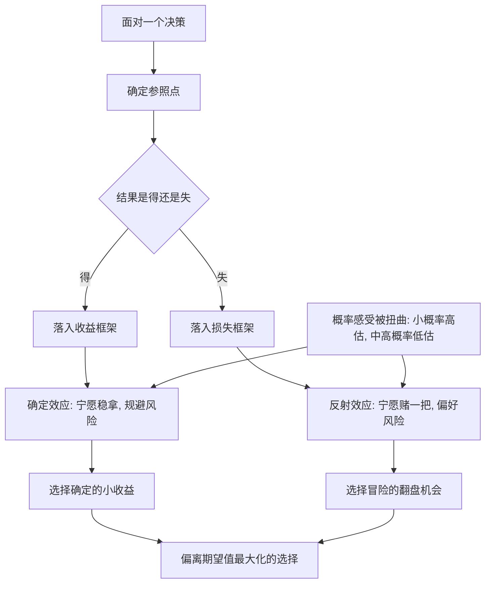

# 16｜什么是“前景理论”？

> 为什么面对收益时保守、面对损失时冒险？

---

## 一、先说结论

前景理论是卡尼曼与阿莫斯·特沃斯基在 1979 年提出的决策理论，也是卡尼曼在 2002 年获得诺贝尔经济学奖的核心成果。它想替换掉传统经济学里那个"理性人"。

它有三个要点。第一，人评估的不是绝对财富，而是相对于某个参照点的得失。第二，面对收益，人倾向于"落袋为安"（风险厌恶）；面对损失，人反而倾向于赌一把（风险偏好）。第三，损失比同等收益更重，而且人对概率的感受不是线性的——小概率会被高估，中高概率会被低估。

这三条合起来，解释了为什么人在钱面前的表现，常常和"算期望值"的理性模型对不上。

---

## 二、我们先理解一个问题

看一道选择题。

选项 A：确定拿到一百万元。

选项 B：掷一次硬币，正面拿两百万元，反面一分钱没有。

如果按期望值算，B 的期望正是 50% 乘以两百万元，也就是一百万元——和 A 完全一样。从"平均结果"看，两者等价。

但请诚实地问自己：你会选哪个？

绝大多数人会选 A。哪怕知道数学上二者等价，人们还是宁愿拿走确定的一百万，也不愿承担一半的概率什么都得不到。

有趣的是，如果把同一道题反过来问——A 是确定损失一百万元，B 是掷硬币，正面损失两百万元，反面不损失——同一个人的选择往往会反转：他会去赌那个硬币。

为什么面对收益就缩，面对损失就冲？这正是前景理论要回答的问题。

---

## 三、作者到底提出了什么观点？

卡尼曼认为，传统经济学假设的"理性人"——按最终财富的期望值来做选择——并不符合真实的人。他和特沃斯基提出了一个描述性的替代方案，包含三个部件。

**第一，参照点。** 人判断得失，是相对一个参照点（通常是你现在的状态，或你期待的某个水平）来衡量的。同样是拿到一百万元，对一个月薪五千的人和对一个已经身家千万的人，意义完全不同。所以决策要研究的不是"最后的绝对财富"，而是"相对参照点的变化"。

**第二，价值函数（得失曲线）。** 收益侧是凹的，损失侧是凸的，而且**损失侧更陡**。这就是损失厌恶的数学表达。它还解释了一个现象：小额的得失之间差别很大，而大额收益再往上加，带来的额外满足却越来越小。

**第三，概率权重函数。** 人感受概率的方式是扭曲的：极小概率的事件会被高估（所以人会买彩票、会怕坐飞机），中高概率则会被低估。这就解释了为什么面对"几乎必得的收益"，人们格外想要那个确定；而面对"几乎必输的损失"，人们会病态地押上小概率的翻盘。

在这三条里，卡尼曼特别强调一个模式，叫**确定效应**：当收益已经相当可观时，人会为了确保它，宁可放弃期望值更高但带风险的选项。

---

## 四、把这个观点翻译成人话

回到那一百万和两百万。

如果你把这两个选项看成"同一件事的两种赌注"，选 A 的人是"亏的"——因为两者期望一样，而 B 的潜在收益更大，风险只是一半概率拿零。经济学里把这叫"风险厌恶"。

但"前景理论"的翻译是：**在收益的框里，人关心的是"能不能把好东西稳稳拿到手"。**

想象你面前这两个选项。选 A，你立刻进入"我有一百万了"的状态；选 B，你的心会悬起来，一半的可能你什么也没有。对多数人来说，为了避开那个"什么都没有"的可能，放弃"可能拿两百万"的想象，是划算的。因为在损失那一侧，从"有"跌到"没有"的痛，比从"有"升到"更多"的快，要重得多。

现在反过来。假设规则变成：A 是确定损失一百万，B 是掷硬币，正面损失两百万，反面不损失。期望还是都等于损失一百万。这一次，人反而不愿意接受确定的损失——因为确定损失等于把痛苦立刻锁死，而赌一把，至少还有一半的机会什么都不发生。

同样是"赌"，在收益区里它是威胁，在损失区里它成了救生圈。

---

## 五、为什么会这样？

这张图有两个入口值得记住。

第一个是 **B**：**参照点定了，后面的选择方向就定了。** 同一笔钱，被视为收益还是损失，取决于你以什么为参照。这也意味着，改变参照点，就能改变一个人愿不愿意冒险。

第二个是 **F 与 G 的对称性**：前景理论最漂亮的地方，是它揭示了风险偏好不是性格，而是**处境**。一个人可以在收益区极度保守，在损失区极度冒险，这不是前后矛盾——这是同一条得失曲线在不同侧面的自然表现。

---

## 六、举一个现实生活中的例子

把"一百万"换成更贴近生活的东西，机制一模一样。

一个已经亏了很多钱的股民，为什么迟迟不肯卖出？因为卖出就是把损失变成现实。留在账面上，他还拥有一半的可能——"万一涨回来呢"。他选择的正是那个"50% 概率拿 200 万"的翻盘结构，只不过在这里，赌注是痛苦的大小而不是收益的大小。

反过来，一个已经赚了一笔的人，为什么常常急着卖掉、落袋为安？因为确定的收益让人安心，而一旦从"赚了"变成"又亏回去"，那份痛在他看来远大于"可能再多赚一点"的快。

你甚至可以在同一个人身上看到两种行为同时发生：卖掉赚钱的，死守亏钱的。**不是他前后不一，是他站在了曲线的两侧。** 这也正是"处置效应"的心理来源。

---

## 七、回到书中重新理解

现在回看，前景理论在书里的位置就非常清楚了。

它不是第 16 章才突然冒出来的一个独立理论，而是前半本书所有偏差的**收拢点**。损失厌恶，是价值函数损失侧更陡的那一段；框架效应，是同一个事实被放进收益侧还是损失侧的结果；锚定与参照点，也在反复提示"原点和基准"有多重要。

卡尼曼想说明的是：理性选择理论要求决策满足若干一致性的公理，而人在真实情境里系统性地违反它们，并且违反得很有规律。前景理论的价值，就在于它把这些"违反"整理成了一套可预测的结构——**不是我们偶尔糊涂，而是在得失面前有一套固定的反应模式。**

也正因为如此，它从根本上动摇了"人是理性的效用最大化者"这个经济学前提。

---

## 八、这个观点背后还有什么？

有几个概念是前景理论的直接延伸，值得拎出来。

**反射效应。** 收益区的选择偏好，会像照镜子一样在损失区反转：收益处规避风险，损失处追求风险。这是"四重模式"的一半。

**确定性效应。** 面对"几乎确定能拿到的收益"，人愿意付出过高代价去确保它。这就是为什么很多人愿意接受一个明显偏低但确定的报价，而不去谈那个期望更高但不确定的交易。

**隔离效应。** 人常常把同一个决策拆成几个独立部分来看（窄框架），而不是把它们合起来算总账（宽框架）。这会让本可以互相抵消的风险，被反复单独放大。

**四重模式。** 把"收益/损失"和"高/低概率"两两组合，可以拼出四种典型偏好：高概率收益求稳、低概率收益买彩票、高概率损失冒险、低概率损失买保险。前景理论的一个长处，是它能同时解释"为什么同一个人既买彩票又买保险"。

---

## 九、这个观点有问题吗？

前景理论是极有影响力的描述性理论，但它不是没有争议——它在解释力上很强，在精确性和规范性上则不断被讨论。

一些学者指出，价值函数和概率权重函数里的参数，是通过实验拟合出来的，不同研究给出的估计并不完全一致；它更像一套能容纳许多现象的解释框架，而不是一个能精确预测每个选择的公式。也有人认为，它在很多地方是对已有观察的整理与命名，其"新"更多体现在整合，而不是单条机制。

在方法层面，可重复性危机之后，部分奠基性实验的效应强度也受到更严格的检视；学界对前景理论在什么条件下适用、边界在哪里，仍有持续讨论。

还有一点需要区分：**前景理论是描述性的（人实际上怎么做），不是规范性的（人应该怎么做）。** 期望效用理论虽然在描述人的真实行为上表现不佳，但它在"如何做出逻辑一致的决策"上仍有价值，并没有被完全取代。二者更像是回答两个不同的问题。

所以更平衡的说法是：**前景理论成功地把人的真实选择结构化了，这是它对经济学和心理学的重大贡献；但它是一个不断被修正的描述框架，而不是终极答案。**

---

## 十、今天再看这个观点

以下部分是基于卡尼曼思想的现代延伸，不是他在书里的原话。

前景理论今天最直接的落点，是"为什么同一个人会既买彩票又买保险"这个老问题——现在有了一套统一的解释：都是小概率被高估、同时在收益和损失两侧各自求稳或求翻盘的结果。

在商业场景里，这套结构被反复使用。厂商把产品设计成一个收益框（"现在下单省两百")或一个损失框（"错过今天就多花两百"），本质上是在选择把你推到曲线的哪一侧。投资顾问劝人长期持有，用的是把频繁波动从"每次独立的损失"重新框成"一段区间内的正常起伏"，也就是从窄框架拉向宽框架。

在公共政策上，理解参照点也很有用——比如把"罚款"改成"奖励再取消"，效果可能不同，因为前者是损失，后者是先得后失。这些用法都能追溯到前景理论对参照点与得失的强调。

---

## 十一、这一篇真正应该记住什么？

1. **前景理论是卡尼曼获诺奖的核心成果，** 用来替代"按期望值决策"的理性人假设。
2. **人看的是相对参照点的得失，不是绝对财富。**
3. **得失曲线不对称：** 损失侧更陡（损失厌恶），收益侧更平缓。
4. **风险偏好由处境决定：** 收益区求稳（确定效应），损失区赌一把（反射效应）。
5. **概率感受是扭曲的：** 小概率高估，中高概率低估——这解释了彩票与保险并存。

---

## 十二、留一个问题

> 如果人对同一个事实的反应，取决于它被放进收益还是损失的框里，
> 那么"我做了一个理性的选择"这句话，
> 究竟是在描述我的判断，还是在描述别人给我的那个框？

---

**下一篇**：讲到这里，已经能看出一个令人不安的推论——既然得失取决于参照点，那么只要改变"被呈现的方式"，就能改变你的选择。同一件事，换一个说法，人的判断真的会翻转吗？

下一篇我们就来拆开这个问题——**为什么换个说法，你的选择就变了。**
