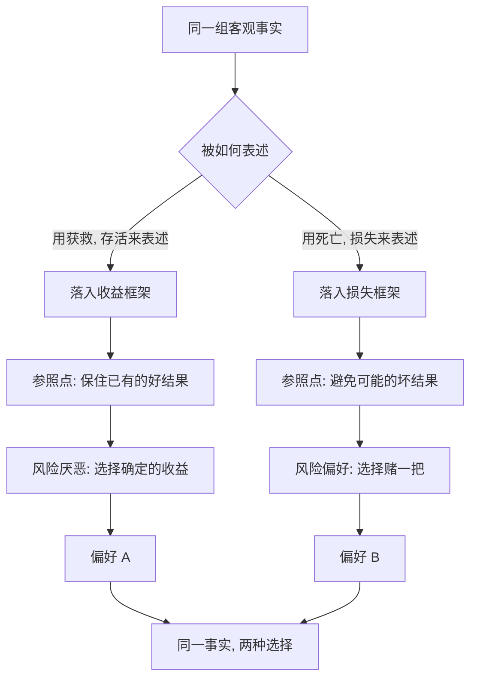

# 17｜为什么换个说法，你的选择就变了？

> 同一件事，为什么换个表述方式，判断就完全不同？

---

## 一、先说结论

卡尼曼认为，人并不对"事实本身"作反应，而是对事实被呈现的"框架"作反应。同一件事，换一个说法，选择就可能翻转。这个现象叫**框架效应**。

它意味着：理性选择理论里那条最基本的规矩——不管你用什么方式描述问题，只要你掌握了全部事实，你的偏好就不该变——在真实的人身上经常被违反。而且违反得不是随机的，它有方向、有规律。

所以更实际的问题是：既然表述会改变判断，那么**谁设置了框架，谁就在很大程度上影响了别人的决定**。

---

## 二、我们先理解一个问题

设想你的家人要做一场大手术。医生找你谈话，说了两种可能。

第一种说法："这种手术，术后的存活率是 90%。"

第二种说法："这种手术，每 100 个人做，会有 10 个在术后死亡。"

你会不会觉得这两句话给人的感觉不一样？

它们描述的是同一件事——90% 存活，就是 10% 死亡。作为数学，两者完全等价。但作为感受，第一句让你心里踏实一些，第二句让你后背发凉。

同一个医生、同一台手术、同一组数据，只因为用词不同，你同意手术的意愿就可能不同。这个"不该有差别却客观存在差别"的地方，就是框架效应。

---

## 三、作者到底提出了什么观点？

卡尼曼与特沃斯基用一组著名的选择实验演示了框架效应。

实验的设定大意是：有一种疾病预计会夺去 600 个人的生命，现在有两套方案。

- 方案一的描述是：如果采用它，将有 200 人获救。
- 方案二的描述是：如果采用它，有三分之一的机会 600 人全部获救，三分之二的机会无人获救。

面对这个说法，多数人选方案一。

现在把描述换一下，结果同样不变，只是换成"死亡"来表述：

- 方案三：如果采用它，将有 400 人死亡。
- 方案四：如果采用它，有三分之一的机会无人死亡，三分之二的机会 600 人全部死亡。

这一次，多数人选方案四。

关键在于：前一组里，方案一和方案二完全等价于后一组的方案三和方案四。同样是"200 人获救"，换一种说法变成"400 人死亡"，人的选择偏好就从"求稳"翻到了"赌一把"。

卡尼曼据此指出：**理性的选择理论要求"描述不变性"——只要事实相同、理解相同，偏好就应当一致。框架效应说明这一要求被系统性地违背了。** 而且原因不难理解："获救"把人推进了收益的框，"死亡"把人推进了损失的框；而前景理论早就告诉我们，人在收益框里求稳，在损失框里冒险。

---

## 四、把这个观点翻译成人话

再回到那台手术。

医生说"存活率 90%"时，你脑子里出现的是"我得救的可能性很大"——这是一个收益的框。在这个框里，你的本能是求稳：那就做吧，稳稳地拿到这 90% 的好结果。

医生说"死亡率 10%"时，你脑子里出现的是"有人会死，而且可能是我的家人"——这是损失的框。在这个框里，你的注意力开始转向风险本身：要不要再找医生问问？有没有更保守的方案？你会想要"避开"那个可能的坏结果，甚至愿意为一个不确定的替代方案去赌。

看出区别了吗？**你没有得到任何新的信息，改变选择的原因，只是那 10% 被摆在了哪一栏。**

这不是愚蠢。系统 1 处理的是"这话听起来是好是坏"，不是"这句话在数学上等不等于另一句话"。当一句话披着收益的外衣进来，情绪先于计算就已经定了调。

---

## 五、为什么会这样？

这张图的核心在 **B → C/D** 这一跳。

客观事实只有一份，但表述方式像一个岔路口，把它送进了两条不同的心理通道。一旦进入收益通道，参照点变成"保住已经到手的好处"，人就保守；一旦进入损失通道，参照点变成"别让它变坏"，人就激进。

所以框架效应并不是一个独立于前景理论的新东西——它是**前景理论在语言层面的直接投影**。改变说法，本质上是改变参照点，进而改变你在曲线的哪一侧做选择。

---

## 六、举一个现实生活中的例子

再把这个手术的例子推远一点，你会发现它到处都是。

同一个治疗方案，一份知情同意书如果写成"本方案的有效率为 70%"，患者更容易签字；写成"本方案对约 30% 的患者无效"，犹豫就会明显增加。同一场手术，医生在术前沟通时选择强调"大多数人都很顺利"，还是强调"有一定比例会出现并发症"，家属的心理准备和决策节奏会完全不同。数据一个字没改，感受和决定却变了。

这也给了临床沟通一个很实际的提醒：**重要的不只是"说真话说完整"，还包括"用什么框架说"。** 一个负责任的沟通者，会把两种表述都摆出来——"这等于说，90% 的人能活下来，同时也有 10% 的人可能挺不过去"——让对方在两个框里都看一眼，而不是被单一的措辞牵着走。

框架效应最危险的地方，不是它让你算错，而是**你根本不知道自己被表述影响过**。你会以为自己只是"综合考虑后做了判断"。

---

## 七、回到书中重新理解

现在看，框架效应在书里的位置也很清楚：它是"选择与损失"这一部分的又一枚拼图，和损失厌恶、前景理论是同一件事的不同侧面。

损失厌恶讲的是得失不对称，前景理论讲的是得失如何决定风险偏好，而框架效应讲的是——**连"这算得还是失"，都可以被表述方式操控。** 三者串起来，构成了一个完整的链条：表述设定参照点，参照点决定得失，得失决定冒险还是保守。

卡尼曼还区分了两种框架：一种是"窄框架"，把每个决定孤立地看，比如逐个评估每一笔小投资赚没赚；另一种是"宽框架"，把它们合起来看总账。窄框架会放大损失厌恶——因为每一次小波动都变成一次独立的输赢。所以，**学会用宽框架思考，本身就是对抗框架效应的一种方法。**

---

## 八、这个观点背后还有什么？

框架效应有几个著名的现实延伸，都和"表述设置参照点"有关。

**默认选项。** 器官捐献率在不同国家差异巨大，一部分原因不是文化，而是表格设计：是"愿意捐献"需要主动打勾，还是"不愿捐献"需要主动打勾。默认值本身就是一种框架——它把"什么都不做"定义成了某一个结果，而人倾向于什么都不做。

**标签与措辞。** 食品包装写"95% 不含脂肪"，比写"含 5% 脂肪"更能打动买家，尽管两者是同一件事。打折时先说"原价 999，现价 599"，也是先用一个高参照点把"省了 400"框成收益。

**谈判与决策呈现。** 同一份预算案，说成"保住多少岗位"还是"削减多少岗位"，会影响公众支持；同一个让步，说成"我放弃了什么"还是"我给了你什么"，会影响对方的感受。谁定义措辞，谁就在部分定义结果。

这些例子的共同点是：**它们都不改变事实，只改变事实的呈现方式，但都实实在在地改变了选择。** 这也是为什么"修辞"从来不只是修辞。

---

## 九、这个观点有问题吗？

框架效应本身相当稳健，但在强度和边界上，学界有不少讨论，不能简单套用。

第一，**效应的大小因情境而异。** 在一些研究中，框架效应的确非常明显；但在另一些研究里，当人们被提示去仔细比较两种表述，或者对领域很熟悉时，效应会缩小。也就是说，它更像一种"默认会发生，但可以被干预"的倾向，而不是一个无法摆脱的陷阱。

第二，**跨文化研究显示差异。** 不同文化背景的人在面对得失框架时，反应强度并不完全一致，有些群体的效应明显更弱。这提示框架效应不是一条放之四海而皆准的常数。

第三，**存在"过度解读"的风险。** 一些批评者认为，把大量政策与营销现象都归因于框架效应，会忽略利益、习惯、信息量等更直接的因素；一个措辞之所以有效，未必纯粹是心理框架，也可能只是它传达了更多信息。

第四，**它的应用带来伦理争论。** "助推"利用的正是框架与默认值，支持者认为它能在不强迫人的前提下改善选择，批评者认为它是在暗中操纵。这是一个仍在进行中的公共讨论，而非已有定论的事。

所以更平衡的说法是：**框架效应是真实且可重复性较好的一类现象，它揭示了表述对选择的影响；但影响的大小依赖情境，而且"知道它存在"本身就能削弱它——这也正是它值得被讲出来的原因。**

---

## 十、今天再看这个观点

以下部分是基于卡尼曼思想的现代延伸，不是他在书里的原话。

今天，框架的竞争已经变成了产品与内容的核心战场。

订阅服务的定价页，几乎都经过精心设计：把年付标成"每月仅需几元"，把取消按钮做成灰色小字，把"继续享受会员"做成显眼的默认按钮。健康类 App 把"你今天没走够步数"和"你已接近目标，只差一点"分别呈现，用户的行动率会不同。新闻标题在"某地经济回升"与"某地经济仍未恢复"之间选择措辞，读者的判断随之偏移。

算法推荐还带来一个新变量：**它不只选择呈现什么，还选择用什么说法呈现，并且会持续测试哪一种说法让你停留更久。** 这意味着框架是被实时优化过的，专门针对你个人的反应。

对个人而言，能做的或许很朴素：**遇到重要决定，主动把同一件事用相反的说法再读一遍。** "成功率 90%"读完，再读一次"失败率 10%"；"省了 400"读完，再问一次"我要花 599 吗"。这个动作不消灭框架，但它让你至少看见了两个框。

---

## 十一、这一篇真正应该记住什么？

1. **框架效应：** 同一事实，换个表述，选择就可能翻转——"存活率 90%"与"死亡率 10%"是同一件事。
2. **人反应的是框架，不是事实本身。** 表述设定了参照点，参照点决定得失，得失决定风险偏好。
3. **它与前景理论同源。** 收益框里求稳，损失框里冒险；表达方式只是把人推到了曲线的某一侧。
4. **谁设置框架，谁就影响决策。** 默认选项、标签、措辞，都是不改变事实却改变选择的工具。
5. **自查方法：** 对重要决定，把同一件事用相反的说法再读一遍，看见两个框，而不是只看见一个。

---

## 十二、留一个问题

> 如果同一件事实，仅仅因为被说成"保住什么"或"失去什么"，
> 就能让你做出相反的选择，
> 那么你所谓的"我想清楚了"，
> 究竟是想清楚了事实，还是只是接受了某一种说法？

---

**下一篇**：框架效应讲的还是"你如何被表述影响"。但还有一个更日常、也更离奇的现象：一旦某样东西到了你手里，你对它的估值就会悄悄上升，仿佛它突然变贵了。

下一篇我们就来拆开这个问题——**为什么你会高估自己拥有的东西。**
