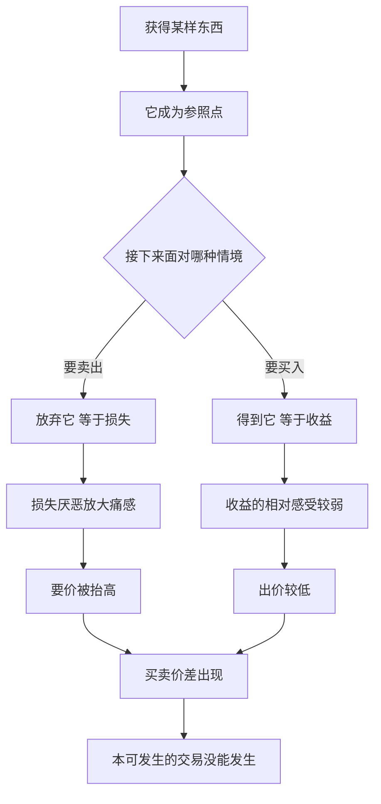

# 18｜为什么你会高估自己拥有的东西？

> 为什么东西一到手，我们就觉得它更值钱了？

---

## 一、先说结论

卡尼曼认为，人一旦拥有某样东西，就会系统性地抬高对它的估值——这就是**禀赋效应**。

同一只杯子，拿在手里的人愿意卖出的价格，明显高于没有杯子的人愿意买入的价格。差别不在杯子，而在“拥有”这个状态本身。它的心理根源是损失厌恶：放弃已经属于自己的东西，被大脑记成了一笔“失去”，而失去的痛，比同等得到的乐更重。

所以，很多时候不是你的东西更值钱，而是“它是我的”这件事，让它在你眼里变得更值钱。经济学假设人给物品定一个稳定的价；心理学发现，这个价会随着“归谁所有”而变动。

---

## 二、我们先理解一个问题

先回想一件东西：你房间里某件正在用、但当初并不特别想要的东西——一个旧背包、一副耳机、一本读过一次的书。

现在问自己两个问题。

第一，如果有人要买走它，你最低愿意卖多少钱？

第二，如果它不在你手上，而是摆在商店里，你最高愿意花多少钱买它？

把这两个数字写下来，你大概会发现：**卖出价高于买入价。** 可物品没变，信息没变，你自己也没变。变的只是“它现在属于谁”。

这就是禀赋效应要解释的现象：为什么“所有权”会改变我们对价值的判断？更奇怪的是，这种改变发生得毫无声息——你并不是故意抬价，你只是真心觉得它值那么多。

---

## 三、作者到底提出了什么观点？

卡尼曼与理查德·塞勒、杰克·克内齐一起，用一系列实验研究了这个问题，其中最著名的是“马克杯实验”：把同样的马克杯随机发给一半参与者，然后分别问得到杯子的人“最低多少肯卖”、没得到杯子的人“最高多少肯买”。结果，卖方的要价大约是买方出价的两倍左右。

由此，卡尼曼提出几点：

- **估值不是绝对的，而是相对于参照点的。** 拥有使当前的物品成为参照点，卖出意味着“失去它”，买入意味着“得到它”。
- **禀赋效应由损失厌恶驱动。** 放弃一件已经属于你的东西，痛感大于获得同等东西的快乐。
- **它是前景理论的直接推论。** 前景理论说人评估的是相对于参照点的得失，而不是绝对财富；所有权只是把参照点挪动了位置。
- **它自动发生，与情感投入无关。** 哪怕物品是几分钟前刚得到的、毫无感情，效应依然出现。

还有一条边界很重要：对现金、可替代商品，以及以转卖为目的持有的物品（比如经销商手里的货），这个效应会明显减弱。禀赋效应管的是“我的东西”，不是“我要卖的东西”。

---

## 四、把这个观点翻译成人话

你衣柜里有两件几乎一样的 T 恤。一件是你的，穿过几次；另一件在商店里，标价一百元。

要你卖掉自己那件，你多半会报一百二甚至一百五。要你买下商店那件，你多半觉得一百元都有点贵。同一件衣服，为什么两个价？因为卖出自己的，感觉像“我少了一件”；买下商店的，感觉像“我多了一件”。少一件和多一件，数字相同，心理重量完全不同。

换句话说，你不是在给衣服定价，你是在给“失去”定价。

商家很懂这一点。免费试用、先享后付、七天无理由试用、把商品先寄到你家——这些设计的共同点是：**先让你拥有，再让你面对“还回去”。** 一旦东西到了你手上，归还就变成了损失，于是你更可能掏钱把它留下。这不是你意志薄弱，而是叙述的参照点被悄悄换掉了。

---

## 五、为什么会这样？

从参照点出发，整个链条是这样的：

关键在于 **A → B** 这一步：参照点的移动。传统经济学假设人按“最终拥有多少财富”来评估选择，所以卖和买用的是同一把尺子。心理学发现，人按“相对于当前状态的变化”来评估——东西一到手，当前状态就变了，得失的方向也随之翻转。

结果是同一件物品，在卖方眼里是“失去”，在买方眼里是“得到”。而失去比得到重，价差就出现了。

---

## 六、举一个现实生活中的例子

看二手平台。

你有一台用了两年的旧手机，当初三千元买的。现在你把它挂上去，标价两千二。挂了半个月，没人来问。你降到一千八，心里还在打鼓：“这么低，不如自己留着。”可当你作为买家去逛别人的同款时，看到标价一千八，你的第一反应是：“用了两年还卖这么贵？”

同一台手机，你自己卖是一千八起步，别人卖你却嫌贵。为什么？

因为你的参照点是“我已经拥有这台手机”，卖出等于失去；而看别人的手机时，你的参照点是“我还没有它”，付钱等于获得。两套参照点，用的是两把完全不同的价格尺。

这个效应还解释了另一个二手市场常见现象：**卖家总觉得“我的东西保养得好”，买家却只按市场行情出价。** 双方争的其实不是手机，而是该用谁的参照点来定价。谈不拢，往往不是价格问题，而是心理账户没有对齐——你觉得在割肉，对方觉得在捡漏。

---

## 七、回到书中重新理解

把禀赋效应放回全书的位置，它就不是一个孤立的趣闻了。

前景理论重新定义了“价值”：人评估的不是绝对财富，而是相对于参照点的得失。损失厌恶接着说：失去比得到更扎心。禀赋效应则是这两条规律落在“所有权”上的具体后果——拥有挪动了参照点，使卖出被编码成损失，于是价格被抬高。

三者连成一条线，一口气解释了很多所谓“不理性”的行为：为什么人死守亏损的股票（卖出等于确认损失）、为什么房东总觉得自己房子该卖更高、为什么一项已经发出去的福利很难收回（收回被视为剥夺）。

它也提醒我们：**“我愿意卖多少钱”和“我愿意买多少钱”不是同一个问题的两种问法，而是两个不同心理过程的产物。**

---

## 八、这个观点背后还有什么？

有几个隐含前提值得拎出来。

**第一，底色是“厌恶失去”，而不是“喜欢拥有”。** 有意思的地方在于，得到杯子的人并没有变得更喜欢杯子，他们只是更受不了失去它。这提醒我们，很多“珍惜”其实是损失厌恶在借壳上演。

**第二，参照点是可以被设置的。** 谁先给了你东西，谁就先替你定好了参照点。免费试用、赠送样品、把商品放进你家——都是在替你的参照点埋线。

**第三，它挑战了传统经济学的一个核心假设。** 如果买卖双方对同一物品的估值对称，那么通过自愿交易，资源总能流向最看重它的人。禀赋效应说明估值可能天生不对称，于是许多对双方都有利的交易根本不会发生——这是行为经济学对标准理论的一次实质冲击。

**第四，它有明确的适用边界。** 效应在“用来使用”的物品上强，在“用来交易”的东西上弱。一个职业二手商不会对自己的库存产生禀赋效应，因为他的参照点本来就是卖出。这也意味着，经验可以在一定程度上削弱它。

---

## 九、这个观点有问题吗？

有问题，而且争议不小。

**第一，关于可重复性与实验设计，学界存在不同解释。** 一些经济学家（如普洛特与蔡勒）认为，在有经验的交易者、真实市场规则的实验中，买卖价差会大幅缩小，甚至消失；实验里观察到的价差，可能部分来自参与者对规则的不确定、误解，或策略性的回答，而不一定反映稳定的偏好。

**第二，单纯的损失厌恶可能不足以解释全部。** 一些心理学家认为，还需要“所有权感”“自我延伸”等更丰富的机制；也有人主张禀赋效应是损失厌恶的一个边界情形，而非常态。

**第三，它有文化与情境依赖。** 在交易频繁、市场化程度高的环境里，效应往往更弱；在某些社群文化中，某些物品还带有身份与关系意义，估值逻辑又完全不同。

**第四，也有大量研究支持其真实性。** 即便控制了策略性回答与理解偏差，效应在许多设置中仍稳定出现。

所以更准确的说法是：禀赋效应是一个**真实但受条件调节**的现象——它经常出现，但不是任何情况下都出现。知道它存在，比断言它无处不在更可靠。

---

## 十、今天再看这个观点

以下部分是禀赋效应的现代延伸，不是卡尼曼的原话。

订阅制、会员制、免费试用、先用后付、游戏里的皮肤与装备，这些商业模式都在利用同一个机制：**先让你拥有，再让“失去”变得难以接受。** 取消会员时，平台不会说“你将每月省下二十元”，而是列出一整屏“你将失去”的权益清单——它把注意力的焦点从钱包移到了损失上。

数字资产让这一机制走得更远。一个用了很久的账号、一套精心搭配的虚拟外观、一段聊天记录，几乎没有转卖价值，但“失去”它们的感觉却是真实的。因为参照点不在市场上，而在你每天打开它的习惯里。

反过来，这也给了个人一个实用对策。当你要处理一件旧物时，不要问“我卖多少钱才舍得”，而要问：**“如果我现在没有它，我愿意花多少钱把它买回来？”** 这两个问题看起来一样，答案却常常差很多。前者是卖方视角，后者把你放回了买方的参照点——用一次视角切换，给自己的定价解毒。

---

## 十一、这一篇真正应该记住什么？

1. **禀赋效应：拥有会抬高你对它的估值。**
2. **根源是损失厌恶：卖出被感知为“失去”，而失去更痛。**
3. **机制是参照点：所有权改变了得失的方向，而不是物品的价值。**
4. **它有边界：现金与可替代品上的效应很弱，经验会削弱它。**
5. **实用一招：用“愿不愿意重新把它买回来”来检验自己的定价是否被高估。**

---

## 十二、留一个问题

> 你家里那些“舍不得扔”的东西，
> 是真的有用，还是只是因为“它曾经属于我”？
> 如果今天它摆在货架上、从未属于你，你还会出这个价吗？

---

你可能觉得，禀赋效应讲的到底是“东西”，只要不买东西就能躲开。可如果被高估的不是物品，而是一段经历呢？那就更微妙了——一趟旅行结束之后，你记得的喜悦，和你一路上真正感受到的，未必是同一份。

下一篇我们就来拆开这个问题——**“经历”和“记忆”，为什么给出不同的答案？**
