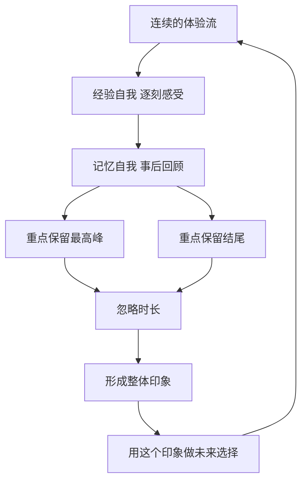

# 19｜“经历”和“记忆”，为什么给出不同的答案？

> 我们真正经历的快乐，和我们记住的快乐，是同一回事吗？

---

## 一、先说结论

卡尼曼认为，一个人的身体里其实住着两个自我：**经验自我**活在每一个当下，负责感受；**记忆自我**负责事后讲述、总结与评价。

它们是同一个人，却经常给出不同的答案。记忆自我并不忠实地统计整个过程，它遵循**峰终定律**：一段体验在记忆里留下的整体评价，主要由最强烈的那个瞬间（峰）和结束时的感受（终）决定，与持续时间几乎无关。

于是“经历了什么”和“记住了什么”会分家。更关键的是：**我们通常用记忆自我的答案，来为经验自我的生活做决定。** 你选择去哪里度假、要不要再来一次，投票的都是记忆自我；可真正承受那段体验的，是经验自我。

---

## 二、我们先理解一个问题

先做两个比较，不用真的去做，只在心里回答。

第一个比较：假设有两趟度假，花费一样、玩得一样开心，一趟去了十天，一趟去了三天。哪一趟让你觉得“更值得”？

第二个比较：假设有两段同样时长的体验，一段整体不错，但最后半小时很糟；另一段整体普通，最后一小时特别好。哪一段，你事后更愿意再经历一次？

多数人的答案会指向同一个方向：第一题里，十天并不让人觉得“值得三倍多”；第二题里，结尾的感受会显著改变整体印象。也就是说，我们对一段体验的记忆，既不太计算总时长，又特别在意结束的那一刻。

问题就来了：如果记忆是一台记录仪，它为什么不忠实地累加每一分钟？这背后是什么规则？

---

## 三、作者到底提出了什么观点？

卡尼曼提出，人有两个可分别研究的“自我”：

- **经验自我**：活在当下，逐刻地感受快乐、痛苦、平静、焦虑。它是连续的时间流，是真正在“生活”的那一部分。
- **记忆自我**：事后回顾，把体验压缩成一个故事，给出“好或不好”“值或不值”的评价。它是间断的、事后构建的。

由此产生几条重要结论：

- **峰终定律**：整体评价大致由最强烈的瞬间与结尾决定，而非所有时刻的平均。
- **时长忽视**：一段体验的长短，对记忆中的整体评价影响很小。让一段愉快的经历更长，并不会让它更幸福；让一段痛苦的过程更久，也不一定让它更糟。
- **记忆自我掌握决策权**：当你为未来做选择时，依据的是记忆里的评价，而不是当年真实的逐刻体验。
- **两个自我对“幸福”的定义不同**：经验自我回答“你此刻开心吗”，记忆自我回答“你对这一生满意吗”。

卡尼曼与同事研究过结肠镜检查与冷水实验。在结肠镜研究里，一组病人在检查延长的那一小段里承受的是较轻微的不适，结果他们事后对整个过程的不适评价反而更低，也更愿意回来复查——**多受了一点罪，记忆却更好。** 这成了峰终定律最反直觉的证据。

---

## 四、把这个观点翻译成人话

想一想你是怎么讲述自己的一年的。

你没法把三百六十五天原样播放给别人听，也没法原样播放给自己听。你只能挑几个片段：一次升职、一场争吵、一次旅行、一个告别的傍晚。讲着讲着，这些片段就替整年作了总结。

这就是记忆自我的工作方式：**它不是流水账，而是传记。** 流水账里有无数的平淡下午，传记里只剩下几个章节。而它挑选的原则不是“最典型”，而是“最高峰”和“最近发生的”。

于是会出现三种常见的错位。第一，一段漫长而平稳的快乐，被记成“还行”；一段短暂但高潮迭起、结尾漂亮的经历，被记成“一生难忘”。第二，我们为了一个漂亮的结尾，主动选择辛苦的过程——熬夜赶工只为交付那一刻的体面。第三，也是最重要的一条：**我们为记忆自我活着，却把账单交给经验自我去付。**

---

## 五、为什么会这样？

把两个自我放在一条时间轴上，循环是这样的：

关键在于 **F** 这一步：这不是记忆“坏掉了”，而是记忆的压缩机制。大脑无法储存全部瞬间，它必须采样。问题在于，采样规则是“极端与最近”，而不是“平均”。

而 **G → H** 又把它变成一个闭环：你根据记忆去选择下一次要经历什么，于是记忆偏好反过来塑造了你会过什么样的日子。喜欢峰和终的人，会不断去追求高光与漂亮的收尾，哪怕过程本身并不愉快。

---

## 六、举一个现实生活中的例子

一段旅行。

你和朋友去海岛玩七天。第一天赶路、转机、又赶上下大雨，狼狈到家。中间有一天去浮潜，看到了海龟，是整趟旅程最亮的时刻。最后一天傍晚，你们在海边吃了顿很好的晚饭，看着落日，笑着走回酒店。

回家后别人问你“玩得怎么样”，你说：“太好了，特别值。”

你几乎不会提第一天的狼狈，也不太提中间几天的平淡。你的记忆，被那一个峰值和那个结尾锚住了。

现在把剧本改一下。这趟旅行其实很累、很贵，中间还吵过两次架，但结尾依旧是那个落日和那顿好饭。你回家后的答案，很可能还是“值”。反过来，如果一趟整体九十分满意的旅程，最后一天丢了钱包、吵翻了天，你的回忆可能只剩“糟心”。

这就是峰终定律的现实版本：**记忆不是求和，而是取峰与取尾。** 也正因如此，我们才会心甘情愿地为“一个漂亮的结尾”买单。

---

## 七、回到书中重新理解

这个观点为什么必须放在全书的末尾？因为它把整本书的逻辑推到了人的一生。

回想前面那些偏差：系统 1 喜欢用最容易提取的信息编一个连贯的故事，而记忆自我，正是最高级的那个讲故事的人。它不追求精确回放，它追求一个能指导未来的、连贯的版本。所以我们记住的从来不是“完整的人生”，而是“一个讲得通的人生”。

这也解释了卡尼曼为什么要把“幸福”拆开。如果只有经验自我，幸福就是“你此刻的感受”；但一旦引入记忆自我，“我这一生过得好不好”就变成了另一个问题。前者关乎感受，后者关乎叙事，两者的答案可以完全不同。

他还留下一个耐人寻味的判断：**经验自我在记忆里几乎是沉默的。** 它真实地承受了每一分钟，却在事后的总结里几乎没有发言权。我们评价自己的一生时，用的是记忆自我的稿子。

---

## 八、这个观点背后还有什么？

有几个更深的意涵值得想一想。

**第一，它有一个哲学重量。** 如果决定人生评价的是记忆自我，那么“我这一生值不值”这个问题，究竟该由谁来回答？是那个逐刻活着的你，还是那个写传记的你？

**第二，它不是说记忆不可靠，而是说记忆有目的。** 记忆的功能是讲一个能指导未来的故事，而不是做一台称重机。理解了目的，就不会再苛求它精确。

**第三，时长忽视有直接的决策含义。** 如果评价由峰终决定，那么“把好时光摊得更长”收益有限，而“制造一个真正的高峰、认真对待结尾”收益很大。医生安慰病人、酒店设计退房体验、活动安排谢幕，都是这个道理。

**第四，它也是一把双刃剑。** 同样的机制可以被善意使用（让一次治疗不那么难熬），也可以被用来操弄——先给你一个高光和甜蜜的收尾，再让你为整体买单。

**第五，它把“幸福”从一个词变成两个可分别研究的东西**，而这正是下一篇要处理的问题。

---

## 九、这个观点有问题吗？

有问题，而且讨论至今没有定论。

**第一，峰终定律本身得到过许多验证，但强度与适用条件存在争议。** 关于这一问题，学界存在不同解释：一些研究者认为，当体验足够长、且整体平稳愉快时，整体评价并不完全由峰终决定，时长也并非总是被忽视。

**第二，可能出现“多个峰”的情况。** 有观点认为，真实记忆评价是在多个情节、多种情绪与意义之间加权的结果，用一个公式概括可能过于简化。不同情境下，人可能记的是平均值、可能是峰值，也可能是某个转折点。

**第三，实验解释存在混淆变量的可能。** 以结肠镜研究为例，“更愿意回来复查”也许还牵涉对医生的信任、对疾病的担忧、实验情境本身，不能全部归因于结尾的那一小段。后续重复研究的结果也不完全一致。

**第四，也有研究者认为记忆自我并非“错误”。** 它服务于意义建构与身份认同——一个记得住高光与结局的人生，未必比一份精确的逐刻记录更差。忠实的痛苦回放，未必是好事。

所以更准确的说法是：峰终定律揭示了记忆评价的**主导模式**，但它不是唯一规则，时长与整体评价的关系至今仍在被讨论。

---

## 十、今天再看这个观点

以下部分是双自我理论的现代延伸，不是卡尼曼的原话。

社交媒体把经验自我与记忆自我的距离进一步拉开了。旅行时，你花在拍照、修图、发动态上的时间，是在为记忆自我工作；你真正看落日的那十分钟，才是经验自我在生活。于是出现一种常见现象：**为了“留下记忆”，反而错过了“经历本身”。**

产品设计也深谙此道。餐厅最后送上一道小甜点、演出安排盛大的谢幕、健身房把最痛快的一组留到最后、App 在结束时给你一段庆祝动画——全都是在为你的记忆自我下功夫，因为做决定的确实是它。

对个人而言，这带来两条相互制衡的启示。一条是操作性的：既然记忆按峰终记账，那就别把时间摊平，要有意识地创造几个真正的高峰，并认真对待每一次结尾。另一条更重要：不要活成“只为回忆而活”，因为真正在承受和享受生活的，是那个不发动态、也不写年终总结的经验自我。两端都要顾到，才是对两个自我都公平的活法。

---

## 十一、这一篇真正应该记住什么？

1. **一个人有两个自我：经验自我活在当下，记忆自我负责讲述。**
2. **记忆评价遵循峰终定律，并严重忽视时长。**
3. **做决定的通常是记忆自我，承受体验的却是经验自我。**
4. **记忆不是坏掉了，而是为了讲一个能指导未来的故事而压缩。**
5. **实用启示：重视高峰与结尾；但别为了回忆，牺牲真正的当下。**

---

## 十二、留一个问题

> 如果决定你人生评价的，是记忆自我写的那本传记，
> 而真正活着的，是经验自我的一天天——
> 那么你想过没有：你这辈子，究竟是在取悦哪一个自己？

---

而这，正好把我们推到全书的最后一问。既然“经历”和“记忆”会给出不同的答案，那么当有人问你“你幸福吗”，这个答案就取决于他问的是哪一个自我——甚至取决于他问的是收入，还是关系。

下一篇，也是整个系列的收束——**幸福到底是什么？**
