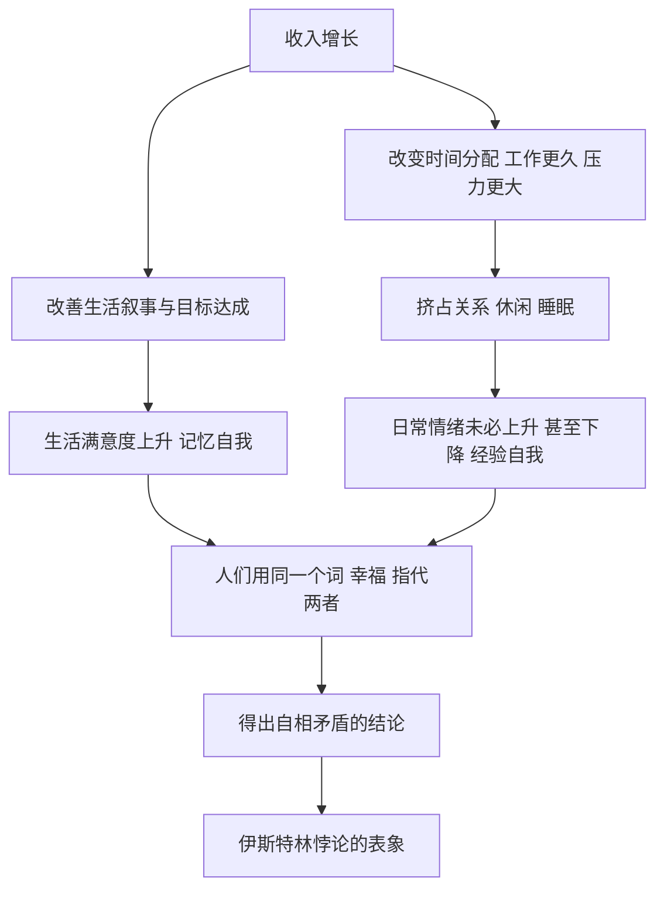

# 20｜幸福到底是什么？

> 财富增长为什么没有让幸福感同步提升？

---

## 一、先说结论

卡尼曼认为，“幸福”不是一个问题，而是两个问题。

一个是“你此刻的情绪体验如何”，属于经验自我；另一个是“你如何评价自己的一生”，属于记忆自我。二者受不同因素影响：**生活满意度**与收入、地位、目标达成关系更大；**当下的情绪体验**与健康、亲密关系、每天在做什么关系更大。

收入增长而幸福感不涨的伊斯特林悖论，很大程度上来自把这两件事混为一谈：**钱能改善“评价”，却未必买到更多“愉快”。** 卡尼曼给出的不是一份幸福配方，而是一句提醒——先分清你问的是哪一个幸福，否则讨论根本无法进行。

---

## 二、我们先理解一个问题

请回答两个问题，不必告诉别人，只要诚实。

第一个：“你对自己现在的生活满意吗？”给个一到十分的分数。

第二个：“你昨天大部分时间，感觉愉快吗？”

这两个问题看起来都在问幸福，可答案经常不一致。有人对生活整体很满意，却常常焦虑；有人收入不高，但一天里大多数时刻心情不错。如果把两个答案都叫“幸福”，就会立刻混乱——同一份生活，既可以“很满意”，又“不开心”。

问题于是变成了：为什么“幸福”这一个词，会指向两种不同的东西？这看起来像文字游戏，其实是全书的最后一问：我们一直在追求的幸福，追的到底是哪一个？

---

## 三、作者到底提出了什么观点？

卡尼曼主张把幸福研究拆成两个对象：

- **生活满意度**：记忆自我的评价。你对自己的人生整体打分，依据是目标是否达成、和别人比处于什么位置、生活是否符合期待。
- **当下的情绪体验**：经验自我的状态。你一天里有多少时刻感到愉快、享受、舒适，有多少时刻感到紧张、烦躁、低落。

他借助大样本的日常调查发现两条规律。第一，**收入对生活满意度的影响更明确、更持续**；第二，**收入对日常情绪的影响存在一个“够用”的门槛**，据他们当时的分析，这个门槛大约在年收入七万五千美元（以当时美元计），超过之后，日常情绪的改善明显放缓。

这里必须澄清一个归属：**伊斯特林悖论不是卡尼曼提出的**，它来自经济学家理查德·伊斯特林的研究。卡尼曼的贡献在于用“两个自我”去解释它——横截面看，富国的人平均更满意；时间序列看，一个国家越富，国民平均满意度却未必同步上升。两者不矛盾，因为被测量的从来不是同一个东西。

---

## 四、把这个观点翻译成人话

想象你在给自己记两本账。

第一本叫“日记”，一年三百六十五天，每天记一句“今天心情如何”。这是经验自我的账。

第二本叫“年终总结”，到了年底只回答一个问题：“这一年你满意吗？”这是记忆自我的账。

现在你换了一份收入翻倍、但天天加班的工作。会发生什么？

“年终总结”那一本可能变好看了：收入上去了，履历漂亮了，目标推进了，“我过得更好”这句话说得出口。可“日记”那一本可能变差了：更累、更少陪家人、睡眠更差，“我没那么开心”也是真的。

两句都对。这就是关键：**钱首先改善的是叙事，不是感受。** 而“幸福”这个词，同时指代这两本账，所以一谈就乱。

---

## 五、为什么会这样？

把收入的两条影响路径分开看，就清楚了：

关键在于 **A → D**：收入不只是一个数字，它还改变你如何花时间。而日常情绪，恰恰主要由“时间花在哪里”决定，而不是由“账户里有多少”决定。

再加上适应与比较：涨薪的快乐很快被适应，参照点随之上移。你不再和五年前的自己比，而是和同事、邻居、社交媒体上的人比。于是收入在涨，满意度的基线也在涨，两者的差距没有想象中那么大。

---

## 六、举一个现实生活中的例子

伊斯特林悖论。

半个多世纪里，许多国家的人均收入增长了好几倍：家里有了洗衣机、冰箱、汽车、空调，医疗条件与预期寿命大幅改善。按常理，人应该比祖辈幸福得多。可当调查者问“总体上，你对生活满意吗”，平均分并没有同步翻倍。日本、美国等国的长期追踪中，都出现过这种“收入涨、满意度平”的图形。

这就是伊斯特林悖论：在同一时点横着比，越富的人越满意；随时间竖着比，整个国家变富，平均满意度却没有同比例上升。

常见的解释有两条。一条是**适应**：好日子过久了就变成背景，不再带来额外快乐。另一条是**比较**：参照点会跟着往上移，你比的不是过去的自己，而是身边的人。

卡尼曼会补上第三条解释：这也和“问的是哪个自我”有关。收入最能稳定改善的，是“我对人生进展的评价”；而每一天的心情，更多受睡眠、通勤、家庭关系、工作是否有意义这些因素的影响。你涨了薪，却可能因此每天多通勤一小时——第一本账变好了，第二本账变差了。

---

## 七、回到书中重新理解

读到这里，全书正好回到了起点。

开头提出的，是两套系统：系统 1 快、自动、凭直觉；系统 2 慢、费力、讲逻辑。中间那些偏差——可得性、代表性、锚定、损失厌恶——本质上都是同一句话的不同版本：系统 1 先给出了一个自信的答案，而系统 2 没有及时复核。

到了最后，卡尼曼把镜头从“判断”转向“人生”，发现连“幸福”这种最私人的问题，也被同一套结构分裂了。经验自我逐刻地感受，快速、自动、沉默，像系统 1；记忆自我事后搭建叙事、给出评价，缓慢而费心，更像系统 2 的工作方式。我们以为“幸福”是一个统一的东西，其实是两个系统在同一个问题上给出了两个层面的答案。

所以全书以“两个自我”和“幸福”收尾，并不是换了个话题，而是**把同一套框架从判断延伸到了生活本身**。你如何做判断，决定了你如何过日子；你用哪一个自我打分，决定了你觉得自己过得好不好。

---

## 八、这个观点背后还有什么？

有几个前提值得拎出来。

**第一，这是一个“测量问题”先于“价值问题”的例子。** 在讨论“怎样更幸福”之前，必须先澄清“你说的幸福指什么”。定义不清，任何比较都是空转。

**第二，卡尼曼的态度是克制的。** 他不宣称幸福有唯一答案，也不给处方。他做的是把一个模糊的大词，拆成可研究、可测量的部分。

**第三，要警惕聚焦错觉。** 一旦你被问“你幸福吗”，你会从记忆里挑出最显眼的东西——通常是收入、婚姻、健康——然后被它主导，误以为它就是你整体生活的重量。提问本身，会塑造你给出的答案。

**第四，它牵出一个分配问题。** 政策若只盯 GDP，优化的是记忆自我的评分；若真正关心日常体验，就得去管通勤、照护、健康与社区生活质量。指标选哪一个自我，决定了资源流向哪里。

---

## 九、这个观点有问题吗？

有问题，而且这一领域至今争议不断。

**第一，测量本身就有分歧。** 关于“幸福”如何测量，学界存在不同解释与争论：自我报告会受提问顺序、当时心情、文化规范影响，东亚受访者常更保守；跨国比较的可比性同样存疑。

**第二，伊斯特林悖论的结论并不统一。** 一些研究使用更大样本、更细致的测量方法后指出，长期看收入与生活满意度仍存在正相关，悖论可能部分来自测量方式与比较基准；也有研究支持“门槛效应”确实存在。两派都拿得出证据。

**第三，“门槛说”后来被修正。** 后续一些更大规模的研究发现，收入与情绪体验之间的正相关在很高收入区间依然存在，只是斜率趋缓，未必存在一个清晰的“够用就好”的断点。也就是说，卡尼曼当时依据的数据，被更新的数据部分改写。

**第四，还有一个哲学争议。** 主观感受是否就是幸福的全貌？一些哲学家与心理学家认为，意义感、关系质量、德性不能被简单还原为“感觉良好”。一个当下不算愉快、但活得有意义的人生，未必更差。

所以更准确的说法是：**区分两种幸福是卡尼曼的重要贡献，但每一种如何测量、二者如何加权，至今仍没有共识。**

---

## 十、今天再看这个观点

以下部分是幸福研究的现代延伸，不是卡尼曼的原话。

在社交媒体时代，“生活满意度”变成了一个高度可见、也高度被比较的指标：别人晒的旅行、房子、成就，持续抬升你的参照点。这本质上是用记忆自我的素材，去骚扰经验自我的日常。于是出现一种现代病：对人生的“评分”不低，但每天都不太开心。

与此同时，正念、睡眠、运动、关系这些改善经验自我的东西，恰恰是经济叙事里最难定价、也最不进入 KPI 的部分。卡尼曼的框架在这里有一个很实际的用途：当你觉得自己不幸福时，先问一句——**出问题的是“我对人生的评价”，还是“我每天的时刻”？** 前者也许需要重新设定目标与比较对象，后者也许只需要多睡一小时、少刷一会儿手机、把晚饭留给人。

两种幸福的改善方式不同，用错了药，再努力也无效。

---

## 十一、这一篇真正应该记住什么？

1. **幸福不是一个问题，而是两个：当下的体验，与对人生的评价。**
2. **二者受不同因素影响：收入影响评价更明显，关系与时间影响体验更明显。**
3. **伊斯特林悖论：宏观上收入增长，满意度未必同步。**
4. **适应与比较会不断抬高参照点，让收入的快乐打折。**
5. **卡尼曼不给配方，他给的是澄清——先分清你问的是哪个幸福。**
6. **而这两个自我，本质上是开篇两套系统在“人生”这个问题上的投影。**

---

## 十二、留一个问题

> 如果“我很满意我的人生”和“我今天并不快乐”可以同时为真——
> 那么当你说“我想过得更幸福”时，
> 你到底想改变的是那份年终总结，还是明早醒来的那一刻？

---

读到这里，全书回到了起点。

第 01 篇里，我们认识了系统 1 和系统 2：一个快而自动，一个慢而费力；一个先给出直觉，一个负责事后复核。走完这二十个问题你会发现，那些偏差、那些自信、那些关于得失与幸福的困惑，说到底都是同一件事的不同面孔——**我们在很多问题上，既比自己以为的更能干，也比自己以为的更可预测地犯错。**

卡尼曼没有给我们一份“从此不再犯错”的说明书。他做的，是给这些错误起名字。名字本身不解决问题，但它让你有机会在错误再次发生时认出它。至于这份地图怎么用，答案不在书里，也不在我这里——它取决于你愿意对自己的哪一部分保持清醒。

两套系统是你的，两个自我也是你的。现在，轮到你形成自己的理解了。

