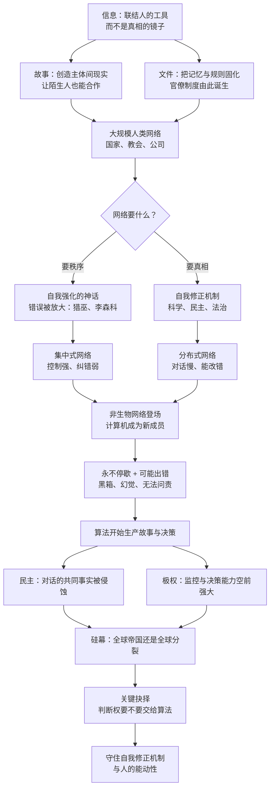

# 《智人之上》深度解读系列

## 系列简介

《智人之上：从石器时代到 AI 时代的信息网络简史》是尤瓦尔·赫拉利继《人类简史》《未来简史》之后的又一部大历史著作（中信出版集团，2024 年，林俊宏译）。这一次，他把镜头对准「信息」本身：从口口相传的故事，到泥板、档案与印刷机，再到今天永不休息的算法网络。

赫拉利要回答的核心问题是：人类明明拥有越来越强的信息能力，为什么却一再走向自我毁灭？他的答案是：我们一直误解了信息——以为信息是通向真相的阶梯，而它真正的功能是联结人、创造秩序。秩序可以建立在幻觉之上，而且历史上常常如此。

这本书的价值不在于预测 AI 会做什么，而在于给出一套历史坐标系：让我们看清民主与极权各自作为「信息网络」的强弱，看清自我修正机制为什么是文明最稀缺的资产，也看清这一次「新成员」入场与印刷术、广播到底有什么本质不同。

本系列按「概念 → 机制 → 制度 → 历史 → 抉择」五个部分拆解全书，共 21 篇。每篇只回答一个核心问题，并明确区分赫拉利的观点、历史事实与学界争议。

---

## 全书核心问题

| 层次 | 核心问题 | 本书的回答方向 |
|---|---|---|
| 信息层（是什么） | 信息到底是什么？它为什么存在？ | 信息的第一功能是联结人、创造秩序，而不是反映真相；真相只是信息的一种特殊用法 |
| 网络层（怎么运转） | 人类信息网络靠什么运转，又为什么会失灵？ | 靠故事（联结）、文件（固化）、决策机制（分配权力）；失灵源于自我强化，而纠正源于自我修正机制 |
| 制度层（谁来做主） | 民主与极权作为两种信息网络，各自强在哪、弱在哪？ | 分布式网络靠对话与纠错，慢但能改错；集中式网络靠控制，快但一旦错了就回不了头 |
| 智能层（非人成员） | 当网络里出现非人智能，会发生什么？ | 计算机不是工具而是「成员」：它能自己生成故事、自己做决定，却不需要理解世界 |
| 抉择层（怎么办） | 人类还有选择吗？该守住什么？ | 历史不是必然的，但窗口很窄；要守住判断权与自我修正机制，而不是守住控制权 |

---

## 全书知识地图

---

## 全系列目录

### 第一部分：人类网络——信息如何组织世界

#### 01｜信息是什么？为什么“信息越多”不等于“越接近真相”

核心问题：信息的本质功能是什么？为什么「信息越多就越接近真相」是一种天真的想象？

核心观点：赫拉利认为，信息的第一功能是联结人、创造秩序，而不是如实反映现实。真相是信息的一种特殊用法，而不是它的常态；信息越多，既可能更接近真相，也可能更远离真相。

理解难度：★★☆☆☆

关键词：天真信息观、联结、真相与秩序、信息网络

---

#### 02｜故事：为什么几百万人能相信同一个不存在的东西

核心问题：为什么人类能靠「故事」实现超大规模的合作？

核心观点：故事创造的是「主体间现实」——只要足够多的人共同相信，它就能像事实一样起作用。故事的力量来自它的联结能力，而不是它的真实性。

理解难度：★★☆☆☆

关键词：主体间现实、共同想象、神话、大规模合作

---

#### 03｜文件：为什么“纸老虎”也会咬人

核心问题：文字与官僚制度如何让权力更强，同时也更僵化？

核心观点：文件是跨越时空的「分布式记忆」，让国家、教会、公司能够执行统一规则；但一旦文件成为权威来源，它就会反过来支配书写它、崇拜它的人。

理解难度：★★★☆☆

关键词：文字、官僚制度、档案、纸老虎、分布式记忆

---

#### 04｜错误：信息网络为什么会集体发疯

核心问题：错误如何在网络里自我强化，而不是被及时纠正？

核心观点：网络天生倾向于自我强化：一个错误一旦成为共识，就会反过来塑造人们看到的「证据」。欧洲猎巫与苏联李森科事件，是同一套机制在不同时代的上演。

理解难度：★★★★☆

关键词：自我强化、猎巫、李森科、回音室、集体错觉

---

#### 05｜真相与秩序：为什么信息网络的首要任务不是求真

核心问题：真相与秩序为什么会冲突？网络通常会选择哪一个？

核心观点：真相昂贵而痛苦，秩序廉价而有效，所以网络天然偏好秩序，只在代价足够大时才为真相让步。权力与真相之间的关系是不对称的：权力可以没有真相，真相却很难没有权力保护。

理解难度：★★★★☆

关键词：真相、秩序、权力、信息成本、沉默

---

#### 06｜自我修正机制：什么样的网络能从错误中活下来

核心问题：为什么有的信息网络能从错误中恢复，有的却越陷越深？

核心观点：一个网络的强大不在于它不犯错，而在于它有没有自我修正机制：独立的机构、可被质疑的权威、对错误的公开追责。科学、民主与法治，是三种最典型的自我修正机制。

理解难度：★★★★☆

关键词：自我修正机制、科学、制度设计、问责、纠错

---

### 第二部分：非生物网络——当网络里出现非人成员

#### 07｜新成员：计算机为什么和印刷机不一样

核心问题：为什么说计算机不是「工具」，而是信息网络里的「新成员」？

核心观点：印刷机只能复制人类写下的文本，计算机却能自己生成文本、自己做出决定。信息网络里第一次出现了不需要理解世界、却能行动的「非人」参与者。

理解难度：★★★☆☆

关键词：新成员、非人智能、行动者、印刷机、工具与成员

---

#### 08｜永不停歇：为什么“不睡觉”的算法改变了权力结构

核心问题：当网络永远在线、永不遗忘时，权力会发生什么变化？

核心观点：计算机不疲倦、不遗忘、可无限复制，这让持续监控第一次变得廉价。权力的关键从「谁掌握信息」转向「谁能实时处理信息」，而人类第一次在这种比较里全面落后。

理解难度：★★★☆☆

关键词：永不停歇、持续监控、实时处理、注意力、数据

---

#### 09｜可能出错：AI 的错误和人的错误有什么根本不同

核心问题：AI 会犯错吗？它的错误为什么更难被发现、更难被追责？

核心观点：AI 的错误不是「算错了」，而是黑箱式的：它能给出结果，却给不出可检验的理由。幻觉、偏见与不可解释性叠加，使传统的问责机制第一次失效。

理解难度：★★★★☆

关键词：幻觉、黑箱、可解释性、问责、信任

---

#### 10｜当算法开始讲故事：共同想象的作者换人了

核心问题：如果故事可以由算法批量生产，人类社会秩序会发生什么？

核心观点：谁生产故事，谁就塑造现实。当算法可以 24 小时生成有感染力的叙事，人类就可能从「故事的主人」变成「故事的接收器」，而共同体赖以存在的主体间现实也会被外包。

理解难度：★★★★☆

关键词：叙事生产、算法、能动性、操纵、共同想象

---

#### 11｜智能不等于意识：AI 到底是一种什么样的存在

核心问题：AI 有意识吗？一个没有意识却足够聪明的东西，为什么更值得警惕？

核心观点：赫拉利反复强调智能与意识是两回事。AI 更像「外星智能」：它不需要主观体验就能做决定、定目标，所以我们不能用「它有没有感受」来判断它是否危险。

理解难度：★★★☆☆

关键词：智能与意识、外星智能、主体性、目标、危险

---

### 第三部分：计算机政治学——制度会被怎样改写

#### 12｜民主制度：我们还能对话吗

核心问题：民主的本质为什么是「对话」，而 AI 为什么正在破坏这场对话？

核心观点：民主是一套分布式信息网络，靠持续的对话与纠错运转。当信息环境被算法和假信息污染，对话所依赖的共同事实消失，民主就会退化成彼此喊话的部落。

理解难度：★★★★☆

关键词：民主、对话、共同事实、分布式网络、公共空间

---

#### 13｜“英明领袖”的神话：为什么集中决策总是灾难收场

核心问题：为什么「把决定权交给最英明的人」这种想法总会失败？

核心观点：信息天然是分散的，任何单点都不可能掌握全部。把决策权集中到一个人（或一个算法）手里，等于关掉整个网络的纠错能力——历史上的大灾难几乎都遵循这一剧本。

理解难度：★★★☆☆

关键词：绝对正确、决策集中、纠错、领袖神话、信息分散

---

#### 14｜极权主义：所有力量归于算法？

核心问题：AI 会让极权制度变得不可战胜吗？

核心观点：AI 确实给了极权前所未有的监控与决策能力，但集中式网络天生缺乏纠错：没人敢指出错误，系统就会越走越偏。极权在 AI 时代既更强大，也更脆弱。

理解难度：★★★★☆

关键词：极权主义、集中式网络、监控、纠错、脆弱性

---

#### 15｜硅幕：全球帝国还是全球分裂

核心问题：AI 时代的世界，会走向数字帝国还是数字分裂？

核心观点：数据、芯片与算法的竞争，正在把世界切成两个数字阵营。赫拉利真正担心的不是分裂本身，而是出现一种用算法治理世界、却没有任何人能对它问责的「数字帝国」。

理解难度：★★★★☆

关键词：硅幕、数字帝国、地缘政治、技术主权、问责真空

---

#### 16｜谁来决定：把决策权交给算法意味着什么

核心问题：当算法替我们做决定，人类还剩下什么？

核心观点：最危险的一步不是「机器取代人的工作」，而是「机器取代人的判断」。一旦把判断权交出去，人类可能连「想要收回」这个念头都难以产生。

理解难度：★★★★★

关键词：决策权、能动性、判断、依赖、让渡

---

### 第四部分：历史的镜子——前几次信息革命

#### 17｜印刷术的双面性：同一次信息革命，为什么既带来科学也带来宗教战争

核心问题：为什么同一种技术进步，既能解放人，也能放大疯狂？

核心观点：信息革命本身不决定结果。印刷术既催生了科学革命与宗教改革，也把仇恨与战争宣传送到每个村庄。决定方向的是制度：有没有自我修正机制，比有没有新技术更重要。

理解难度：★★★★☆

关键词：印刷术、宗教改革、科学革命、三十年战争、双刃剑

---

#### 18｜宣传机器：20 世纪的极权如何操控信息网络

核心问题：20 世纪的极权政权如何用广播和报纸统治？它和今天的算法有什么不同？

核心观点：广播与报纸是「一对多」的单向网络，极权靠它统一口径、垄断解释权。今天的算法网络是「多对多」的：中央控制更难，但操纵更隐蔽、更个性化。

理解难度：★★★☆☆

关键词：宣传、大众媒体、单向网络、垄断解释权、个性化操纵

---

### 第五部分：我们该怎么办

#### 19｜人类还有选择吗

核心问题：在技术与历史的「必然性」面前，人的选择还有多大空间？

核心观点：赫拉利拒绝技术决定论：历史不是被技术推着走的，而是被无数选择累积出来的。但选择的窗口很窄，而且必须在灾难发生之前使用。

理解难度：★★★☆☆

关键词：选择、决定论、历史偶然性、时间窗口、责任

---

#### 20｜我们需要什么样的自我修正机制

核心问题：面对 AI，什么样的制度设计能让我们保住纠错能力？

核心观点：答案不是「更强的控制」，而是更强的自我修正：独立机构、可审计的算法、跨国协调，以及一个不被单一叙事吞掉的公共空间。控制只能维持秩序，修正才能保住真相。

理解难度：★★★★★

关键词：自我修正机制、算法审计、监管、全球协作、公共空间

---

#### 21｜结语：在智人之上，人类要回答的问题

核心问题：这本书最终想让我们警惕什么，又希望我们守住什么？

核心观点：赫拉利的核心警告不是「AI 会毁灭人类」，而是「人类可能已经把判断权交了出去，却还以为自己仍然在做主」。信息网络既可以连接人，也可以替代人；守住前者，是这一代人无法回避的任务。

理解难度：★★★★☆

关键词：能动性、非人智能、希望、责任、联结

---

## 推荐阅读顺序

主线就是 `01 → 21`，按认知难度分五段推进：

1. **地基（01 → 03）**：先建立「信息 = 联结工具」的基本认知，再看故事与文件如何把认知变成秩序。这一段不需要任何技术背景。
2. **机制（04 → 06）**：错误如何自我强化、真相为何让位于秩序、自我修正机制为什么稀缺。这一段是全书的解释力来源，也是后面判断 AI 的标尺。
3. **新成员（07 → 11）**：计算机作为「成员」而非「工具」入场，带来永不停歇、可能出错、算法生产故事与「智能不等于意识」四重变化。
4. **制度冲击（12 → 16）**：把标尺用回现实：民主、极权、地缘格局与决策权转移。
5. **历史与抉择（17 → 21）**：用印刷术与广播两次信息革命做对照，最后回到「人还能选择什么」。

给不同需求读者的入口：

- **想先抓骨架**：`01 → 04 → 06 → 07 → 16 → 21`，六篇读完能拿到全书的论证链条。
- **只关心 AI 与政治**：从 `12` 开始，读完 `12 → 16`，再回头补 `06` 与 `09`。
- **想练习批判性阅读**：`05`、`09`、`14`、`19` 四篇里赫拉利的判断最需要被质疑，适合边读边反驳。

---

## 例子与素材分配表（写正文前必读）

每篇的专属案例，**禁止跨篇重复使用**：

| 篇 | 专属案例（主） | 备用/对照 |
|---|---|---|
| 01 | 同一场战争的两种报道：信息量相同，结论相反 | 天气预报 vs 谣言 |
| 02 | 货币与公司：没有人见过的「法人」如何运转 | 民族与国旗 |
| 03 | 美索不达米亚的泥板档案与税收 | 教廷档案、现代公司合规文件 |
| 04 | 欧洲猎巫（1560—1630 年的加速期） | 苏联李森科事件 |
| 05 | 伽利略与教会的冲突（真相的代价） | 战时宣传与沉默 |
| 06 | 科学界的同行评议与论文撤稿 | 民主选举与和平交权 |
| 07 | 印刷机只能印人写的东西，AI 能自己写 | 自动交易与自动驾驶 |
| 08 | 客服、审核与金融风控里的 7×24 算法 | 社交平台的推荐流 |
| 09 | AI 幻觉与「看起来很像真的」引用 | 人脸识别误判与申诉无门 |
| 10 | 生成式 AI 批量生产政治叙事与广告 | 深度伪造 |
| 11 | 下棋与蛋白质折叠：聪明但无感受 | 科幻中的「非人智能」 |
| 12 | 议会辩论与公共议事传统 | 社交媒体上的「部落化」 |
| 13 | 斯大林、希特勒与「绝对正确」的代价 | 企业管理中的独裁式 CEO |
| 14 | 数字监控下的社会治理实验 | 单一算法的绩效排名 |
| 15 | 芯片出口管制与数据跨境流动 | 两套技术标准的分叉 |
| 16 | 把医疗诊断或量刑交给算法 | 导航依赖与方向感退化 |
| 17 | 古腾堡、路德与三十年战争 | 科学期刊的诞生 |
| 18 | 纳粹宣传机器与广播的普及 | 冷战时期的电台战 |
| 19 | 历史上「本来可以不同」的转折点 | 个人层面：算法推荐与自主选择 |
| 20 | 算法审计与独立监管机构 | 全球 AI 治理谈判 |
| 21 | 回到开篇问题：人类到底想要什么 | 全系列的闭环回扣 |

---

## 全系列状态

- 共 **21 篇**，分 **5 个部分**。
- 当前状态：**仅完成拆书**（本文档），正文尚未开始。
- 回复「开始写」生成第 01 篇；回复「直到写完所有篇」则连续写完（会先写 01 作样板，再并行推进其余）。
- 写完后如需网页版，回复「转 html」即可生成卡片式目录页与全部文章页。
