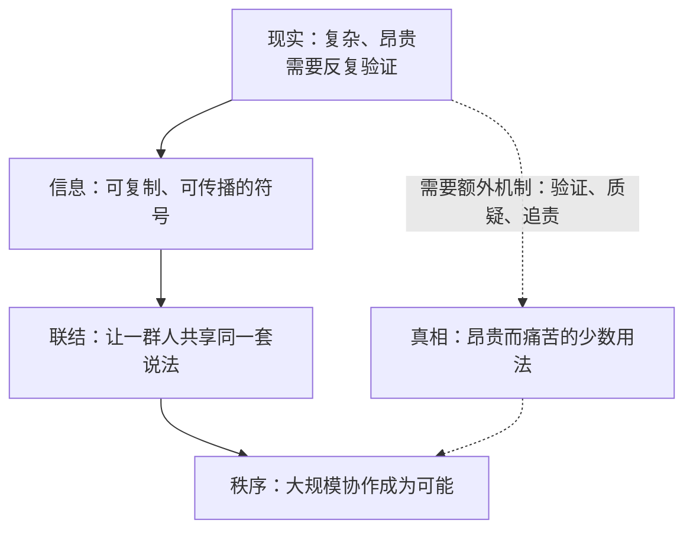

# 01｜信息是什么？为什么“信息越多”不等于“越接近真相”

> 信息的作用到底是什么？为什么信息越多，我们反而可能离真相更远？

---

## 一、先说结论

我们从小被教：多看书、多听、多了解，就会离真相更近。赫拉利说，这个假设本身就站不住。信息的默认功能不是反映真相，而是把人联结起来、创造秩序。真相是信息的一种特殊用法，需要额外的机制和代价才能保住。

所以，信息变多不等于真相变多。一个网络可以既信息爆炸，又对现实一无所知——只要所有人相信同一套东西，它照样能高效运转。

## 二、我们先理解一个问题

先做一个思想实验。

假设有两个人。第一个人读过一百篇关于某种疾病的医学论文，第二个人在微信群里看过一百条养生偏方。谁“知道得更多”？

这个问题没有标准答案。第二个人可能掌握了一百个听起来非常具体的案例。但如果问谁更接近真相，答案就取决于一个前提：他接收到的信息，有没有被某种机制要求过“必须和事实对得上”。

这个前提，就是本文要处理的问题：信息到底是什么？它是现实的镜子，还是别的什么东西？

## 三、作者到底提出了什么观点？

赫拉利把“信息是现实的表征，所以信息越多就越接近真相”这套默认想法，称为天真的信息观。

他认为这套想法从起点上就错了。

在他看来，信息最本质的功能是联结：它把不同的人接进同一个网络，让大家能够协作。而要联结人，最有效的方式往往不是告诉人们真相，而是给他们一个可以共同相信的东西。

换句话说，信息不等于真相，信息更像胶水。

赫拉利还往前走了一步：信息与真相之间没有必然联系。真相是信息的一种特殊用法，而且是一种非常昂贵的用法。

## 四、把这个观点翻译成人话

把信息想象成胶水。

胶水的任务是让两块木头粘在一起。它粘得牢不牢，和这两块木头是不是“真实存在”没有关系。你可以用胶水粘好一把椅子，也可以用胶水把一堆错误的东西粘成一个看起来很结实的形状。

一个社会也是这样。让几百万人愿意一起交税、修路、打仗的，不是“大家都掌握了事实”，而是“大家都相信同一套说法”。这套说法可以是真的，也可以是假的，但它必须是被共享的。

这也解释了为什么假消息常常比真消息跑得快：假消息可以被专门设计成“容易被相信、容易被转发”，真消息则不能——它要受事实的约束。

## 五、为什么会这样？

把这条推理链拆开，会清楚很多。

第一步，现实本身是复杂的。要知道一件事的真相，通常需要检验、需要数据、需要有人愿意承认自己错了。

第二步，信息是符号，它可以脱离现实被复制。一句话从一个人传到另一个人，速度远远快于“验证这句话”的速度。

第三步，只要足够多的人相信同一套符号，他们就能协作——这就是秩序。

第四步，秩序一旦形成，它会反过来奖励那些维持共识的信息、惩罚那些破坏共识的信息，哪怕后者才是真的。

所以，真相不是信息的默认产物，而是需要额外机制才能保住的东西。

## 六、举一个现实生活中的例子

假设某个小区群里突然出现一条消息：物业要把地下车库改建成商铺。

这条消息可能是真的，可能是有人理解错了，也可能是故意编的。但接下来发生的事，和“它是不是真的”关系不大：

有人转发；有人补充细节（“我昨天看到有人来测量”）；有人提供历史证据（“三年前他们就干过一次”）；有人开始组织维权。一天之内，群里出现了几百条信息。

信息量暴增。而真相呢？可能只需要打一个电话就能问清楚，但没有人打——因为在这个已经形成的网络里，“打电话去核实”成了一种不合群的行为。

这个例子说明的正是赫拉利的判断：信息的作用是联结，而联结的结果是秩序。这个小区群确实被联结起来了，甚至形成了行动能力。但它是否因此更接近真相，是另一回事。

## 七、回到书中重新理解

现在回头看赫拉利在第一章里的论证，就容易理解了。

他先拆掉那个默认假设：我们以为信息是“现实的原料”，信息越多，我们对现实的把握就越准。然后他指出，这个假设解释不了一个现象——人类的信息技术在持续进步，但人类并没有变得更明智。

他的说法是：信息的主要功能不是揭示真相，而是创造新的现实。故事、法律、货币、国家，这些东西都不是“被发现的”，而是“被创造的”。

他还专门讨论了信息论创始人香农的定义。在香农那里，信息的多少与“意义”无关：一条消息能传输多少比特，和它是否真实毫无关系。赫拉利认为，这个技术定义其实比我们的直觉更接近事情的本质——信息是可以被传递的差异，而不是对现实的忠实描述。

## 八、这个观点背后还有什么？

第一，它有一个隐含前提：信息的生产者和接收者的利益往往并不一致。谁有动机去生产信息？通常是那些希望改变别人行为的人。这决定了信息从出生起就带着“目的”，而不是“真相”。

第二，它解释了为什么“自由竞争的信息市场”不必然产出真相。因为在这个市场上，最好卖的不是最真的信息，而是最容易被相信、最容易被转发、最能让人产生归属感的信息。

第三，它和后面几篇的关系很紧密：故事是信息用来联结人的主要形式（下一篇）；文件是信息被固化之后的产物（第三篇）；而自我修正机制，则是人类发明出来、专门用来对抗“信息不等于真相”这一事实的工具（第六篇）。

## 九、这个观点有问题吗？

有几个地方值得警惕。

第一，它容易被误读成“没有真相”。赫拉利并不否认真相存在——他反复强调真相是可能的，只是很贵。但“信息不等于真相”这句话在传播中很容易被简化成“真假无所谓”，而这与他本人的立场正好相反。

第二，“信息”这个词在他的论证里承担了太多含义。日常语言里的信息（消息、知识）、香农意义上的信息（可传输的差异）、社会意义上的信息（维系网络的说法），其实是三种不同的东西。把它们放在同一个词下面讨论，会让论证显得比实际更有力。这一点在书评中有争议，一些评论者认为他对信息的定义过于宽泛。

第三，他可能低估了真相的长期竞争力。从长时段看，那些能持续做出准确预测的网络——比如科学——确实获得了巨大的力量。如果真相在长期竞争里毫无优势，我们很难解释科学的成功。

第四，他的基调明显偏悲观。他倾向于强调“网络偏好秩序”，但历史上也有一些社会长期维持了对真相的尊重。这需要解释，而不是简单归因于某个制度。

## 十、今天再看这个观点

以下是基于赫拉利思想的现代延伸，不是作者原话。

在推荐算法时代，“信息即联结”这句话变得更直观了。平台优化的目标不是让你更接近真相，而是让你留在网络里、继续互动。它追求的是联结强度和停留时间，而不是准确性。一个把“提高互动率”当作唯一目标的系统，会自然偏向那些最能引发情绪的内容。

赫拉利本人在书里更关心的是下一步：当生产内容的不是人，而是可以无限生成、永不疲倦的算法时，“联结”这件事会被推向什么方向。那是第二部分要处理的问题。

## 十一、这一篇真正应该记住什么？

1. 信息的第一功能是联结，不是反映真相；真相是信息的一种特殊用法，需要额外机制才能保住。
2. “信息越多越接近真相”是一个未经检验的假设，在很多场景下是错的。
3. 假消息传播得更快不是偶然：它的生产目标就是“被相信”，而不是“与事实相符”。
4. 判断一个信息网络的好坏，不能看它生产了多少信息，而要看它有没有能力发现自己在骗自己。

## 十二、留一个问题

如果信息的主要功能是联结而不是求真，那么“真相最终会胜出”这句话，究竟是一个被历史验证过的规律，还是一个我们愿意相信的故事？
