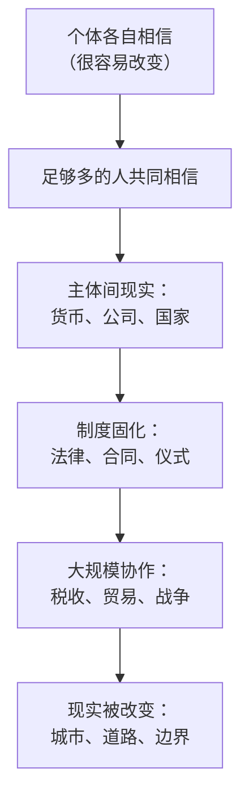

# 02｜故事：为什么几百万人能相信同一个不存在的东西

> 为什么人类能靠“故事”实现几百万人规模的大协作？这种能力从哪里来，代价是什么？

---

## 一、先说结论

因为故事能创造出一种特殊的东西：主体间现实。只要足够多的人共同相信，它就会像事实一样起作用——货币、公司、国家、法律，都属于这一类。故事的力量来自它的联结能力，而不是它的真实性。

这也意味着，让人类合作得最好的东西，和让人类看清现实的东西，往往不是同一个。

## 二、我们先理解一个问题

先看一个奇怪的事实。

你手里的一张纸，或者手机里的一串数字，为什么能换来面包？这张纸不能吃、不能穿，它的价值不是物理属性带来的。

再想一个更奇怪的：公司。一家公司没有身体、没有意识，但它可以签合同、被起诉、纳税、雇人、破产。如果所有员工明天都换掉，公司还是那家公司。

这些东西都有一个共同点：它们只存在于人们的共同相信之中。问题是——这种“共同相信”是怎么做到的？

## 三、作者到底提出了什么观点？

赫拉利的答案是：靠故事。

他区分了三种现实。第一种是客观现实，比如河流、石头，不管你怎么想它都在那里。第二种是主观现实，比如你的牙疼，只有你自己感受得到。第三种是主体间现实——它既不在物理世界里，也不在某个人的脑子里，而是存在于“很多人共同相信”这件事里。

货币、国家、法律、公司、民族，都是主体间现实。

赫拉利的观点是：故事是人类建造大规模网络的默认工具。因为要让互不相识的人协作，最省力的办法不是让他们亲眼验证每件事，而是给他们一个共同相信的东西。故事不需要真实，只需要被共享。

## 四、把这个观点翻译成人话

可以把故事理解成一套“多人协作的操作系统”。

一台电脑要跑程序，需要操作系统规定好内存怎么用、文件怎么存。一群人要一起干活，也需要一套规定好“什么算数”的说明书：什么算钱、谁算自己人、违规会怎样。

这套说明书必须是共享的，否则协作无法进行。但它不必是准确的——它只需要足够多的人照着执行。

这也是为什么故事往往比事实更有力量：事实需要被验证，故事只需要被相信。

## 五、为什么会这样？

把故事变成现实的链条，大致是这样的。

第一步，一个人相信某件事，这很脆弱，随时可能改变。

第二步，当足够多的人同时相信，就出现了质变：这个信念获得了独立于任何个人的存在。

第三步，为了让这种存在稳定下来，人们会发明制度：法律条文、合同格式、宣誓仪式。

第四步，制度让协作可以规模化——几百万互不相识的人可以一起交税、修路、打仗。

第五步，也是最有意思的一步：这些协作最终改变了物理世界。边界真的被划出来了，城市真的被建起来了。故事于是看起来像是“本来就存在的东西”。

## 六、举一个现实生活中的例子

看一家公司。

它没有身体，你不可能在街上遇到“某科技公司”这个实体。你遇到的只是员工、办公室、服务器。但公司是真实存在的：它可以签一份合同，如果违约，法院会强制执行；它可以被收购，价格是双方谈出来的；它可以存在一百年，尽管创始人早就去世了。

更关键的是：公司之所以能运转，是因为所有相关方都“假装”它是个人。会计要把它当成一个独立的财务主体；税务要把它当成纳税人；员工签合同时，对方写的是公司的名字。

没有人见过公司，但所有人的行为都围绕着它展开。这就是主体间现实——它不是幻觉，因为它的后果是真的；它也不是物理事实，因为它只靠共同相信而存在。

## 七、回到书中重新理解

赫拉利在第二章里处理的就是这条线索：故事如何把人类网络连接起来。

他指出，人类网络与动物群体的根本区别不在于个体智力，而在于联结规模。黑猩猩的群体上限大约几十只，而人类可以组织起几百万人的协作——靠的不是彼此认识，而是共享同一套故事。

他还特别提醒：故事的作用是“联结”，不是“描述”。评价一个故事，不能只问它真不真，还要问它把谁连在了一起、又排除了谁。

而在《智人之上》里，他比《人类简史》时期更强调故事的危险：一个成功的故事会自我强化，最后连它的受益者都被它说服。这就引出了下一篇要讨论的东西——故事需要被写下来、被制度化，而一旦写下来，它就开始反过来支配人。

## 八、这个观点背后还有什么？

第一，它有一个隐含前提：信任是可以被制造出来的。大规模协作的前提不是“互相信任的人”，而是“让人可以互相预期的规则”。故事提供的正是这种预期。

第二，故事必须被固化才能长久。口头故事会变形、会失传，所以它需要文字、档案和制度——这正好是下一篇的主题。故事负责联结，文件负责维持。

第三，它解释了权力的来源。谁掌握故事的编辑权，谁就掌握了“什么算数”的定义权。这也是为什么历史上争夺最激烈的往往不是土地，而是叙事权。

## 九、这个观点有问题吗？

有几个地方需要打问号。

第一，它很容易滑向“一切都是故事”的虚无主义。赫拉利本人并不这么认为——他区分了“故事”和“可以修正的故事”，也承认有些故事（比如科学）必须接受现实检验。但“主体间现实”这个概念在传播中确实很容易被简化成“真假无所谓”。

第二，这个概念并不完全是他的原创。社会学家涂尔干讨论过“集体表象”，哲学家塞尔提出过“制度性事实”，赫拉利的贡献更多在于叙述方式，而不是概念本身。这一点在书评里是常见批评。

第三，用“故事”解释一切，可能低估了物质条件和暴力的作用。历史学界有一派更强调资源、地理和强制力：很多时候人们协作不是因为相信，而是因为别无选择。把协作一律归因于共同相信，是一种偏文化主义的解释。

第四，故事并不总是有效。大量日常协作靠的是利益计算和惩罚机制，而不是共同的信仰。如果一套制度能让违约者付出代价，人们不需要“相信”它也会遵守它。

## 十、今天再看这个观点

以下是基于赫拉利思想的现代延伸，不是作者原话。

今天最擅长生产故事的不再是祭司和诗人，而是平台和算法。推荐系统在做的事情，本质上就是批量生产“让特定人群共同相信的叙事”——只不过它的目标不是建立国家，而是维持停留时长。

这带来一个新问题：当故事的生产速度超过人类消化速度，共同相信这件事会变得更难，还是更容易？赫拉利在后面的章节里会给出他的判断：更碎片化，也更难纠正。

## 十一、这一篇真正应该记住什么？

1. 主体间现实是第三种现实：它既不是物理事实，也不是个人幻觉，而是靠共同相信存在、却能产生真实后果的东西。
2. 故事是大规模协作的默认工具，因为它的成本远低于让每个人亲自验证。
3. 故事的力量来自联结能力，而不是真实性——这是它既能建设也能毁灭的根源。
4. 谁掌握故事的编辑权，谁就掌握了定义“什么算数”的权力。

## 十二、留一个问题

如果货币、公司、国家都靠共同相信而存在，那么当足够多的人同时停止相信，会发生什么？
