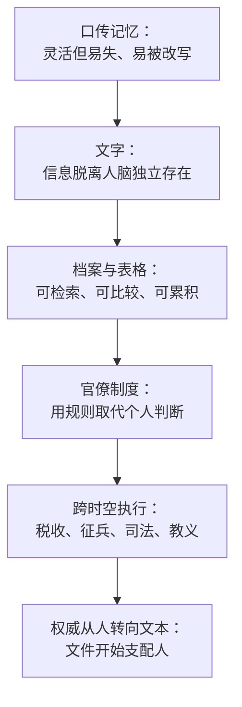

# 03｜文件：为什么“纸老虎”也会咬人

> 文字与官僚制度如何让权力变得更强，同时又让它更僵化？

---

## 一、先说结论

文件是跨越时空的分布式记忆，让国家、教会、公司能够在几百年、几千里的尺度上执行同一套规则。但文件一旦成为权威来源，它就会反过来支配书写它、崇拜它的人——纸做的老虎，真的会咬人。

这是赫拉利全书里最容易被低估的一章：真正统治现代世界的，不是国王，而是流程。

## 二、我们先理解一个问题

先想一件小事：你要办一张证明。

证明上写着你叫什么、出生在哪、父母是谁。这些信息你早就知道，但只有盖了章的那张纸才算数。如果纸上的信息和你本人不符，麻烦的是你，不是纸。

再想一个更大的场景：一支十万人的军队，如何保证每个人都知道自己该站在哪里、听谁的命令？一个横跨欧亚的帝国，如何向几千万人收税，而不被中间人贪掉一半？

这两个问题的答案都是同一个：靠文件。

## 三、作者到底提出了什么观点？

赫拉利的判断是：文字发明之后，信息第一次可以脱离人脑独立存在。

在此之前，所有信息都储存在人的记忆里。人会忘、会死、会为了自己的利益改动记忆。有了文字，信息可以被固定在泥板、纸莎草、纸张上，不随人而去。

而固定下来的信息，催生了一种全新的组织形式：官僚制度。

赫拉利指出，官僚制度的本质是“用规则取代个人判断”。它不关心某个具体的人怎么想，只关心表格里的字段是否齐全、流程是否走完。这让组织获得了前所未有的稳定性和规模——但也让组织变得僵硬，甚至荒唐。

他的比喻是“纸老虎”：文件看起来是最没有力量的东西，但它咬人的时候，比真老虎更彻底。

## 四、把这个观点翻译成人话

可以把文件理解成“组织的记忆”。

一个人的记忆是软的：会模糊、会美化、会遗忘。一个组织的记忆必须是硬的，否则它无法长期存在。你不可能靠“大家都记得”来管理一千万人的税收。

所以组织需要把记忆写下来，并且规定：写下来的版本优先于任何人的回忆。这就是为什么在绝大多数机构里，“以文件为准”是一条铁律。

这条铁律的代价是：组织的判断力被外包给了文件。文件说你是客户，你就是客户；文件说你不是，你就不是。

## 五、为什么会这样？

从口传到官僚制度，中间有一条清晰的演化链。

第一步，口传记忆灵活但不可靠，无法支撑大规模长期组织。

第二步，文字把信息固定下来，于是它第一次可以被“归档”。

第三步，归档带来一个质变：信息可以被检索、比较、统计。一旦能统计，就能管理。

第四步，为了管理，组织发明了流程和表格，把判断变成执行。

第五步，组织终于可以在极大尺度和极长时间上运作——但也把权威交给了文本。

第六步，也是最反直觉的一步：文件开始支配人。不是国王在统治，而是“规定”在统治；不是人在解释规则，而是规则在解释人。

## 六、举一个现实生活中的例子

看一张报销单。

一位员工出差回来，把发票贴好，填单，提交。财务审核，发现少了一张餐饮发票的抬头，于是退回。员工补上，再提交，又发现日期跨月，需要额外说明。

整个过程里，没有人怀疑这笔钱是不是真的花在了业务上——那不重要。重要的是文件是否齐全。

再往深一层看：为什么财务必须这么死板？因为财务个人的判断无法被审计。如果财务说“我看他挺可信的，就报了吧”，一旦出事，责任无法界定。而如果财务说“按制度要求，他缺一张发票”，那么无论结果如何，财务都没有责任。

于是文件成了责任的载体。这既是它强大的原因，也是它僵化的原因。

## 七、回到书中重新理解

赫拉利在第三章里，从美索不达米亚的泥板讲起。

他提到，人类最早的文字记录，大部分不是诗歌和神话，而是账目：多少头羊、多少斗大麦、谁欠谁多少。书写最初是一项会计技术。

然后他讲了一个关键转折：当文本获得权威，权威就从人转移到了文本上。教会、帝国、公司之所以能长期存在，是因为它们把规则写进了文件，并且让文件高于个人。

他还讨论了宗教经典的例子：一部经典的形成，本身就是一个官僚过程——哪些文本入选、哪些被排除、谁有权解释，都需要机构来决定。赫拉利由此提出一个尖锐的判断：很多看起来最神圣的东西，其实是文件系统的产物。

## 八、这个观点背后还有什么？

第一，它有一个隐含前提：大规模组织最需要的不是聪明，而是可预期。文件提供的正是可预期——代价是牺牲灵活性。

第二，它揭示了“责任”的技术本质。在文件系统里，合规比正确更重要，因为合规可以被检查，正确很难。这是很多荒唐流程的根源，也是它们能长期存在的原因。

第三，它和上一篇的关系是互补的：故事负责联结，文件负责维持。没有故事的联结，网络无法形成；没有文件的固化，网络无法持久。

第四，它也埋下了一个隐患：当人被简化成文件里的字段，组织就会失去看见真实世界的能力。这一点在下一篇讨论错误时，会变成一个关键机制。

## 九、这个观点有问题吗？

有几个地方值得质疑。

第一，这一章的叙述偏技术决定论：好像文字一出现，官僚制度就必然出现。但历史学界更倾向于认为，官僚制度的形成与具体的政治竞争、战争压力、财政需求密切相关，文字只是必要条件之一。

第二，“纸老虎咬人”这个比喻很漂亮，但它掩盖了另一个事实：文件系统从来不是中立的，它总是被某些人控制。赫拉利花了较多篇幅讲文件如何约束人，较少讨论谁在设计这些文件、谁从中获益。

第三，他把宗教经典的形成主要解释为官僚过程，这在宗教研究者中是有争议的。信众会认为，这忽略了经典内容本身的宗教经验维度。

第四，他可能低估了口头传统。不少社会长期依靠口传、仪式和人际网络维持秩序，并没有发展出复杂的文书系统，但它们同样维持了相当规模的协作。

## 十、今天再看这个观点

以下是基于赫拉利思想的现代延伸，不是作者原话。

今天我们生活在一个文件系统极度膨胀的时代：数据库、账号、信用记录、医疗档案。区别在于，过去的文件由人填写、由人解释；今天的文件由系统自动生成、自动匹配。

这带来一个新问题：当系统判错的时候，你很难申诉。因为没有人“决定”了什么——是数据匹配的结果。责任被分散到了流程里，就像那张报销单，谁都按规矩办事，但结果是错的。

赫拉利在书里把这个隐患一路推到了 AI 时代：如果填表和判断都交给算法，那么“以文件为准”就会变成“以模型为准”，而模型的判断连理由都不给。

## 十一、这一篇真正应该记住什么？

1. 文件是组织的分布式记忆，它让大规模、长时段的协作成为可能。
2. 官僚制度的本质是用规则取代个人判断，它用灵活性换来了可预期性。
3. 一旦文本成为权威来源，权力就从人转移到了文件上，人开始被文件定义。
4. 合规比正确更容易被检查，所以文件系统天然倾向于“程序正确”，这是很多荒唐流程的根源。

## 十二、留一个问题

当决定你命运的不再是某个人，而是系统里的一个字段时，你该向谁申诉？
