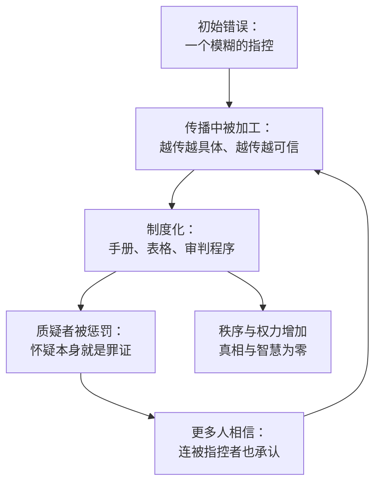

# 04｜错误：信息网络为什么会集体发疯

> 错误是如何在网络里自我强化，而不是被及时纠正的？

---

## 一、先说结论

信息网络天生倾向于自我强化：一个错误一旦成为共识，它就会反过来塑造人们看到的“证据”。欧洲猎巫与苏联的李森科事件，是同一套机制在不同时代的上演。

赫拉利的结论很冷峻：错误不会自动被纠正。纠错是一种需要被专门设计出来的能力。

## 二、我们先理解一个问题

先看一个数字。

在近代早期的欧洲，大约有三个世纪的时间，数以万计的人因为“巫术”被处死。审判者不是文盲，其中很多是受过教育的法官、神学家和法律专家。他们认真取证、认真记录、认真判决。

这件事奇怪的地方不在于“有人相信巫术”，而在于：一个现代人看来完全站不住脚的信念，被一整套严肃的制度认真执行了三百年。

一个错误，为什么没有被纠正？它是怎么被越做越大的？

## 三、作者到底提出了什么观点？

赫拉利认为，信息网络有一种内在的自我强化倾向。

他的推理大致是：信息在网络里传播时，不会像水一样越流越淡，反而会越传越“具体”。每经过一个节点，都可能被补充细节、被赋予意义。当这些经过加工的信息积累到一定数量，它们就会反过来变成“证据”。

于是形成了一个闭环：因为大家都在说，所以它是真的；因为它是真的，所以大家都要说。

赫拉利还提出一个更尖锐的判断：灾难往往不是“信息不足”造成的，而是“信息过多”造成的。关于女巫的信息越多，猎巫就越疯狂。他在书中明确写道，那场灾难是“由信息制造、又被更多信息放大”的。

## 四、把这个观点翻译成人话

可以把这个机制理解成一座回音壁。

你对着回音壁喊一声，声音反弹回来。如果你不知道那是自己的声音，你会以为有人在回应你——而且回应得很一致。

信息网络就是这样一座回音壁：当所有人都从别人那里听到同样的说法，每个人都会觉得“这么多人都这么说，那一定是真的”。共识于是自己生产了证据。

关键在于：这个过程里，没有人在撒谎，也没有人是傻瓜。每个参与者都在做看起来合理的事。

## 五、为什么会这样？

把猎巫式的错误拆开，会看到一条稳定的循环。

第一步，一个模糊的指控出现。它可能来自一次偶然的死亡、一场疾病、一次邻里纠纷。

第二步，传播过程中信息被加工：时间、地点、人物都变得更具体，故事变得更可信。

第三步，制度接手。一旦有了审判手册、有了标准化的指控表格、有了专门的职位，这个错误就有了基础设施，可以批量复制。

第四步，也是最致命的一步：质疑者被惩罚。当“不相信”本身成为可疑的证据，纠错机制就被拆掉了。

第五步，循环回到第二步，但这一次有了制度的加持，规模会成倍扩大。

## 六、举一个现实生活中的例子

看一个公司里的传言。

某天开始，有人说“公司可能要裁掉整个部门”。最初这只是一个人午饭时的猜测。

但接下来发生的事很有规律：有人补充“我看到 HR 昨天找经理谈话了”；有人回忆“去年这个时候也裁过一轮”；有人开始更新简历，并把消息告诉关系好的同事。

信息量在几天内爆炸。到这一步，传言的来源已经不重要了——重要的是它开始自我实现：因为骨干员工开始找下家，项目交付变慢，业绩下滑，管理层真的开始考虑裁员。

最后，这个传言“成真”了。所有人都会说：你看，我早就知道。

这个例子里，没有人故意造谣，也没有人被骗。是网络本身把猜测加工成了现实。

## 七、回到书中重新理解

赫拉利在第四章里，把猎巫当作一个完整的案例来解剖。

他提到那本著名的《女巫之锤》：一本由宗教裁判官写成的猎巫手册，在印刷术的帮助下大量流传，还出现了大量仿作。印刷机不只印经典，也印恐慌。

他特别指出一个细节：猎巫的官僚系统发明了“女巫”这个类别，并把它强加给现实。审判表格上印好了标准的指控和标准的供词，只留下日期、姓名和签名的空格。这套流程生产了大量的秩序与权力——某些人因此获得了权威，整个社会也借此规训了成员——但它生产的真相和智慧是零。

还有一个细节让人不寒而栗：连一些被指控的人也开始相信自己真的参与了全球性的撒旦阴谋。理由很朴素：所有人都这么说。

## 八、这个观点背后还有什么？

第一，它有一个隐含前提：信息在传播中会被“加工”，而不是简单衰减。每一次转述都可能增加细节，让故事更完整、更可信，也更远离事实。

第二，它指出了制度的两面性。制度既是秩序的来源，也是错误的固化器。一旦错误被写进表格和流程，它就获得了自我复制的机器。

第三，它把“绝对正确”的幻想当作灾难的核心配方。只要一个系统宣称自己不可能错，它就会自动丧失纠错能力——这既适用于宗教机构，也适用于领袖，也适用于算法。

第四，它给下一篇留了伏笔：既然错误会自我强化，那么能纠错的机制就变得极其稀缺。什么样的系统能纠错，是整本书最重要的追问。

## 九、这个观点有问题吗？

有几个地方需要补充和质疑。

第一，关于猎巫的成因，历史学界并没有共识。除了信息机制，还有宗教改革带来的宗教竞争、气候变冷导致的生存压力、地方政治与财产纠纷、法律程序的变化等多种解释。赫拉利明显偏向“信息机制”这一条，这使叙述非常有力，但也可能过度单一。

第二，他的案例选择偏向最戏剧化的部分。用猎巫来代表“错误的自增强”，说服力强，但它是否代表了一般情况，是另一回事。

第三，“自我强化”并不是他独有的发现。社会科学里已有回音室、群体极化、信息瀑布等成熟概念，他并没有系统地把自己的说法与这些研究对照。

第四，他可能低估了利益的作用。在猎巫中，很多人并不是“相信”，而是靠它获利——没收财产、清除对手、巩固地位。如果错误只是认知问题，那么教育就能解决；但如果它是利益结构，那就要难得多。

## 十、今天再看这个观点

以下是基于赫拉利思想的现代延伸，不是作者原话。

在社交平台上，这套机制被工业化地加速了。推荐系统会把最能引发情绪的内容推给最容易被打动的人，然后根据他们的反应继续优化。整个过程不需要任何人造谣，系统本身就在批量生产“共识”。

赫拉利本人对 AI 时代的担心更进一步：过去要形成一场猎巫，需要几百年的信息积累；现在，一个模型可以在几分钟内生成几千条互相印证的“证据”。纠错的速度，可能永远追不上错误的生产速度。

## 十一、这一篇真正应该记住什么？

1. 信息网络有自我强化的倾向：错误不会自动消失，反而会越传越具体、越传越可信。
2. 灾难常常不是信息不足造成的，而是信息过多造成的——关于女巫的信息越多，猎巫越疯狂。
3. 制度既生产秩序，也固化错误。一旦错误被写进表格和流程，它就获得了自我复制的机器。
4. 只要一个系统宣称自己绝对正确，它就自动丧失了纠错能力。

## 十二、留一个问题

如果错误能靠“大家都这么说”自我强化，那么我们凭什么认为，自己现在深信不疑的某些共识，不是同一个机制的产物？
