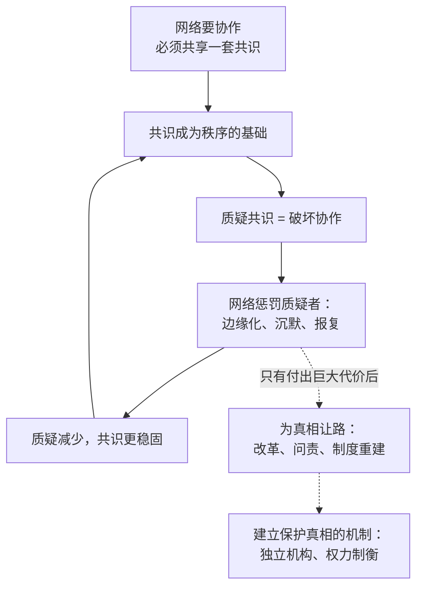

# 05｜真相与秩序：为什么信息网络的首要任务不是求真

> 真相与秩序为什么会冲突？网络通常会选择哪一个？

---

## 一、先说结论

真相昂贵而痛苦，秩序廉价而有效，所以网络天然偏好秩序，只在代价足够大时才为真相让步。这就是为什么说真话的人常常没有好下场——不是因为人们讨厌真相，而是因为真相会威胁到网络赖以运转的共识。

赫拉利的判断是：权力可以没有真相，真相却很难没有权力保护。

## 二、我们先理解一个问题

想象一个场景。

会议室里，项目负责人正在讲一个明显有问题的方案。你手上有数据，能证明这个方案会失败。你开口了。

接下来的事情通常不是“大家感谢你”，而是：气氛变冷，有人低头看手机，负责人说“你的担心我们记下了”，然后会议继续。几周后项目出了问题，大家在私下说“其实早就有人提醒过”。

这里的关键不是谁对谁错，而是一个更基本的问题：为什么一个组织明明需要真相，却常常惩罚说出真相的人？

## 三、作者到底提出了什么观点？

赫拉利的回答是：因为信息网络同时有两个目标，而这两个目标经常打架。

第一个目标是秩序：让足够多的人协调行动，维持网络的存在。第二个目标是真相：让网络对现实的描述尽量准确。

问题在于，维持秩序最有效的方式是共识，而真相经常与共识冲突。一个网络越是依靠某套共识运转，它就越不能容忍对这套共识的质疑。

所以网络会默认选择秩序。只有在真相的缺席带来足够大的代价时——比如战争失败、经济崩溃、瘟疫失控——它才会开始为真相让路。

赫拉利还强调一个不对称：权力可以在没有真相的情况下长期存在，而真相很难在没有权力保护的情况下存活。伽利略可以是对的，但他依然要认错。

## 四、把这个观点翻译成人话

可以把真相理解成一种“逆人性”的产品。

要接近真相，你必须做几件让人不舒服的事：承认自己可能错了；放弃“我们这边”的立场；把归属感放在准确性之后。而秩序恰好相反：它给你归属感、给你位置、给你“我们是对的”的确定感。

于是，真相的供给从来不是自动的。它需要有人付代价去换，也需要制度去保护那些愿意付代价的人。

## 五、为什么会这样？

把“秩序优先”这条规律拆开，可以看到一个自洽的循环。

第一步，任何协作都需要共享的共识。

第二步，共识一旦形成，它就成了秩序的承重墙。

第三步，质疑共识的行为，在系统看来等于破坏协作。

第四步，系统会惩罚质疑者。惩罚不一定来自权力中心，也可能来自同事、同行、朋友圈——这往往更有效。

第五步，质疑减少，共识更稳固，循环继续。

第六步，只有当共识造成的损失足够大，网络才会被迫为真相让路。

第七步，让路之后，如果运气好，社会会建立起保护真相的机制。这是下一篇要讲的东西。

## 六、举一个现实生活中的例子

看一个很小的场景。

一位朋友辞掉稳定的工作去创业，问你意见。你其实看到了三个明显的问题：市场太小、他没有相关经验、启动资金撑不过半年。但你说出口的是：“挺好的，趁年轻试试。”

为什么？因为说出问题会让他难受，也会让两人的关系变紧张。更麻烦的是：如果他后来真的失败了，你说过的话会被重新翻出来——你可能变成“当初不支持他的人”。

真相的代价不只是被惩罚，还包括让别人难受、让自己显得不合群、让关系承担风险。所以在日常生活中，我们大多数时候选择的是维护关系的秩序，而不是说出准确的判断。

## 七、回到书中重新理解

把上面这个小场景放大到历史尺度，就能理解赫拉利为什么反复使用伽利略的例子。

伽利略的观测是对的，但他挑战的不只是一个天文学结论，而是一整套支撑教会权威的世界观。所以冲突的焦点从来不是“地球是否在动”，而是“谁有权解释世界”。

赫拉利由此提出他的核心判断：真相需要被保护，而不是被相信。指望人们“天然热爱真相”是没有用的，因为网络的结构本身就在奖励沉默。

他也讨论了另一面：为真相付出的代价并不总是值得。如果为了追求真相而摧毁了协作的基础，网络可能会解体，而解体带来的痛苦往往由最普通的人承担。这就是为什么“真相与秩序”的取舍没有简单的答案。

## 八、这个观点背后还有什么？

第一，它有一个隐含前提：真相的发现需要“反直觉”的制度安排。因为人的默认倾向是维护共识，所以必须用制度去对抗这种倾向——独立的法院、自由的媒体、可质疑的权威。

第二，它解释了为什么“求真”往往需要外部力量。在一个封闭的网络内部，几乎不可能自我揭穿，因为揭穿者会先被网络处理掉。

第三，它和第一篇呼应：如果信息的第一功能是联结，那么真相必然是例外状态。它和第六篇衔接：既然真相需要保护，那么保护它的机制就是整个文明最关键的部件。

第四，它给权力与真相的关系定了一个基调：不是“真相战胜权力”，而是“权力偶尔允许真相存在”。这个基调偏悲观，但它的解释力很强。

## 九、这个观点有问题吗？

有几个地方需要质疑。

第一，“真相 vs 秩序”的二分可能过于干净。现实中两者常常互相支撑：一个长期可靠的秩序，往往需要相当程度的真实性——税收需要真实的账目，司法需要真实的口供。把两者当成零和关系，可能简化了问题。

第二，他对“真相”的理解偏科学主义，主要指可验证的事实。但人类社会还需要另一类东西：意义、价值、归属。这些东西不能用“是否符合事实”来衡量，而它们同样是网络运转的必需品。把它们都归入“秩序”，会掩盖它们的重要性。

第三，他可能低估了现代社会的纠错供给能力。自由媒体、科学共同体、独立司法、非政府组织，这些机制在二十世纪确实显著扩大了真相的生存空间。

第四，也是最需要注意的一点：这个观点容易被误用。如果“秩序优先”被当作规律，那么压制真相的行为似乎就有了合理性。赫拉利本人明确反对这种推论——他站在真相一边——但他的论证结构确实给了这种误用空间，这也是书评中对他的常见批评之一。

## 十、今天再看这个观点

以下是基于赫拉利思想的现代延伸，不是作者原话。

在组织管理领域，“心理安全”这个概念被反复验证：一个团队能不能说出坏消息，直接决定了它能不能及早发现风险。这与赫拉利的判断是同一件事，只是尺度从国家换成了公司。

而在公共领域，情况更复杂。新闻业的商业模式在衰退，独立的调查能力随之下降；与此同时，信息的生产成本降到接近于零。结果是：需要真相的场景变多了，生产真相的能力却在减少。

## 十一、这一篇真正应该记住什么？

1. 信息网络同时追求秩序与真相，而这两者经常冲突；网络的默认选择是秩序。
2. 真相昂贵而痛苦，它要求承认错误、放弃归属感，所以不会自动供给。
3. 网络会惩罚质疑者，而且惩罚常常来自普通人，而不只是权力中心。
4. 权力可以没有真相，真相却很难没有权力保护——这就是为什么保护真相需要制度，而不是道德。

## 十二、留一个问题

如果秩序可以在没有真相的情况下长期存在，那么我们愿意为真相付出多少秩序作为代价？
