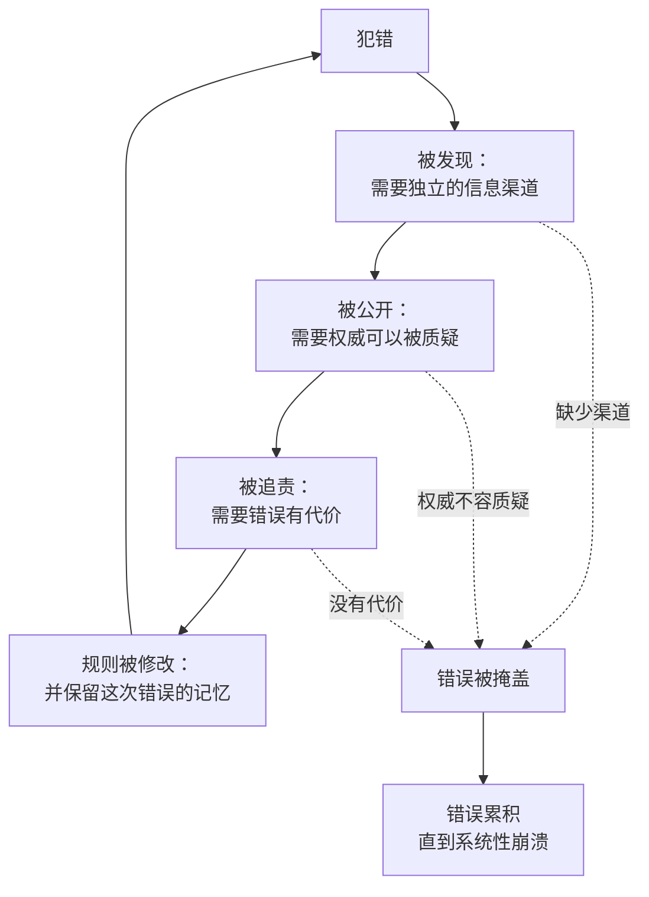

# 06｜自我修正机制：什么样的网络能从错误中活下来

> 为什么有的信息网络能从错误中恢复，有的却越陷越深？

---

## 一、先说结论

一个网络的强大不在于它不犯错，而在于它有没有自我修正机制：独立的机构、可以被质疑的权威、对错误的公开追责。科学、民主与法治，是三种最典型的自我修正机制。

赫拉利把这套机制当作全书最重要的解药。他自己说过，这本书最核心的结论其实很朴素：去干那些枯燥的活——建设有强自我修正机制的机构。

## 二、我们先理解一个问题

先做一个对比。

假设有两个组织，都犯了一个严重的错误。第一个组织里，错误被迅速发现、公开讨论、追究责任、修改规则。第二个组织里，错误被掩盖、质疑者被边缘化、结论被重申，直到下一次更大的错误出现。

几十年后，第一个组织大概率还在，第二个组织大概率已经解体。

问题来了：为什么“能纠错”这件事，在现实中如此罕见？纠错到底需要什么条件？

## 三、作者到底提出了什么观点？

赫拉利认为，自我修正机制不是自然而然出现的，而是一种需要被专门设计的能力。

他给出的核心要素有三个：第一，网络内部必须有独立于权力中心的信息渠道——如果所有信息都要经过同一道关口，错误永远不会被上报。第二，权威必须可以被质疑——当“绝对正确”成为某个机构或某个人的属性时，纠错就失去了合法性。第三，错误必须有代价——如果犯错没有后果，修正就不会发生。

他用一组对比来说明强弱：科学共同体拥有很强的自我修正机制，因为它不仅愿意承认错误，还主动寻找错误，甚至奖励那些推翻旧结论的人。而像天主教廷这样的机构，自我修正机制相对较弱，因为它很难承认制度本身出错，只能把问题归结为个别成员的过失。

赫拉利还指出一个反直觉的结论：强自我修正机制会让网络内部不稳定。它会带来争论、动荡、权力更替。但正是这种不稳定的代价，换来了长期生存的能力。

## 四、把这个观点翻译成人话

可以把自我修正机制理解成“体检”，而不是“治疗”。

治疗是出了问题才去医院；体检是主动去发现还没暴露的问题。绝大多数组织只做治疗，不做体检——因为体检会查出问题，而查出问题本身就会带来麻烦。

科学之所以特殊，是因为它把体检变成了制度：一个结论发表出来，就是邀请全世界来挑错。挑错成功的人会获得声望，而不是惩罚。这一点极其反直觉，也极其难复制。

## 五、为什么会这样？

把自我修正的完整循环拆开，可以看到它需要好几个部件同时到位。

第一步，错误发生。这一步无法避免。

第二步，错误被发现——前提是网络里有独立于权力的信息渠道。

第三步，错误被公开讨论——前提是权威可以被质疑。

第四步，责任被追究——前提是犯错要付出代价。

第五步，规则被修改，而且这次的错误被记住。记忆很重要：一个不记得自己犯过什么错的网络，会重复犯同一个错。

任何一个环节缺失，循环就会滑向另一边：错误被掩盖、累积，直到系统崩溃。

## 六、举一个现实生活中的例子

看商业航空业。

每一次空难之后，调查的重点不是“谁该被骂”，而是“系统哪里出了问题”：是培训不足，是仪表设计有歧义，还是沟通流程有缺陷。调查结果会变成强制性的行业改进，所有航空公司都要执行。

更关键的是，行业还建立了自愿报告制度：飞行员和机务可以主动报告自己犯的错，而不必担心被处罚——因为大家认识到，如果报告错误会被惩罚，错误就会转入地下，那才是最危险的。

结果是，商业航空在几十年里安全性持续提升，成为现代社会中自我修正机制运行得最成功的领域之一。

这个例子的启发在于：它的核心不是“更严格”，而是“让错误可见”。可见的错误可以修正，隐藏的错误会累积。

## 七、回到书中重新理解

赫拉利在第四章里把自我修正机制作为衡量机构质量的核心指标。

他比较了两种机构：一种依靠弱自我修正机制（例如天主教廷），一种发展出强自我修正机制（例如科学学科）。他的观察是，弱机制有时会导致历史性灾难，比如近代早期的欧洲猎巫；而强机制虽然有效，却会让网络从内部变得不稳定。

他还讲了一个耐人寻味的判断：如果按存续时间、传播范围和权力来衡量，天主教会也许是人类历史上最成功的机构。它的成功，可能恰恰与它自我修正机制较弱有关——因为不会因为内部争论而分裂。这个观察很重要：它说明秩序与纠错之间存在真实的取舍，而不是“纠错总是更好”。

他举了两个科学界的例子来说明强机制如何运作：一位年轻化学家提出准晶体的发现后被权威猛烈攻击，最终被证明是对的；数学家康托尔提出无穷集合理论时被同行攻击，但几十年后成为现代数学的基础。赫拉利的意思是：科学家和其他人一样有偏见，但制度让偏见可以被克服。

## 八、这个观点背后还有什么？

第一，它有一个隐含前提：纠错需要独立的权力，而不只是独立的态度。如果所有信息渠道都被同一方控制，再多的诚意也无法纠错。

第二，它揭示了自我修正机制的成本。纠错会带来动荡、效率损失、权威受损，所以它从来不是免费的。真正的问题是：一个网络愿意付出多少代价换取纠错能力？

第三，它和上一篇形成完整的逻辑：既然网络默认追求秩序，那么自我修正机制就是一种“人为的例外状态”，需要被持续维护，而且很容易被侵蚀。

第四，它把文明问题变成了工程问题。赫拉利的结论不是“要相信真相”，而是“要建设机构”。这是一个相当务实、也相当不浪漫的结论。

## 九、这个观点有问题吗？

有几个地方值得质疑。

第一，他可能高估了科学自我修正的速度。科学史上也有长期停滞：范式惰性、权威压制、热门方向的资源虹吸，都会让纠错变得缓慢。科学哲学家库恩对“常规科学”的描述，与“科学家主动寻找错误”的画面并不完全一致。

第二，民主作为自我修正机制的有效性，近些年受到现实挑战。极化、信息污染、选举周期过短，都可能让民主的纠错能力下降。赫拉利承认这些困难，但更多把它们归因于信息环境的变化。

第三，他把自我修正机制当作近乎万能解，却没有给出成本分析：什么时候纠错的代价高于收益？一个总是在自我怀疑的网络，是否也会失去行动能力？

第四，他关于教廷的对比可能过于二元。历史上教廷也有过改革与自我调整（比如多次大公会议、修会改革）。把某一类机构整体贴上“弱自我修正”的标签，会损失很多细节。

## 十、今天再看这个观点

以下是基于赫拉利思想的现代延伸，不是作者原话。

一个值得注意的现象是：科学这套自我修正机制本身正在承受压力。论文数量爆炸、审稿资源不足、复现率偏低，让“主动寻找错误”变得越来越难。近年多起公开的复现失败说明：机制存在，不等于机制有效。

这对 AI 时代是一个提醒：自我修正机制不是建好就完事的装置，它需要资源、人员和持续的关注才能维持运转。而资源与关注，从来都是稀缺的。

## 十一、这一篇真正应该记住什么？

1. 衡量一个网络的标准不是它犯不犯错，而是它有没有自我修正机制。
2. 自我修正需要三个条件：独立的信息渠道、可被质疑的权威、犯错有代价。
3. 强自我修正机制会带来内部不稳定，这是它的成本，也是它能长期存活的原因。
4. 纠错是一项需要被专门设计、并持续维护的能力，它不会自动出现。

## 十二、留一个问题

如果一个网络连“我们可能错了”这句话都不允许被说出口，它还能撑多久？
