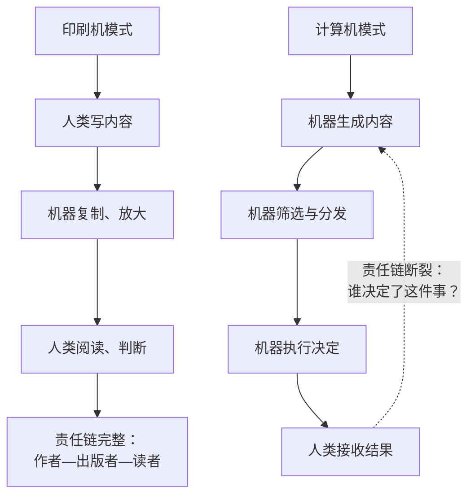

# 07｜新成员：计算机为什么和印刷机不一样

> 为什么说计算机不是“工具”，而是信息网络里的“新成员”？

---

## 一、先说结论

印刷机只能复制人类写下的文本，计算机却能自己生成文本、自己做出决定。这意味着信息网络里第一次出现了不需要理解世界、却能行动的“非人”参与者。

赫拉利用一个词来标记这个变化：成员。工具听人指挥，成员自己行动。而一旦网络里有了自己行动的成员，整个网络的权力结构就变了。

## 二、我们先理解一个问题

先比较两件事。

古腾堡的印刷机被印出来了，它做的事很简单：把人类写好的文字，快速、廉价、大量地复制出去。它不会自己写一本书，也不会决定印什么。谁掌握印刷机，谁就掌握内容。

再看今天的一个自动化系统：它可以自己生成文案、自己判断这条内容该不该推给某个用户、自己决定这笔退款要不要通过。没有人写下它此刻输出的那句话。

问题就在这里：印刷机放大的只是人类的声音，而计算机开始发出自己的声音。这两件事，真的只是程度差别吗？

## 三、作者到底提出了什么观点？

赫拉利认为，这是性质上的不同，不是程度上的不同。

他的核心区分是：过去所有的信息革命，改变的都是信息的传播方式；而这一次，改变的是信息的作者。

他把计算机称为信息网络的“新成员”，理由是：一个成员的特征不是聪明，而是能自己做决定、自己追求目标。印刷机没有目标，锤子没有目标；但一个能自己决定要不要批准退款的系统，在功能上已经进入了“做决定”的领域。

赫拉利还特别强调，这件事不需要机器有意识。它不需要理解世界，也不需要感受任何东西，就可以做出影响世界的决定。这是他后面几章所有担忧的起点。

## 四、把这个观点翻译成人话

可以用一把锤子来说明。

锤子不会自己决定敲哪里。它没有目标，它只是手的延伸。你对它负全责——砸到人了，是你在砸。

现在想象一把“会自己决定敲哪里”的锤子。它可能更高效，能算出最省力的落点。但一旦它砸到了不该砸的东西，你该怎么处理？你说“是锤子自己决定的”，这句话在法律和道德上都不成立；你说“是我决定的”，可你根本不知道它要敲哪里。

赫拉利想说的就是：当工具开始自己决定，我们原来那套“工具—使用者—责任”的结构就失效了。

## 五、为什么会这样？

把“工具”和“成员”的差别拆开看，会更清楚。

上一条链是印刷机模式：机器只负责放大，判断始终在人这一侧，所以责任链是完整的。

下一条链是计算机模式：机器参与了生成、筛选、执行三个环节，人类只在最后接收结果。责任链在这里断掉了——不是没人负责，而是“谁负责”这个问题本身变得无法回答。

赫拉利的判断是：网络的力量来自能做出决定的成员，而不是来自算得快的成员。所以计算机的加入，改变的是网络的权力分布，而不只是效率。

## 六、举一个现实生活中的例子

看客服系统的演化。

第一代是话术库：客服人员按照标准话术回答，判断权在人手里。第二代是规则引擎：系统按照预设规则给出方案，人可以覆盖它。第三代是智能体：系统自己判断这位用户的投诉是否合理，自己决定退款还是拒绝，人只在异常时介入。

到第三代，一个有意思的变化出现了：客服人员从“判断者”变成了“确认者”。他每天点几百次“同意”，逐渐不再真正阅读系统的理由。

这个变化的关键不在于系统是否比人更聪明，而在于判断权已经悄悄转移了。而且转移得很自然——因为系统更快、更一致、更少情绪化。没有人会在某一天宣布“从今天起判断权归算法”，它是一点点发生的。

## 七、回到书中重新理解

赫拉利在第六章里把这一章命名为“新成员”，并反复与印刷机做对比。

他的论证结构大致是：历史上每一次信息技术的突破，都会引发社会重组，但那些技术始终是“人类的工具”。印刷机放大了人类的声音，广播放大了人类的声音，电话连接了人类的声音。而计算机第一次可以自己发声。

他还强调一个容易被忽略的点：计算机不需要有意识就能成为行动者。这打破了我们习惯的直觉——我们总以为“只有有意识的东西才需要被当作主体对待”。但一个没有意识、却能在市场里自动交易、在社交平台上自动发帖、在系统里自动审批的东西，已经在事实上参与了社会运转。

赫拉利由此提出一个尖锐的问题：如果网络里出现了不需要理解世界就能行动的成员，那么人类还能不能继续做这个网络的主人？

## 八、这个观点背后还有什么？

第一，它有一个隐含前提：网络里的权力属于“能做决定的人”，而不属于“算得快的人”。这条判断解释了为什么他如此在意判断权的转移，而不是在意算力大小。

第二，为什么用“成员”这个词很重要。成员意味着：有目标、能行动、要承担责任。但机器能行动却无法承担责任——这个缺口就是整个问题的核心，第九篇会专门讨论。

第三，它和第三篇形成呼应：文件系统让人变成条目，算法系统让人变成数据。区别在于，文件系统里还有人解释规则，算法系统里连解释都没有。

第四，它埋下了后面所有讨论的伏笔：民主、极权、地缘格局，都要在这个“新成员入场”的前提下重新审视。

## 九、这个观点有问题吗？

有几个地方需要打问号。

第一，“成员”是个拟人化的比喻。一些 AI 研究者认为这类说法会误导公众：当前的系统并没有自己的目标，它只是在优化人类给定的目标函数。把“优化某个指标”说成“自己做决定”，可能高估了机器的自主性。

第二，“工具 vs 成员”的边界并不清晰。一个自动交易系统、一个恒温器、一个推荐算法，分别落在什么位置？赫拉利给出的是概念性的区分，而不是可操作的判据。

第三，他倾向于把 AI 当作一个统一的行动者来讨论，但现实中它是一堆能力差异巨大的具体系统：有的只会分类图片，有的能写代码。把它们统称为“新成员”，会让讨论失去精度。

第四，批评者还指出，他对 AI 能力的描述偏笼统，容易让读者产生“机器已经全面超越人类”的印象，而这与当前技术的实际局限并不相符。

## 十、今天再看这个观点

以下是基于赫拉利思想的现代延伸，不是作者原话。

从 2023 年起，“智能体”成为行业热词：让模型自己调用工具、自己规划步骤、自己完成任务。这恰好是赫拉利所描述的“新成员”在工程上的落地。

与此同时，治理上的空白也很明显：当一个智能体在系统里自动做成了上千笔决定，出了问题该由谁负责？是训练数据的人，部署它的人，还是使用它的人？目前并没有公认的答案。

## 十一、这一篇真正应该记住什么？

1. 印刷机放大人类的声音，计算机开始发出自己的声音——这是性质变化，不是程度变化。
2. 网络里的权力属于能做决定的成员，而不属于算得快的成员。
3. 计算机不需要有意识，就可以成为行动者；这一点打破了我们关于“主体”的直觉。
4. “工具—使用者—责任”的结构，在能自己决定的系统面前会失效。

## 十二、留一个问题

如果机器能自己做决定，却没有任何人能替这个决定负责，那么这个网络还算是有主的吗？
